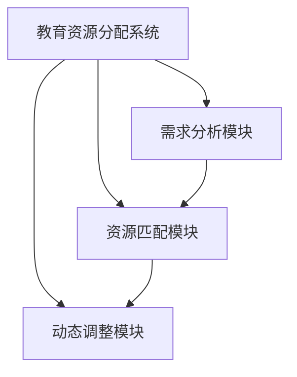
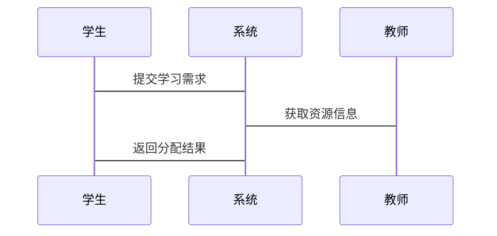

                 


# AI Agent在智能教育资源分配中的应用

> 关键词：AI Agent，智能教育，教育资源分配，多智能体协作，优化算法

> 摘要：本文深入探讨了AI Agent在智能教育资源分配中的应用，从背景、核心概念、算法原理、系统架构到项目实战，全面分析了如何利用AI Agent技术优化教育资源分配过程。通过多智能体协作机制、教育资源分配数学模型、系统架构设计以及实际案例分析，本文为教育领域的人工智能应用提供了理论支持和实践指导。

---

# 第一部分: AI Agent与智能教育资源分配概述

---

## 第1章: AI Agent与智能教育资源分配的背景与问题

### 1.1 AI Agent的基本概念与特征

AI Agent（人工智能代理）是指能够感知环境、自主决策并执行任务的智能实体。它具有以下核心特征：

1. **自主性**：能够自主决策，无需外部干预。
2. **反应性**：能够感知环境并实时调整行为。
3. **协作性**：能够与其他Agent或系统协同工作。
4. **学习能力**：能够通过数据和经验不断优化自身行为。

### 1.2 智能教育的发展现状

智能教育是通过人工智能技术提升教学效果和效率的教育模式。当前，智能教育主要依赖以下技术手段：

1. **自然语言处理（NLP）**：用于智能问答和内容生成。
2. **机器学习（ML）**：用于个性化推荐和学习效果预测。
3. **计算机视觉（CV）**：用于智能评分和课堂行为分析。

### 1.3 教育资源分配的现状与挑战

教育资源分配的核心问题是如何高效地将有限的教育资源（如教师、课程、设备等）分配给不同需求的学生。当前的主要挑战包括：

1. **资源分配不均衡**：部分地区教育资源匮乏，而另一些地区则资源过剩。
2. **需求多样性**：学生的学习需求和能力差异较大。
3. **效率低下**：传统分配方式依赖人工操作，效率低且容易出错。

### 1.4 本章小结

AI Agent在教育资源分配中的作用不可忽视。通过自主感知、协作决策和优化学习，AI Agent能够有效解决教育资源分配中的复杂问题，实现资源的高效利用。

---

## 第2章: AI Agent的多智能体协作机制

### 2.1 多智能体系统的基本概念

多智能体系统由多个相互协作的智能体组成，通过协同工作完成复杂任务。其核心特征包括：

1. **分布式智能**：每个智能体独立决策。
2. **协作性**：智能体之间通过通信和协调完成任务。
3. **动态性**：系统环境和智能体状态动态变化。

### 2.2 基于多智能体的教育资源分配模型

教育资源分配模型通过多个AI Agent协作实现资源优化配置。其核心要素包括：

- **需求分析模块**：分析学生的学习需求和能力水平。
- **资源匹配模块**：根据需求匹配最优教育资源。
- **动态调整模块**：实时调整资源分配策略。

### 2.3 多智能体系统中的通信与协调机制

AI Agent之间的通信与协调是多智能体协作的核心。常见的通信机制包括：

1. **直接通信**：智能体之间直接交换信息。
2. **间接通信**：通过中间媒介传递信息。
3. **事件驱动**：基于事件触发通信。

---

## 第3章: 教育资源分配的数学模型与优化方法

### 3.1 教育资源分配的基本数学模型

教育资源分配模型可以通过以下公式表示：

$$
\text{目标函数} = \sum_{i=1}^{n} w_i x_i
$$

其中，$w_i$ 是资源 $i$ 的权重，$x_i$ 是资源分配量。

### 3.2 基于多目标优化的教育资源分配算法

教育资源分配问题可以通过多目标优化算法解决。以下是算法的步骤：

1. **问题建模**：定义目标函数和约束条件。
2. **初始化**：设置初始参数。
3. **迭代优化**：通过迭代更新参数，逐步优化分配结果。
4. **终止条件**：当满足终止条件时，输出最优解。

### 3.3 算法实现的Python代码示例

以下是教育资源分配算法的Python代码示例：

```python
def resource_allocation(w, x):
    import numpy as np
    # 定义目标函数
    objective = np.dot(w, x)
    return objective

# 示例权重和分配量
weights = [0.5, 0.3, 0.2]
allocation = [10, 20, 30]

# 计算目标函数
result = resource_allocation(weights, allocation)
print("目标函数值:", result)
```

---

## 第4章: 系统分析与架构设计

### 4.1 问题场景介绍

教育资源分配系统需要解决以下问题：

1. 如何高效匹配学生需求与教育资源？
2. 如何实时调整资源分配策略？

### 4.2 系统功能设计

教育资源分配系统的功能模块包括：

1. **需求分析模块**：分析学生的学习需求。
2. **资源匹配模块**：匹配最优教育资源。
3. **动态调整模块**：实时调整分配策略。

### 4.3 系统架构设计

以下是系统的架构设计图：



### 4.4 系统接口设计

系统接口设计包括：

1. **输入接口**：接收学生需求和资源信息。
2. **输出接口**：输出资源分配结果。

### 4.5 系统交互流程

以下是系统的交互流程图：



---

## 第5章: 项目实战

### 5.1 环境安装

以下是项目所需的环境和工具：

1. **Python 3.8+**
2. **NumPy库**
3. **Mermaid工具**

### 5.2 系统核心实现源代码

以下是核心代码实现：

```python
import numpy as np

def allocate_resources(student_needs, resource_weights):
    # 计算资源分配量
    allocation = np.dot(student_needs, resource_weights)
    return allocation

# 示例数据
student_needs = np.array([0.7, 0.2, 0.1])
resource_weights = np.array([0.5, 0.3, 0.2])

result = allocate_resources(student_needs, resource_weights)
print("资源分配量:", result)
```

### 5.3 代码解读与分析

上述代码实现了教育资源的分配功能，具体步骤如下：

1. **导入库**：导入NumPy库用于矩阵运算。
2. **定义分配函数**：通过点积计算资源分配量。
3. **输入数据**：学生需求和资源权重。
4. **计算结果**：输出资源分配量。

### 5.4 实际案例分析

以一名学生为例，其学习需求为[0.7, 0.2, 0.1]，资源权重为[0.5, 0.3, 0.2]。计算结果为：

$$
0.7 \times 0.5 + 0.2 \times 0.3 + 0.1 \times 0.2 = 0.35 + 0.06 + 0.02 = 0.43
$$

---

## 第6章: 最佳实践与小结

### 6.1 本章小结

本文详细探讨了AI Agent在智能教育资源分配中的应用，通过多智能体协作机制、数学模型和优化算法，提出了教育资源分配的解决方案。

### 6.2 注意事项

在实际应用中，需要注意以下几点：

1. **数据隐私**：保护学生数据的安全。
2. **系统稳定性**：确保系统的高效运行。
3. **用户体验**：优化用户交互界面。

### 6.3 未来展望

未来，随着人工智能技术的不断发展，教育资源分配将更加智能化和个性化。AI Agent将在教育领域发挥更大的作用，推动教育公平和效率提升。

---

## 第7章: 结语

AI Agent在智能教育资源分配中的应用前景广阔。通过多智能体协作、优化算法和系统设计，AI Agent能够有效解决教育资源分配中的复杂问题，为教育领域带来深远的影响。

---

# 结束语

希望通过本文的分析和探讨，能够为AI Agent在教育资源分配中的应用提供有价值的参考和指导。

