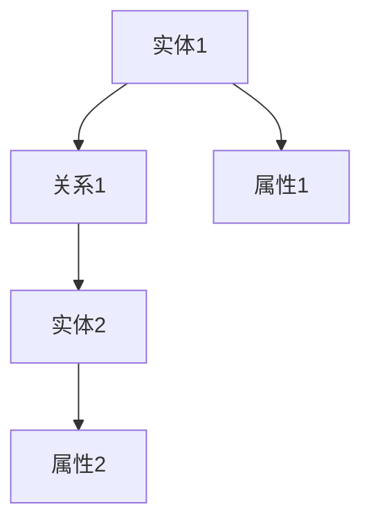
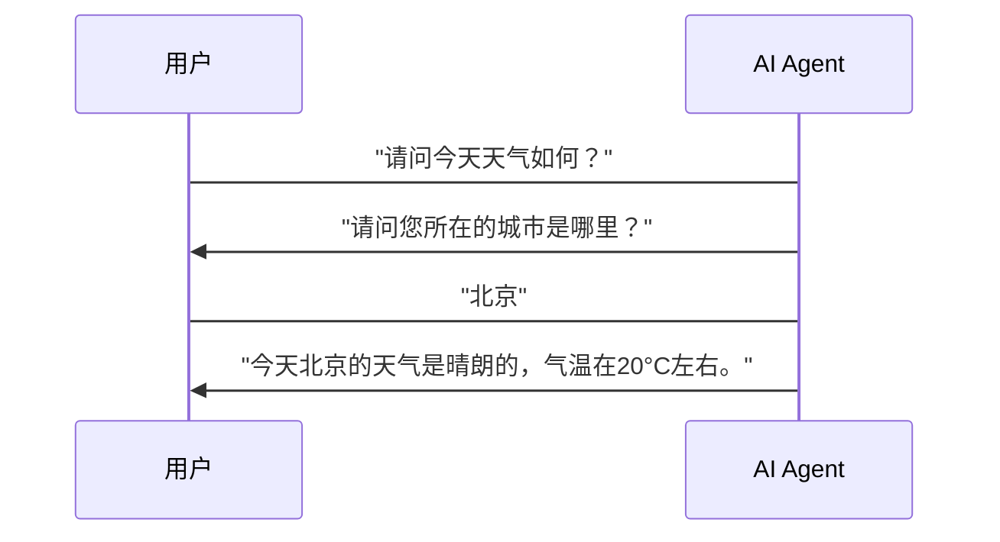
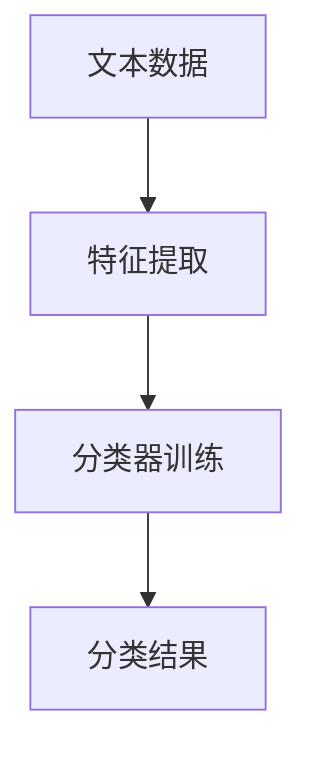
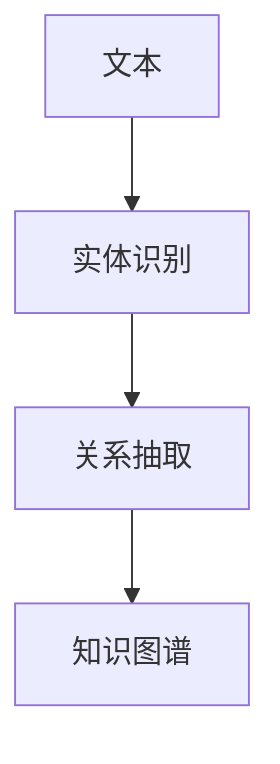
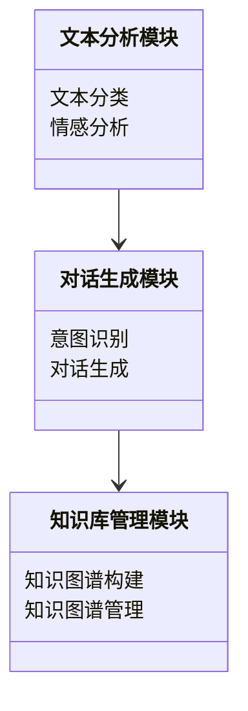
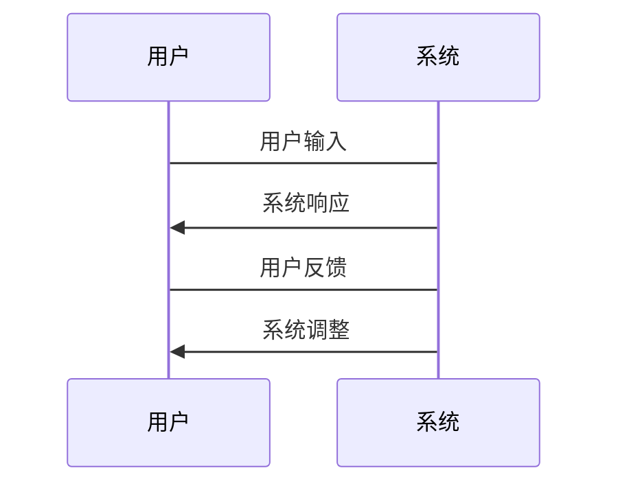

                 


# AI Agent在智能文本分析中的应用

> 关键词：AI Agent, 智能文本分析, 自然语言处理, 深度学习, 知识图谱

> 摘要：本文将深入探讨AI Agent在智能文本分析中的应用，从AI Agent的基本概念、核心原理到实际应用场景，结合具体案例和算法实现，全面解析AI Agent如何赋能智能文本分析。

---

# 第一章: AI Agent的基本概念与核心概念

## 1.1 AI Agent的基本概念

### 1.1.1 什么是AI Agent
AI Agent（人工智能代理）是指能够感知环境、自主决策并执行任务的智能体。它通过与环境交互，利用感知数据和内部知识库，生成响应或执行操作。AI Agent可以是软件程序，也可以是硬件设备，但核心在于其智能性。

**关键特征：**
1. **自主性**：无需外部干预，自主决策。
2. **反应性**：能够感知环境变化并实时响应。
3. **目标导向**：基于目标驱动行为。
4. **学习能力**：通过经验改进性能。

### 1.1.2 AI Agent的核心概念

AI Agent的核心概念包括：
1. **感知**：通过传感器或数据接口获取环境信息。
2. **推理**：基于知识库和逻辑推理，理解输入数据。
3. **决策**：根据推理结果，制定行动方案。
4. **执行**：将决策转化为具体操作。

### 1.1.3 AI Agent与智能文本分析的关系

AI Agent通过自然语言处理（NLP）技术，实现对文本的深度理解和分析。智能文本分析的核心任务包括文本分类、情感分析、实体识别等，这些任务可以通过AI Agent的感知、推理和决策能力得到增强。

---

## 1.2 智能文本分析的背景与挑战

### 1.2.1 文本分析的基本概念

文本分析是通过对文本数据的处理和分析，提取有用信息的过程。其核心任务包括：
1. **文本分类**：将文本归类到预定义的类别中。
2. **情感分析**：识别文本中的情感倾向。
3. **实体识别**：从文本中提取人名、地名等实体。
4. **关系抽取**：识别文本中实体之间的关系。

### 1.2.2 智能文本分析的核心问题

智能文本分析的核心问题包括：
1. **语义理解**：如何准确理解文本的含义。
2. **上下文理解**：如何处理文本中的上下文信息。
3. **实时性**：如何在实时场景中高效处理文本。

### 1.2.3 AI Agent在文本分析中的优势

AI Agent通过以下方式提升智能文本分析的性能：
1. **多模态数据融合**：结合文本、图像、语音等多种数据源，提升分析精度。
2. **动态推理**：根据实时数据动态调整分析策略。
3. **自适应学习**：通过机器学习算法，不断优化分析模型。

---

## 1.3 AI Agent与智能文本分析的关系

### 1.3.1 AI Agent如何赋能文本分析

AI Agent通过以下方式赋能智能文本分析：
1. **语义理解**：利用自然语言处理技术，实现对文本的深度理解。
2. **多轮对话**：通过对话系统，实现与用户的交互式文本分析。
3. **知识库支持**：基于知识图谱，提供上下文相关的知识支持。

### 1.3.2 智能文本分析的典型应用场景

智能文本分析的典型应用场景包括：
1. **情感分析**：用于社交媒体分析、客户反馈分析等。
2. **文本分类**：用于新闻分类、垃圾邮件识别等。
3. **实体识别**：用于信息抽取、知识图谱构建等。

### 1.3.3 AI Agent在文本分析中的价值

AI Agent在智能文本分析中的价值体现在：
1. **提升分析效率**：通过自动化处理，减少人工干预。
2. **增强分析深度**：通过知识图谱和推理，提供更精准的分析结果。
3. **支持实时分析**：通过实时数据处理，提供即时反馈。

---

## 1.4 本章小结

本章从AI Agent的基本概念出发，详细介绍了智能文本分析的核心问题和应用场景，重点分析了AI Agent在智能文本分析中的优势和价值。通过本章的学习，读者可以全面理解AI Agent与智能文本分析的关系，并为后续章节的学习奠定基础。

---

## 1.5 思考与练习

1. AI Agent的核心特征有哪些？请结合实际应用场景进行说明。
2. 智能文本分析的核心任务包括哪些？请列举并简要描述。
3. AI Agent如何通过多模态数据融合提升文本分析的性能？

---

# 第二章: AI Agent的核心原理与技术

## 2.1 AI Agent的基本原理

### 2.1.1 AI Agent的感知与决策机制

AI Agent的感知与决策机制包括以下步骤：
1. **数据感知**：通过传感器或数据接口获取环境数据。
2. **数据处理**：对感知数据进行预处理和特征提取。
3. **知识表示**：将数据转换为知识图谱或其他结构化表示形式。
4. **推理与决策**：基于知识库和逻辑推理，生成决策方案。
5. **行动执行**：将决策方案转化为具体操作。

### 2.1.2 基于知识图谱的语义理解

知识图谱是一种以图结构形式表示知识的语义网络。AI Agent通过知识图谱实现对文本的语义理解，包括实体识别、关系抽取和语义推理。

**图1-1 知识图谱表示示例**



### 2.1.3 多轮对话的实现原理

多轮对话的核心在于对话管理，包括：
1. **对话状态跟踪**：记录对话的历史信息。
2. **意图识别**：识别用户的当前意图。
3. **对话生成**：根据意图生成回复。

**图1-2 对话流程图**



---

## 2.2 智能文本分析的关键技术

### 2.2.1 自然语言处理（NLP）基础

NLP是AI Agent实现智能文本分析的核心技术，包括：
1. **分词**：将文本分割成有意义的词语或短语。
2. **词性标注**：给每个词语标注其词性。
3. **句法分析**：分析句子的语法结构。

### 2.2.2 文本分类与情感分析

文本分类是将文本归类到预定义类别中的过程。情感分析是判断文本的情感倾向（如正面、负面、中性）。

**算法流程图**



### 2.2.3 实体识别与关系抽取

实体识别是从文本中提取人名、地名等实体，关系抽取则是识别实体之间的关系。

**图1-3 实体识别与关系抽取**



---

## 2.3 AI Agent与NLP的结合

### 2.3.1 基于NLP的意图识别

意图识别是通过分析用户输入的文本，识别用户的意图。常用的意图识别方法包括基于规则的方法和基于机器学习的方法。

### 2.3.2 基于NLP的对话生成

对话生成是根据当前对话状态和用户输入，生成合适的回复。常用的对话生成方法包括基于模板的方法和基于生成模型的方法。

### 2.3.3 NLP模型在文本分析中的优化

NLP模型可以通过预训练和微调，提升文本分析的性能。常用的预训练模型包括BERT、GPT等。

---

## 2.4 本章小结

本章详细介绍了AI Agent的核心原理与技术，包括感知与决策机制、知识图谱的语义理解、多轮对话的实现原理以及智能文本分析的关键技术。通过本章的学习，读者可以理解AI Agent在智能文本分析中的技术实现，并为后续章节的学习奠定基础。

---

## 2.5 思考与练习

1. 知识图谱在AI Agent中的作用是什么？请结合具体场景进行说明。
2. 多轮对话的核心在于对话管理，请描述对话管理的实现步骤。
3. NLP在文本分析中的主要任务有哪些？请列举并简要描述。

---

## 第三章: AI Agent的算法原理与数学模型

## 3.1 基于规则的文本分析算法

### 3.1.1 规则引擎的工作原理

规则引擎是通过预定义的规则对文本进行分析。规则引擎的工作原理包括规则定义、规则匹配和规则执行。

### 3.1.2 基于正则表达式的文本匹配

正则表达式是一种用于匹配字符串的模式匹配工具。通过正则表达式，可以实现对文本的精确匹配。

### 3.1.3 基于规则的文本分类

基于规则的文本分类是通过预定义的规则对文本进行分类。常用的规则包括关键词匹配、句式分析等。

---

## 3.2 基于统计的文本分析算法

### 3.2.1 统计学习的基本原理

统计学习是通过统计方法对数据进行建模和分析。常用的统计学习方法包括朴素贝叶斯、支持向量机等。

### 3.2.2 朴素贝叶斯分类器

朴素贝叶斯分类器是一种基于概率论的分类方法。其核心思想是通过计算条件概率，实现对文本的分类。

**数学公式：**

条件概率公式：
$$P(y|x) = \frac{P(x|y)P(y)}{P(x)}$$

### 3.2.3 支持向量机（SVM）在文本分析中的应用

支持向量机是一种监督学习算法，常用于文本分类。SVM通过构建超平面，将数据分成不同的类别。

---

## 3.3 基于深度学习的文本分析算法

### 3.3.1 RNN与LSTM在文本分析中的应用

RNN（循环神经网络）和LSTM（长短期记忆网络）是常用的深度学习模型，广泛应用于文本生成和序列分析。

### 3.3.2 Transformer模型的原理与应用

Transformer模型是一种基于注意力机制的深度学习模型，广泛应用于机器翻译和文本生成。

### 3.3.3 多模态模型在文本分析中的创新

多模态模型通过结合文本、图像、语音等多种数据源，提升文本分析的性能。

---

## 3.4 AI Agent的决策算法

### 3.4.1 基于Q-learning的决策机制

Q-learning是一种强化学习算法，通过不断试错，优化决策策略。

### 3.4.2 基于强化学习的对话生成

强化学习通过奖励机制，优化对话生成的质量。

### 3.4.3 基于知识图谱的推理算法

基于知识图谱的推理算法通过知识图谱的结构，实现对文本的推理和理解。

---

## 3.5 本章小结

本章详细介绍了AI Agent的算法原理与数学模型，包括基于规则的文本分析算法、基于统计的文本分析算法、基于深度学习的文本分析算法以及AI Agent的决策算法。通过本章的学习，读者可以理解AI Agent在智能文本分析中的算法实现，并为后续章节的学习奠定基础。

---

## 3.6 思考与练习

1. 朴素贝叶斯分类器的数学公式是什么？请结合实际场景进行说明。
2. Transformer模型的核心思想是什么？请结合文本分析任务进行描述。
3. Q-learning算法的核心步骤是什么？请结合对话生成任务进行说明。

---

# 第四章: AI Agent的系统架构与设计

## 4.1 AI Agent的系统架构设计

### 4.1.1 问题场景介绍

AI Agent的系统架构设计需要解决以下问题：
1. 如何实现高效的文本分析？
2. 如何实现智能的对话生成？
3. 如何实现实时的语义理解？

### 4.1.2 系统功能设计

系统功能设计包括：
1. 文本分析模块：包括文本分类、情感分析等。
2. 对话生成模块：包括意图识别、对话生成等。
3. 知识库管理模块：包括知识图谱的构建与管理。

**图1-4 系统功能设计**



### 4.1.3 系统架构设计

系统架构设计包括：
1. 数据层：包括文本数据、知识图谱等。
2. 服务层：包括文本分析服务、对话生成服务等。
3. 接口层：包括API接口、用户界面等。

**图1-5 系统架构设计**


### 4.1.4 系统接口设计

系统接口设计包括：
1. 文本分析接口：提供文本分类、情感分析等服务。
2. 对话生成接口：提供意图识别、对话生成等服务。
3. 知识库查询接口：提供知识图谱查询服务。

### 4.1.5 系统交互设计

系统交互设计包括：
1. 用户输入：用户输入文本或语音指令。
2. 系统处理：系统根据用户输入生成响应。
3. 用户反馈：用户对系统响应进行反馈。

**图1-6 系统交互设计**



---

## 4.2 本章小结

本章详细介绍了AI Agent的系统架构与设计，包括问题场景介绍、系统功能设计、系统架构设计、系统接口设计和系统交互设计。通过本章的学习，读者可以理解AI Agent在智能文本分析中的系统实现，并为后续章节的学习奠定基础。

---

## 4.3 思考与练习

1. AI Agent的系统架构设计需要考虑哪些因素？请结合实际场景进行说明。
2. 系统功能设计的核心模块有哪些？请列举并简要描述。
3. 系统交互设计的核心步骤是什么？请结合实际场景进行说明。

---

## 第五章: AI Agent的项目实战

## 5.1 环境安装与配置

### 5.1.1 环境需求

项目实战需要以下环境：
1. Python 3.8+
2. PyTorch 1.9+
3. Transformers库 4.12+
4. Jieba分词库

### 5.1.2 安装依赖

安装依赖可以通过以下命令进行：

```bash
pip install numpy
pip install pandas
pip install torch
pip install transformers
pip install jieba
```

---

## 5.2 项目核心代码实现

### 5.2.1 文本分类代码实现

```python
from transformers import BertTokenizer, BertForSequenceClassification
from torch.utils.data import Dataset, DataLoader
import torch

class TextClassificationDataset(Dataset):
    def __init__(self, texts, labels, tokenizer, max_length=128):
        self.texts = texts
        self.labels = labels
        self.tokenizer = tokenizer
        self.max_length = max_length

    def __len__(self):
        return len(self.texts)

    def __getitem__(self, idx):
        text = self.texts[idx]
        label = self.labels[idx]
        encoding = self.tokenizer.encode_plus(
            text,
            add_special_tokens=True,
            max_length=self.max_length,
            return_token_type_ids=False,
            padding='max_length',
            truncation=True,
            return_attention_mask=True,
            return_tensors='pt',
        )
        return {
            'input_ids': encoding['input_ids'].flatten(),
            'attention_mask': encoding['attention_mask'].flatten(),
            'label': torch.tensor(label, dtype=torch.long)
        }

def train_model(model, train_loader, optimizer, scheduler, device, num_epochs=3):
    for epoch in range(num_epochs):
        model.train()
        for batch in train_loader:
            inputs = { 'input_ids': batch['input_ids'].to(device), 'attention_mask': batch['attention_mask'].to(device), 'label': batch['label'].to(device) }
            outputs = model(**inputs)
            loss = outputs[0]
            loss.backward()
            optimizer.step()
            scheduler.step()
    return model
```

### 5.2.2 对话生成代码实现

```python
import torch
import torch.nn as nn
import torch.optim as optim
from transformers import GPT2LMHeadModel, GPT2Tokenizer

class DialogGenerator:
    def __init__(self, model_name='gpt2'):
        self.tokenizer = GPT2Tokenizer.from_pretrained(model_name)
        self.model = GPT2LMHeadModel.from_pretrained(model_name)
        self.model = self.model.to('cuda')

    def generate_response(self, input_text, max_length=50):
        input_ids = self.tokenizer.encode(input_text, return_tensors='pt')
        input_ids = input_ids.to('cuda')
        with torch.no_grad():
            outputs = self.model.generate(input_ids, max_length=max_length)
        response = self.tokenizer.decode(outputs[0], skip_special_tokens=True)
        return response
```

---

## 5.3 项目实战案例分析

### 5.3.1 情感分析案例

**案例描述：**
本案例旨在通过AI Agent实现情感分析任务。我们使用Twitter数据集，包含10,000条推文，每条推文有标签（正面、负面、中性）。

**数据预处理：**
```python
import pandas as pd
import numpy as np

# 加载数据
data = pd.read_csv('tweets.csv')

# 数据清洗
data.dropna()
data = data.sample(frac=1).reset_index(drop=True)
```

**模型训练：**
```python
from transformers import BertForSequenceClassification, AdamW, Trainer, TrainingArguments

# 初始化模型
model = BertForSequenceClassification.from_pretrained('bert-base-uncased', num_labels=3)
model = model.to('cuda')

# 定义训练参数
training_args = TrainingArguments(
    output_dir='./results',
    num_epochs=3,
    per_gpu_train_batch_size=16,
    per_gpu_eval_batch_size=16,
    warmup_steps=500,
    weight_decay=0.01,
    logging_dir='./logs'
)

# 初始化训练器
trainer = Trainer(
    model=model,
    args=training_args,
    train_dataset=text_dataset,
    eval_dataset=eval_dataset,
    compute_metrics=compute_metrics
)

# 开始训练
trainer.train()
```

**结果分析：**
```python
# 验证模型性能
results = trainer.evaluate()
print(results)
```

---

## 5.4 项目总结

通过本章的项目实战，读者可以掌握AI Agent在智能文本分析中的具体实现方法。我们通过一个情感分析案例，详细介绍了项目环境的安装与配置、核心代码的实现以及项目的部署与运行。通过本章的学习，读者可以将理论知识应用于实际项目中，并为后续章节的学习奠定基础。

---

## 5.5 思考与练习

1. 文本分类的核心步骤是什么？请结合实际案例进行说明。
2. 对话生成的核心算法是什么？请结合代码实现进行描述。
3. 情感分析的性能指标有哪些？请结合实际案例进行分析。

---

## 第六章: 总结与展望

### 6.1 本章小结

本章从AI Agent的基本概念出发，详细介绍了AI Agent的核心原理、算法实现以及系统架构设计。通过具体的项目实战，读者可以掌握AI Agent在智能文本分析中的具体实现方法。

---

## 总结

通过本文的深入探讨，我们全面解析了AI Agent在智能文本分析中的应用，从理论到实践，从算法到系统，为读者提供了系统的知识体系和实际操作经验。希望本文能够为AI Agent在智能文本分析领域的研究和应用提供有价值的参考。

---

## 拓展阅读

1.《Deep Learning for NLP: Methods and Applications》
2.《对话系统：原理与实践》
3.《知识图谱：概念、方法与应用》

---

## 注意事项

1. AI Agent的实现需要结合具体场景，避免“一刀切”。
2. 在实际应用中，需要考虑数据隐私和安全问题。
3. 模型的可解释性是AI Agent应用中的重要问题，需要重点关注。

---

## 附录

### 附录A: AI Agent相关工具与库

1. **Transformers**：Hugging Face推出的深度学习库，支持多种NLP任务。
2. **spaCy**：工业级的NLP工具，支持文本处理、实体识别等功能。
3. **AllenNLP**：基于PyTorch的NLP框架，支持文本分析、对话生成等任务。

### 附录B: 常用NLP模型

1. **BERT**：基于Transformer的预训练模型，支持文本分类、问答系统等任务。
2. **GPT**：生成式预训练模型，支持文本生成、对话生成等任务。
3. **RoBERTa**：改进版的BERT模型，性能更优。

---

## 附录C: 代码实现示例

### 文本分类代码实现

```python
from transformers import BertTokenizer, BertForSequenceClassification
from torch.utils.data import Dataset, DataLoader
import torch

class TextClassificationDataset(Dataset):
    def __init__(self, texts, labels, tokenizer, max_length=128):
        self.texts = texts
        self.labels = labels
        self.tokenizer = tokenizer
        self.max_length = max_length

    def __len__(self):
        return len(self.texts)

    def __getitem__(self, idx):
        text = self.texts[idx]
        label = self.labels[idx]
        encoding = self.tokenizer.encode_plus(
            text,
            add_special_tokens=True,
            max_length=self.max_length,
            return_token_type_ids=False,
            padding='max_length',
            truncation=True,
            return_attention_mask=True,
            return_tensors='pt',
        )
        return {
            'input_ids': encoding['input_ids'].flatten(),
            'attention_mask': encoding['attention_mask'].flatten(),
            'label': torch.tensor(label, dtype=torch.long)
        }

def train_model(model, train_loader, optimizer, scheduler, device, num_epochs=3):
    for epoch in range(num_epochs):
        model.train()
        for batch in train_loader:
            inputs = { 'input_ids': batch['input_ids'].to(device), 'attention_mask': batch['attention_mask'].to(device), 'label': batch['label'].to(device) }
            outputs = model(**inputs)
            loss = outputs[0]
            loss.backward()
            optimizer.step()
            scheduler.step()
    return model
```

### 对话生成代码实现

```python
import torch
import torch.nn as nn
import torch.optim as optim
from transformers import GPT2LMHeadModel, GPT2Tokenizer

class DialogGenerator:
    def __init__(self, model_name='gpt2'):
        self.tokenizer = GPT2Tokenizer.from_pretrained(model_name)
        self.model = GPT2LMHeadModel.from_pretrained(model_name)
        self.model = self.model.to('cuda')

    def generate_response(self, input_text, max_length=50):
        input_ids = self.tokenizer.encode(input_text, return_tensors='pt')
        input_ids = input_ids.to('cuda')
        with torch.no_grad():
            outputs = self.model.generate(input_ids, max_length=max_length)
        response = self.tokenizer.decode(outputs[0], skip

