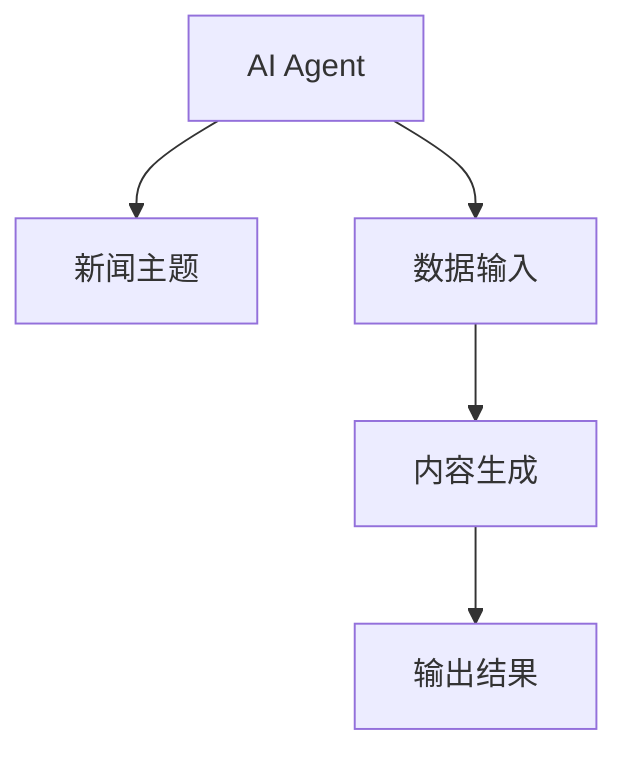

                 

# AI Agent在智能新闻写作中的角色

> 关键词：AI Agent，智能新闻写作，生成式AI，自然语言处理，新闻自动化

> 摘要：本文探讨了AI Agent在智能新闻写作中的角色，分析了其核心概念、算法原理、系统架构，并通过实际案例展示了AI Agent在新闻写作中的应用，最后提出了最佳实践建议。

---

# 第一部分: AI Agent在智能新闻写作中的背景与概念

# 第1章: AI Agent与智能新闻写作的背景

## 1.1 AI Agent的基本概念
### 1.1.1 AI Agent的定义与特征
AI Agent（人工智能代理）是指能够感知环境、自主决策并执行任务的智能实体。它结合了自然语言处理（NLP）、机器学习和大数据分析等技术，能够理解上下文、生成内容并与其他系统或用户交互。

### 1.1.2 智能新闻写作的定义与特点
智能新闻写作是指利用AI技术自动生成或辅助生成新闻内容的过程。其特点包括自动化、个性化、实时性和高效性。AI Agent在其中充当了内容生成的核心角色，能够根据数据输入生成结构化或非结构化的新闻报道。

### 1.1.3 AI Agent在新闻写作中的角色定位
AI Agent在新闻写作中主要扮演以下角色：
1. **内容生成器**：根据输入的数据生成新闻标题、导语和正文。
2. **数据处理器**：对原始数据进行清洗、整理和分析，提取关键信息。
3. **协同助手**：与人类记者协同工作，提供辅助建议或自动完成部分写作任务。

## 1.2 AI Agent与智能新闻写作的背景
### 1.2.1 数字化新闻生产的趋势
随着互联网和移动设备的普及，新闻生产逐渐从传统的人工写作模式向数字化、自动化方向转变。AI Agent的引入极大地提高了新闻生产的效率和精准度。

### 1.2.2 AI技术在媒体行业的应用现状
目前，AI技术在媒体行业的应用主要集中在新闻推荐、内容生成和数据可视化等方面。AI Agent的出现进一步推动了新闻写作的智能化和自动化。

### 1.2.3 智能新闻写作的市场需求与挑战
市场需求方面，AI Agent能够快速生成大量高质量的新闻内容，满足用户对实时新闻的需求。然而，AI Agent在新闻写作中也面临一些挑战，如内容的原创性、准确性以及伦理问题。

## 1.3 AI Agent在新闻写作中的问题背景
### 1.3.1 传统新闻写作的局限性
传统新闻写作依赖人工劳动，效率低且成本高。此外，人类记者的主观性可能会影响新闻的客观性和中立性。

### 1.3.2 AI Agent在新闻写作中的优势
AI Agent能够快速处理大量数据，生成结构化和非结构化的新闻内容。它还可以通过不断学习和优化，提高内容生成的准确性和相关性。

### 1.3.3 当前存在的主要问题与挑战
目前，AI Agent在新闻写作中面临的主要问题包括：
1. **内容原创性**：AI生成的内容可能存在重复或抄袭的风险。
2. **准确性**：AI可能因为数据质量问题生成不准确的新闻。
3. **伦理问题**：AI生成的新闻可能缺乏情感和深度，影响读者的体验。

---

# 第二部分: AI Agent的核心概念与原理

# 第2章: AI Agent的核心概念与联系

## 2.1 AI Agent的核心原理
### 2.1.1 自然语言处理（NLP）的基础
自然语言处理是AI Agent理解人类语言的基础。通过NLP技术，AI Agent可以将文本数据转化为结构化的信息，并生成符合语法和语义的新闻内容。

### 2.1.2 生成式AI的原理
生成式AI（Generative AI）是基于大模型（如GPT系列）的技术，能够根据输入的上下文生成相关的内容。其核心原理包括：
1. **文本生成**：通过概率分布生成新的文本。
2. **上下文理解**：基于上下文信息生成连贯的内容。

### 2.1.3 大模型在AI Agent中的作用
大模型（如GPT-3、GPT-4）在AI Agent中起到了核心作用。它们通过大量的训练数据，能够生成高质量的文本内容，并在新闻写作中提供强大的支持。

## 2.2 AI Agent与智能新闻写作的核心要素
### 2.2.1 数据输入与处理
AI Agent需要输入结构化或非结构化的数据，如新闻事件的关键词、时间、地点等。数据处理阶段包括数据清洗、特征提取和数据增强。

### 2.2.2 内容生成与优化
AI Agent根据输入数据生成新闻标题、导语和正文。生成的内容需要经过优化，确保其准确性和可读性。

### 2.2.3 人机协同的写作模式
AI Agent与人类记者协同工作，通过分工合作，实现新闻写作的高效性和质量。

## 2.3 核心概念对比分析
### 2.3.1 传统新闻写作与AI辅助写作的特征对比
| 特征                | 传统新闻写作           | AI辅助写作           |
|---------------------|------------------------|----------------------|
| 写作主体            | 人类记者               | AI Agent + 人类记者  |
| 写作效率            | 较低                   | 较高                 |
| 写作质量            | 取决于记者的经验       | 取决于AI模型的训练数据和优化 |
| 写作范围            | 有限                   | 更广泛               |

### 2.3.2 AI Agent在新闻写作中的实体关系图

---

# 第三部分: AI Agent的算法原理与数学模型

# 第3章: AI Agent的算法原理

## 3.1 生成式AI的算法流程
### 3.1.1 大模型的训练流程
生成式AI模型的训练流程包括：
1. **数据预处理**：清洗数据、分词、去停用词等。
2. **模型训练**：使用大规模数据训练生成模型，如GPT模型。
3. **微调优化**：根据具体任务对模型进行微调，优化生成效果。

### 3.1.2 内容生成的机制
内容生成的机制包括：
1. **上下文理解**：模型根据输入的上下文生成相关的内容。
2. **概率预测**：模型通过概率分布生成文本。
3. **反馈优化**：根据用户反馈不断优化生成内容。

### 3.1.3 基于上下文的生成方式
基于上下文的生成方式包括：
1. **条件生成**：根据给定的条件生成内容。
2. **无条件生成**：生成任意内容。

## 3.2 AI Agent的数学模型
### 3.2.1 概率分布与损失函数
生成式AI模型基于概率分布生成文本。交叉熵损失函数用于衡量生成结果与真实数据的差异。

$$ L = -\sum_{i=1}^{n} \log P(y_i|x) $$

其中，$P(y_i|x)$ 是给定输入$x$的情况下生成$y_i$的概率。

### 3.2.2 变压器模型（Transformer）的结构
变压

