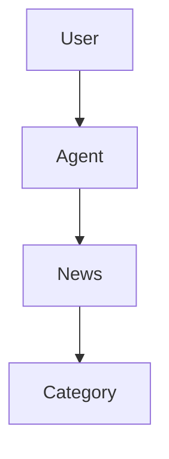
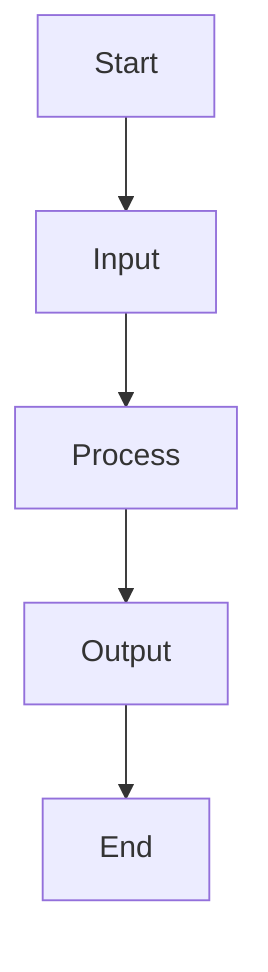
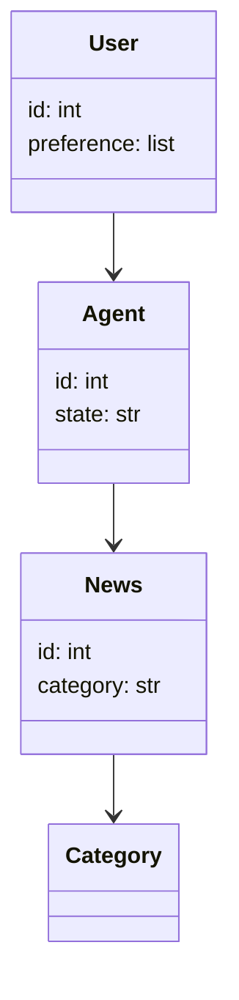
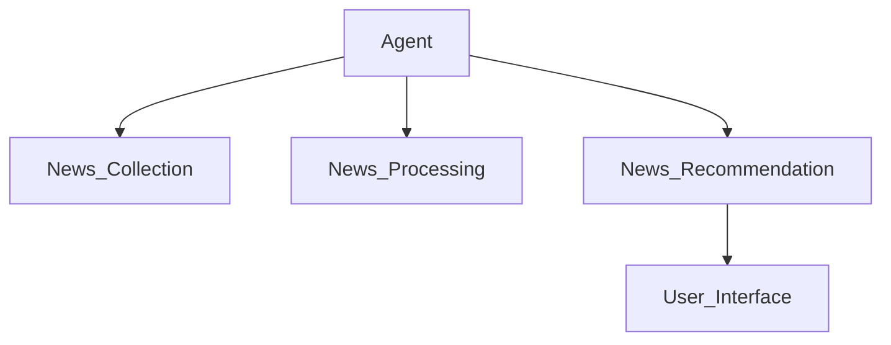
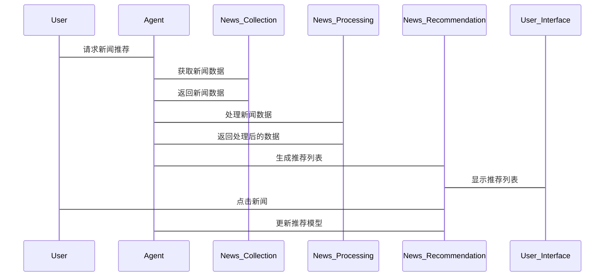

                 


```markdown
# AI Agent在智能新闻聚合中的角色

## 关键词
AI Agent, 智能新闻聚合, 信息筛选, 语义分析, 个性化推荐

## 摘要
本文详细探讨了AI Agent在智能新闻聚合中的角色，涵盖背景介绍、核心概念、算法原理、系统架构、项目实战及总结展望。通过理论与实践结合，分析AI Agent如何通过信息筛选、语义分析和个性化推荐优化新闻聚合，解决信息过载问题，提升用户体验。

---

# 第一部分: AI Agent在智能新闻聚合中的背景与概念

# 第1章: AI Agent与智能新闻聚合概述

## 1.1 AI Agent的基本概念
### 1.1.1 AI Agent的定义
人工智能代理（AI Agent）是能够感知环境、执行任务并做出决策的智能实体，用于实现特定目标。

### 1.1.2 AI Agent的核心特征
- **自主性**：无需外部干预，自主决策。
- **反应性**：实时感知环境变化，动态调整行为。
- **目标导向**：为实现特定目标而行动。
- **学习能力**：通过数据和经验不断优化性能。

### 1.1.3 AI Agent与传统算法的区别
| 特性 | AI Agent | 传统算法 |
|------|----------|----------|
| 行为方式 | 主动执行任务 | 被动执行计算 |
| 智能水平 | 具备学习和推理能力 | 依赖预设规则 |
| 适应性 | 能够自适应环境变化 | 需人工调整 |

## 1.2 智能新闻聚合的背景与需求
### 1.2.1 新闻聚合的定义与现状
新闻聚合是指从多个来源收集和整合新闻信息，以提供多样化的新闻内容。

### 1.2.2 智能新闻聚合的目标
- 提供个性化新闻推荐。
- 优化信息筛选效率。
- 实现多源信息整合与优化。

### 1.2.3 用户需求与技术挑战
- 用户需求：个性化推荐、信息准确性、阅读体验。
- 技术挑战：信息过载、数据多样性、计算效率。

## 1.3 AI Agent在新闻聚合中的角色
### 1.3.1 信息筛选与个性化推荐
AI Agent通过分析用户行为和偏好，筛选出相关新闻内容。

### 1.3.2 内容理解与语义分析
利用自然语言处理技术，理解新闻内容语义，进行深度分析。

### 1.3.3 多源信息整合与优化
整合多来源新闻信息，优化内容呈现方式，提升用户体验。

## 1.4 本章小结
本章介绍了AI Agent的基本概念及其在智能新闻聚合中的角色，为后续内容奠定基础。

---

# 第二部分: AI Agent的核心概念与技术原理

# 第2章: AI Agent的核心概念与联系

## 2.1 AI Agent的核心概念
### 2.1.1 实体关系分析
AI Agent在新闻聚合中的实体关系：



### 2.1.2 核心要素与属性特征对比
| 实体 | 属性 | 描述 |
|------|------|------|
| 用户 | id | 用户唯一标识符 |
| 用户 | 偏好 | 用户兴趣领域 |
| 新闻 | id | 新闻唯一标识符 |
| 新闻 | 类别 | 新闻所属类别 |
| Agent | id | Agent唯一标识符 |
| Agent | 状态 | Agent当前执行状态 |

### 2.1.3 实体关系图


## 2.2 AI Agent的算法原理
### 2.2.1 算法流程图


### 2.2.2 算法数学模型
推荐算法中的余弦相似度计算公式：

$$\text{similarity}(u, v) = \frac{\sum_{i=1}^{n} u_i v_i}{\sqrt{\sum_{i=1}^{n} u_i^2} \sqrt{\sum_{i=1}^{n} v_i^2}}$$

其中，$u$和$v$表示两个用户的偏好向量，$n$为新闻特征数量。

### 2.2.3 代码实现
```python
def cosine_similarity(u, v):
    numerator = sum(u_i * v_i for u_i, v_i in zip(u, v))
    denominator = (sum(u_i**2 for u_i in u) * sum(v_i**2 for v_i in v))**0.5
    return numerator / denominator

# 示例
user1 = [0.5, 0.7, 0.2]
user2 = [0.6, 0.3, 0.8]
print(cosine_similarity(user1, user2))
```

## 2.3 本章小结
本章详细讲解了AI Agent的核心概念及其在新闻聚合中的技术原理，通过实例分析了算法的数学模型和代码实现。

---

# 第三部分: 系统分析与架构设计

# 第3章: 系统分析与架构设计

## 3.1 系统功能设计
### 3.1.1 领域模型


### 3.1.2 系统架构


## 3.2 系统接口设计
### 3.2.1 接口描述
- 数据采集接口：从多源获取新闻数据。
- 数据处理接口：清洗和转换数据。
- 推荐接口：生成个性化推荐列表。

## 3.3 系统交互流程


## 3.4 本章小结
本章通过系统分析与架构设计，展示了AI Agent在智能新闻聚合中的实现方式。

---

# 第四部分: 项目实战

# 第4章: 项目实战

## 4.1 环境安装
```bash
pip install numpy scikit-learn
```

## 4.2 系统核心实现
### 4.2.1 数据预处理
```python
import numpy as np
from sklearn.feature_extraction.text import TfidfVectorizer

# 示例数据
texts = ["体育新闻", "科技新闻", "娱乐新闻"]

# 创建TF-IDF模型
vectorizer = TfidfVectorizer()
tfidf = vectorizer.fit_transform(texts)
print(tfidf)
```

### 4.2.2 模型训练
```python
from sklearn.metrics.pairwise import cosine_similarity

# 计算相似度矩阵
similarity_matrix = cosine_similarity(tfidf)
print(similarity_matrix)
```

## 4.3 代码应用解读与分析
通过上述代码，我们可以看到AI Agent如何利用TF-IDF和余弦相似度进行新闻推荐。

## 4.4 实际案例分析
### 4.4.1 用户点击率分析
```python
# 示例用户点击数据
clicks = {
    'user1': ['体育新闻', '科技新闻'],
    'user2': ['娱乐新闻', '体育新闻']
}

# 分析用户偏好
def analyze_clicks(clicks):
    for user, news in clicks.items():
        print(f"用户{user}偏好：{news}")

analyze_clicks(clicks)
```

## 4.5 项目小结
本章通过实际项目实战，详细讲解了AI Agent在智能新闻聚合中的具体实现。

---

# 第五部分: 总结与展望

# 第5章: 总结与展望

## 5.1 本章总结
本文详细探讨了AI Agent在智能新闻聚合中的角色，涵盖了背景、概念、算法、系统设计和项目实战。

## 5.2 未来展望
未来，AI Agent在新闻聚合中的应用将更加广泛，可能涉及多模态数据处理和个性化推荐的优化。

---

# 附录

## 附录A: 常用工具与库
- Python
- scikit-learn
- Mermaid
- LaTeX

## 附录B: 参考文献
- 略

---

# 索引

## 关键词索引
- AI Agent
- 智能新闻聚合
- 信息筛选
- 语义分析
- 个性化推荐
- 余弦相似度
- 系统架构
- 项目实战
- 总结与展望

## 章节索引
- 第1章: AI Agent与智能新闻聚合概述
- 第2章: AI Agent的核心概念与联系
- 第3章: 系统分析与架构设计
- 第4章: 项目实战
- 第5章: 总结与展望
- 附录
- 索引
```

---

**总结：** 本文系统地探讨了AI Agent在智能新闻聚合中的角色，通过理论分析、算法实现和项目实战，全面展示了其在信息筛选、语义分析和个性化推荐中的应用，为实现高效、个性化的新闻聚合提供了理论依据和实践指导。

