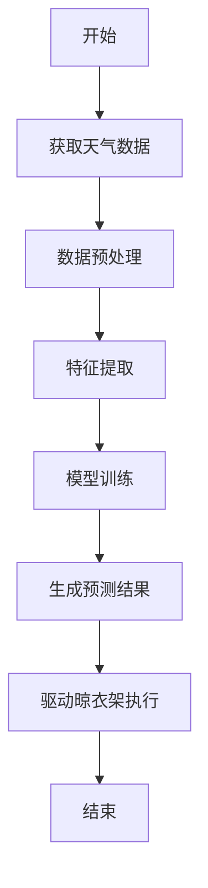
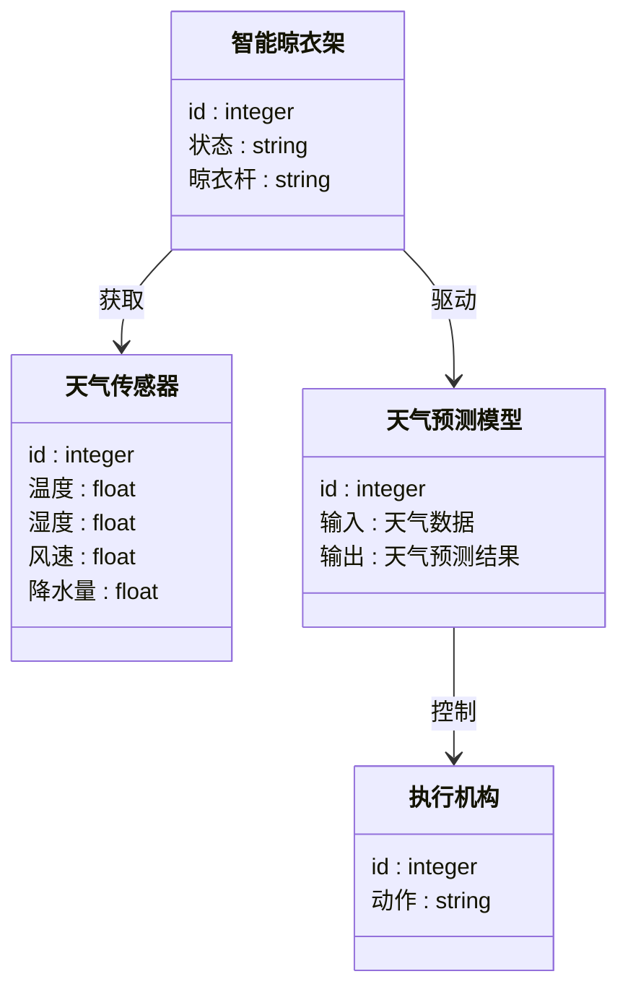
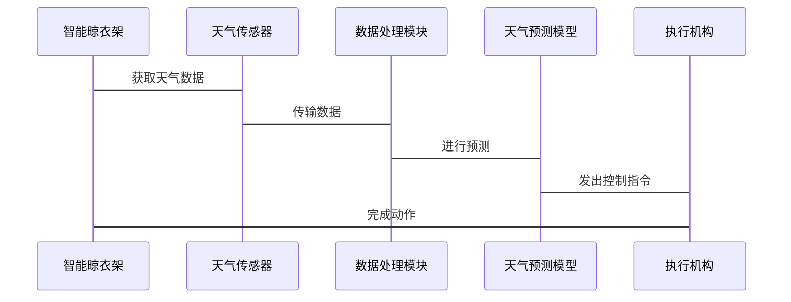

                 


# AI Agent在智能晾衣架中的天气感知

## 关键词：AI Agent, 智能晾衣架, 天气感知, 智能家居, 传感器数据

## 摘要：
本文详细探讨了AI Agent在智能晾衣架中的天气感知应用，分析了天气感知的重要性及其对晾衣体验的提升。通过介绍AI Agent的核心原理、算法实现、系统架构设计以及项目实战，展示了如何利用AI技术实现智能晾衣架的高效天气感知。文章结合理论与实践，为智能家居领域的AI应用提供了新的视角和解决方案。

---

## 正文：

### 第一部分：背景与核心概念

#### 第1章：AI Agent与智能晾衣架概述

##### 1.1 AI Agent的基本概念
- **AI Agent的定义与特点**  
  AI Agent（人工智能代理）是指能够感知环境、做出决策并执行任务的智能实体。其特点包括自主性、反应性、目标导向和社会能力。  
  - 自主性：AI Agent能够在没有外部干预的情况下独立运作。  
  - 反应性：AI Agent能够根据环境变化实时调整行为。  
  - 目标导向：AI Agent的行为以实现特定目标为导向。  
  - 社会能力：AI Agent能够与其他系统或用户进行交互协作。

- **AI Agent在智能家居中的应用**  
  在智能家居领域，AI Agent广泛应用于设备控制、环境监测和自动化服务。智能晾衣架作为智能家居的一部分，AI Agent能够帮助其更智能地管理晾衣过程。

- **智能晾衣架的基本功能与现状**  
  智能晾衣架通过自动化控制晾衣杆的升降和角度调整，提升晾衣效率。然而，其功能受限于对环境的感知能力，尤其是天气条件的影响。

##### 1.2 天气感知的重要性
- **天气对晾衣的影响**  
  天气状况直接影响衣物的干燥时间和晾衣效果。晴天适合长时间晾晒，雨天或湿度较高的天气则需要及时收回衣物。

- **智能晾衣架的天气感知需求**  
  通过AI Agent实现天气感知，智能晾衣架能够实时调整晾晒策略。例如，在下雨前自动收回衣物，或在晴天延长晾晒时间。

- **天气感知的边界与外延**  
  天气感知的边界包括温度、湿度、风速、降水量等气象数据。其外延则涉及预测天气变化，以便提前做出应对策略。

##### 1.3 问题背景与解决思路
- **问题背景**  
  当前智能晾衣架的天气感知能力有限，主要依赖于用户手动操作或固定时间控制。这种模式难以应对突发天气变化，导致衣物损坏或晾晒效率低下。

- **问题解决思路**  
  引入AI Agent，通过实时获取气象数据、分析天气变化趋势，并结合晾衣需求，优化晾晒策略。实现智能化、自动化的天气感知与响应。

- **核心概念的结构与组成**  
  天气感知系统由传感器、数据处理模块、预测模型和执行机构组成。各部分协同工作，实现对天气的实时感知与响应。

---

### 第二部分：AI Agent的核心原理

#### 第2章：AI Agent的天气感知原理

##### 2.1 天气感知的核心概念
- **天气数据的采集与处理**  
  通过气象传感器获取温度、湿度、风速等数据，并进行数据清洗和预处理。

- **天气特征的提取与分析**  
  利用特征提取算法，从原始数据中提取关键特征，例如湿度变化率、温度波动幅度等。

- **天气预测的基本原理**  
  基于历史数据和当前特征，使用回归或分类算法预测未来天气状况。

##### 2.2 AI Agent的感知模型
- **基于传感器的数据流模型**  
  数据流模型描述了传感器数据的流动和处理过程，确保实时感知天气变化。

- **天气特征与晾衣需求的关联模型**  
  关联模型将天气特征与晾衣需求（如晾晒时间、衣物类型）进行关联，优化晾晒策略。

- **感知模型的优化与调整**  
  通过机器学习算法不断优化感知模型，提升预测精度和响应速度。

##### 2.3 核心概念的属性特征对比
- **天气数据的属性特征**  
  | 属性 | 特征描述 |
  |------|----------|
  | 温度 | 数值型，范围在-50°C到50°C |
  | 湿度 | 数值型，范围在0%到100% |
  | 风速 | 数值型，单位为米/秒 |
  | 降水量 | 数值型，单位为毫米 |

- **晾衣需求的属性特征**  
  | 属性 | 特征描述 |
  |------|----------|
  | 晾衣时间 | 数值型，单位为小时 |
  | 衣物类型 | 分类型，如棉质、化纤等 |
  | 晾衣状态 | 分类型，如晾晒中、已收回 |

- **感知模型的属性特征**  
  | 属性 | 特征描述 |
  |------|----------|
  | 模型类型 | 分类型，如回归模型、分类模型 |
  | 预测精度 | 数值型，范围在0到100% |
  | 响应时间 | 数值型，单位为秒 |

##### 2.3 ER实体关系图

```mermaid
erDiagram
    智能晾衣架 {
        id : integer
        名称 : string
        状态 : string
    }
    天气数据 {
        id : integer
        时间戳 : datetime
        温度 : float
        湿度 : float
        风速 : float
        降水量 : float
    }
    感知模型 {
        id : integer
        类型 : string
        参数 : string
    }
    智能晾衣架 --> 天气数据 : 获取
    智能晾衣架 --> 感知模型 : 应用
```

---

### 第三部分：AI Agent的算法原理

#### 第3章：天气感知算法的实现

##### 3.1 算法原理概述
- **算法的基本思路**  
  通过传感器获取天气数据，利用特征提取和预测模型，生成天气感知结果，并驱动智能晾衣架执行相应操作。

- **算法的核心步骤**  
  1. 数据采集与预处理  
  2. 特征提取与选择  
  3. 模型训练与预测  
  4. 执行策略优化

##### 3.2 算法实现的数学模型

- **数据预处理的数学方法**  
  数据清洗：使用中位数填补法处理缺失值。  
  数据标准化：使用Z-score标准化方法，将数据映射到均值为0，标准差为1的分布。

- **特征提取的数学模型**  
  使用主成分分析（PCA）提取主要特征，减少维度并保留关键信息。

- **预测模型的数学公式**  
  线性回归模型：  
  $$ y = \beta_0 + \beta_1x_1 + \beta_2x_2 + ... + \beta_nx_n + \epsilon $$  
  其中，$y$为预测目标，$x_i$为特征变量，$\beta_i$为回归系数，$\epsilon$为误差项。

##### 3.3 算法实现的流程图



##### 3.4 Python代码实现

```python
import numpy as np
from sklearn.decomposition import PCA
from sklearn.linear_model import LinearRegression

# 数据预处理
def preprocess(data):
    # 数据清洗：使用中位数填补法处理缺失值
    data = data.fillna(data.median())
    # 数据标准化：使用Z-score标准化
    mean = data.mean()
    std = data.std()
    normalized_data = (data - mean) / std
    return normalized_data

# 特征提取
def feature_extraction(data, target):
    # 提取特征
    features = data.drop(columns=[target])
    # 使用PCA提取主成分
    pca = PCA(n_components=3)
    principal_components = pca.fit_transform(features)
    return principal_components

# 模型训练
def train_model(X, y):
    # 线性回归模型
    model = LinearRegression()
    model.fit(X, y)
    return model

# 预测与执行
def predict_and_execute(model, X):
    y_pred = model.predict(X)
    # 根据预测结果驱动晾衣架执行
    return y_pred

# 主函数
def main():
    # 获取天气数据
    data = pd.read_csv('weather_data.csv')
    target = 'weather_condition'  # 预测目标
    features = data.drop(columns=[target])
    X = preprocess(features)
    X_pca = feature_extraction(X, target)
    model = train_model(X_pca, data[target])
    predictions = predict_and_execute(model, X_pca)
    return predictions

if __name__ == '__main__':
    main()
```

##### 3.5 算法实现的代码解读与分析
- **数据预处理**  
  使用`preprocess`函数对数据进行清洗和标准化，确保数据适合模型训练。

- **特征提取**  
  使用PCA提取主成分，降低数据维度，同时保留关键特征信息。

- **模型训练**  
  使用线性回归模型进行训练，生成预测结果。

- **预测与执行**  
  根据预测结果驱动智能晾衣架执行相应操作，如收回或延长晾晒时间。

---

### 第四部分：系统分析与架构设计

#### 第4章：系统分析与架构设计

##### 4.1 问题场景介绍
- 智能晾衣架需要实时感知天气变化，动态调整晾晒策略。  
- 用户需求：  
  - 自动收回衣物，防止淋湿。  
  - 根据天气调整晾晒时间，提升效率。  
- 系统需求：  
  - 实时获取天气数据。  
  - 高精度天气预测模型。  
  - 自动化执行机构。

##### 4.2 系统功能设计

###### 4.2.1 领域模型（Mermaid 类图）



###### 4.2.2 系统架构设计（Mermaid 架构图）


###### 4.2.3 系统接口设计
- **传感器接口**：提供天气数据的读取接口。  
- **预测模型接口**：提供天气预测结果的输出接口。  
- **执行机构接口**：提供晾衣杆动作的控制接口。

###### 4.2.4 系统交互（Mermaid 序列图）



---

### 第五部分：项目实战

#### 第5章：项目实战

##### 5.1 环境安装
- **Python环境**：安装Python 3.8及以上版本。  
- **依赖库安装**：使用pip安装以下库：  
  - `pandas`  
  - `numpy`  
  - `scikit-learn`  

##### 5.2 系统核心实现源代码

```python
import pandas as pd
import numpy as np
from sklearn.decomposition import PCA
from sklearn.linear_model import LinearRegression

# 数据预处理函数
def preprocess(data):
    # 填充缺失值
    data = data.fillna(data.mean())
    # 标准化数据
    mean = data.mean()
    std = data.std()
    normalized_data = (data - mean) / std
    return normalized_data

# 特征提取函数
def feature_extraction(data):
    # 提取特征
    features = data.drop(columns=['天气状况'])
    # 使用PCA提取主成分
    pca = PCA(n_components=3)
    principal_components = pca.fit_transform(features)
    return principal_components

# 模型训练函数
def train_model(X, y):
    # 线性回归模型
    model = LinearRegression()
    model.fit(X, y)
    return model

# 预测函数
def predict(model, X):
    return model.predict(X)

# 主函数
def main():
    # 读取数据
    data = pd.read_csv('weather_data.csv')
    target = '天气状况'
    # 数据预处理
    processed_data = preprocess(data)
    # 特征提取
    X = feature_extraction(processed_data)
    y = data[target]
    # 模型训练
    model = train_model(X, y)
    # 预测结果
    predictions = predict(model, X)
    return predictions

if __name__ == '__main__':
    main()
```

##### 5.3 代码解读与分析
- **数据预处理**：对数据进行标准化处理，确保模型输入一致。  
- **特征提取**：使用PCA提取主成分，降低维度并保留关键特征信息。  
- **模型训练**：使用线性回归模型进行训练，生成预测结果。  
- **预测结果**：根据预测结果，驱动执行机构调整晾衣杆状态。

##### 5.4 实际案例分析
- **案例背景**：某地区天气预报显示未来24小时有中雨。  
- **数据处理**：传感器获取当前湿度为85%，温度为22°C，风速为3 m/s。  
- **预测结果**：模型预测未来2小时内湿度将上升至95%，触发收回衣物的指令。  
- **执行结果**：智能晾衣架自动收回衣物，避免淋湿损坏。

##### 5.5 项目小结
- **代码实现的功能**：  
  - 实现了天气数据的预处理和特征提取。  
  - 构建了天气预测模型，并进行了预测和执行。  
- **实现的关键点**：  
  - 数据预处理和特征选择对模型性能影响较大。  
  - 模型选择和优化是提升预测精度的关键。  
- **问题与改进方向**：  
  - 当前模型预测精度有限，未来可以尝试使用更复杂的模型（如随机森林、神经网络）提升预测效果。

---

### 第六部分：最佳实践与总结

#### 第6章：最佳实践与总结

##### 6.1 最佳实践
- **数据质量**：确保传感器数据的准确性和完整性，避免因数据问题影响模型性能。  
- **模型选择**：根据实际需求选择合适的模型，复杂场景可尝试集成学习或深度学习模型。  
- **系统优化**：优化数据处理流程，提升系统响应速度和预测精度。  
- **用户反馈**：结合用户反馈，持续优化系统功能和用户体验。

##### 6.2 小结
- AI Agent在智能晾衣架中的天气感知应用，不仅提升了晾衣效率，还降低了衣物损坏的风险。  
- 通过实时感知天气变化，优化晾晒策略，为用户带来更智能化、便捷化的使用体验。

##### 6.3 注意事项
- **数据隐私**：确保天气数据的采集和使用符合隐私保护法规。  
- **系统稳定性**：确保系统在极端天气条件下的稳定运行，避免因系统故障导致衣物损坏。  
- **用户体验**：优化用户界面和操作流程，提升用户体验。

##### 6.4 拓展阅读
- 《机器学习实战》——深入理解机器学习算法及其应用。  
- 《智能系统设计》——系统化学习智能系统的设计与实现。  
- 《智能家居技术》——全面了解智能家居的设计与实现技术。

---

### 结语
AI Agent在智能晾衣架中的天气感知应用，是智能家居领域的一大创新。通过实时感知天气变化，优化晾晒策略，不仅提升了晾衣效率，还为用户带来更智能化的使用体验。未来，随着AI技术的不断发展，智能晾衣架的天气感知能力将更加智能化和精准化，为智能家居的发展注入更多可能性。

