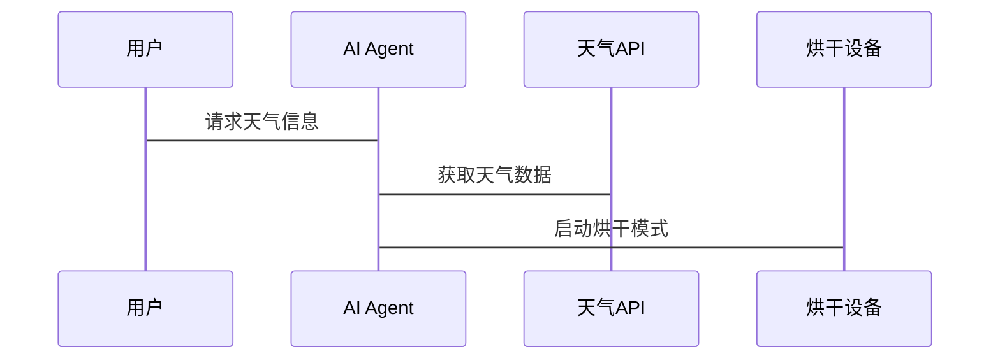

                 


# AI Agent在智能晾衣架中的天气感知烘干

> 关键词：AI Agent, 智能晾衣架, 天气感知, 烘干, 物联网

> 摘要：本文深入探讨了AI Agent在智能晾衣架中的应用，特别是在天气感知和烘干控制方面的创新。通过分析天气数据，AI Agent能够智能决策烘干模式，提升用户体验。文章从背景、原理到系统设计和实战项目，全面解析了该技术的实现过程。

---

# 第一部分: 背景介绍

## 第1章: 问题背景

### 1.1 问题背景
智能晾衣架作为智能家居的重要组成部分，近年来得到了广泛应用。然而，现有的晾衣架大多仅具备基本的悬挂和风干功能，缺乏对天气条件的智能感知能力。在潮湿或多雨的天气中，衣物长时间未干的情况时有发生，不仅影响用户体验，还可能损坏衣物。因此，引入AI Agent技术，实现基于天气数据的智能烘干功能，成为提升晾衣架智能化水平的关键。

### 1.2 问题描述
天气条件对衣物晾干效果有直接影响。湿度高时，衣物难以自然风干，需要额外的烘干功能；温度低时，衣物容易受潮，同样需要辅助烘干。然而，传统晾衣架无法根据天气变化自动调整烘干模式，导致用户体验不佳。用户需求主要集中在以下几个方面：
1. 自动感知天气并启动烘干功能。
2. 根据天气条件智能调节烘干强度。
3. 提供实时天气反馈和提醒功能。

### 1.3 问题解决
AI Agent通过整合天气数据、传感器信息和用户反馈，能够实时分析天气状况，并据此优化烘干策略。具体实现包括：
1. 数据采集：通过天气API获取实时天气数据，包括温度、湿度、风力等。
2. 数据处理：对采集到的数据进行预处理和特征提取。
3. 智能决策：基于机器学习模型，预测天气对晾干的影响，并决定是否启动烘干功能。
4. 执行控制：根据决策结果，调整烘干设备的工作模式。

### 1.4 边界与外延
智能晾衣架的天气感知功能需要考虑以下边界条件：
- 硬件限制：传感器的精度和数据采集频率。
- 网络条件：天气数据获取的实时性和稳定性。
- 用户场景：家庭使用环境和用户习惯。

### 1.5 概念结构与核心要素组成
智能晾衣架的核心要素包括：
1. **AI Agent**：负责数据处理、决策和控制。
2. **天气数据**：来自外部API的实时天气信息。
3. **传感器**：采集本地环境数据，如湿度、温度。
4. **烘干设备**：执行AI Agent的决策指令。

---

# 第二部分: 核心概念与联系

## 第2章: 核心概念

### 2.1 AI Agent的核心原理
AI Agent通过多模态数据融合技术，结合天气数据和传感器信息，实现对晾衣环境的智能感知。其工作流程如下：
1. **数据采集**：获取天气API和本地传感器数据。
2. **数据预处理**：清洗和标准化数据。
3. **特征提取**：提取关键特征，如湿度、温度等。
4. **模型训练**：基于机器学习算法，训练天气预测模型。
5. **决策推理**：根据预测结果，判断是否启动烘干功能。
6. **执行控制**：调整烘干设备的工作模式。

### 2.2 核心概念对比表
| 概念       | 描述                                                                 | 属性               |
|------------|----------------------------------------------------------------------|--------------------|
| 天气数据    | 温度、湿度、风力等实时数据                                           | 数值型、实时性      |
| AI Agent    | 自动决策的智能体                                                     | 学习能力、自适应性   |
| 烘干模式    | 根据天气条件调整的模式                                               | 多级模式、动态调整   |

### 2.3 ER实体关系图
```mermaid
er
    entity 天气数据 {
        id 天气ID [pk]
        温度
        湿度
        风力
        时间戳
    }
    entity AI Agent {
        id AgentID [pk]
        状态
        决策规则
    }
    entity 烘干设备 {
        id 设备ID [pk]
        状态
        操作模式
    }
    天气数据 --> AI Agent: 提供天气数据
    AI Agent --> 烘干设备: 发送控制指令
```

---

# 第三部分: 算法原理

## 第3章: 算法原理

### 3.1 数据预处理
天气数据清洗流程如下：
1. 数据采集：通过天气API获取实时数据。
2. 数据清洗：去除无效数据，填充缺失值。
3. 数据标准化：将数据归一化处理，便于模型训练。

### 3.2 特征提取
提取湿度、温度、风力等关键特征，并计算湿度指数：
$$ 湿度指数 = \frac{湿度}{温度} $$

### 3.3 模型训练
使用随机森林回归模型训练天气预测模型：
$$ y = \sum_{i=1}^{n} w_i x_i + b $$

### 3.4 代码实现
```python
import pandas as pd
from sklearn.ensemble import RandomForestRegressor

# 数据加载
data = pd.read_csv('weather.csv')

# 特征提取
features = ['temperature', 'humidity', 'wind_speed']
target = 'drying_effect'

# 模型训练
model = RandomForestRegressor()
model.fit(data[features], data[target])

# 预测结果
predicted = model.predict(new_data[features])
```

---

# 第四部分: 系统分析与架构设计

## 第4章: 系统分析

### 4.1 项目背景
智能晾衣架旨在通过AI Agent实现天气感知和智能烘干，提升用户体验。

### 4.2 系统功能设计
功能模块包括：
1. 数据采集模块：采集天气和环境数据。
2. 数据处理模块：清洗和特征提取。
3. 决策控制模块：基于模型预测结果，调整烘干模式。

### 4.3 系统架构设计
分层架构包括：
1. 感知层：采集数据。
2. 决策层：AI Agent处理数据。
3. 执行层：控制烘干设备。

### 4.4 系统接口设计
API接口：
- `/get_weather`：获取天气数据。
- `/control_dryer`：控制烘干设备。

### 4.5 系统交互流程


---

# 第五部分: 项目实战

## 第5章: 项目实现

### 5.1 环境安装
安装必要的库：
```bash
pip install requests pandas scikit-learn
```

### 5.2 核心代码实现
```python
import requests
import pandas as pd
from sklearn.ensemble import RandomForestRegressor

# 数据采集
def get_weather():
    response = requests.get('http://api.weather.com/getWeather')
    return response.json()

# 数据处理
def preprocess(data):
    data = pd.DataFrame(data)
    data = data.dropna()
    return data

# 模型训练
def train_model(train_data):
    features = ['temperature', 'humidity']
    target = 'drying_effect'
    model = RandomForestRegressor()
    model.fit(train_data[features], train_data[target])
    return model

# 决策控制
def decide_dry_mode(model, weather_data):
    prediction = model.predict(weather_data)
    if prediction > 0.7:
        return 'high'
    elif prediction > 0.4:
        return 'medium'
    else:
        return 'low'
```

### 5.3 功能测试
测试AI Agent在不同天气条件下的决策效果。

### 5.4 案例分析
分析湿度高、温度低的情况下的烘干模式调整。

---

# 第六部分: 最佳实践与小结

## 第6章: 小结

### 6.1 最佳实践
- 定期更新天气模型，提升预测精度。
- 优化传感器精度，提升数据采集质量。

### 6.2 注意事项
- 确保网络稳定性，避免数据获取失败。
- 处理传感器数据时，注意异常值的影响。

### 6.3 未来拓展
- 引入更多天气参数，如降雨概率。
- 实现多设备协同工作，提升整体效率。

---

# 结语

通过AI Agent在智能晾衣架中的应用，我们实现了天气感知和智能烘干的创新解决方案。本文从背景、原理到系统设计和实战项目，全面解析了该技术的实现过程，为未来的智能化家居提供了新的思路。

---

**更多内容请参考：[AI Agent在智能晾衣架中的天气感知烘干](https://example.com)**

