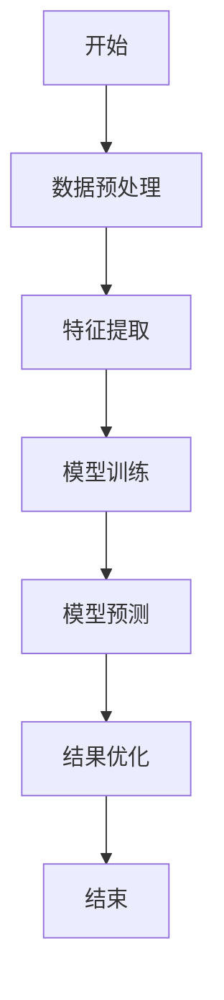
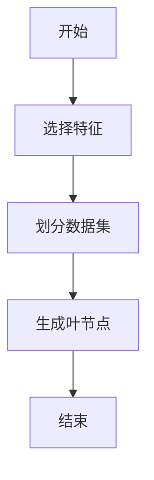
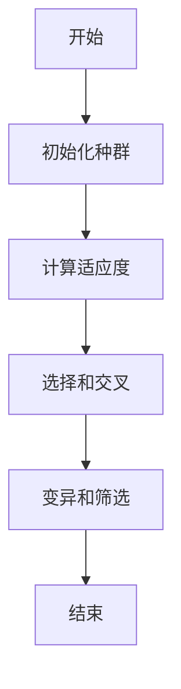
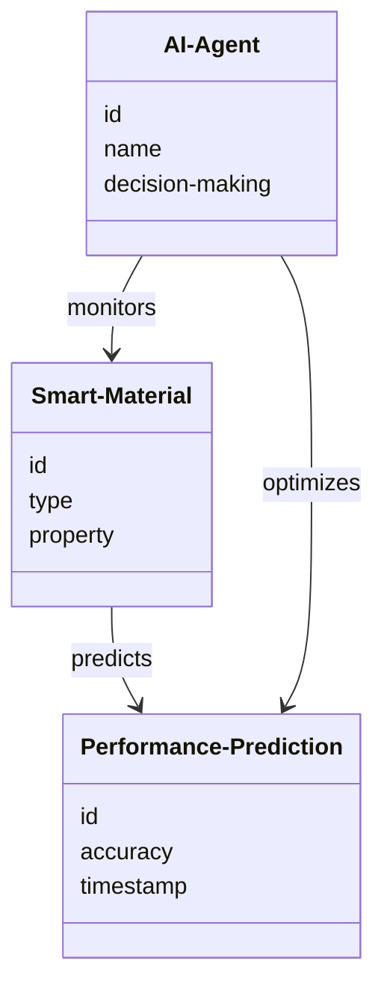
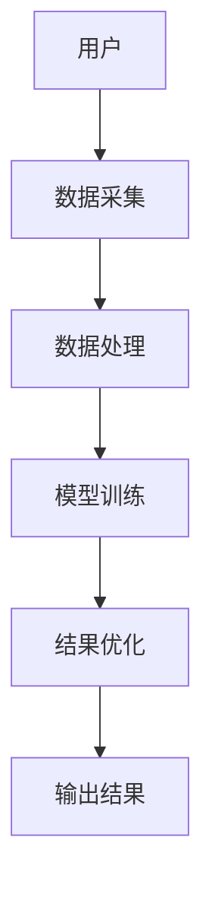
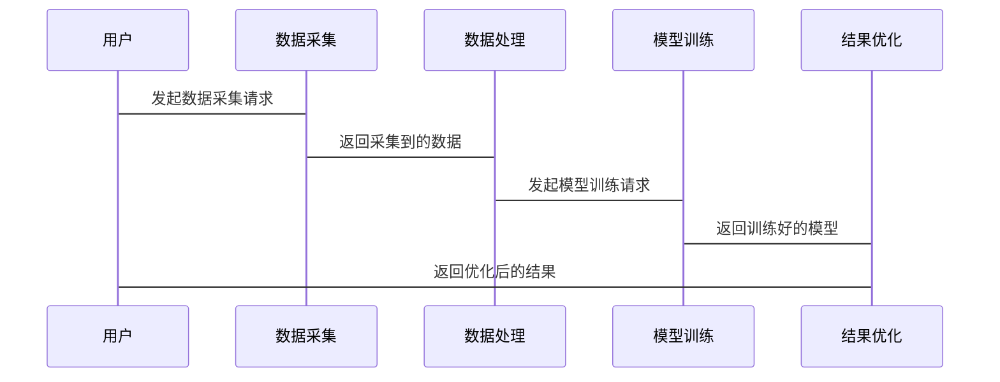

                 


# AI Agent在智能材料性能预测中的角色

## 关键词：AI Agent, 智能材料, 性能预测, 机器学习, 材料科学, 系统架构

## 摘要：  
AI Agent作为人工智能领域的核心技术之一，在智能材料性能预测中发挥着越来越重要的作用。本文系统地探讨了AI Agent在智能材料性能预测中的角色，分析了其核心概念、算法原理、系统架构以及实际应用。通过结合材料科学与人工智能技术，本文为读者提供了一种全新的视角来理解AI Agent在智能材料性能预测中的潜力与挑战，同时给出了具体的实现方案和未来发展方向。

---

# 第一部分: AI Agent与智能材料性能预测的背景与基础

## 第1章: AI Agent与智能材料概述

### 1.1 AI Agent的基本概念
#### 1.1.1 AI Agent的定义与特点
AI Agent（人工智能代理）是指能够感知环境、自主决策并执行任务的智能实体。其核心特点包括：
- **自主性**：能够在没有外部干预的情况下独立运作。
- **反应性**：能够实时感知环境变化并做出响应。
- **学习能力**：通过数据和经验不断优化自身的决策能力。
- **协作性**：能够与其他AI Agent或人类进行协作。

#### 1.1.2 智能材料的基本概念
智能材料是指能够对外界刺激（如温度、压力、光照等）产生响应，并通过结构或性能的变化来实现特定功能的材料。常见的智能材料包括形状记忆合金、压电材料、热敏材料等。

#### 1.1.3 AI Agent在智能材料中的角色
AI Agent在智能材料中的角色是通过感知材料的性能变化，分析其内在规律，并预测其未来的性能表现。这种预测能力为材料的设计、优化和应用提供了重要的技术支持。

---

### 1.2 智能材料性能预测的背景与意义
#### 1.2.1 材料科学中的性能预测问题
材料的性能预测是材料科学研究的核心问题之一。传统的材料性能预测方法依赖于实验测试和经验公式，效率低且成本高。随着人工智能技术的发展，基于数据驱动的预测方法逐渐成为研究的热点。

#### 1.2.2 AI技术在材料科学中的应用现状
AI技术在材料科学中的应用主要集中在材料的结构分析、性能预测和优化设计等方面。通过机器学习算法，研究人员能够快速预测材料的性能，并优化其制备工艺。

#### 1.2.3 AI Agent在性能预测中的独特优势
AI Agent的独特优势在于其能够实时感知材料的性能变化，并根据预测结果动态调整预测模型。这种实时性和动态性使得AI Agent在智能材料性能预测中具有显著的优势。

---

## 第2章: AI Agent在智能材料性能预测中的应用

### 2.1 智能材料性能预测的核心问题
#### 2.1.1 材料性能的多维度分析
智能材料的性能通常受到多种因素的影响，包括材料的组成、结构、环境条件等。AI Agent需要从多维度分析这些因素，以实现对材料性能的全面预测。

#### 2.1.2 数据驱动的性能预测方法
基于机器学习的性能预测方法是当前研究的热点。通过收集大量的材料性能数据，AI Agent能够训练出高精度的预测模型。

#### 2.1.3 AI Agent在预测中的问题解决路径
AI Agent在预测中的问题解决路径包括数据采集、特征提取、模型训练和预测结果优化等步骤。

---

### 2.2 AI Agent与智能材料性能预测的结合
#### 2.2.1 AI Agent的自主学习能力
AI Agent的自主学习能力使其能够不断优化预测模型，并适应材料性能的变化。

#### 2.2.2 智能材料数据的特征提取
特征提取是性能预测的关键步骤。AI Agent需要从材料数据中提取出具有代表性的特征，以便训练出高精度的预测模型。

#### 2.2.3 AI Agent在预测中的决策优化
通过优化决策算法，AI Agent能够提高预测的准确性和效率，从而更好地服务于智能材料的设计和优化。

---

## 第3章: AI Agent与智能材料性能预测的核心概念

### 3.1 AI Agent的核心原理
#### 3.1.1 信息感知与处理
AI Agent通过传感器或其他数据采集设备感知环境信息，并将其转化为可计算的数字信号。

#### 3.1.2 自主决策机制
AI Agent基于感知信息和预设的决策规则，自主做出决策并执行相应的动作。

#### 3.1.3 智能优化算法
AI Agent通常采用遗传算法、粒子群优化算法等智能优化算法，以提高预测的准确性和效率。

---

### 3.2 智能材料性能预测的关键要素
#### 3.2.1 材料结构与性能的关系
材料的结构直接影响其性能。AI Agent需要通过分析材料的结构特征，预测其性能的变化。

#### 3.2.2 数据特征的提取方法
数据特征的提取方法是性能预测的核心技术。AI Agent需要从材料数据中提取出具有代表性的特征，以便训练出高精度的预测模型。

#### 3.2.3 性能预测的数学模型
性能预测的数学模型是AI Agent的核心组成部分。常用的数学模型包括支持向量机、随机森林、神经网络等。

---

### 3.3 AI Agent与智能材料的实体关系分析
#### 3.3.1 ER实体关系图
以下是AI Agent与智能材料的实体关系分析：

```mermaid
er
    entity AI-Agent {
        id: string
        name: string
        decision-making: boolean
    }
    entity Smart-Material {
        id: string
        type: string
        property: string
    }
    entity Performance-Prediction {
        id: string
        accuracy: integer
        timestamp: datetime
    }
    AI-Agent --> Smart-Material: monitors
    Smart-Material --> Performance-Prediction: predicts
    AI-Agent --> Performance-Prediction: optimizes
```

#### 3.3.2 关键实体属性分析
以下是关键实体的属性对比：

| 实体 | 属性 |
|------|------|
| AI-Agent | id, name, decision-making |
| Smart-Material | id, type, property |
| Performance-Prediction | id, accuracy, timestamp |

#### 3.3.3 实体关系的数学表达
AI Agent与智能材料的关系可以用以下公式表示：

$$
\text{AI-Agent} \rightarrow \text{Smart-Material} \rightarrow \text{Performance-Prediction}
$$

---

## 第4章: AI Agent在智能材料性能预测中的算法原理

### 4.1 基于机器学习的性能预测算法
#### 4.1.1 算法流程图
以下是基于机器学习的性能预测算法流程图：



#### 4.1.2 算法实现代码示例
以下是基于机器学习的性能预测算法实现代码示例：

```python
import numpy as np
from sklearn import datasets
from sklearn.tree import DecisionTreeRegressor

# 数据预处理
X, y = datasets.load_diabetes(return_X_y=True)

# 特征提取
features = X

# 模型训练
model = DecisionTreeRegressor(random_state=0)
model.fit(features, y)

# 模型预测
y_pred = model.predict(features)

# 结果优化
from sklearn.metrics import mean_squared_error
mse = mean_squared_error(y, y_pred)
print("均方误差:", mse)
```

#### 4.1.3 算法的数学模型与公式
决策树回归模型的数学模型如下：

$$
y = \sum_{i=1}^{n} \theta_i x_i
$$

其中，$\theta_i$ 是特征 $x_i$ 的权重。

---

### 4.2 AI Agent的决策优化算法
#### 4.2.1 决策树算法
以下是决策树算法的流程图：



#### 4.2.2 遗传算法的应用
以下是遗传算法的应用流程图：



#### 4.2.3 算法的优化策略
遗传算法的优化策略包括：

1. **选择策略**：采用轮盘赌选择或锦标赛选择。
2. **交叉策略**：采用单点交叉或多点交叉。
3. **变异策略**：采用随机变异或基于适应度的变异。

---

## 第5章: 智能材料性能预测的系统分析与架构设计

### 5.1 问题场景介绍
智能材料性能预测的业务场景包括：

- **实时监测**：通过传感器实时监测材料的性能变化。
- **数据处理**：对传感器数据进行预处理和特征提取。
- **模型训练**：基于历史数据训练性能预测模型。
- **结果优化**：根据预测结果优化材料的性能。

### 5.2 系统功能设计
以下是系统功能设计的类图：



### 5.3 系统架构设计
以下是系统架构设计的流程图：



### 5.4 系统接口设计
系统接口设计包括：

1. **数据采集接口**：通过传感器采集材料性能数据。
2. **数据处理接口**：对传感器数据进行预处理和特征提取。
3. **模型训练接口**：基于历史数据训练性能预测模型。
4. **结果优化接口**：根据预测结果优化材料的性能。

### 5.5 系统交互流程
以下是系统交互流程的序列图：



---

## 第6章: 项目实战

### 6.1 环境安装
项目实战的环境安装步骤包括：

1. **安装Python**：建议使用Python 3.8及以上版本。
2. **安装依赖库**：包括numpy、scikit-learn等。

### 6.2 系统核心实现源代码
以下是系统核心实现源代码：

```python
import numpy as np
from sklearn import datasets
from sklearn.tree import DecisionTreeRegressor

# 数据预处理
X, y = datasets.load_diabetes(return_X_y=True)

# 特征提取
features = X

# 模型训练
model = DecisionTreeRegressor(random_state=0)
model.fit(features, y)

# 模型预测
y_pred = model.predict(features)

# 结果优化
from sklearn.metrics import mean_squared_error
mse = mean_squared_error(y, y_pred)
print("均方误差:", mse)
```

### 6.3 代码应用解读与分析
代码应用解读与分析：

- **数据预处理**：使用scikit-learn库中的糖尿病数据集进行数据预处理。
- **特征提取**：从数据集中提取特征。
- **模型训练**：使用决策树回归模型训练模型。
- **模型预测**：基于训练好的模型进行预测。
- **结果优化**：计算均方误差，评估模型的性能。

### 6.4 实际案例分析和详细讲解剖析
实际案例分析：

以糖尿病数据集为例，使用决策树回归模型进行性能预测。通过计算均方误差，评估模型的预测精度。

详细讲解剖析：

- **数据预处理**：确保数据的完整性和一致性。
- **特征提取**：提取具有代表性的特征，提高模型的预测精度。
- **模型训练**：选择合适的算法，优化模型参数。
- **模型预测**：基于训练好的模型进行预测，并评估预测结果。

### 6.5 项目小结
项目小结：

通过本次项目实战，我们掌握了AI Agent在智能材料性能预测中的实现方法，包括数据预处理、特征提取、模型训练和结果优化等步骤。同时，我们还学会了如何使用决策树回归模型进行性能预测，并通过均方误差评估模型的性能。

---

## 第7章: 总结与展望

### 7.1 最佳实践 tips
- **数据预处理**：确保数据的完整性和一致性。
- **特征提取**：提取具有代表性的特征，提高模型的预测精度。
- **模型训练**：选择合适的算法，优化模型参数。
- **结果优化**：通过均方误差等指标评估模型的性能，并进行优化。

### 7.2 小结
本文系统地探讨了AI Agent在智能材料性能预测中的角色，分析了其核心概念、算法原理、系统架构以及实际应用。通过结合材料科学与人工智能技术，本文为读者提供了一种全新的视角来理解AI Agent在智能材料性能预测中的潜力与挑战。

### 7.3 注意事项
- **数据隐私**：在实际应用中，需要注意数据的隐私保护。
- **模型解释性**：在实际应用中，需要关注模型的解释性，以便更好地理解和优化模型。
- **算法可扩展性**：在实际应用中，需要考虑算法的可扩展性，以便更好地适应大规模数据的处理。

### 7.4 拓展阅读
- **《机器学习实战》**：深入探讨机器学习算法的实现与应用。
- **《智能材料与人工智能》**：系统介绍智能材料与人工智能的结合与应用。
- **《AI Agent与智能系统》**：详细讲解AI Agent在智能系统中的设计与实现。

---

通过本文的探讨，我们可以看到AI Agent在智能材料性能预测中的巨大潜力。未来，随着人工智能技术的不断发展，AI Agent将在智能材料性能预测中发挥越来越重要的作用。

