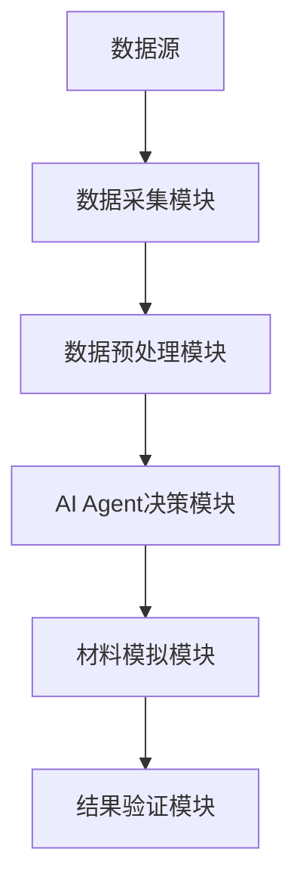
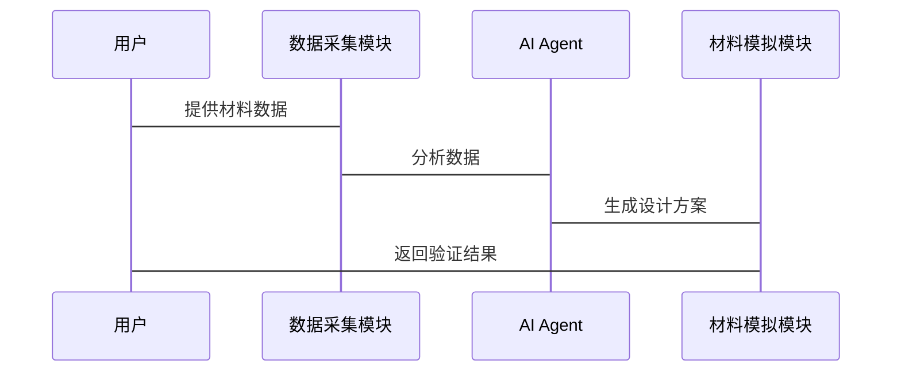

                 


# AI Agent在智能材料设计与发现中的角色

## 关键词：
- AI Agent
- 智能材料
- 材料设计
- 生成对抗网络（GAN）
- 强化学习
- 智能计算

## 摘要：
本文探讨AI Agent在智能材料设计与发现中的应用，从基本概念、算法原理到系统架构，再到项目实战，全面分析AI Agent如何推动材料科学的进步。通过强化学习和生成对抗网络等算法，结合实际案例和系统设计，揭示AI Agent在材料科学中的巨大潜力。

---

# 第1章: AI Agent与智能材料概述

## 1.1 AI Agent的基本概念

### 1.1.1 AI Agent的定义与分类
- **定义**：AI Agent是一种智能体，能够感知环境并采取行动以实现目标。
- **分类**：分为简单反射Agent、基于模型的Reflexive Agent、目标驱动的Agent、效用驱动的Agent和学习驱动的Agent。

### 1.1.2 AI Agent的核心特征
- **自主性**：无需外部干预。
- **反应性**：能实时感知并做出反应。
- **目标导向性**：具备明确的目标驱动。

### 1.1.3 AI Agent与传统计算的区别
| 特性       | 传统计算       | AI Agent    |
|------------|----------------|-------------|
| 自主性      | 无             | 有          |
| 学习能力    | 无             | 有          |
| 环境交互    | 无             | 有          |

## 1.2 智能材料的基本概念

### 1.2.1 智能材料的定义与分类
- **定义**：智能材料是能够感知外界变化并做出相应反应的材料。
- **分类**：包括形状记忆合金、压电材料、磁性材料等。

### 1.2.2 智能材料的特性与应用领域
| 特性       | 描述             | 应用领域       |
|------------|------------------|----------------|
| 灵敏性      | 对外界刺激敏感   | 医疗器械       |
| 自适应性    | 可自适应环境变化  | 智能服装       |

## 1.3 AI Agent在智能材料设计中的角色

### 1.3.1 AI Agent在材料设计中的功能
- 数据分析：处理大量材料数据，发现规律。
- 模型构建：建立材料性能预测模型。
- 优化设计：基于AI优化材料结构。

### 1.3.2 AI Agent与材料科学的结合方式
1. 数据驱动：利用AI处理实验数据。
2. 模型驱动：建立材料性能模型。

### 1.3.3 AI Agent在材料发现中的优势
- 提高效率：缩短材料研发周期。
- 成本降低：减少实验成本。
- 精准预测：提高预测准确性。

## 1.4 本章小结
本章介绍了AI Agent和智能材料的基本概念，分析了AI Agent在智能材料设计中的角色及其优势。

---

# 第2章: AI Agent的核心算法与数学模型

## 2.1 强化学习算法

### 2.1.1 强化学习的基本原理
- **定义**：通过试错学习，利用奖励机制优化策略。
- **流程**：环境 → 行动 → 奖励 → 更新策略。

### 2.1.2 Q-learning算法的数学模型
$$ Q(s,a) = r + \gamma \max Q(s',a') $$

### 2.1.3 Deep Q-Networks (DQN) 的实现
- 使用神经网络近似Q值函数。
- 通过经验回放和目标网络优化。

### 2.1.4 强化学习在材料设计中的应用
- 材料优化：通过试错优化材料性能。
- 结构设计：探索材料结构空间。

## 2.2 生成对抗网络（GAN）

### 2.2.1 GAN的基本结构
- **生成器**：生成样本。
- **判别器**：判别样本真伪。

### 2.2.2 GAN的损失函数
$$ \mathcal{L} = \mathbb{E}_{z}[\log D(G(z))] + \mathbb{E}_{x}[\log(1-D(G(z)))] $$

### 2.2.3 GAN在材料生成中的应用
- 生成材料结构：设计新型材料。
- 模拟材料性能：预测材料特性。

## 2.3 聚类算法

### 2.3.1 K-means算法的原理
- 将数据分成k个簇，使簇内方差最小。
$$ \text{目标函数} = \sum_{i=1}^k \sum_{j=1}^n (x_j - c_i)^2 $$

### 2.3.2 层次聚类算法的实现
- **步骤**：计算距离矩阵 → 确定聚类数 → 聚类。

### 2.3.3 聚类在材料分类中的应用
- 材料分类：根据性能分类材料。
- 数据分析：分析材料数据结构。

## 2.4 本章小结
本章详细介绍了强化学习、GAN和聚类算法的原理及其在材料设计中的应用。

---

# 第3章: 智能材料设计的系统架构

## 3.1 系统模块划分

### 3.1.1 数据采集模块
- 从数据库或实验中获取材料数据。

### 3.1.2 数据预处理模块
- 清洗和归一化数据。

### 3.1.3 AI Agent决策模块
- 使用强化学习或GAN生成材料设计方案。

### 3.1.4 材料模拟与验证模块
- 使用分子动力学等方法验证材料性能。

## 3.2 系统数据流图


## 3.3 系统接口设计

### 3.3.1 数据接口
- 输入：材料数据。
- 输出：处理后的数据。

### 3.3.2 模型接口
- 输入：材料参数。
- 输出：材料设计方案。

### 3.3.3 用户接口
- 输入：用户需求。
- 输出：设计报告。

## 3.4 系统交互设计


## 3.5 本章小结
本章详细描述了智能材料设计系统的架构和模块设计，展示了各部分的交互流程。

---

# 第4章: 项目实战：基于AI Agent的智能材料设计系统

## 4.1 环境安装

### 4.1.1 安装Python
```bash
python --version
pip install --upgrade pip
```

### 4.1.2 安装深度学习框架
```bash
pip install tensorflow-gpu
pip install keras
pip install numpy
pip install matplotlib
pip install scikit-learn
pip install pymermaid
```

## 4.2 核心代码实现

### 4.2.1 强化学习代码
```python
import numpy as np
import gym
from gym import spaces
from gym.utils import seeding

class MaterialDesignEnv(gym.Env):
    def __init__(self):
        self.action_space = spaces.Discrete(4)
        self.observation_space = spaces.Box(low=0, high=1, shape=(2,))
        self._reset()
    
    def _reset(self):
        self.state = np.random.random(2)
        return self.state, 0, False
    
    def _step(self, action):
        # 处理动作，更新状态，返回新的状态，奖励和完成标志
        pass
    
    def _render(self, mode='human'):
        pass

# 使用DQN算法训练模型
class DQNAgent:
    def __init__(self, state_size, action_size):
        self.state_size = state_size
        self.action_size = action_size
        self.model = self.build_model()
    
    def build_model(self):
        # 构建DQN神经网络模型
        pass

# 训练过程
env = MaterialDesignEnv()
agent = DQNAgent(2,4)
for episode in range(1000):
    state = env.reset()
    while not done:
        action = agent.act(state)
        next_state, reward, done = env.step(action)
        agent.remember(state, action, reward, next_state, done)
        agent.replay()
```

### 4.2.2 GAN代码
```python
import tensorflow as tf
from tensorflow.keras.layers import Dense, Input, LeakyReLU
from tensorflow.keras.models import Model

# 定义生成器
def generator():
    input = Input(shape=(100,))
    x = Dense(256)(input)
    x = LeakyReLU(alpha=0.2)(x)
    x = Dense(2)(x)
    model = Model(inputs=input, outputs=x)
    return model

# 定义判别器
def discriminator():
    input = Input(shape=(2,))
    x = Dense(256)(input)
    x = LeakyReLU(alpha=0.2)(x)
    x = Dense(1)(x)
    model = Model(inputs=input, outputs=x)
    return model

# 编译模型
def train_gan(generator, discriminator):
    discriminator.compile(loss='binary_crossentropy', optimizer='adam')
    generator.compile(loss='binary_crossentropy', optimizer='adam')
    # 定义GAN的损失函数和训练过程
    pass

# 训练过程
gan_model = train_gan(generator(), discriminator())
```

## 4.3 应用解读与分析

### 4.3.1 强化学习应用
- **目标**：优化材料性能。
- **过程**：通过试错优化材料参数。

### 4.3.2 GAN应用
- **目标**：生成新材料结构。
- **过程**：生成器生成材料结构，判别器验证结构合理性。

## 4.4 案例分析

### 4.4.1 案例1：新型合金设计
- **输入**：合金成分数据。
- **输出**：优化的合金结构。

### 4.4.2 案例2：智能传感器设计
- **输入**：传感器性能需求。
- **输出**：最优传感器设计方案。

## 4.5 项目小结
本章通过实际案例展示了AI Agent在智能材料设计中的应用，验证了其有效性和优越性。

---

# 第5章: 总结与展望

## 5.1 本章小结
- AI Agent在智能材料设计中的应用显著提高了研发效率和精确度。
- 强化学习和GAN等算法在材料设计中发挥了重要作用。

## 5.2 未来展望
- 更复杂的材料设计：探索更多材料特性。
- 更高效的学习算法：提升AI Agent的学习效率。
- 更广泛的应用领域：扩展AI Agent在材料科学中的应用范围。

## 5.3 最佳实践 tips
- 数据质量：确保数据准确性和完整性。
- 模型选择：根据任务选择合适的算法。
- 系统设计：注重模块化和可扩展性。

## 5.4 注意事项
- 数据隐私：注意数据安全。
- 模型解释性：确保模型可解释。
- 实验验证：验证模型预测的准确性。

## 5.5 拓展阅读
- 推荐阅读《生成对抗网络》和《强化学习》的相关书籍。

---

# 结语

AI Agent正在深刻改变智能材料的设计与发现方式，未来随着算法的进步和计算能力的提升，AI Agent将在材料科学中发挥更大的作用，推动更多创新材料的研发。

