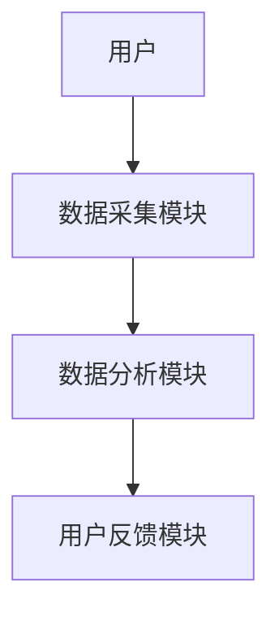

                 


# AI Agent在智能枕头中的睡眠质量分析

## 关键词：
- AI Agent
- 智能枕头
- 睡眠质量
- 数据分析
- 机器学习

## 摘要：
本文探讨了AI Agent在智能枕头中的应用，详细分析了睡眠质量的检测与改善。通过结合AI技术，智能枕头能够实时监测用户的睡眠数据，利用机器学习算法进行分析，为用户提供个性化的睡眠改善建议。本文从背景介绍、核心概念、算法原理、系统架构、项目实战等方面展开，系统阐述了AI Agent在睡眠质量分析中的作用与实现。

---

# 第1章: AI Agent与智能枕头的背景介绍

## 1.1 AI Agent的基本概念
### 1.1.1 AI Agent的定义与特点
人工智能代理（AI Agent）是指能够感知环境并采取行动以实现目标的智能实体。其特点包括自主性、反应性、主动性和社会能力。AI Agent能够通过传感器获取数据，利用算法进行决策，并执行相应的操作。

### 1.1.2 AI Agent的核心功能与应用场景
AI Agent的核心功能包括数据采集、信息处理、决策制定和执行操作。其应用场景广泛，如智能家居、自动驾驶、医疗健康等。

### 1.1.3 AI Agent与传统软件的区别
AI Agent与传统软件的主要区别在于其智能性和自主性。AI Agent能够通过学习和适应环境来优化其行为，而传统软件通常基于固定的规则运行。

## 1.2 智能枕头的发展历程
### 1.2.1 智能枕头的定义与技术基础
智能枕头是一种结合了传感器和智能技术的睡眠辅助设备，能够监测用户的睡眠状态，并通过AI算法提供个性化的睡眠改善建议。

### 1.2.2 智能枕头的发展阶段与现状
智能枕头经历了从简单的震动提醒到复杂的多传感器监测的演变。当前，智能枕头主要通过收集用户的生理数据（如心率、体温、呼吸频率等）和环境数据（如光线、噪音等）来分析睡眠质量。

### 1.2.3 智能枕头的未来趋势
未来的智能枕头将更加智能化，集成更多的传感器和AI算法，能够实时监测用户的睡眠状态，并通过反馈机制优化用户的睡眠质量。

## 1.3 睡眠质量分析的背景与意义
### 1.3.1 睡眠质量的重要性与影响因素
睡眠质量直接影响人体健康，长期睡眠不足会导致多种健康问题。影响睡眠质量的因素包括生理因素（如年龄、健康状况）和环境因素（如噪音、光线）。

### 1.3.2 睡眠质量分析的现状与挑战
目前，睡眠质量分析主要依赖于专业的医疗设备和人工分析。然而，这种方法成本高、操作复杂，难以普及到普通家庭。

### 1.3.3 AI Agent在睡眠质量分析中的作用
AI Agent能够通过智能枕头实时监测用户的睡眠数据，利用机器学习算法快速分析数据并提供个性化的改善建议。

## 1.4 本章小结
本章介绍了AI Agent的基本概念、智能枕头的发展历程以及睡眠质量分析的背景与意义。通过这些内容，我们理解了AI Agent在智能枕头中的重要性及其在睡眠质量分析中的潜在价值。

---

# 第2章: AI Agent与智能枕头的核心原理

## 2.1 AI Agent的核心原理
### 2.1.1 AI Agent的工作流程
AI Agent的工作流程包括数据采集、信息处理、决策制定和执行操作。通过传感器获取数据后，AI Agent会利用算法进行分析，并根据结果采取相应的行动。

### 2.1.2 AI Agent的感知与决策机制
AI Agent通过多种传感器（如加速度计、心率传感器）感知环境，并利用机器学习算法进行决策。感知数据后，AI Agent会根据预设的目标和策略做出最优选择。

### 2.1.3 AI Agent的学习与优化
AI Agent能够通过强化学习和监督学习不断优化其算法模型，提高睡眠质量分析的准确性。学习过程包括数据收集、模型训练和结果反馈。

## 2.2 智能枕头的核心原理
### 2.2.1 智能枕头的数据采集模块
智能枕头通过多种传感器（如加速度计、温度传感器）采集用户的生理数据和环境数据。这些数据包括心率、体温、呼吸频率等。

### 2.2.2 智能枕头的数据分析模块
数据分析模块利用AI算法对采集到的数据进行分析，识别用户的睡眠阶段（如浅睡、深睡）并评估睡眠质量。

### 2.2.3 智能枕头的反馈与改善建议
智能枕头根据分析结果提供个性化的改善建议，如调整枕头高度、优化睡眠环境等。

## 2.3 AI Agent与智能枕头的协同工作
### 2.3.1 数据流与协同机制
AI Agent与智能枕头通过数据接口进行交互，AI Agent接收智能枕头采集的数据并进行分析，然后将结果反馈给智能枕头以优化其行为。

### 2.3.2 数据处理与算法选择
AI Agent在分析睡眠数据时，通常采用机器学习算法（如支持向量机、随机森林）进行分类和预测。选择合适的算法能够提高睡眠质量分析的准确性。

### 2.3.3 系统架构与模块划分
AI Agent与智能枕头的系统架构通常包括数据采集模块、数据分析模块和用户反馈模块。各模块协同工作，实现睡眠质量的实时监测与优化。

## 2.4 本章小结
本章详细讲解了AI Agent与智能枕头的核心原理，包括AI Agent的工作流程、智能枕头的数据采集与分析模块，以及两者协同工作的机制。通过这些内容，我们理解了AI Agent在智能枕头中的具体应用和实现方式。

---

# 第3章: AI Agent在睡眠质量分析中的算法原理

## 3.1 睡眠质量分析的算法选择
### 3.1.1 机器学习算法在睡眠质量分析中的应用
机器学习算法（如支持向量机、随机森林）在睡眠质量分析中被广泛应用。这些算法能够处理复杂的生理数据，提高分析的准确性。

### 3.1.2 基于深度学习的睡眠质量分析
深度学习算法（如卷积神经网络、循环神经网络）在睡眠质量分析中也表现出色。深度学习能够自动提取数据特征，减少人工特征工程的工作量。

### 3.1.3 算法选择的考虑因素
算法选择需要考虑数据量、数据类型、计算复杂度和分析目标。对于睡眠质量分析，通常选择能够处理多维时间序列数据的算法。

## 3.2 基于机器学习的睡眠质量分析模型
### 3.2.1 数据预处理
数据预处理包括数据清洗、特征提取和数据标准化。通过预处理可以提高模型的准确性和稳定性。

### 3.2.2 模型训练与优化
利用训练数据对模型进行训练，并通过交叉验证和网格搜索优化模型参数。优化后的模型能够更好地泛化到新数据。

### 3.2.3 模型评估
模型评估包括准确率、召回率、F1分数等指标。通过评估可以了解模型的性能，并根据需要进行调整。

## 3.3 算法实现与代码示例
### 3.3.1 使用Python的机器学习库（如scikit-learn）进行实现
```python
from sklearn.svm import SVC
from sklearn.model_selection import train_test_split
from sklearn.metrics import accuracy_score

# 数据预处理
X_train, X_test, y_train, y_test = train_test_split(X, y, test_size=0.2)

# 模型训练
model = SVC()
model.fit(X_train, y_train)

# 模型预测
y_pred = model.predict(X_test)

# 模型评估
print("Accuracy:", accuracy_score(y_test, y_pred))
```

### 3.3.2 基于深度学习的实现（如Keras）
```python
from keras.models import Sequential
from keras.layers import LSTM, Dense

# 构建模型
model = Sequential()
model.add(LSTM(64, input_shape=(timesteps, features)))
model.add(Dense(1, activation='sigmoid'))

# 编译模型
model.compile(loss='binary_crossentropy', optimizer='adam', metrics=['accuracy'])

# 训练模型
model.fit(X_train, y_train, epochs=10, batch_size=32, validation_data=(X_test, y_test))
```

## 3.4 本章小结
本章详细讲解了AI Agent在睡眠质量分析中的算法原理，包括机器学习和深度学习算法的选择与实现。通过代码示例，我们理解了如何利用Python和相关库进行模型训练和评估。

---

# 第4章: 智能枕头的系统架构与设计

## 4.1 系统功能设计
### 4.1.1 数据采集模块
数据采集模块包括多种传感器（如加速度计、心率传感器）和相应的接口。这些传感器能够实时采集用户的生理数据和环境数据。

### 4.1.2 数据分析模块
数据分析模块利用AI算法对采集到的数据进行分析，识别用户的睡眠阶段并评估睡眠质量。

### 4.1.3 用户反馈模块
用户反馈模块通过显示或声音反馈将分析结果呈现给用户，并提供个性化的改善建议。

## 4.2 系统架构设计
### 4.2.1 系统架构图
使用Mermaid绘制系统架构图，展示系统的各个模块及其交互关系。



### 4.2.2 模块交互流程
模块交互流程包括数据采集、数据传输、数据分析和结果反馈。各模块协同工作，实现睡眠质量的实时监测与优化。

## 4.3 系统接口设计
### 4.3.1 数据接口
数据接口用于智能枕头与AI Agent之间的数据传输。通常采用RESTful API或消息队列（如Kafka）进行通信。

### 4.3.2 用户接口
用户接口用于显示分析结果和改善建议。通常采用图形界面或声音反馈，便于用户理解和操作。

## 4.4 本章小结
本章详细讲解了智能枕头的系统架构与设计，包括数据采集模块、数据分析模块和用户反馈模块的功能设计，以及模块之间的交互流程。

---

# 第5章: 项目实战——智能枕头的睡眠质量分析系统

## 5.1 项目环境安装与配置
### 5.1.1 硬件设备安装
智能枕头需要安装多种传感器（如加速度计、心率传感器）和相应的接口电路。

### 5.1.2 软件环境配置
安装必要的开发工具和库（如Python、scikit-learn、TensorFlow）。

## 5.2 系统核心实现
### 5.2.1 数据采集模块的实现
编写代码实现数据采集功能，确保传感器能够实时采集数据并传输给数据分析模块。

### 5.2.2 数据分析模块的实现
利用机器学习算法对采集到的数据进行分析，识别用户的睡眠阶段并评估睡眠质量。

### 5.2.3 用户反馈模块的实现
根据分析结果生成改善建议，并通过图形或声音反馈呈现给用户。

## 5.3 项目测试与优化
### 5.3.1 系统测试
进行功能测试和性能测试，确保系统的稳定性和准确性。

### 5.3.2 模型优化
通过交叉验证和超参数优化，进一步提高模型的准确性和鲁棒性。

## 5.4 实际案例分析
### 5.4.1 案例背景
介绍实际案例的背景和目标。

### 5.4.2 数据分析与结果
展示实际案例中的数据分析结果和改善建议。

## 5.5 本章小结
本章通过实际项目的实现，详细讲解了智能枕头的睡眠质量分析系统的开发过程，包括环境配置、系统实现、测试优化和案例分析。

---

# 第6章: 总结与展望

## 6.1 本章总结
总结本文的主要内容，回顾AI Agent在智能枕头中的应用及其在睡眠质量分析中的作用。

## 6.2 未来展望
展望AI Agent在智能枕头中的未来发展方向，包括更智能的传感器、更复杂的算法和更个性化的服务。

---

# 第7章: 最佳实践与注意事项

## 7.1 最佳实践
### 7.1.1 数据隐私保护
在实际应用中，需要注意用户的隐私保护，确保数据的安全性和 confidentiality。

### 7.1.2 系统优化建议
通过硬件优化和算法改进，进一步提高系统的准确性和稳定性。

## 7.2 小结
总结本文的主要内容，强调AI Agent在智能枕头中的重要性及其在睡眠质量分析中的应用价值。

## 7.3 注意事项
在实际应用中，需要注意系统的可靠性和用户体验，确保用户能够方便地使用智能枕头。

## 7.4 拓展阅读
推荐相关的书籍和论文，帮助读者进一步深入学习AI Agent和智能枕头的相关知识。

---

# 结语
通过本文的学习，我们深入了解了AI Agent在智能枕头中的应用及其在睡眠质量分析中的作用。希望本文能够为读者提供有价值的知识和启发，进一步推动AI技术在健康领域的应用和发展。

