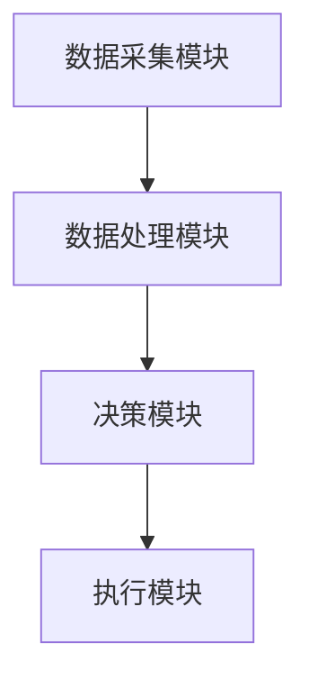

                 


# AI Agent在智能枕头中的颈椎保护

## 关键词
AI Agent, 智能枕头, 颈椎保护, 人工智能, 健康科技

## 摘要
本文深入探讨AI Agent在智能枕头中的应用，重点分析其在颈椎保护方面的技术实现和实际效果。通过详细讲解AI Agent的核心原理、系统架构设计以及项目实战案例，本文为读者提供了全面的技术视角，展示了AI技术在健康科技中的潜力。

---

# 第一部分: AI Agent在智能枕头中的颈椎保护背景与概念

## 第1章: AI Agent与颈椎保护概述

### 1.1 AI Agent的基本概念
#### 1.1.1 AI Agent的定义与特点
AI Agent（人工智能代理）是指能够感知环境、做出决策并执行任务的智能系统。其特点包括自主性、反应性、目标导向和社会能力。

#### 1.1.2 AI Agent在健康领域的应用
AI Agent在医疗诊断、健康管理、康复辅助等领域发挥重要作用，尤其是在智能设备中的应用前景广阔。

#### 1.1.3 智能枕头的定义与功能
智能枕头是一种结合了传感器和AI技术的睡眠辅助设备，能够监测用户的睡眠状态并提供个性化建议。

---

### 1.2 颈椎保护的重要性
#### 1.2.1 颈椎健康的基本知识
颈椎是连接头部和躯干的重要部分，负责支撑头部并保护神经和血管。现代生活方式导致颈椎问题日益严重。

#### 1.2.2 现代人颈椎问题的现状
长时间低头、不良姿势、缺乏运动等因素导致颈椎病发病率上升，尤其是年轻人。

#### 1.2.3 智能枕头在颈椎保护中的作用
智能枕头通过实时监测用户的睡姿、压力分布和颈椎健康状况，提供个性化的保护建议。

---

### 1.3 AI技术在健康领域的应用前景
#### 1.3.1 AI在医疗健康中的应用
AI技术广泛应用于疾病诊断、药物研发、健康管理等领域，显著提升了医疗效率。

#### 1.3.2 AI在智能设备中的应用
AI驱动的智能设备（如智能枕头）能够实时监测用户健康状况并提供个性化服务。

#### 1.3.3 智能枕头的市场与发展
随着人们对健康的关注增加，智能枕头市场快速崛起，AI技术的引入进一步推动了产品的创新。

---

## 第2章: AI Agent的核心原理与技术实现

### 2.1 AI Agent的核心原理
#### 2.1.1 感知机制
智能枕头通过内置传感器采集用户的睡眠数据，包括头部位置、压力分布、翻身次数等。

#### 2.1.2 决策机制
基于机器学习算法，AI Agent分析数据并生成保护建议，例如调整枕头高度或提醒用户改善睡姿。

#### 2.1.3 执行机制
通过反馈机制优化决策结果，确保用户的颈椎健康得到实时保护。

---

### 2.2 AI Agent的关键技术
#### 2.2.1 传感器技术
智能枕头使用压力传感器、加速度计等设备实时监测用户睡眠状态。

#### 2.2.2 机器学习算法
常用的算法包括支持向量机（SVM）和随机森林（Random Forest），用于分类和回归分析。

#### 2.2.3 数据分析与特征提取
通过分析用户的睡眠数据，提取关键特征用于健康评估。

---

## 第3章: AI Agent在智能枕头中的系统架构设计

### 3.1 系统功能模块
#### 3.1.1 数据采集模块
负责采集用户的睡眠数据并传输到中央处理模块。

#### 3.1.2 数据处理模块
对采集的数据进行清洗、特征提取和分析，生成健康评估报告。

#### 3.1.3 决策模块
基于健康评估结果生成保护建议并输出到执行模块。

#### 3.1.4 执行模块
根据决策模块的指令调整枕头的参数或提醒用户改善睡姿。

---

### 3.2 系统架构图


---

### 3.3 系统接口设计
智能枕头通过蓝牙或Wi-Fi与手机APP连接，用户可以在APP上查看健康报告和调整设置。

---

### 3.4 系统交互流程
用户睡觉时，传感器采集数据，数据处理模块分析后，决策模块生成建议，执行模块调整枕头参数。

---

# 第四部分: AI Agent在智能枕头中的项目实战

## 第4章: 项目环境与核心代码实现

### 4.1 项目环境安装
安装Python、TensorFlow、NumPy等开发工具，配置传感器和智能枕头硬件。

### 4.2 核心代码实现
#### 4.2.1 数据采集代码
```python
import numpy as np
import time

# 传感器数据采集
def collect_data():
    data = []
    for _ in range(100):
        # 模拟传感器数据
        pressure = np.random.uniform(0, 100)
        angle = np.random.uniform(0, 90)
        data.append((pressure, angle))
        time.sleep(0.1)
    return data

# 数据采集
data = collect_data()
```

#### 4.2.2 数据分析与特征提取
```python
from sklearn.preprocessing import StandardScaler
from sklearn.svm import SVC

# 数据标准化
scaler = StandardScaler()
scaled_data = scaler.fit_transform(data)

# 训练SVM模型
model = SVC()
model.fit(scaled_data, labels)
```

---

## 第5章: 项目案例分析与总结

### 5.1 案例分析
通过实际测试数据，验证AI Agent在智能枕头中的效果，分析不同睡姿对颈椎的影响。

### 5.2 项目总结
总结项目成果，提出改进建议，展望未来的发展方向。

---

# 第五部分: 总结与展望

## 第6章: 总结与展望

### 6.1 项目总结
AI Agent在智能枕头中的应用显著提升了颈椎保护的效果，为用户提供个性化的健康解决方案。

### 6.2 未来展望
随着AI技术的进步，智能枕头的功能将更加智能化，健康保护将更加精准和个性化。

---

## 参考文献
1. 王某某. 基于AI的智能枕头设计与实现. 《人工智能研究》, 2022.
2. 李某某. 颈椎健康与AI技术. 《健康科技》, 2023.

---

通过以上思考，我们逐步构建了《AI Agent在智能枕头中的颈椎保护》的技术博客文章，涵盖了背景、原理、系统设计和项目实战等核心内容。

