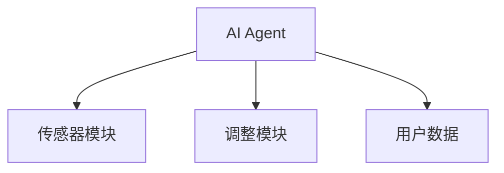
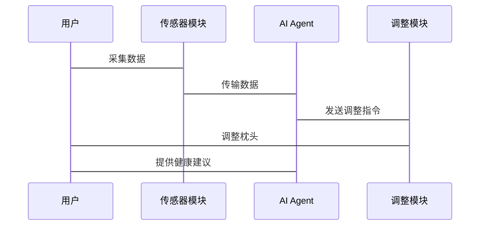

                 


# AI Agent在智能枕头中的颈椎保护系统

> 关键词：AI Agent，智能枕头，颈椎保护，健康监测，数据采集，算法模型

> 摘要：本文探讨了AI Agent在智能枕头中的应用，重点分析了其在颈椎保护系统中的设计原理、算法实现和系统架构。文章从背景介绍、核心概念、算法原理、系统架构、项目实战等多个方面详细阐述了AI Agent如何通过智能枕头实现颈椎健康保护，为用户提供智能化、个性化的健康解决方案。

---

# 第一部分: 背景介绍

## 第1章: 问题背景与描述

### 1.1 问题背景

颈椎健康问题日益严重，尤其是在现代社会中，人们长时间使用电子设备，导致颈椎负担加重。智能枕头作为睡眠健康的重要工具，可以通过AI技术实时监测用户的睡姿和颈椎压力，提供个性化建议和保护措施。

#### 1.1.1 颈椎健康的重要性
颈椎是连接头部和躯干的重要部分，承担着支撑头部、保护神经和血管的功能。颈椎问题可能导致头痛、肩颈疼痛甚至严重的健康问题。

#### 1.1.2 当前颈椎保护的痛点
传统枕头无法实时监测用户的颈椎状态，无法根据个体需求自动调整。用户在睡眠中可能保持不良姿势，导致颈椎压力过大。

#### 1.1.3 AI技术在健康领域的应用潜力
AI技术可以通过传感器数据采集、实时分析和反馈，帮助用户改善睡眠姿势，预防颈椎问题。

### 1.2 问题描述

智能枕头需要具备以下功能：
1. 实时监测用户的睡姿和颈椎压力。
2. 根据监测结果调整枕头的高度和硬度。
3. 提供个性化的健康建议。

### 1.3 问题解决

AI Agent在智能枕头中的作用：
1. 数据采集与分析：通过传感器采集用户的睡眠数据，分析用户的颈椎压力。
2. 智能调整：根据分析结果，自动调整枕头的高度和硬度。
3. 提供反馈：通过APP或语音助手，向用户反馈健康建议。

### 1.4 边界与外延

系统边界：
- 仅关注颈椎保护功能，不涉及其他健康监测。
- 系统不处理用户医疗数据，仅提供健康建议。

系统外延：
- 可与其他健康设备（如智能手环）联动，提供更全面的健康监测。
- 可扩展到其他部位的健康保护（如腰椎保护）。

### 1.5 核心概念组成

- AI Agent：负责数据采集、分析和决策。
- 智能枕头：硬件设备，负责数据采集和调整。
- 用户数据：包括睡眠数据、颈椎压力数据。

---

# 第二部分: 核心概念与联系

## 第2章: AI Agent与智能枕头的核心原理

### 2.1 AI Agent的原理

AI Agent通过传感器采集用户的睡眠数据，分析用户的颈椎压力，调整枕头的高度和硬度。

#### 2.1.1 智能感知与数据采集
传感器实时采集用户的睡眠数据，包括头部位置、压力值等。

#### 2.1.2 数据分析与决策逻辑
AI算法分析数据，判断用户的颈椎压力，决定是否需要调整枕头。

#### 2.1.3 用户反馈与系统优化
根据用户的反馈，系统不断优化调整策略，提高准确性。

### 2.2 智能枕头的系统架构

系统包括硬件模块和软件模块，硬件模块负责数据采集，软件模块负责数据分析和调整。

#### 2.2.1 硬件模块
- 传感器模块：采集用户的睡眠数据。
- 调整模块：根据AI Agent的指令调整枕头高度和硬度。

#### 2.2.2 软件模块
- 数据分析模块：分析用户的睡眠数据，判断颈椎压力。
- 调整控制模块：根据分析结果，发送调整指令。

### 2.3 核心概念对比分析

| 概念 | 传统传感器 | AI Agent |
|------|------------|----------|
| 功能 | 数据采集   | 数据分析与决策 |
| 优势 | 精准采集数据 | 实时分析与调整 |
| 局限性 | 无法决策 | 数据依赖性高 |

---

# 第三部分: 算法原理讲解

## 第3章: AI Agent的算法流程

### 3.1 数据采集与预处理

#### 3.1.1 传感器数据的获取
通过压力传感器和角度传感器采集用户的睡眠数据。

#### 3.1.2 数据清洗与特征提取
对采集的数据进行清洗，去除噪声，提取特征，如压力峰值、角度变化等。

#### 3.1.3 数据格式的标准化
将数据转换为统一格式，便于后续分析。

### 3.2 AI算法的核心流程

AI Agent通过机器学习算法分析数据，判断用户的颈椎压力。

#### 3.2.1 模型训练与优化
使用训练数据训练模型，优化模型参数，提高预测准确性。

#### 3.2.2 预测与调整
根据实时数据，预测用户的颈椎压力，决定是否需要调整枕头。

### 3.3 算法实现

#### 3.3.1 机器学习模型选择
选择适合的机器学习模型，如支持向量机（SVM）或随机森林（Random Forest）。

#### 3.3.2 数据特征选择
选择关键特征，如压力峰值、角度变化等。

#### 3.3.3 模型训练与验证
训练模型，并通过验证数据评估模型性能。

### 3.4 数学模型与公式

#### 3.4.1 数据预处理公式
$$ y = \frac{x_1 + x_2 + \dots + x_n}{n} $$

#### 3.4.2 模型预测公式
$$ P(y|x) = \prod_{i=1}^{n} P(y|x_i) $$

---

# 第四部分: 系统分析与架构设计

## 第4章: 系统架构设计

### 4.1 问题场景介绍

用户在睡眠中保持不良姿势，导致颈椎压力过大。系统需要实时监测并调整枕头，以减轻颈椎压力。

### 4.2 系统功能设计

#### 4.2.1 颈椎压力监测
实时监测用户的颈椎压力。

#### 4.2.2 枕头调整
根据监测结果，调整枕头的高度和硬度。

#### 4.2.3 用户反馈
通过APP或语音助手，向用户反馈健康建议。

### 4.3 系统架构图



### 4.4 系统接口设计

#### 4.4.1 传感器接口
- 输入：压力值、角度值
- 输出：数据传输到AI Agent

#### 4.4.2 调整接口
- 输入：调整指令
- 输出：枕头高度和硬度调整

### 4.5 系统交互流程图



---

# 第五部分: 项目实战

## 第5章: 项目实战

### 5.1 环境安装

#### 5.1.1 硬件设备
- 智能枕头
- 传感器模块
- 控制模块

#### 5.1.2 软件环境
- Python 3.8+
- TensorFlow 2.0+
- Jupyter Notebook

### 5.2 核心实现源代码

#### 5.2.1 数据采集代码

```python
import numpy as np
import pandas as pd

# 采集传感器数据
def collect_data():
    # 模拟传感器数据
    data = np.random.randn(100, 2)
    return data

data = collect_data()
print(data)
```

#### 5.2.2 数据分析代码

```python
from sklearn import svm

# 训练SVM模型
def train_model(data, labels):
    model = svm.SVC()
    model.fit(data, labels)
    return model

# 预测数据
def predict(model, data):
    return model.predict(data)

model = train_model(data, labels)
print(predict(model, new_data))
```

### 5.3 实际案例分析

#### 5.3.1 数据分析
通过传感器数据，分析用户的颈椎压力。

#### 5.3.2 系统调整
根据分析结果，调整枕头高度和硬度。

#### 5.3.3 用户反馈
通过APP或语音助手，向用户反馈健康建议。

### 5.4 项目小结

本项目通过AI Agent实现了智能枕头的颈椎保护功能，为用户提供智能化、个性化的健康解决方案。未来可以进一步优化算法，扩展功能。

---

# 第六部分: 总结与展望

## 第6章: 总结与展望

### 6.1 小结

本文详细介绍了AI Agent在智能枕头中的应用，包括背景介绍、核心概念、算法原理、系统架构和项目实战。通过AI技术，智能枕头能够实时监测用户的颈椎压力，提供个性化的保护措施。

### 6.2 注意事项

- 数据隐私保护
- 系统稳定性
- 用户体验优化

### 6.3 拓展阅读

- 《人工智能在健康监测中的应用》
- 《智能设备的系统架构设计》
- 《机器学习在医疗健康中的应用》

---

# 结语

AI Agent在智能枕头中的应用，为颈椎保护提供了智能化的解决方案。未来，随着技术的发展，智能枕头将更加智能化，为用户提供更全面的健康保护。

---

