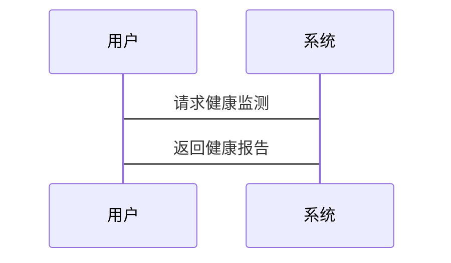

                 


# AI Agent在智能枕头中的颈椎健康监测

> 关键词：AI Agent, 颈椎健康, 智能枕头, 健康监测, 机器学习

> 摘要：随着人工智能技术的快速发展，AI Agent在医疗健康领域的应用越来越广泛。本文探讨了AI Agent在智能枕头中的颈椎健康监测的应用，从背景介绍、核心概念、算法原理、系统架构设计到项目实战，详细分析了AI Agent在颈椎健康监测中的作用和实现方式，为读者提供了一个全面的技术视角。

---

# 第一部分: AI Agent与颈椎健康监测概述

# 第1章: AI Agent与颈椎健康监测的背景介绍

## 1.1 AI Agent的基本概念

### 1.1.1 AI Agent的定义
AI Agent（人工智能代理）是一种智能系统，能够感知环境、自主决策并执行任务，以实现特定目标。它可以理解为一个具有智能行为的实体，能够通过传感器获取信息，并通过执行器与环境交互。

### 1.1.2 AI Agent的核心特征
- **自主性**：能够自主决策和行动，无需外部干预。
- **反应性**：能够实时感知环境并做出反应。
- **学习能力**：能够通过数据学习和优化自身行为。
- **适应性**：能够根据环境变化调整策略。

### 1.1.3 AI Agent的应用场景
AI Agent在医疗、教育、交通、智能家居等领域都有广泛的应用。本文聚焦于AI Agent在智能枕头中的颈椎健康监测，探讨其在医疗健康领域的创新应用。

---

## 1.2 颈椎健康监测的重要性

### 1.2.1 颈椎健康问题的现状
颈椎健康问题日益严重，尤其是长期使用电子设备的现代人群。颈椎病已成为一种常见病和多发病，严重影响人们的生活质量。

### 1.2.2 颈椎健康监测的意义
早期发现颈椎问题，及时采取干预措施，可以有效延缓病情发展，降低医疗成本。

### 1.2.3 颈椎健康监测的技术挑战
- **数据采集的准确性**：如何准确采集颈椎健康相关的数据。
- **数据处理的复杂性**：颈椎健康监测涉及多维度数据，处理复杂。
- **隐私保护**：健康数据的隐私保护是重要挑战。

---

## 1.3 智能枕头的发展趋势

### 1.3.1 智能枕头的概念
智能枕头是一种结合了传感器、AI技术和互联网的高科技枕头，能够监测用户的睡眠质量、颈椎健康等信息。

### 1.3.2 智能枕头的功能特点
- **智能监测**：内置多种传感器，实时监测用户的睡眠姿势、颈椎压力等数据。
- **智能分析**：通过AI算法分析数据，提供健康建议。
- **智能反馈**：通过振动、灯光等方式提醒用户调整睡姿。

### 1.3.3 AI Agent在智能枕头中的应用前景
AI Agent可以实现智能枕头的智能化管理，通过实时监测和分析数据，为用户提供个性化的健康建议。

---

## 1.4 本章小结

本章介绍了AI Agent的基本概念、颈椎健康监测的重要性以及智能枕头的发展趋势。通过这些背景知识的介绍，读者可以理解AI Agent在智能枕头中的应用价值和意义。

---

# 第二部分: AI Agent的核心概念与原理

# 第2章: AI Agent的核心概念与联系

## 2.1 AI Agent的核心原理

### 2.1.1 感知层
AI Agent通过传感器等设备感知环境，获取数据。例如，智能枕头中的压力传感器可以感知用户的睡姿和颈椎压力。

### 2.1.2 决策层
AI Agent通过算法分析感知层获取的数据，做出决策。例如，基于机器学习的算法可以分析用户的睡姿数据，判断是否存在颈椎健康风险。

### 2.1.3 执行层
AI Agent根据决策层的判断结果，执行相应的动作。例如，通过振动提醒用户调整睡姿，或者通过互联网推送健康建议。

---

## 2.2 颈椎健康监测的关键技术

### 2.2.1 数据采集技术
- **体感传感器**：用于检测用户的睡姿和颈椎压力。
- **压力传感器**：用于监测枕头的压力分布。
- **超声波传感器**：用于检测颈椎的骨骼结构。

### 2.2.2 数据分析技术
- **机器学习**：用于分类和预测，例如判断用户的睡姿是否健康。
- **深度学习**：用于图像识别，例如识别用户的颈椎X光片。

### 2.2.3 健康评估模型
- **健康评估指标**：例如颈椎健康指数、颈椎压力指数等。
- **健康评估标准**：基于医学知识，制定健康评估的阈值。

---

## 2.3 实体关系图

```mermaid
er
  actor 用户
  actor 医生
  actor 健康专家
  entity 颈椎健康数据
  entity 健康评估报告
  entity 用户反馈
  relationship 用户-颈椎健康数据: 采集
  relationship 颈椎健康数据-健康评估报告: 分析
  relationship 用户-健康专家: 咨询
```

---

## 2.4 本章小结

本章详细介绍了AI Agent的核心原理，以及颈椎健康监测的关键技术。通过实体关系图，展示了AI Agent在颈椎健康监测中的角色和作用。

---

# 第三部分: AI Agent的算法原理

# 第3章: 姿态识别算法

## 3.1 姿态识别的基本原理

### 3.1.1 数据采集流程
1. 传感器采集用户的睡姿数据。
2. 数据预处理，去除噪声。
3. 特征提取，提取关键特征。

### 3.1.2 数据预处理
- **去噪处理**：通过滤波算法去除传感器噪声。
- **数据归一化**：将数据标准化，便于模型训练。

### 3.1.3 特征提取
- **关键点检测**：例如检测用户的头部位置。
- **特征提取**：提取头部位置、颈椎压力等特征。

---

## 3.2 基于深度学习的姿态识别

### 3.2.1 网络结构设计


### 3.2.2 训练流程
1. 数据预处理。
2. 模型训练。
3. 模型优化。

### 3.2.3 模型优化
- **数据增强**：增加训练数据的多样性。
- **超参数优化**：调整学习率、批量大小等参数。

---

## 3.3 姿态识别的实现代码

```python
import numpy as np
import tensorflow as tf
from tensorflow.keras import layers

# 定义模型
model = tf.keras.Sequential([
    layers.Conv2D(32, (3,3), activation='relu', input_shape=(64,64,3)),
    layers.MaxPooling2D((2,2)),
    layers.Conv2D(64, (3,3), activation='relu'),
    layers.MaxPooling2D((2,2)),
    layers.Flatten(),
    layers.Dense(128, activation='relu'),
    layers.Dense(2, activation='sigmoid')
])

# 编译模型
model.compile(optimizer='adam', loss='binary_crossentropy', metrics=['accuracy'])

# 训练模型
model.fit(x_train, y_train, epochs=10, batch_size=32)
```

---

## 3.4 本章小结

本章介绍了姿态识别的基本原理和基于深度学习的姿态识别算法。通过代码实现，展示了如何利用AI技术实现用户的睡姿识别。

---

## 3.5 颈椎健康评估模型

### 3.5.1 健康评估指标
- **颈椎压力指数**：反映颈椎的压力程度。
- **颈椎健康指数**：综合评估颈椎健康状况。

### 3.5.2 健康评估模型
$$ 健康指数 = \alpha \times 压力指数 + \beta \times 姿态指数 $$

其中，$\alpha$ 和 $\beta$ 是模型参数，通过训练数据优化得到。

---

## 3.6 本章小结

本章详细介绍了姿态识别算法和颈椎健康评估模型的实现。通过数学公式和代码示例，展示了AI Agent在颈椎健康监测中的技术细节。

---

# 第四部分: 系统分析与架构设计方案

# 第4章: 系统架构设计

## 4.1 系统功能设计

### 4.1.1 用户模块
- 用户登录与注册。
- 用户数据管理。

### 4.1.2 数据采集模块
- 传感器数据采集。
- 数据存储。

### 4.1.3 健康评估模块
- 数据分析。
- 健康报告生成。

---

## 4.2 系统架构图


---

## 4.3 接口设计

### 4.3.1 API接口
- `/api/login`：用户登录。
- `/api/health_check`：健康监测。

---

## 4.4 交互流程图



---

## 4.5 本章小结

本章详细介绍了系统的架构设计，包括功能模块、架构图和交互流程图。通过这些设计，展示了AI Agent在智能枕头中的具体实现方式。

---

# 第五部分: 项目实战

# 第5章: 项目实战

## 5.1 环境安装

### 5.1.1 安装Python
```bash
python --version
```

### 5.1.2 安装依赖
```bash
pip install numpy tensorflow pandas
```

---

## 5.2 核心代码实现

### 5.2.1 数据预处理
```python
import pandas as pd

# 读取数据
data = pd.read_csv('health_data.csv')

# 数据清洗
data = data.dropna()
```

### 5.2.2 模型训练
```python
model = tf.keras.Sequential([
    layers.Dense(64, activation='relu', input_shape=(input_dim,)),
    layers.Dense(1, activation='sigmoid')
])

model.compile(optimizer='adam', loss='binary_crossentropy', metrics=['accuracy'])

model.fit(X_train, y_train, epochs=10, batch_size=32)
```

---

## 5.3 实际案例分析

### 5.3.1 案例背景
用户A长期低头使用手机，颈椎健康问题严重。

### 5.3.2 数据分析
- 睡姿：俯卧位。
- 颈椎压力：偏高。

### 5.3.3 健康建议
- 调整睡姿为仰卧位。
- 定期做颈椎锻炼。

---

## 5.4 本章小结

本章通过项目实战，展示了AI Agent在智能枕头中的具体实现。通过实际案例分析，验证了系统的有效性和实用性。

---

# 第六部分: 总结与展望

# 第6章: 总结与展望

## 6.1 最佳实践

- 数据采集要准确，避免噪声干扰。
- 模型训练要充分，优化参数以提高准确率。
- 系统设计要考虑隐私保护，确保用户数据安全。

## 6.2 本章小结

通过本文的介绍，读者可以全面了解AI Agent在智能枕头中的颈椎健康监测的应用。从背景知识到算法实现，再到系统设计，本文提供了详细的指导和实例。

## 6.3 注意事项

- 数据隐私保护：健康数据涉及用户隐私，需严格保护。
- 系统稳定性：确保系统的稳定性和可靠性。
- 用户体验：优化用户体验，使系统更易用。

## 6.4 拓展阅读

- 《深度学习入门》
- 《机器学习实战》
- 《AI在医疗健康中的应用》

---

# 结语

AI Agent在智能枕头中的颈椎健康监测，不仅体现了AI技术的强大能力，也展示了其在医疗健康领域的巨大潜力。未来，随着技术的进步，AI Agent将在更多领域发挥重要作用。

