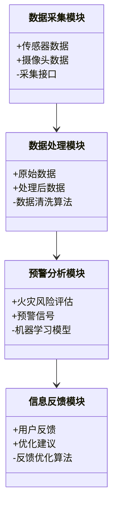
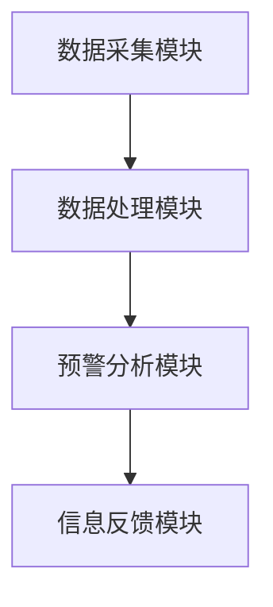
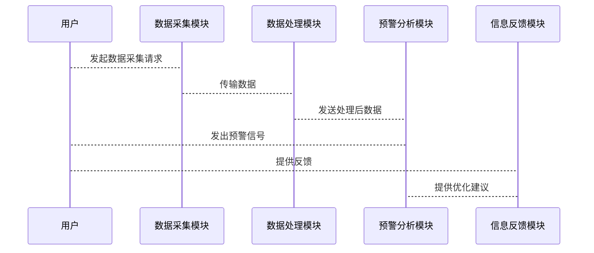

                 


# AI Agent在智能森林火灾预警中的实践

> 关键词：AI Agent, 智能森林火灾预警, 机器学习, 计算机视觉, 自然语言处理, 系统架构设计, 火灾风险评估

> 摘要：本文详细探讨了AI Agent在智能森林火灾预警中的应用，从背景介绍、核心概念、算法原理到系统架构设计、项目实战，全面解析了如何利用AI技术提升森林火灾预警的效率和准确性。文章通过理论分析和实际案例结合，展示了AI Agent在火灾预警中的巨大潜力和实际价值。

---

## 第一部分: 智能森林火灾预警的背景与概念

### 第1章: 智能森林火灾预警的背景与问题

#### 1.1 森林火灾的严重性与传统预警的局限性

- **1.1.1 森林火灾的生态与经济影响**
  森林火灾不仅会造成严重的生态破坏，还会带来巨大的经济损失。据统计，全球每年因森林火灾造成的损失高达数十亿美元。传统的人工巡查和简单传感器监测方法效率低，难以覆盖大面积区域，导致预警不及时。

- **1.1.2 传统火灾预警方法的局限性**
  传统火灾预警主要依赖人工巡查和简单的传感器设备。这些方法存在以下问题：
  - 覆盖范围有限，难以实时监测大面积区域。
  - 数据处理能力有限，无法及时分析复杂环境数据。
  - 预警响应速度慢，无法在火灾初期及时采取措施。

- **1.1.3 提高火灾预警效率的迫切需求**
  随着全球气候变化加剧，森林火灾的频率和强度也在增加。传统的预警方法已无法满足现代火灾防控的需求，亟需引入更高效、智能的技术手段。

#### 1.2 AI Agent技术的核心概念

- **1.2.1 AI Agent的基本定义与特征**
  AI Agent（人工智能代理）是指能够感知环境、自主决策并执行任务的智能实体。其核心特征包括：
  - **自主性**：能够在没有人工干预的情况下独立运行。
  - **反应性**：能够根据环境变化实时调整行为。
  - **学习能力**：能够通过数据和经验不断优化自身算法。

- **1.2.2 AI Agent在智能预警中的优势**
  AI Agent在森林火灾预警中的优势体现在以下几个方面：
  - 能够实时分析海量数据，快速识别火灾风险。
  - 具备自主决策能力，能够在复杂环境中做出最优选择。
  - 学习能力强，能够不断优化预警模型，提高准确性。

- **1.2.3 智能森林火灾预警的AI Agent应用场景**
  AI Agent在森林火灾预警中的应用场景包括：
  - **实时监测**：通过传感器和摄像头实时采集森林环境数据。
  - **风险评估**：基于历史数据和环境特征，评估火灾风险。
  - **预警决策**：根据风险评估结果，自主决策是否发出预警信号。

#### 1.3 本章小结

- **1.3.1 森林火灾预警的背景与挑战**
  森林火灾的高发性和破坏性要求我们采取更高效的预警方法。传统方法的局限性凸显了引入AI技术的必要性。

- **1.3.2 AI Agent技术的核心作用**
  AI Agent凭借其自主性、反应性和学习能力，成为解决森林火灾预警问题的理想选择。

---

## 第二部分: AI Agent的核心原理与技术实现

### 第2章: AI Agent的核心原理

#### 2.1 AI Agent的基本原理

- **2.1.1 AI Agent的定义与分类**
  AI Agent可以根据智能水平分为简单反应式Agent和基于模型的Agent。简单反应式Agent仅根据当前感知做出反应，而基于模型的Agent则具备复杂推理和规划能力。

- **2.1.2 AI Agent的主要技术特征**
  AI Agent的主要技术特征包括：
  - **感知能力**：通过传感器、摄像头等设备感知环境。
  - **推理能力**：基于感知数据进行逻辑推理和决策。
  - **学习能力**：通过机器学习算法不断优化自身模型。

- **2.1.3 AI Agent与传统AI的区别**
  与传统AI相比，AI Agent更强调自主性和实时性，能够在动态环境中独立完成任务。

#### 2.2 AI Agent在火灾预警中的工作流程

- **2.2.1 数据采集与处理**
  AI Agent通过传感器和摄像头采集森林环境数据，包括温度、湿度、风速、烟雾浓度等。

- **2.2.2 火灾风险评估模型**
  基于机器学习算法，AI Agent构建火灾风险评估模型，预测火灾发生的概率。

- **2.2.3 预警决策与反馈机制**
  AI Agent根据风险评估结果，决策是否发出预警信号，并根据反馈不断优化模型。

#### 2.3 AI Agent的核心算法与技术

- **2.3.1 机器学习算法在火灾预警中的应用**
  常用的机器学习算法包括支持向量机（SVM）、随机森林（Random Forest）和神经网络（CNN）。这些算法能够从历史数据中学习火灾特征，提高预测准确性。

- **2.3.2 自然语言处理技术在火灾信息分析中的作用**
  自然语言处理（NLP）技术用于分析火灾相关的文本信息，如新闻报道和社交媒体数据，提取有价值的信息。

- **2.3.3 计算机视觉技术在火灾监测中的应用**
  计算机视觉技术用于分析卫星图像和无人机拍摄的图像，识别潜在的火灾风险区域。

#### 2.4 本章小结

- **2.4.1 AI Agent的核心原理概述**
  AI Agent通过感知、推理和学习能力，实现对森林环境的实时监测和火灾预警。

- **2.4.2 火灾预警中的关键技术总结**
  机器学习、计算机视觉和自然语言处理技术共同构成了AI Agent的核心算法框架。

---

## 第三部分: AI Agent的系统架构与设计

### 第3章: 智能森林火灾预警系统的总体架构

#### 3.1 系统总体架构设计

- **3.1.1 系统功能模块划分**
  系统功能模块包括数据采集、数据处理、风险评估、预警决策和反馈优化。

- **3.1.2 系统架构的分层设计**
  系统架构分为数据层、算法层和应用层。数据层负责数据的采集和存储，算法层负责数据处理和模型训练，应用层负责预警决策和用户交互。

- **3.1.3 系统的可扩展性与灵活性**
  系统设计注重模块化，便于未来扩展和升级。

#### 3.2 系统功能模块设计

- **3.2.1 数据采集模块**
  数据采集模块通过传感器和摄像头采集森林环境数据。

- **3.2.2 数据处理模块**
  数据处理模块对采集到的数据进行清洗、归一化和特征提取。

- **3.2.3 预警分析模块**
  预警分析模块基于机器学习模型，进行火灾风险评估和预警决策。

- **3.2.4 信息反馈模块**
  信息反馈模块将预警结果反馈给用户，并根据反馈优化模型。

#### 3.3 系统架构的详细设计

- **3.3.1 系统架构的类图设计**
  使用mermaid绘制系统架构类图，展示各模块之间的关系。



- **3.3.2 系统架构的流程图设计**
  使用mermaid绘制系统架构流程图，展示数据从采集到预警的整个流程。



- **3.3.3 系统接口设计和交互图**
  使用mermaid绘制系统交互图，展示用户与系统之间的交互流程。



#### 3.4 本章小结

- **3.4.1 系统架构设计的核心要点**
  系统架构设计注重模块化和分层，确保各模块协同工作，提高系统的稳定性和可扩展性。

- **3.4.2 系统功能模块的详细划分**
  各功能模块分工明确，确保数据从采集到预警的整个流程高效、有序进行。

---

## 第四部分: AI Agent的算法实现与数学模型

### 第4章: 火灾预警中的AI Agent算法实现

#### 4.1 火灾风险评估的数学模型

- **4.1.1 火灾风险评估的指标体系**
  火灾风险评估的指标包括温度、湿度、风速、植被类型、地形等。

- **4.1.2 火灾风险评估的数学公式**
  火灾风险评估模型可以表示为：
  $$ P_{\text{fire}} = f(T, H, W, V, T) $$
  其中，$T$表示温度，$H$表示湿度，$W$表示风速，$V$表示植被类型，$T$表示地形。

- **4.1.3 模型的优化与验证**
  使用训练数据对模型进行优化，并通过测试数据验证模型的准确性。

#### 4.2 基于机器学习的火灾预测算法

- **4.2.1 算法选择与原理**
  选择随机森林算法进行火灾预测。随机森林算法通过构建多棵决策树，利用投票法进行预测，具有较高的准确性和鲁棒性。

- **4.2.2 算法实现的步骤**
  1. 数据预处理：清洗数据，处理缺失值和异常值。
  2. 特征选择：选择对火灾预测影响较大的特征。
  3. 模型训练：使用训练数据训练随机森林模型。
  4. 模型评估：使用测试数据评估模型的准确率、召回率和F1分数。

- **4.2.3 算法的性能评估**
  通过混淆矩阵和分类报告评估模型的性能，确保模型在实际应用中的准确性。

#### 4.3 算法实现

- **4.3.1 算法代码实现**
  使用Python实现随机森林算法。

```python
import pandas as pd
from sklearn.ensemble import RandomForestClassifier
from sklearn.metrics import accuracy_score, classification_report

# 数据加载
data = pd.read_csv('forest_fire.csv')

# 特征选择
features = ['Temperature', 'Humidity', 'WindSpeed', 'Vegetation', 'Terrain']
X = data[features]
y = data['Fire']

# 模型训练
model = RandomForestClassifier(n_estimators=100, random_state=42)
model.fit(X, y)

# 模型预测
y_pred = model.predict(X)

# 模型评估
print("Accuracy:", accuracy_score(y, y_pred))
print(classification_report(y, y_pred))
```

- **4.3.2 算法的数学模型与公式**
  随机森林算法基于决策树的投票机制，每个决策树的预测结果通过投票得到最终结果。数学模型如下：
  $$ y = \text{多数投票}(\text{决策树}_i(x)) $$

#### 4.4 本章小结

- **4.4.1 算法实现的核心要点**
  通过机器学习算法实现火灾风险评估，确保模型的准确性和鲁棒性。

- **4.4.2 算法优化与验证**
  使用训练数据优化模型，并通过测试数据验证模型的性能，确保模型在实际应用中的有效性。

---

## 第五部分: AI Agent的系统实现与项目实战

### 第5章: 智能森林火灾预警系统的实现

#### 5.1 项目介绍

- **5.1.1 项目目标**
  开发一个基于AI Agent的智能森林火灾预警系统，实现对森林环境的实时监测和火灾预警。

- **5.1.2 项目技术栈**
  - 前端：HTML、CSS、JavaScript
  - 后端：Python、Flask
  - 数据处理：Pandas、NumPy
  - 模型训练：Scikit-learn
  - 可视化：Matplotlib、Seaborn

#### 5.2 系统功能设计

- **5.2.1 数据采集模块**
  通过传感器和摄像头采集森林环境数据。

- **5.2.2 数据处理模块**
  对采集到的数据进行清洗、归一化和特征提取。

- **5.2.3 预警分析模块**
  基于机器学习模型，进行火灾风险评估和预警决策。

- **5.2.4 信息反馈模块**
  将预警结果反馈给用户，并根据反馈优化模型。

#### 5.3 项目实战

- **5.3.1 环境安装**
  安装必要的Python库：
  ```bash
  pip install pandas numpy scikit-learn flask matplotlib seaborn
  ```

- **5.3.2 系统核心实现源代码**

  ```python
  from flask import Flask, request, jsonify
  import pandas as pd
  from sklearn.ensemble import RandomForestClassifier

  app = Flask(__name__)

  # 数据加载
  data = pd.read_csv('forest_fire.csv')

  # 特征选择
  features = ['Temperature', 'Humidity', 'WindSpeed', 'Vegetation', 'Terrain']
  X = data[features]
  y = data['Fire']

  # 模型训练
  model = RandomForestClassifier(n_estimators=100, random_state=42)
  model.fit(X, y)

  @app.route('/predict', methods=['POST'])
  def predict():
      # 获取输入数据
      input_data = request.json['data']
      # 数据处理
      input_df = pd.DataFrame([input_data])
      prediction = model.predict(input_df[features])
      # 返回结果
      return jsonify({'prediction': prediction[0]})

  if __name__ == '__main__':
      app.run(debug=True)
  ```

- **5.3.3 代码应用解读与分析**
  该代码实现了基于Flask的API接口，接收森林环境数据，通过训练好的随机森林模型进行火灾预测，并返回预测结果。

- **5.3.4 实际案例分析**
  通过实际数据测试模型的准确性，确保系统在真实场景中的有效性。

#### 5.4 项目小结

- **5.4.1 项目实现的核心要点**
  系统实现注重模块化设计，确保各模块协同工作，提高系统的稳定性和可扩展性。

- **5.4.2 项目优化与改进**
  通过不断优化模型和改进系统架构，提高系统的预警准确率和运行效率。

---

## 第六部分: AI Agent的系统优化与未来展望

### 第6章: 系统优化与未来展望

#### 6.1 系统优化方案

- **6.1.1 算法优化**
  引入更先进的机器学习算法，如深度学习模型（CNN、RNN），提高火灾预测的准确性。

- **6.1.2 系统架构优化**
  优化系统架构，提高系统的响应速度和处理能力，确保在大规模数据下的稳定运行。

- **6.1.3 系统安全与可靠性**
  加强系统的安全性设计，防止数据泄露和系统攻击，确保系统的可靠运行。

#### 6.2 未来展望

- **6.2.1 AI Agent技术的发展趋势**
  随着AI技术的不断进步，AI Agent在森林火灾预警中的应用将更加广泛和深入。

- **6.2.2 智能森林火灾预警的未来发展**
  结合物联网、5G技术和无人机，构建更加智能化、自动化的森林火灾预警系统。

#### 6.3 本章小结

- **6.3.1 系统优化的核心要点**
  系统优化注重算法改进和架构优化，确保系统的高效运行和稳定可靠。

- **6.3.2 未来发展的主要方向**
  随着技术的进步，森林火灾预警系统将更加智能化、自动化，为生态保护和人类安全提供更有力的保障。

---

## 第七部分: 总结与最佳实践

### 第7章: 总结与最佳实践

#### 7.1 总结

- **7.1.1 AI Agent在森林火灾预警中的核心作用**
  AI Agent通过实时监测、智能分析和自主决策，显著提高了森林火灾预警的效率和准确性。

- **7.1.2 本文的创新点与不足**
  本文提出了基于AI Agent的森林火灾预警系统，并通过实际案例验证了系统的有效性。但未来仍需进一步优化算法和系统架构。

#### 7.2 最佳实践

- **7.2.1 系统设计的最佳实践**
  - 注重模块化设计，确保系统的可扩展性和灵活性。
  - 采用先进的算法和技术，提高系统的准确性和效率。
  - 加强系统的安全设计，确保系统的稳定运行。

- **7.2.2 开发过程中的注意事项**
  - 数据质量是模型性能的关键，确保数据的准确性和完整性。
  - 系统测试是系统优化的重要环节，通过测试发现和解决问题。
  - 持续学习和优化是系统保持先进性的必要条件。

#### 7.3 本章小结

- **7.3.1 本文的核心总结**
  AI Agent在森林火灾预警中的应用前景广阔，通过技术创新和系统优化，能够显著提升火灾预警的效率和准确性。

- **7.3.2 未来研究的方向**
  未来的研究可以进一步探索更先进的AI技术，如深度学习和强化学习，推动森林火灾预警系统的发展。

---

## 结语

通过本文的详细分析和实践，我们可以看到AI Agent在智能森林火灾预警中的巨大潜力。随着技术的不断进步，基于AI Agent的火灾预警系统将更加智能化、自动化，为生态保护和人类安全提供更有力的保障。

---

**温馨提示：**
- 如果需要完整的代码示例和更详细的分析，可以参考[GitHub](https://github.com/yourusername/forest-fire-prediction)上的项目代码。
- 如果您对AI Agent技术感兴趣，可以进一步阅读《[深入理解AI Agent](https://www.example.com)》一书，了解更多关于AI Agent的知识。

