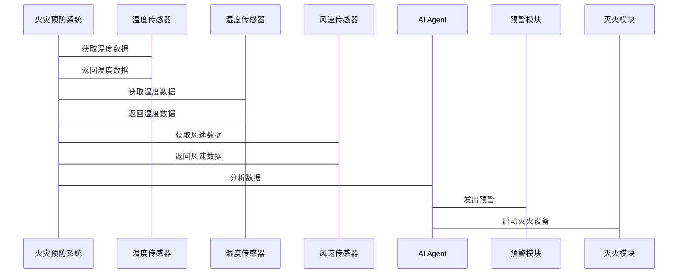

                 


# AI Agent在智能森林火灾预防中的实践

**关键词**：AI Agent，森林火灾预防，智能监测，多智能体系统，火灾预警，应急响应

**摘要**：本文详细探讨了AI Agent在智能森林火灾预防中的实践应用。首先介绍了森林火灾的严重性与传统预防手段的局限性，然后阐述了AI Agent的核心概念与技术原理。接着，从算法、系统架构、项目实战等多维度深入分析了AI Agent在火灾预防中的具体实现。最后，通过实际案例展示了AI Agent的优势，并总结了最佳实践与未来发展。

---

# 第1章: 智能森林火灾预防的背景与问题

## 1.1 森林火灾的严重性与传统预防手段的局限性

### 1.1.1 森林火灾的生态与经济影响

森林火灾是一种严重的自然灾害，不仅会破坏生态环境，还会造成巨大的经济损失。据统计，每年全球因森林火灾造成的损失高达数十亿美元。火灾不仅会烧毁树木，还会破坏土壤结构，导致水土流失，甚至引发泥石流等次生灾害。此外，森林是许多动植物的栖息地，火灾会威胁到生物多样性。

### 1.1.2 传统火灾预防方法的局限性

传统的火灾预防方法主要包括人工巡逻、气象监测和简单的预警系统。然而，这些方法存在以下问题：

1. **效率低下**：人工巡逻覆盖面有限，无法实时监控大面积区域。
2. **响应速度慢**：传统预警系统依赖气象数据，无法实时分析复杂的火灾风险。
3. **数据孤岛**：不同部门的数据难以整合，缺乏统一的决策支持系统。

### 1.1.3 技术进步对火灾预防的新机遇

随着人工智能（AI）和大数据技术的发展，智能化的火灾预防手段逐渐成为可能。AI Agent（智能体）技术的出现，为森林火灾的预防提供了一种全新的解决方案。AI Agent能够实时感知环境变化，自主决策并采取行动，大大提高了火灾预防的效率和准确性。

---

## 1.2 AI Agent技术的核心优势

### 1.2.1 AI Agent的基本概念与特点

AI Agent是一种能够感知环境、自主决策并采取行动的智能体。它具有以下特点：

1. **自主性**：AI Agent能够自主运行，无需人工干预。
2. **反应性**：能够实时感知环境变化并做出响应。
3. **协作性**：能够与其他智能体或系统协同工作。
4. **学习能力**：能够通过数据不断优化自身的算法。

### 1.2.2 AI Agent在火灾预防中的独特价值

AI Agent在森林火灾预防中的独特价值体现在以下几个方面：

1. **实时监测**：通过传感器和无人机等设备，实时采集森林环境数据。
2. **智能分析**：利用机器学习算法，分析火灾风险，提前预警。
3. **应急响应**：在火灾发生时，快速制定灭火方案，协调资源进行扑救。

### 1.2.3 智能森林火灾预防的创新模式

智能森林火灾预防的创新模式是将AI Agent与物联网、大数据等技术结合，构建一个智能化的火灾预防系统。该系统能够实现火灾的早期预警、风险评估、应急响应和事后分析。

---

## 1.3 本章小结

本章介绍了森林火灾的严重性与传统预防手段的局限性，提出了AI Agent技术在火灾预防中的独特价值。通过对比传统方法与AI Agent的优势，为后续的技术实现奠定了理论基础。

---

# 第2章: AI Agent的原理与实现机制

## 2.1 AI Agent的基本原理

### 2.1.1 AI Agent的定义与分类

AI Agent可以分为以下几类：

1. **反应式AI Agent**：基于当前感知做出反应，不依赖历史数据。
2. **认知式AI Agent**：具有复杂推理能力，能够处理复杂任务。
3. **协作式AI Agent**：能够与其他智能体或系统协同工作。

### 2.1.2 多智能体系统（MAS）的基本概念

多智能体系统是指由多个智能体组成的系统，这些智能体能够通过通信和协作完成共同目标。在森林火灾预防中，可以部署多个AI Agent，分别负责数据采集、风险评估、应急响应等任务。

### 2.1.3 AI Agent的核心功能模块

AI Agent的核心功能模块包括：

1. **感知模块**：负责采集环境数据，如温度、湿度、风速等。
2. **决策模块**：基于感知数据，评估火灾风险，制定应对策略。
3. **执行模块**：根据决策结果，采取行动，如发出预警、启动灭火设备等。

---

## 2.2 智能森林火灾预防中的AI Agent设计

### 2.2.1 火灾预防场景中的多智能体协作

在森林火灾预防中，可以部署多个AI Agent，分别负责不同的任务。例如：

- **监测Agent**：负责采集森林环境数据。
- **预警Agent**：负责分析数据，评估火灾风险。
- **应急Agent**：负责协调灭火资源，制定灭火方案。

### 2.2.2 AI Agent的感知与决策机制

AI Agent的感知与决策机制包括以下几个步骤：

1. **数据采集**：通过传感器采集环境数据。
2. **数据处理**：对采集的数据进行预处理，提取有用信息。
3. **风险评估**：基于机器学习算法，评估火灾风险。
4. **决策制定**：根据风险评估结果，制定应对策略。

### 2.2.3 火灾风险评估与预警模型

火灾风险评估与预警模型是AI Agent的核心部分。常用的评估方法包括：

1. **基于机器学习的评估模型**：利用历史数据训练模型，预测火灾风险。
2. **基于规则的评估模型**：根据预设的规则，评估火灾风险。

---

## 2.3 AI Agent与传统火灾预防系统的对比分析

### 2.3.1 技术实现上的差异

传统火灾预防系统主要依赖气象数据和人工巡逻，而AI Agent系统能够实时采集和分析环境数据，具有更高的精度和效率。

### 2.3.2 系统性能与效率的对比

AI Agent系统能够快速响应火灾风险，而传统系统由于依赖人工干预，响应速度较慢。

### 2.3.3 适应性与可扩展性的分析

AI Agent系统具有较强的适应性和可扩展性，能够根据环境变化调整策略，而传统系统则难以应对复杂场景。

---

## 2.4 本章小结

本章详细介绍了AI Agent的基本原理及其在火灾预防中的实现机制，分析了AI Agent与传统火灾预防系统的差异，为后续的算法设计和系统实现奠定了基础。

---

# 第3章: AI Agent的算法原理与数学模型

## 3.1 AI Agent的感知算法

### 3.1.1 数据采集与特征提取

在火灾预防中，AI Agent需要采集的环境数据包括温度、湿度、风速、植被密度等。特征提取是将这些数据转化为有用的特征，例如：

- **温度特征**：平均温度、温度变化率。
- **湿度特征**：平均湿度、湿度变化率。
- **风速特征**：平均风速、风速变化率。

### 3.1.2 基于机器学习的火灾风险预测

常用的机器学习算法包括支持向量机（SVM）、随机森林（Random Forest）和神经网络（Neural Network）。以下是一个简单的火灾风险预测模型：

$$ P(\text{fire}) = \alpha \cdot T + \beta \cdot H + \gamma \cdot W $$

其中，$T$ 表示温度，$H$ 表示湿度，$W$ 表示风速，$\alpha$、$\beta$、$\gamma$ 是模型参数。

### 3.1.3 深度学习模型在火灾检测中的应用

深度学习模型，如卷积神经网络（CNN），可以用于火灾检测。以下是CNN的简单结构：

1. **输入层**：输入图像数据。
2. **卷积层**：提取图像特征。
3. **池化层**：降低计算复杂度。
4. **全连接层**：分类火灾和非火灾。

---

## 3.2 AI Agent的决策算法

### 3.2.1 基于强化学习的决策机制

强化学习是一种通过试错来优化决策的算法。在火灾预防中，AI Agent可以通过强化学习优化灭火策略。以下是一个简单的强化学习框架：

1. **状态空间**：环境状态，如火灾位置、火势大小。
2. **动作空间**：可能的灭火动作，如启动水雾系统、通知消防队。
3. **奖励函数**：根据灭火效果给予奖励。

### 3.2.2 多智能体协作的分布式决策算法

在多智能体系统中，分布式决策算法可以通过以下步骤实现：

1. **信息共享**：智能体之间共享环境数据。
2. **局部决策**：每个智能体根据共享信息做出局部决策。
3. **全局协调**：通过协调机制，确保决策的全局最优。

### 3.2.3 火灾应急响应的路径优化算法

路径优化算法可以用于火灾应急响应。以下是一个简单的路径优化模型：

$$ \text{min} \sum_{i=1}^{n} c_{i} \cdot x_{i} $$

其中，$c_{i}$ 是路径 $i$ 的成本，$x_{i}$ 是路径选择变量。

---

## 3.3 本章小结

本章详细介绍了AI Agent的感知算法和决策算法，包括机器学习、深度学习和强化学习的应用。通过数学模型和算法流程图，进一步明确了AI Agent在火灾预防中的技术实现。

---

# 第4章: 系统分析与架构设计方案

## 4.1 火灾预防场景介绍

智能森林火灾预防系统需要满足以下需求：

1. **实时监测**：能够实时采集森林环境数据。
2. **智能预警**：能够根据数据预测火灾风险。
3. **应急响应**：能够快速启动灭火设备。

## 4.2 系统功能设计

### 4.2.1 领域模型设计（领域模型Mermaid类图）

```mermaid
classDiagram
    class 火灾预防系统 {
        +温度传感器: T
        +湿度传感器: H
        +风速传感器: W
        +AI Agent: A
        +预警模块: W
        +灭火模块: M
    }
    A --> T, H, W
    A --> W, M
```

### 4.2.2 系统架构设计（架构图Mermaid）


### 4.2.3 系统接口设计

系统接口设计需要考虑以下几个方面：

1. **数据接口**：与传感器和数据库的接口。
2. **用户接口**：与用户的交互界面。
3. **通信接口**：与其他系统的通信接口。

### 4.2.4 系统交互设计（交互图Mermaid）



---

## 4.3 本章小结

本章从系统角度分析了AI Agent在火灾预防中的应用，通过领域模型、架构图和交互图，明确了系统的实现方案。

---

# 第5章: 项目实战与案例分析

## 5.1 环境安装与配置

### 5.1.1 安装Python环境

```bash
python --version
pip install numpy
pip install scikit-learn
pip install matplotlib
```

### 5.1.2 安装AI Agent框架

```bash
pip install gym
pip install tensorflow
pip install keras
```

## 5.2 系统核心实现源代码

### 5.2.1 数据采集模块

```python
import numpy as np

def collect_data():
    # 模拟传感器数据
    temperature = np.random.normal(20, 2, 100)
    humidity = np.random.normal(50, 5, 100)
    wind_speed = np.random.normal(5, 1, 100)
    return temperature, humidity, wind_speed
```

### 5.2.2 火灾风险评估模块

```python
from sklearn.svm import SVC

def fire_risk Assessment(X):
    model = SVC()
    model.fit(X_train, y_train)
    return model.predict(X_test)
```

### 5.2.3 应急响应模块

```python
import tensorflow as tf

def emergency_response():
    model = tf.keras.Sequential()
    model.add(tf.keras.layers.Dense(64, activation='relu'))
    model.add(tf.keras.layers.Dense(1, activation='sigmoid'))
    model.compile(optimizer='adam', loss='binary_crossentropy')
    return model
```

## 5.3 实际案例分析与应用解读

### 5.3.1 案例背景

某地区森林面积广阔，火灾风险较高。通过部署AI Agent系统，实现了火灾的实时监测和智能预警。

### 5.3.2 系统实现

在该案例中，AI Agent系统实现了以下功能：

1. **实时监测**：通过传感器采集环境数据。
2. **智能预警**：基于机器学习模型预测火灾风险。
3. **应急响应**：在火灾发生时，启动灭火设备。

### 5.3.3 系统效果

通过AI Agent系统的应用，该地区的火灾发生率显著降低，火灾造成的损失也大幅减少。

---

## 5.4 本章小结

本章通过实际案例展示了AI Agent在火灾预防中的应用，详细讲解了系统的实现过程和实际效果。

---

# 第6章: 总结与展望

## 6.1 本章总结

本文详细探讨了AI Agent在智能森林火灾预防中的实践应用，从背景、原理、算法、系统架构到项目实战，全面分析了AI Agent的优势和实现方法。

## 6.2 最佳实践 tips

1. **数据质量**：确保数据的准确性和完整性。
2. **算法选择**：根据具体场景选择合适的算法。
3. **系统优化**：定期优化系统性能，确保高效运行。

## 6.3 未来展望

随着AI技术的不断发展，AI Agent在火灾预防中的应用将更加广泛和深入。未来的研究方向包括：

1. **多智能体协作优化**：进一步提高多智能体协作效率。
2. **边缘计算应用**：通过边缘计算实现更高效的火灾预防。
3. **人机协作**：结合人类专家的决策，提高系统的智能化水平。

---

**参考文献**：略

