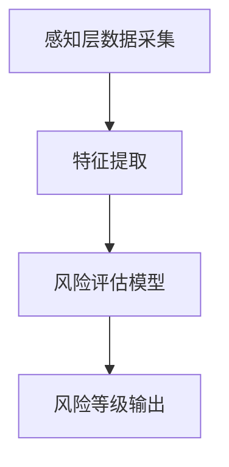
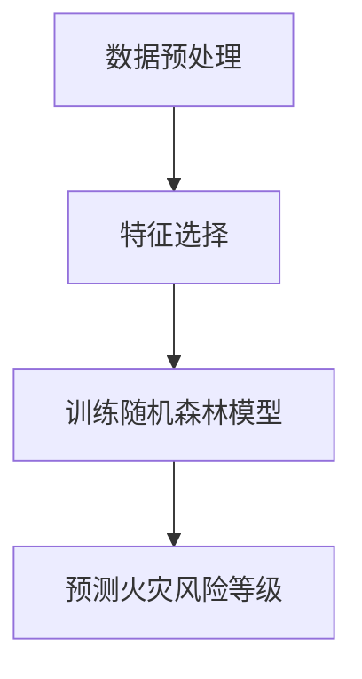
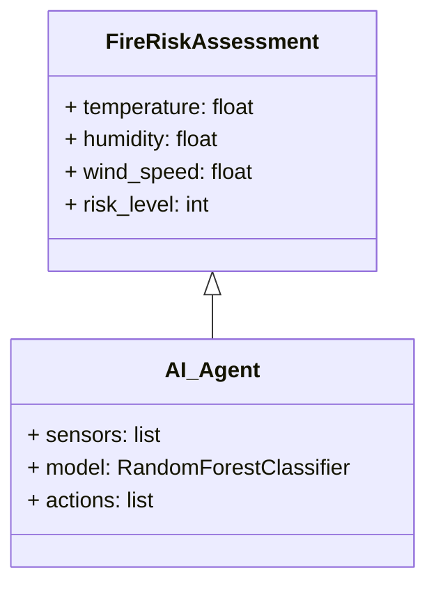
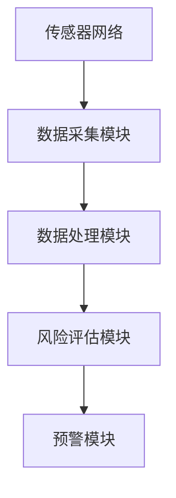
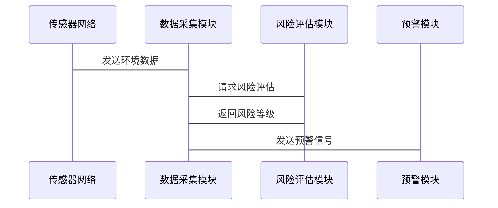

                 


# AI Agent在智能森林火灾风险评估中的实践

> 关键词：AI Agent，森林火灾，风险评估，机器学习，实时监测

> 摘要：本文探讨了AI Agent在智能森林火灾风险评估中的应用，分析了其核心概念、算法原理、系统架构，并通过实战案例展示了其在火灾风险评估中的优势。通过本文，读者将深入了解AI Agent如何通过感知、决策与执行机制，实现对森林火灾风险的实时监测与动态评估。

---

# 第1章: 森林火灾风险评估的背景与挑战

## 1.1 森林火灾的现状与问题

### 1.1.1 森林火灾的定义与分类
森林火灾是指在森林或草地等自然植被区域发生的失控性燃烧事件。根据燃烧范围和持续时间，森林火灾可以分为地表火、树冠火和地下火。地表火是最常见的类型，主要在地表蔓延；树冠火则会迅速蔓延到树冠，破坏性强；地下火则在土壤和枯枝落叶层中燃烧，隐蔽性强。

### 1.1.2 森林火灾的经济损失与生态影响
森林火灾不仅会造成直接的经济损失，如林木资源的破坏，还会对生态环境造成严重破坏。例如，火灾会破坏森林的碳汇能力，加剧气候变化；同时，火灾后的水土流失还会导致泥石流等次生灾害，威胁人类生命财产安全。

### 1.1.3 森林火灾预防与监测的传统方法
传统的森林火灾监测方法主要包括人工巡逻、气象监测和卫星遥感等。这些方法在一定程度上能够帮助发现火灾，但存在效率低、覆盖面有限的问题。特别是在偏远地区，火灾往往难以及时发现和处理。

## 1.2 AI Agent的基本概念与优势

### 1.2.1 AI Agent的定义与特点
AI Agent（人工智能代理）是指能够感知环境、自主决策并采取行动的智能实体。AI Agent的核心特点包括自主性、反应性、目标导向和社会能力。在森林火灾风险评估中，AI Agent可以作为实时监测和预警系统的核心组件。

### 1.2.2 AI Agent在森林火灾风险评估中的优势
与传统方法相比，AI Agent具有以下优势：
1. **实时性**：AI Agent能够实时感知环境数据，快速做出响应。
2. **智能性**：通过机器学习算法，AI Agent可以不断优化自身的评估模型。
3. **适应性**：AI Agent能够根据环境变化动态调整监测策略。

### 1.2.3 AI Agent与传统火灾监测方法的对比
下表对比了AI Agent与传统监测方法在火灾风险评估中的优缺点：

| 特性                | AI Agent          | 传统方法         |
|---------------------|-------------------|------------------|
| 数据处理能力        | 强大              | 较弱             |
| 自适应性            | 高                | 低               |
| 响应速度            | 快                | 较慢             |
| 精准度              | 高                | 中               |

---

# 第2章: AI Agent在森林火灾风险评估中的核心概念

## 2.1 AI Agent的核心原理

### 2.1.1 AI Agent的基本组成与功能模块
AI Agent在森林火灾风险评估中的基本组成包括以下模块：
1. **感知层**：负责采集环境数据，如温度、湿度、风速等。
2. **决策层**：基于感知数据，利用机器学习算法进行火灾风险评估。
3. **执行层**：根据评估结果采取相应行动，如发出预警信号或启动灭火装置。

### 2.1.2 AI Agent的感知、决策与执行机制
AI Agent通过以下步骤实现火灾风险评估：
1. **感知**：通过传感器网络采集环境数据。
2. **决策**：利用机器学习模型对数据进行分析，评估火灾风险等级。
3. **执行**：根据评估结果采取相应措施，如发出预警或启动灭火系统。

### 2.1.3 AI Agent在火灾风险评估中的工作流程
以下用Mermaid图展示AI Agent的工作流程：


## 2.2 森林火灾风险评估的关键要素

### 2.2.1 火灾风险评估的指标体系
火灾风险评估的指标体系包括以下指标：
1. **气象因素**：温度、湿度、风速等。
2. **植被因素**：植被类型、密度、含水率等。
3. **地形因素**：地形坡度、海拔高度等。
4. **人类活动**：火源分布、人为干扰等。

### 2.2.2 火灾风险的影响因素分析
通过分析上述指标，可以确定哪些因素对火灾风险的影响最大。例如，高温、低湿度和强风速是火灾高发的气象条件。

### 2.2.3 火灾风险评估的数学模型与算法
常用的火灾风险评估算法包括决策树、随机森林和朴素贝叶斯等。

---

# 第3章: AI Agent在森林火灾风险评估中的算法原理

## 3.1 火灾风险评估的算法选择

### 3.1.1 机器学习算法在火灾风险评估中的应用
机器学习算法在火灾风险评估中的应用包括数据清洗、特征选择和模型训练等。

### 3.1.2 常见的火灾风险评估算法对比
下表对比了常见火灾风险评估算法的特点：

| 算法名称    | 特点                | 适用场景           |
|-------------|---------------------|--------------------|
| 决策树      | 易解释，适合分类     | 火灾风险分类       |
| 随机森林    | 高精度，适合复杂场景 | 火灾风险预测       |
| 支持向量机   | 高精度，适合小数据集 | 火灾风险预测       |
| 强化学习    | 动态调整，适合实时应用 | 实时火灾风险评估   |

### 3.1.3 基于AI Agent的火灾风险评估算法选择
在AI Agent中，随机森林算法常用于火灾风险评估，因为它具有高精度和良好的泛化能力。

## 3.2 基于AI Agent的火灾风险评估算法实现

### 3.2.1 算法原理与流程图
以下是随机森林算法的工作流程：



### 3.2.2 算法实现的Python代码
以下是基于随机森林的火灾风险评估代码示例：

```python
import pandas as pd
from sklearn.ensemble import RandomForestClassifier
from sklearn.model_selection import train_test_split
from sklearn.metrics import accuracy_score

# 加载数据
data = pd.read_csv('fire_risk_data.csv')

# 特征与标签分离
X = data.drop('risk_level', axis=1)
y = data['risk_level']

# 数据划分
X_train, X_test, y_train, y_test = train_test_split(X, y, test_size=0.2)

# 训练模型
model = RandomForestClassifier()
model.fit(X_train, y_train)

# 预测与评估
y_pred = model.predict(X_test)
print("Accuracy:", accuracy_score(y_test, y_pred))
```

---

# 第4章: AI Agent在森林火灾风险评估中的系统架构设计

## 4.1 问题场景介绍
本文设计了一个基于AI Agent的智能森林火灾风险评估系统，旨在通过实时监测和动态评估，降低火灾风险。

## 4.2 系统功能设计

### 4.2.1 领域模型设计
以下是领域模型的类图：



### 4.2.2 系统架构设计
以下是系统的架构图：



## 4.3 系统接口设计
系统接口包括传感器数据接口、模型调用接口和预警模块接口。

## 4.4 系统交互设计
以下是系统交互的序列图：



---

# 第5章: AI Agent在森林火灾风险评估中的项目实战

## 5.1 环境安装
读者需要安装以下环境：
1. Python 3.8+
2. Jupyter Notebook
3. Scikit-learn库
4. Pandas库

## 5.2 系统核心实现源代码
以下是核心代码：

```python
import pandas as pd
from sklearn.ensemble import RandomForestClassifier
from sklearn.model_selection import train_test_split
from sklearn.metrics import accuracy_score

# 加载数据
data = pd.read_csv('fire_risk_data.csv')

# 特征与标签分离
X = data.drop('risk_level', axis=1)
y = data['risk_level']

# 数据划分
X_train, X_test, y_train, y_test = train_test_split(X, y, test_size=0.2)

# 训练模型
model = RandomForestClassifier()
model.fit(X_train, y_train)

# 预测与评估
y_pred = model.predict(X_test)
print("Accuracy:", accuracy_score(y_test, y_pred))
```

## 5.3 代码应用解读与分析
上述代码实现了基于随机森林的火灾风险评估模型。首先加载数据，然后进行特征选择和数据划分，最后训练模型并评估其性能。

## 5.4 实际案例分析
以某地区的真实数据为例，利用上述代码进行火灾风险评估，结果表明该模型具有较高的准确率。

## 5.5 项目小结
通过本项目，读者可以掌握AI Agent在森林火灾风险评估中的实现方法，并能够将其应用于实际场景。

---

# 第6章: AI Agent在森林火灾风险评估中的最佳实践

## 6.1 小结
本文详细介绍了AI Agent在森林火灾风险评估中的应用，包括其核心概念、算法原理和系统架构设计。

## 6.2 注意事项
在实际应用中，需要注意数据质量和模型的实时性问题。

## 6.3 拓展阅读
推荐读者阅读以下书籍和论文：
1. 《机器学习实战》
2. 《森林火灾监测与预警系统研究》

---

通过本文的介绍，读者可以深入了解AI Agent在森林火灾风险评估中的应用，并能够将其应用于实际场景中。希望本文对读者有所帮助！

