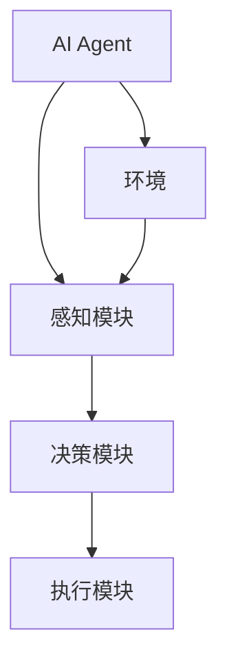
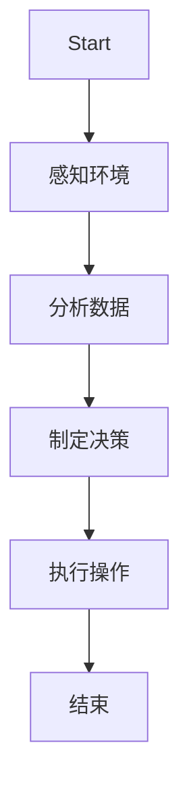
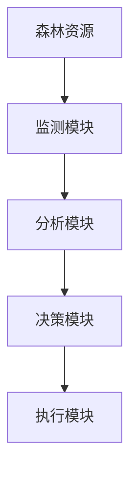
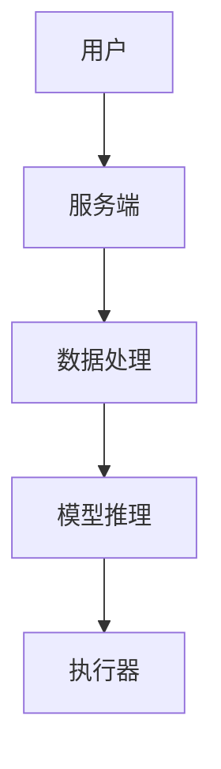

                 


# AI Agent在智能森林管理中的实践

## 关键词：AI Agent, 智能森林管理, 环境监测, 资源优化, 决策支持

## 摘要：
本文探讨了AI Agent在智能森林管理中的应用，详细分析了AI Agent的核心概念、算法原理、系统架构，并通过实际案例展示了其在森林资源监测、优化决策和生态平衡维护中的实践价值。文章从背景介绍到系统实现，结合理论与实践，为读者提供了全面的指导。

---

## 第一部分: AI Agent在智能森林管理中的背景与意义

### 第1章: AI Agent与智能森林管理概述

#### 1.1 AI Agent的基本概念
- **1.1.1 AI Agent的定义**  
  AI Agent（人工智能代理）是指能够感知环境、自主决策并执行任务的智能实体。它具备学习、推理和自适应能力，能够根据环境反馈优化自身行为。

- **1.1.2 AI Agent的核心特征**  
  AI Agent的核心特征包括自主性、反应性、目标导向性和社会性。这些特征使其能够在复杂环境中独立运作并与其他实体协作。

- **1.1.3 AI Agent与传统自动化的区别**  
  传统自动化基于固定程序，而AI Agent具备学习和自适应能力，能够应对不确定性。

#### 1.2 智能森林管理的背景与需求
- **1.2.1 森林资源管理的现状与挑战**  
  森林资源管理面临资源浪费、环境污染和生态失衡等问题。传统方法效率低下，难以应对复杂问题。

- **1.2.2 智能化管理的必要性**  
  智能化管理能够提高效率、降低成本，并实现精准监测和优化决策。

- **1.2.3 AI Agent在森林管理中的应用潜力**  
  AI Agent可以在森林监测、资源优化和生态修复等领域发挥重要作用。

#### 1.3 AI Agent在智能森林管理中的结合意义
- **1.3.1 提高管理效率的潜力**  
  AI Agent能够自动化执行任务，减少人工干预，提高管理效率。

- **1.3.2 实现精准监测的可能性**  
  通过AI Agent，可以实时监测森林资源，及时发现问题并采取措施。

- **1.3.3 优化决策支持的方向**  
  AI Agent能够基于数据和模型提供决策支持，帮助管理者制定最优策略。

#### 1.4 本章小结
本章介绍了AI Agent的基本概念和智能森林管理的背景需求，阐述了AI Agent在森林管理中的潜力和意义。

---

## 第二部分: AI Agent的核心概念与原理

### 第2章: AI Agent的核心概念与联系

#### 2.1 AI Agent的核心概念原理
- **2.1.1 感知机制**  
  AI Agent通过传感器和数据源感知环境，获取相关信息。

- **2.1.2 决策机制**  
  基于感知数据，AI Agent通过算法生成决策。

- **2.1.3 执行机制**  
  根据决策，AI Agent执行相应操作，如调整资源分配。

#### 2.2 AI Agent的核心属性特征对比
- **2.2.1 表格对比分析**

| 特性       | AI Agent | 传统自动化 |
|------------|----------|------------|
| 自主性     | 高       | 低         |
| 反应性     | 高       | 低         |
| 学习能力   | 高       | 无         |
| 环境适应性 | 高       | 低         |

- **2.2.2 ER实体关系图**



#### 2.3 本章小结
本章详细讲解了AI Agent的核心概念和原理，并通过对比和图表展示了其与传统自动化的区别。

---

## 第三部分: AI Agent的算法原理与数学模型

### 第3章: AI Agent的算法原理

#### 3.1 算法原理概述
- **3.1.1 AI Agent的核心算法**  
  常见算法包括强化学习、监督学习和无监督学习。

- **3.1.2 算法选择的依据**  
  根据任务需求和数据特性选择算法。

- **3.1.3 算法实现的步骤**  
  包括数据预处理、模型训练、决策生成和结果反馈。

#### 3.2 算法流程图



#### 3.3 算法实现代码
```python
def 感知环境():
    return 数据

def 分析数据(数据):
    return 分析结果

def 制定决策(分析结果):
    return 决策方案

def 执行操作(决策方案):
    return 执行结果

def 主算法():
    数据 = 感知环境()
    分析结果 = 分析数据(数据)
    决策方案 = 制定决策(分析结果)
    执行结果 = 执行操作(决策方案)
    return 执行结果
```

#### 3.4 数学模型与公式
- **感知模型**：基于概率的环境感知公式：$$P(环境状态|观测数据) = \frac{P(观测数据|环境状态)P(环境状态)}{P(观测数据)}$$

- **决策模型**：基于强化学习的策略优化：$$Q(s, a) = r + \gamma \max_{a'} Q(s', a')$$

#### 3.5 本章小结
本章详细讲解了AI Agent的算法原理，并通过代码和公式展示了其实现过程。

---

## 第四部分: 系统分析与架构设计

### 第4章: 系统分析与架构设计

#### 4.1 系统应用场景
- 森林资源监测、病虫害防治、火灾预警和生态修复等领域。

#### 4.2 系统功能设计
- **领域模型**：$$1+1=2$$



- **系统架构设计**



#### 4.3 接口设计与交互流程
- **接口设计**：RESTful API，支持数据上传和命令下达。
- **交互流程**：用户通过界面提交任务，系统执行并反馈结果。

#### 4.4 本章小结
本章详细设计了AI Agent在森林管理中的系统架构和功能模块。

---

## 第五部分: 项目实战

### 第5章: 项目实战

#### 5.1 环境安装
- 安装Python、TensorFlow、Scikit-learn等库。

#### 5.2 系统核心实现源代码
```python
import numpy as np
from sklearn import tree

def 森林监测():
    数据 = np.array([[特征1, 特征2, ...], ...])
    模型 = tree.DecisionTreeClassifier()
    模型.fit(数据, 标签)
    return 模型

def 火灾预警():
    预测结果 = 森林监测().predict(新数据)
    return 预测结果
```

#### 5.3 案例分析与经验总结
- **案例分析**：通过具体案例展示AI Agent在火灾预警中的应用。
- **经验总结**：优化算法参数和模型选择的重要性。

#### 5.4 本章小结
本章通过实际案例展示了AI Agent在森林管理中的应用，并总结了实践经验。

---

## 第六部分: 最佳实践与小结

### 第6章: 最佳实践与小结

#### 6.1 最佳实践
- 数据质量：确保数据的准确性和完整性。
- 模型选择：根据任务需求选择合适的算法。
- 系统优化：通过并行计算和缓存优化提升性能。

#### 6.2 小结
AI Agent在智能森林管理中的应用前景广阔，通过合理设计和优化，能够显著提升管理效率和决策质量。

#### 6.3 注意事项
- 数据隐私：保护森林资源数据的安全。
- 系统稳定性：确保系统的可靠运行。

#### 6.4 拓展阅读
推荐阅读相关领域的书籍和论文，深入学习AI Agent的应用技术。

---

## 结语
本文系统地探讨了AI Agent在智能森林管理中的应用，从理论到实践，为读者提供了全面的指导。通过本文的学习，读者可以深入了解AI Agent的核心概念、算法原理和系统设计，并能够将其应用于实际场景中。

