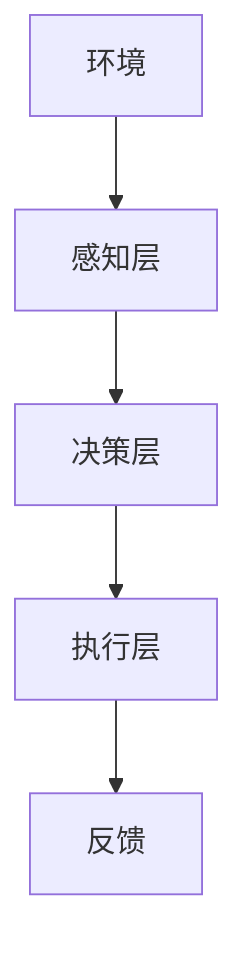
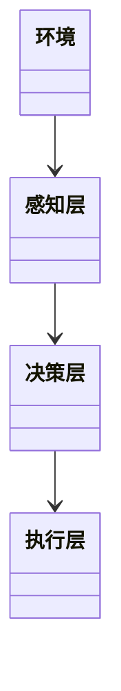

                 


# AI Agent在智能森林资源管理中的实践

## 关键词：AI Agent, 智能森林资源管理, 资源监测, 优化决策, 生态保护

## 摘要：  
随着全球森林资源面临的严峻挑战，传统的森林资源管理方式已难以应对复杂的环境变化和资源需求。AI Agent作为一种具备自主性、反应性和协作能力的智能体，正在成为森林资源管理领域的革命性工具。本文将深入探讨AI Agent在森林资源管理中的核心原理、技术实现、系统架构及实际应用，结合具体案例分析，展示AI Agent如何通过智能化手段提升森林资源管理的效率与可持续性。

---

## 第1章: AI Agent与智能森林资源管理的背景

### 1.1 AI Agent的核心概念  
AI Agent（人工智能代理）是指能够在特定环境中感知信息、自主决策并采取行动的智能实体。其核心特征包括：  
1. **自主性**：无需外部干预，自主完成任务。  
2. **反应性**：能够实时感知环境变化并做出响应。  
3. **目标导向**：基于预设目标或学习目标进行决策。  

AI Agent在森林资源管理中的应用潜力巨大，尤其是在资源监测、优化决策和生态保护方面。

### 1.2 森林资源管理的挑战与智能化需求  
传统森林资源管理面临以下问题：  
1. **数据获取难度大**：森林环境复杂，资源分布广泛，难以实时监测。  
2. **决策效率低**：依赖人工经验，难以快速响应环境变化。  
3. **生态保护压力大**：非法采伐、火灾、病虫害等问题威胁森林生态平衡。  

智能化管理成为解决这些问题的关键，AI Agent通过实时数据处理和自主决策能力，为森林资源管理提供高效解决方案。

### 1.3 AI Agent在森林资源管理中的定位与作用  
AI Agent在森林资源管理中的作用包括：  
1. **资源监测**：通过传感器和无人机实时采集森林数据，识别异常情况。  
2. **优化决策**：基于历史数据和预测模型，优化资源分配和管理策略。  
3. **生态保护**：通过实时监控和预警，保护森林免受非法采伐和自然灾害的威胁。  

---

## 第2章: AI Agent的核心原理与技术实现

### 2.1 AI Agent的感知与决策机制  
AI Agent通过多种传感器（如摄像头、温度计、湿度计）感知森林环境，并结合历史数据进行分析。感知数据经过预处理后，输入到决策模型中，生成最优行动方案。

### 2.2 AI Agent的算法原理  
AI Agent的核心算法包括强化学习和多智能体协作：  

#### 2.2.1 强化学习算法（Q-Learning）  
Q-Learning是一种经典的强化学习算法，通过试错方式优化决策策略。其数学模型如下：  
$$ Q(s, a) = Q(s, a) + \alpha \left( r + \gamma \max Q(s', a') - Q(s, a) \right) $$  
其中，$s$表示状态，$a$表示动作，$r$表示奖励，$\gamma$表示折扣因子，$\alpha$表示学习率。  

#### 2.2.2 多智能体协作  
在森林资源管理中，AI Agent需要与多个传感器、无人机和其他智能体协作。其协作机制可以通过以下公式表示：  
$$ \min_{\theta} \sum_{i=1}^{n} \mathcal{L}_i(\theta) $$  
其中，$\mathcal{L}_i(\theta)$表示第$i$个智能体的损失函数，$\theta$表示共享参数。

### 2.3 AI Agent的系统架构  
AI Agent的系统架构包括感知层、决策层和执行层：  



---

## 第3章: AI Agent在森林资源管理中的系统设计

### 3.1 项目介绍  
本项目旨在通过AI Agent实现森林资源的智能化管理，包括资源监测、火灾预警和病虫害识别等功能。

### 3.2 系统功能设计  
系统功能模块包括：  
1. **数据采集模块**：通过传感器和无人机采集森林环境数据。  
2. **数据处理模块**：对数据进行清洗、特征提取和存储。  
3. **决策模块**：基于强化学习算法生成最优决策。  
4. **执行模块**：通过无人机或机器人执行决策任务。  

### 3.3 系统架构设计  
系统架构采用分层设计：  



---

## 第4章: AI Agent在森林资源管理中的项目实战

### 4.1 环境配置  
项目需要以下环境：  
- **硬件**：传感器、无人机、计算机。  
- **软件**：Python、TensorFlow、OpenCV。  

### 4.2 核心代码实现  
以下是AI Agent的核心代码示例：

```python
import numpy as np

class AIAgent:
    def __init__(self, state_space, action_space):
        self.state_space = state_space
        self.action_space = action_space
        self.Q = np.zeros((state_space, action_space))
    
    def perceive(self, state):
        return state
    
    def decide(self, state):
        max_action = np.argmax(self.Q[state, :])
        return max_action
    
    def learn(self, state, action, reward, next_state):
        self.Q[state, action] += 0.1 * (reward + 0.9 * np.max(self.Q[next_state, :]) - self.Q[state, action])
```

### 4.3 代码解读与应用  
- `perceive`方法用于感知环境状态。  
- `decide`方法基于Q值表选择最优动作。  
- `learn`方法通过强化学习更新Q值表。  

### 4.4 实际案例分析  
以火灾预警为例，AI Agent通过实时监测温度和烟雾数据，识别火灾风险并触发报警。

---

## 第5章: 总结与展望

### 5.1 本章总结  
AI Agent通过智能化手段显著提升了森林资源管理的效率和可持续性，为生态保护提供了新的解决方案。

### 5.2 未来展望  
未来，AI Agent在森林资源管理中的应用将更加广泛，包括更复杂的多智能体协作和更高效的算法优化。

---

## 总结  
AI Agent在智能森林资源管理中的应用展示了人工智能技术在生态领域的巨大潜力。通过本文的详细分析，读者可以深入了解AI Agent的核心原理和实际应用，为未来的相关研究和实践提供参考。

