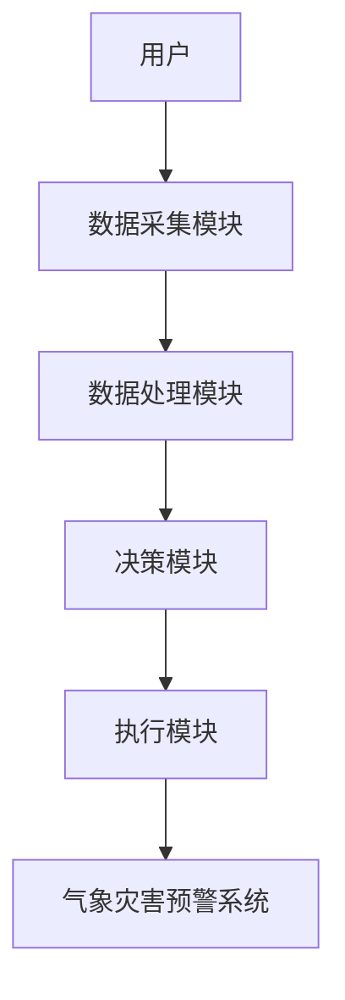
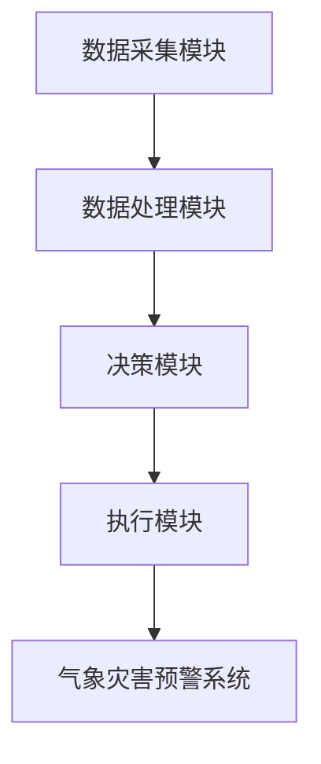

                 


# AI Agent在智能气象灾害预警系统中的实践

## 关键词：AI Agent, 智能气象灾害预警系统, 时间序列分析, 概率论, 强化学习, 系统架构设计, 项目实战

## 摘要：本文详细探讨了AI Agent在智能气象灾害预警系统中的实践应用，从背景介绍、核心概念到系统架构设计和项目实战，全面解析了如何利用AI技术提升气象灾害预警的准确性和效率。通过具体案例分析和代码实现，展示了AI Agent在气象灾害预警中的潜力和优势。

---

## 第一部分：AI Agent与智能气象灾害预警系统概述

### 第1章：AI Agent的基本概念与应用背景

#### 1.1 AI Agent的定义与核心原理

##### 1.1.1 AI Agent的定义
AI Agent（人工智能代理）是指在计算机系统中能够感知环境并采取行动以实现目标的智能实体。它可以自主决策、执行任务，并与环境和其他系统进行交互。

##### 1.1.2 AI Agent的核心原理
AI Agent的核心原理包括感知、决策和执行三个主要环节：
1. **感知层**：通过传感器或数据源获取环境信息。
2. **决策层**：基于感知的信息，利用算法和模型做出决策。
3. **执行层**：根据决策结果执行相应的动作，并将结果反馈给环境。

##### 1.1.3 AI Agent在气象灾害预警中的应用潜力
AI Agent可以用于实时监测气象数据、预测灾害性天气、优化预警策略等，从而提高气象灾害预警的准确性和效率。

#### 1.2 智能气象灾害预警系统的背景与现状

##### 1.2.1 气象灾害的定义与分类
气象灾害包括台风、暴雨、干旱、暴雪等，通常由极端天气事件引发，对人类社会和自然环境造成严重威胁。

##### 1.2.2 传统气象灾害预警系统的局限性
传统气象灾害预警系统主要依赖人工分析和固定模型，存在数据处理能力有限、预警响应不及时等问题。

##### 1.2.3 智能化气象灾害预警系统的必要性
随着AI技术的发展，智能化气象灾害预警系统能够更快速、更准确地处理大量数据，优化预警策略，提高灾害应对能力。

#### 1.3 AI Agent在气象灾害预警中的应用价值

##### 1.3.1 提高预警准确性的潜力
AI Agent可以通过机器学习算法分析历史数据，识别潜在的气象灾害模式，提高预警的准确性。

##### 1.3.2 实现智能化决策的优势
AI Agent能够实时分析气象数据，动态调整预警策略，优化资源分配，提高应对效率。

##### 1.3.3 优化资源分配的可能
通过AI Agent的智能决策，可以更合理地分配资源，减少不必要的浪费，提高灾害应对的效率。

### 第2章：AI Agent的核心概念与原理

#### 2.1 AI Agent的核心概念

##### 2.1.1 感知层：数据采集与处理
AI Agent通过多种传感器和数据源（如气象卫星、气象站）获取气象数据，并进行预处理和特征提取。

##### 2.1.2 决策层：算法与模型
决策层利用机器学习算法（如时间序列分析、强化学习）对数据进行分析，生成预警决策。

##### 2.1.3 执行层：动作与反馈
执行层根据决策结果采取相应的行动（如发布预警信息、启动应急措施），并将反馈信息传递给感知层。

#### 2.2 AI Agent的数学模型与算法

##### 2.2.1 感知层的数学模型
时间序列分析模型，如ARIMA（自回归积分滑动平均模型），用于预测未来的气象数据。

##### 2.2.2 决策层的算法选择
强化学习算法（如Q-Learning）用于优化决策策略，最大化预警系统的性能。

##### 2.2.3 执行层的优化策略
基于概率论的优化模型，如贝叶斯网络，用于评估不同决策的可能结果，选择最优动作。

#### 2.3 AI Agent的实体关系图



---

## 第二部分：AI Agent在智能气象灾害预警系统中的算法原理

### 第3章：智能气象灾害预警系统的算法实现

#### 3.1 感知层的算法实现

##### 3.1.1 数据采集与预处理
通过气象卫星和气象站采集气象数据，并进行清洗、归一化等预处理步骤。

##### 3.1.2 时间序列数据分析
使用时间序列分析算法（如ARIMA）对历史数据进行建模，预测未来的气象变化趋势。

##### 3.1.3 异常检测算法
采用基于统计的方法（如Z-Score）或机器学习算法（如Isolation Forest）检测气象数据中的异常值。

#### 3.2 决策层的算法实现

##### 3.2.1 基于概率论的决策模型
利用贝叶斯网络对气象数据进行分析，计算不同气象条件下的概率分布，生成预警决策。

##### 3.2.2 基于强化学习的决策优化
使用Q-Learning算法，通过与环境的交互，优化决策策略，提高预警系统的准确性和响应速度。

##### 3.2.3 基于图论的关联分析
通过图论方法（如关联规则挖掘）分析气象数据之间的关联关系，发现潜在的气象灾害模式。

#### 3.3 执行层的算法实现

##### 3.3.1 动作规划算法
基于强化学习的算法（如DQN）制定执行动作的计划，确保最优的资源分配和行动顺序。

##### 3.3.2 多目标优化算法
使用多目标优化算法（如NSGA-II）在多个目标之间进行权衡，找到最优的预警和应对策略。

##### 3.3.3 反馈机制设计
设计有效的反馈机制，将执行结果反馈给感知层，不断优化系统的性能。

### 第4章：智能气象灾害预警系统的数学模型与公式

#### 4.1 感知层的数学模型

##### 4.1.1 时间序列模型
ARIMA模型：
$$ARIMA(p, d, q)$$
其中，p为自回归阶数，d为差分阶数，q为移动平均阶数。

#### 4.2 决策层的数学模型

##### 4.2.1 基于概率的决策模型
贝叶斯定理：
$$P(A|B) = \frac{P(B|A)P(A)}{P(B)}$$

#### 4.3 执行层的数学模型

##### 4.3.1 基于强化学习的优化模型
Q-Learning算法的更新规则：
$$Q(s, a) = Q(s, a) + \alpha \left[r + \gamma \max Q(s', a') - Q(s, a)\right]$$

---

## 第三部分：智能气象灾害预警系统的系统架构设计

### 第5章：系统分析与架构设计方案

#### 5.1 项目介绍与系统功能设计

##### 5.1.1 项目介绍
本项目旨在开发一个基于AI Agent的智能气象灾害预警系统，利用机器学习算法和强化学习技术，实现对气象灾害的实时监测和智能预警。

##### 5.1.2 系统功能设计
系统功能包括数据采集、数据处理、预警决策、结果执行和反馈优化等模块。

#### 5.2 系统架构设计

##### 5.2.1 系统架构图


##### 5.2.2 系统接口设计
系统接口包括数据接口（与气象站、卫星连接）、用户接口（提供预警信息）和反馈接口（收集执行结果）。

#### 5.3 系统交互设计

##### 5.3.1 系统交互流程
1. 数据采集模块获取气象数据。
2. 数据处理模块对数据进行预处理和特征提取。
3. 决策模块基于处理后的数据，利用算法生成预警决策。
4. 执行模块根据决策结果执行相应的动作，并将结果反馈给系统。

#### 5.4 系统功能模块的详细设计

##### 5.4.1 数据采集模块
负责从各种气象数据源（如气象站、卫星）采集实时数据，并进行初步清洗和预处理。

##### 5.4.2 数据处理模块
对采集到的数据进行特征提取、标准化等处理，为后续的分析提供高质量的数据。

##### 5.4.3 决策模块
利用机器学习算法和强化学习算法，对数据进行分析，生成预警决策。

##### 5.4.4 执行模块
根据决策结果，执行相应的动作（如发布预警信息、启动应急措施），并将结果反馈给系统。

---

## 第四部分：AI Agent在智能气象灾害预警系统中的项目实战

### 第6章：项目实战

#### 6.1 环境安装与配置

##### 6.1.1 安装Python
安装Python 3.8或更高版本，并配置虚拟环境。

##### 6.1.2 安装相关库
安装必要的库，如numpy、pandas、scikit-learn、tensorflow、keras等。

#### 6.2 系统核心实现源代码

##### 6.2.1 数据采集与预处理
```python
import pandas as pd
import numpy as np

# 读取气象数据
data = pd.read_csv('weather.csv')

# 数据清洗
data.dropna(inplace=True)
data['date'] = pd.to_datetime(data['date'])
data.set_index('date', inplace=True)
```

##### 6.2.2 时间序列分析
```python
from statsmodels.tsa.arima_model import ARIMA

# 训练ARIMA模型
model = ARIMA(data['temperature'], order=(5, 1, 0))
model_fit = model.fit()
```

##### 6.2.3 强化学习算法实现
```python
from tensorflow.keras.models import Sequential
from tensorflow.keras.layers import Dense, LSTM

# 构建LSTM模型
model = Sequential()
model.add(LSTM(64, input_shape=(timesteps, features)))
model.add(Dense(1))
model.compile(loss='mean_squared_error', optimizer='adam')
```

#### 6.3 项目总结与优化

##### 6.3.1 项目总结
通过项目实战，验证了AI Agent在气象灾害预警中的有效性和潜力。

##### 6.3.2 系统优化
进一步优化算法模型，提高预警系统的准确性和响应速度。

---

## 第五部分：总结与扩展

### 第7章：总结与展望

#### 7.1 最佳实践与注意事项

##### 7.1.1 数据质量的重要性
确保数据的准确性和完整性，是提高预警系统性能的关键。

##### 7.1.2 算法选择的策略
根据具体场景和数据特点，选择合适的算法和模型。

##### 7.1.3 系统维护与更新
定期更新模型和算法，确保系统的性能和准确性。

#### 7.2 未来展望

##### 7.2.1 新兴技术的应用
随着AI技术的不断发展，未来可以引入更多的新技术，如大语言模型、边缘计算等，进一步提升气象灾害预警系统的智能化水平。

##### 7.2.2 智能气象灾害预警系统的未来发展
未来，气象灾害预警系统将更加智能化、个性化，能够提供更精准、更及时的预警信息，帮助人们更好地应对气象灾害。

---

## 参考文献

1. 气象灾害预警系统相关文献
2. AI Agent相关文献
3. 时间序列分析相关文献
4. 强化学习相关文献

---

通过以上目录结构，我们可以系统地了解AI Agent在智能气象灾害预警系统中的应用，从理论到实践，从算法到系统设计，全面解析如何利用AI技术提升气象灾害预警的效率和准确性。

