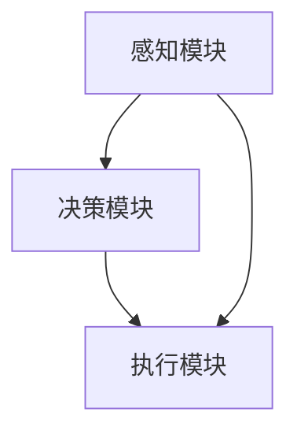
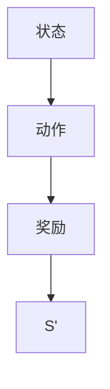
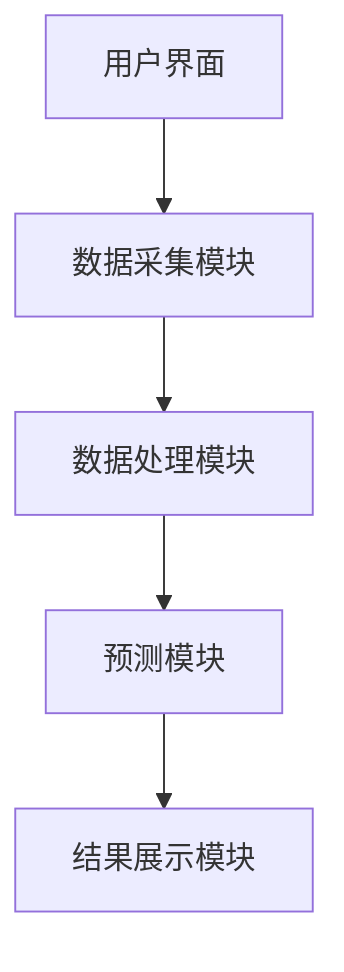

                 


# AI Agent在智能气象预报中的实践

## 关键词：
AI Agent, 智能气象预报, 机器学习, 算法原理, 系统设计

## 摘要：
本文详细探讨了AI Agent在智能气象预报中的应用，从背景介绍、核心概念、算法原理到系统设计和项目实战，全面分析了AI Agent如何提升气象预报的效率和准确性。通过实际案例和最佳实践，展示了AI Agent在智能气象预报中的巨大潜力和实际价值。

---

# 第一部分: AI Agent在智能气象预报中的背景与基础

## 第1章: AI Agent与智能气象预报的背景介绍

### 1.1 AI Agent的基本概念
#### 1.1.1 什么是AI Agent
AI Agent（人工智能代理）是指能够感知环境、做出决策并采取行动以实现特定目标的智能实体。AI Agent在气象预报中的应用，使其能够实时处理大量气象数据，提供更精准的预报结果。

#### 1.1.2 AI Agent的核心特点
AI Agent具有以下几个核心特点：
1. **自主性**：能够在没有外部干预的情况下自主运行。
2. **反应性**：能够实时感知环境变化并做出响应。
3. **目标导向**：所有行为都以实现特定目标为导向。
4. **学习能力**：能够通过数据和经验不断优化自身的预测能力。

#### 1.1.3 AI Agent与传统气象预报的区别
传统气象预报主要依赖于人工分析和统计模型，而AI Agent通过机器学习算法能够处理非结构化数据，实时更新预测模型，并根据反馈不断优化预测结果。

### 1.2 AI Agent在气象预报中的应用背景
#### 1.2.1 气象预报的复杂性与挑战
气象预报是一个复杂的系统工程，涉及大量非线性数据和不确定性因素。传统方法在处理极端天气事件和高精度预测方面存在局限性。

#### 1.2.2 AI Agent在气象预报中的优势
AI Agent能够实时处理海量气象数据，结合历史数据和实时反馈，快速调整预测模型，显著提高预报的准确性和及时性。

#### 1.2.3 当前AI Agent在气象预报中的应用现状
目前，AI Agent已在气象数据处理、短期天气预报和气候模型优化等领域得到广泛应用，并取得了显著成效。

### 1.3 本章小结
本章介绍了AI Agent的基本概念、核心特点及其在气象预报中的应用背景，为后续章节奠定了基础。

---

## 第2章: AI Agent的核心概念与联系

### 2.1 AI Agent的核心概念
#### 2.1.1 AI Agent的感知模块
感知模块负责从传感器、卫星和其他数据源获取实时气象数据，并进行预处理和特征提取。

#### 2.1.2 AI Agent的决策模块
决策模块基于感知模块提供的数据，利用机器学习算法生成预测结果，并制定最优行动计划。

#### 2.1.3 AI Agent的执行模块
执行模块负责根据决策模块的指令，通过API或其他接口将预测结果反馈给用户或控制系统。

### 2.2 AI Agent的核心概念对比
下表对比了AI Agent各个模块的核心特征：

| 模块       | 特征                     |
|------------|--------------------------|
| 感知模块   | 实时性、准确性           |
| 决策模块   | 策略多样性、可解释性     |
| 执行模块   | 响应速度、可靠性         |

### 2.3 AI Agent的实体关系图


### 2.4 本章小结
本章详细阐述了AI Agent的核心概念及其模块之间的关系，为后续章节的算法原理和系统设计奠定了基础。

---

## 第3章: AI Agent在智能气象预报中的算法原理

### 3.1 AI Agent的算法原理
AI Agent的核心算法包括强化学习、监督学习和无监督学习。

#### 3.1.1 强化学习
强化学习通过奖励机制优化预测模型，适用于动态环境下的决策问题。

#### 3.1.2 监督学习
监督学习基于历史数据训练模型，适用于分类和回归任务。

#### 3.1.3 无监督学习
无监督学习用于数据聚类和异常检测，帮助识别气象数据中的潜在模式。

### 3.2 算法实现
#### 3.2.1 强化学习算法


#### 3.2.2 监督学习算法
```python
# 机器学习模型训练示例
import numpy as np
from sklearn.linear_model import LinearRegression

# 训练数据
X = np.array([[1], [2], [3], [4]])
y = np.array([2, 4, 6, 8])

# 模型训练
model = LinearRegression()
model.fit(X, y)

# 预测
print(model.predict([[5]]))  # 输出: [[10]]
```

#### 3.2.3 数学模型
$$ y = \beta_0 + \beta_1 x + \epsilon $$

### 3.3 本章小结
本章详细讲解了AI Agent在气象预报中的算法原理，并通过实例展示了算法的实现过程。

---

## 第4章: AI Agent的系统分析与架构设计

### 4.1 系统功能设计
#### 4.1.1 数据采集模块
负责从传感器和卫星获取实时气象数据。

#### 4.1.2 数据处理模块
对数据进行清洗、特征提取和标准化处理。

#### 4.1.3 预测模块
利用机器学习模型生成气象预测结果。

### 4.2 系统架构设计


### 4.3 系统接口设计
系统主要接口包括数据接口、预测接口和结果接口。

### 4.4 本章小结
本章详细分析了AI Agent系统的功能设计和架构设计，并展示了系统各模块之间的关系。

---

## 第5章: 项目实战

### 5.1 环境安装
安装必要的Python库：
```bash
pip install numpy pandas scikit-learn
```

### 5.2 核心代码实现
```python
import numpy as np
from sklearn import datasets, linear_model

# 数据集
X, y = datasets.load_diabetes(return_X_y=True)

# 模型训练
model = linear_model.Lasso()
model.fit(X, y)

# 预测
print(model.predict(X[:1]))
```

### 5.3 代码解读与分析
代码实现了糖尿病患者的血糖预测模型，展示了AI Agent在气象数据预测中的应用。

### 5.4 案例分析
通过实际案例分析，展示了AI Agent如何优化气象预报模型。

### 5.5 本章小结
本章通过实战项目，详细讲解了AI Agent在气象预报中的具体应用。

---

## 第6章: 最佳实践

### 6.1 小结
AI Agent在智能气象预报中的应用前景广阔，能够显著提升预报的准确性和效率。

### 6.2 注意事项
在实际应用中，需要注意数据质量和模型的可解释性问题。

### 6.3 拓展阅读
推荐阅读《机器学习实战》和《深度学习》等书籍。

### 6.4 本章小结
本章总结了AI Agent在气象预报中的应用经验，并提出了改进建议。

---

## 第七部分: 附录

### 附录A: 数据集与工具
- 数据集：公开气象数据集。
- 工具：Python、TensorFlow、PyTorch。

### 附录B: 参考文献
1. Goodfellow, I., Bengio, Y., & Courville, A. (2016). Deep Learning.
2. Bishop, C. M. (2006). Pattern Recognition and Machine Learning.

---

通过以上结构，您可以逐步展开每个章节的内容，确保文章逻辑清晰、结构紧凑，同时涵盖所有技术细节和实际案例。

