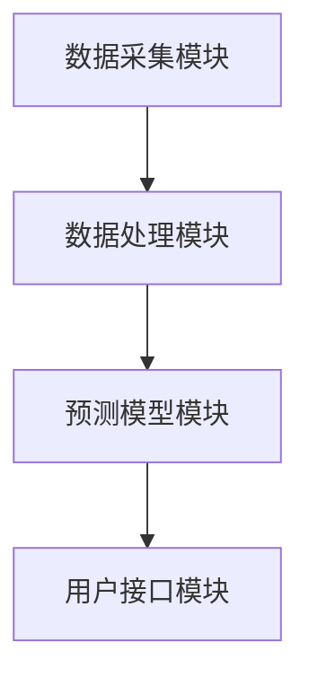
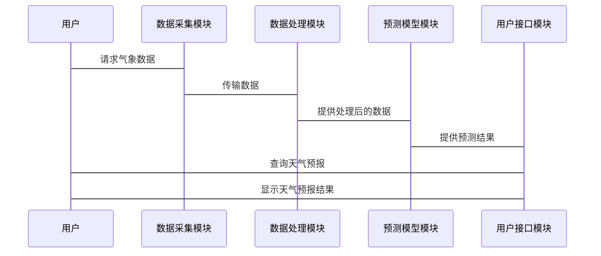

                 


# AI Agent在智能气象预报中的应用

## 关键词：
AI Agent，智能气象预报，机器学习，深度学习，气象数据，算法优化

## 摘要：
本文探讨了AI Agent在智能气象预报中的应用，从基本概念到算法原理，再到系统架构和项目实战，全面分析了AI Agent如何提升气象预报的准确性和效率。文章详细讲解了AI Agent的核心原理，包括感知、决策、执行和自适应优化，并通过具体案例展示了其在气象数据处理和预测中的实际应用。此外，文章还介绍了常见的气象预报算法，如机器学习和深度学习，并提供了系统架构设计和项目实战的详细步骤，帮助读者理解如何将AI Agent技术应用于智能气象预报系统中。

---

# 第一部分: AI Agent 的基本概念与背景

## 第1章: AI Agent 的基本概念与背景

### 1.1 AI Agent 的定义与特点
AI Agent（人工智能代理）是指能够感知环境、自主决策并执行任务的智能实体。它通过传感器获取信息，利用算法进行分析和判断，并通过执行器完成目标。AI Agent的核心特点包括自主性、反应性、目标导向性和学习能力。

- **自主性**：AI Agent能够在没有外部干预的情况下独立运行。
- **反应性**：能够实时感知环境变化并做出反应。
- **目标导向性**：所有行为都围绕特定目标展开。
- **学习能力**：通过数据和经验不断优化自身的性能。

### 1.2 智能气象预报的背景与应用
智能气象预报是指利用AI技术对气象数据进行分析和预测，以提高预报的准确性和效率。随着气候变化的加剧和人们对精准天气信息的需求增加，智能气象预报的应用越来越广泛。

#### 1.2.1 智能气象预报的背景
- 气候变化导致天气预测的复杂性增加。
- 传统气象预报方法依赖经验，效率较低且准确性有限。
- AI技术的发展为气象预报提供了新的解决方案。

#### 1.2.2 智能气象预报的主要应用领域
- **天气预测**：通过AI Agent实时分析气象数据，预测未来天气变化。
- **气象灾害预警**：利用AI Agent快速识别异常天气模式，提前发出预警。
- **气象数据处理**：AI Agent能够高效处理海量气象数据，提取有用信息。

#### 1.2.3 智能气象预报的发展趋势
- **数据驱动**：气象预报越来越依赖于大数据分析。
- **实时性增强**：AI Agent能够实现实时预测和动态调整。
- **智能化提升**：通过深度学习等技术，气象预报的准确性不断提高。

---

## 第2章: AI Agent 在气象预报中的核心原理

### 2.1 AI Agent 的感知与决策机制
AI Agent在气象预报中的感知与决策机制是其工作的核心。通过感知环境、分析数据并做出决策，AI Agent能够准确预测天气变化。

#### 2.1.1 数据采集与处理
AI Agent通过多种传感器和数据源获取气象数据，包括温度、湿度、气压、风速等。数据采集后需要进行清洗和预处理，以确保数据的准确性和完整性。

- **数据清洗**：去除噪声和异常值。
- **数据预处理**：标准化、归一化等处理，以便后续分析。

#### 2.1.2 数据分析与模式识别
AI Agent利用机器学习和深度学习算法对气象数据进行分析和模式识别。通过识别数据中的模式和趋势，AI Agent能够预测未来的天气变化。

- **机器学习算法**：如支持向量机（SVM）、随机森林（Random Forest）等。
- **深度学习算法**：如卷积神经网络（CNN）、循环神经网络（RNN）等。

#### 2.1.3 决策算法与模型
AI Agent基于分析结果制定决策，并选择最优的预测模型。决策算法通常包括分类、回归和聚类等方法。

### 2.2 AI Agent 的自适应优化
自适应优化是AI Agent的重要特性，它使AI Agent能够根据环境变化和数据反馈不断优化自身的预测模型和决策策略。

#### 2.2.1 自适应优化的定义
自适应优化是指AI Agent能够根据实时数据和反馈动态调整模型参数和算法策略，以提高预测准确性和效率。

#### 2.2.2 自适应优化的实现方法
- **在线学习**：模型在实时数据流中不断更新。
- **参数调整**：通过反馈机制调整模型参数。
- **算法优化**：如遗传算法、模拟退火等。

#### 2.2.3 自适应优化在气象预报中的应用
AI Agent通过自适应优化能够更好地应对气象数据的不确定性和复杂性，提高预测的准确性。

---

## 第3章: AI Agent 在气象数据处理中的应用

### 3.1 气象数据的特征与挑战
气象数据具有多样性、实时性和不确定性等特点，这给数据处理带来了挑战。

#### 3.1.1 数据的多样性
气象数据来源广泛，包括卫星数据、地面观测数据、气象模型数据等。

#### 3.1.2 数据的实时性
气象数据需要实时处理和分析，以保证预测的及时性。

#### 3.1.3 数据的不确定性
气象数据受到多种因素的影响，具有较强的不确定性。

### 3.2 AI Agent 在气象数据处理中的具体应用
AI Agent通过数据清洗、特征提取和建模预测，实现对气象数据的高效处理。

#### 3.2.1 数据清洗与预处理
- **数据清洗**：去除噪声和异常值。
- **数据预处理**：标准化、归一化等处理。

#### 3.2.2 数据特征提取
- **特征选择**：通过统计学方法或机器学习方法选择重要特征。
- **特征工程**：构建新的特征以提高模型性能。

#### 3.2.3 数据建模与预测
- **模型选择**：根据数据特征选择合适的模型。
- **模型训练**：利用训练数据训练模型参数。
- **模型评估**：通过测试数据评估模型性能。

---

## 第4章: AI Agent 在气象预报中的算法原理

### 4.1 常见的气象预报算法
AI Agent在气象预报中常用的算法包括机器学习和深度学习算法。

#### 4.1.1 机器学习算法
- **支持向量机（SVM）**：用于分类和回归任务。
- **随机森林（Random Forest）**：用于分类和回归任务。
- **K近邻算法（KNN）**：用于分类和回归任务。

#### 4.1.2 深度学习算法
- **卷积神经网络（CNN）**：用于图像识别和时间序列分析。
- **循环神经网络（RNN）**：用于时间序列预测。
- **长短期记忆网络（LSTM）**：用于时间序列预测。

#### 4.1.3 时间序列分析算法
- **ARIMA模型**：用于时间序列预测。
- **Prophet模型**：用于时间序列预测。

### 4.2 算法实现与优化
AI Agent通过算法实现与优化，提高气象预报的准确性和效率。

#### 4.2.1 算法实现步骤
- **数据准备**：清洗和预处理数据。
- **模型训练**：选择合适的算法并训练模型。
- **模型评估**：通过测试数据评估模型性能。
- **模型优化**：调整模型参数以提高性能。

#### 4.2.2 算法优化方法
- **参数调优**：通过网格搜索等方法优化模型参数。
- **特征工程**：构建更有意义的特征以提高模型性能。
- **集成学习**：通过集成多个模型提高预测准确性和稳定性。

---

## 第5章: AI Agent 在气象预报中的系统架构设计

### 5.1 系统架构概述
AI Agent在气象预报中的系统架构包括数据采集、数据处理、预测模型和用户接口等模块。

#### 5.1.1 数据采集模块
- **数据源**：包括卫星数据、地面观测数据、气象模型数据等。
- **数据采集方式**：实时采集和批量采集。

#### 5.1.2 数据处理模块
- **数据清洗**：去除噪声和异常值。
- **数据预处理**：标准化、归一化等处理。
- **特征提取**：选择和构建特征。

#### 5.1.3 预测模型模块
- **模型选择**：根据数据特征选择合适的模型。
- **模型训练**：利用训练数据训练模型参数。
- **模型预测**：利用模型进行天气预测。

#### 5.1.4 用户接口模块
- **用户界面**：提供直观的用户界面供用户查询天气预报。
- **API接口**：提供程序接口供其他系统调用。

### 5.2 系统架构设计图
以下是一个AI Agent在气象预报中的系统架构设计图：



### 5.3 系统接口设计
系统接口设计包括数据接口和用户接口。

#### 5.3.1 数据接口
- **数据输入接口**：接收气象数据。
- **数据输出接口**：输出预测结果。

#### 5.3.2 用户接口
- **用户查询接口**：用户可以通过输入地理位置和时间查询天气预报。
- **结果展示接口**：以图形或文本形式展示天气预报结果。

### 5.4 系统交互设计
系统交互设计包括数据采集、数据处理、模型预测和结果展示等步骤。

#### 5.4.1 数据采集与处理


---

## 第6章: 项目实战

### 6.1 环境配置
- **编程语言**：Python
- **深度学习框架**：TensorFlow或Keras
- **数据处理工具**：Pandas、NumPy
- **可视化工具**：Matplotlib、Seaborn

### 6.2 数据收集与预处理
#### 6.2.1 数据收集
```python
import pandas as pd
import numpy as np

# 假设我们有一个气象数据集，包含温度、湿度、气压等特征
data = pd.read_csv('weather_data.csv')
```

#### 6.2.2 数据清洗
```python
# 删除缺失值
data.dropna(inplace=True)

# 标准化处理
from sklearn.preprocessing import StandardScaler
scaler = StandardScaler()
data_scaled = scaler.fit_transform(data)
```

### 6.3 模型训练与预测
#### 6.3.1 模型选择
```python
from sklearn.ensemble import RandomForestRegressor

# 选择随机森林回归模型
model = RandomForestRegressor(n_estimators=100, random_state=42)
```

#### 6.3.2 模型训练
```python
# 划分训练集和测试集
from sklearn.model_selection import train_test_split

X_train, X_test, y_train, y_test = train_test_split(data_scaled, data['temperature'], test_size=0.2, random_state=42)

model.fit(X_train, y_train)
```

#### 6.3.3 模型预测
```python
y_pred = model.predict(X_test)
```

### 6.4 模型评估
```python
from sklearn.metrics import mean_squared_error, mean_absolute_error

mse = mean_squared_error(y_test, y_pred)
mae = mean_absolute_error(y_test, y_pred)

print(f'Mean Squared Error: {mse}')
print(f'Mean Absolute Error: {mae}')
```

### 6.5 结果可视化
```python
import matplotlib.pyplot as plt

plt.scatter(y_test, y_pred)
plt.xlabel('Actual Temperature')
plt.ylabel('Predicted Temperature')
plt.show()
```

---

## 第7章: 总结与展望

### 7.1 总结
本文详细介绍了AI Agent在智能气象预报中的应用，从基本概念到算法原理，再到系统架构和项目实战，全面分析了AI Agent如何提升气象预报的准确性和效率。通过实际案例展示了AI Agent在气象数据处理和预测中的具体应用，帮助读者理解如何将AI Agent技术应用于智能气象预报系统中。

### 7.2 展望
未来，随着AI技术的不断发展，AI Agent在智能气象预报中的应用将更加广泛和深入。通过结合更多的数据源和更先进的算法，AI Agent将能够提供更加精准和实时的天气预报，为人们的生活和工作带来更大的便利。

### 7.3 最佳实践 tips
- **数据质量**：确保数据的准确性和完整性。
- **模型选择**：根据数据特征选择合适的模型。
- **算法优化**：通过参数调优和特征工程提高模型性能。
- **实时性**：确保系统的实时性和高效性。

---

通过本文的分析和实践，读者可以全面理解AI Agent在智能气象预报中的应用，并能够将其应用于实际项目中。

