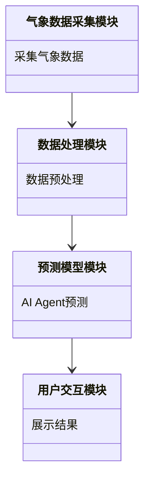
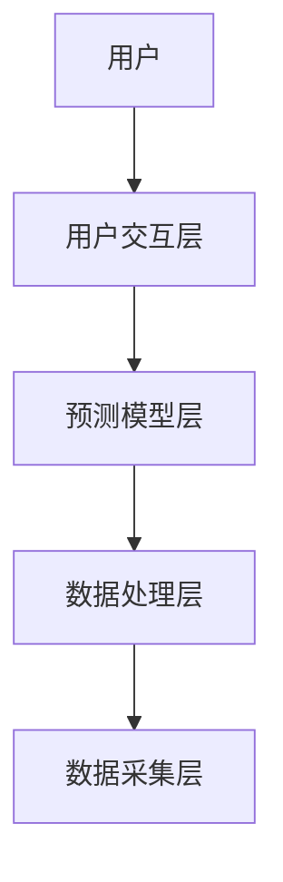
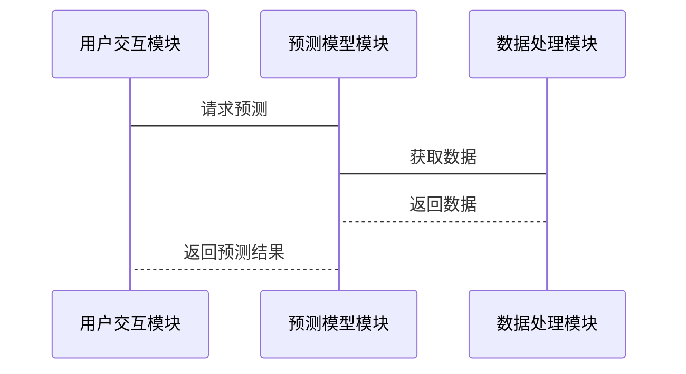

                 


# AI Agent在智能气象预报系统中的实践

## 关键词：AI Agent、智能气象预报系统、强化学习、气象数据、系统架构

## 摘要：  
随着人工智能技术的快速发展，AI Agent（智能体）在智能气象预报系统中的应用日益广泛。本文系统地探讨了AI Agent在气象预报中的核心原理、技术实现及实际应用。通过分析AI Agent的感知、决策和执行机制，结合强化学习算法和多智能体协同技术，本文提出了一个基于AI Agent的智能气象预报系统架构，并通过具体案例展示了系统的实现与优化过程。本文还总结了当前研究中的挑战与未来发展方向，为相关领域的研究和实践提供了参考。

---

# 第1章 AI Agent与智能气象预报系统概述

## 1.1 AI Agent的基本概念

### 1.1.1 AI Agent的定义  
AI Agent（智能体）是指能够感知环境、做出决策并执行动作的智能实体。在智能气象预报系统中，AI Agent通过数据采集、分析和预测，辅助气象预报员完成更精准的气象预测任务。

### 1.1.2 AI Agent的核心特征  
- **自主性**：能够独立感知环境并自主决策。  
- **反应性**：能够实时响应环境变化。  
- **学习能力**：通过数据不断优化预测模型。  
- **协作性**：能够与其他智能体协同工作。  

### 1.1.3 AI Agent与传统气象预报系统的区别  
传统气象预报系统依赖于固定的数学模型和规则，而AI Agent能够通过学习和自适应能力，动态优化预测结果，具有更强的灵活性和适应性。

## 1.2 智能气象预报系统的背景与意义

### 1.2.1 气象预报的重要性  
气象预报在农业、交通、能源、灾害预警等领域具有重要意义。精准的气象预报能够帮助人们避免自然灾害带来的损失。

### 1.2.2 传统气象预报系统的局限性  
传统气象预报系统依赖于固定的数学模型，难以应对复杂的气象变化，预测精度有限，且对实时数据的处理能力较弱。

### 1.2.3 AI Agent在气象预报中的应用前景  
AI Agent通过实时数据处理、动态优化和多智能体协同，能够显著提高气象预报的准确性和实时性，为气象预报领域带来革命性变化。

## 1.3 本章小结  
本章介绍了AI Agent的基本概念及其在智能气象预报系统中的重要性，分析了传统气象预报系统的局限性，并展望了AI Agent在气象预报中的应用前景。

---

# 第2章 AI Agent的核心原理

## 2.1 AI Agent的感知机制

### 2.1.1 数据采集与处理  
AI Agent通过传感器、卫星数据等多源数据采集气象信息，并进行预处理和特征提取。

### 2.1.2 感知模型的构建  
感知模型通过深度学习等技术，从多源数据中提取有用的气象特征，为后续的决策提供支持。

## 2.2 AI Agent的决策机制

### 2.2.1 决策算法的选择  
在气象预报中，常用的决策算法包括强化学习（如Q-learning）和贝叶斯网络等。

### 2.2.2 多目标优化策略  
AI Agent需要在多个目标（如预测精度、计算效率）之间进行权衡，以实现最优决策。

## 2.3 AI Agent的执行机制

### 2.3.1 行为规划与执行  
AI Agent根据决策结果生成执行计划，并通过接口与气象预报系统进行交互。

### 2.3.2 执行结果的反馈机制  
AI Agent通过反馈机制不断优化自身的预测模型，提高预测精度。

## 2.4 本章小结  
本章详细介绍了AI Agent的核心原理，包括感知、决策和执行三个主要环节，并探讨了相关算法和技术在气象预报中的应用。

---

# 第3章 AI Agent在气象预报中的算法原理

## 3.1 强化学习算法

### 3.1.1 强化学习的基本原理  
强化学习是一种通过试错机制优化决策的算法。AI Agent通过与环境的交互，逐步优化预测策略。

### 3.1.2 Q-learning算法的实现  
以下是Q-learning算法的伪代码实现：

```python
def q_learning(env, epsilon=0.1, alpha=0.1, gamma=0.99):
    q_table = np.zeros((env.observation_space, env.action_space))
    for episode in range(max_episodes):
        state = env.reset()
        while not done:
            if np.random.random() < epsilon:
                action = env.action_space.sample()
            else:
                action = np.argmax(q_table[state])
            next_state, reward, done, info = env.step(action)
            q_table[state][action] = q_table[state][action] * (1 - alpha) + reward * alpha + gamma * np.max(q_table[next_state])
            state = next_state
```

### 3.1.3 算法的数学模型与公式  
Q-learning算法的数学模型如下：

$$ Q(s, a) = Q(s, a) \times (1 - \alpha) + \text{reward} \times \alpha + \gamma \times \max(Q(s', a')) $$

其中，$s$是当前状态，$a$是动作，$s'$是下一个状态，$\alpha$是学习率，$\gamma$是折扣因子。

## 3.2 概率推理与不确定性处理

### 3.2.1 贝叶斯网络的应用  
贝叶斯网络通过概率推理，能够有效处理气象预测中的不确定性问题。

### 3.2.2 概率推理的数学模型  
贝叶斯网络的数学模型如下：

$$ P(A|B) = \frac{P(B|A) \times P(A)}{P(B)} $$

其中，$P(A|B)$表示在$B$条件下$A$发生的概率。

## 3.3 多智能体协同

### 3.3.1 多智能体系统的基本结构  
多智能体系统由多个智能体组成，每个智能体负责特定任务，通过协同完成复杂的预测任务。

### 3.3.2 多智能体协同的实现方法  
多智能体协同可以通过通信协议实现信息共享和任务分配。

## 3.4 本章小结  
本章详细探讨了AI Agent在气象预报中的算法原理，包括强化学习、概率推理和多智能体协同等技术，并通过数学公式和代码示例进行了详细讲解。

---

# 第4章 智能气象预报系统的架构设计

## 4.1 系统总体架构

### 4.1.1 分层架构设计  
智能气象预报系统采用分层架构，包括数据采集层、数据处理层、预测模型层和用户交互层。

### 4.1.2 各模块的功能描述  
- 数据采集层：负责采集气象数据。  
- 数据处理层：对数据进行预处理和特征提取。  
- 预测模型层：基于AI Agent进行预测。  
- 用户交互层：提供用户界面和结果展示。

## 4.2 系统功能设计

### 4.2.1 领域模型设计  
以下是领域模型的Mermaid图：



## 4.3 系统架构设计

### 4.3.1 系统架构设计  
以下是系统架构的Mermaid图：



## 4.4 系统接口设计

### 4.4.1 系统接口设计  
以下是系统接口的Mermaid图：



## 4.5 本章小结  
本章详细设计了智能气象预报系统的总体架构，包括功能模块、系统架构和接口设计，并通过图示展示了系统的协同工作流程。

---

# 第5章 AI Agent在气象预报中的项目实战

## 5.1 项目背景与目标

### 5.1.1 项目背景  
本项目旨在利用AI Agent技术，构建一个高效的智能气象预报系统。

### 5.1.2 项目目标  
- 实现AI Agent的感知、决策和执行功能。  
- 提高气象预报的准确性和实时性。  

## 5.2 项目实现

### 5.2.1 环境配置  
项目使用Python 3.8及以上版本，安装必要的库：

```bash
pip install numpy pandas scikit-learn matplotlib
```

### 5.2.2 核心代码实现

#### 数据预处理
```python
import pandas as pd

# 读取数据
data = pd.read_csv('weather_data.csv')

# 数据清洗
data.dropna(inplace=True)
data['date'] = pd.to_datetime(data['date'])
data.set_index('date', inplace=True)
```

#### 模型训练
```python
from sklearn.model_selection import train_test_split
from sklearn.ensemble import RandomForestRegressor

# 划分训练集和测试集
X_train, X_test, y_train, y_test = train_test_split(data.drop('target', axis=1), data['target'], test_size=0.2)

# 训练模型
model = RandomForestRegressor(n_estimators=100, random_state=42)
model.fit(X_train, y_train)
```

#### 模型评估
```python
from sklearn.metrics import mean_absolute_error

# 预测结果
y_pred = model.predict(X_test)

# 评估指标
mae = mean_absolute_error(y_test, y_pred)
print(f"MAE: {mae}")
```

## 5.3 项目小结  
本章通过具体案例展示了AI Agent在气象预报中的实际应用，详细讲解了项目的实现过程，包括环境配置、数据预处理和模型训练等步骤。

---

# 第6章 总结与展望

## 6.1 总结  
本文系统地探讨了AI Agent在智能气象预报系统中的应用，分析了其核心原理和技术实现，提出了一个完整的系统架构，并通过具体案例展示了项目的实现过程。

## 6.2 当前研究的不足  
目前的研究主要集中在算法优化和系统设计方面，未来需要进一步解决数据隐私、模型解释性等问题。

## 6.3 未来展望  
随着AI技术的不断发展，AI Agent在气象预报中的应用将更加广泛，预测精度和实时性将不断提升。

## 6.4 本章小结  
本章总结了本文的主要内容，并展望了AI Agent在气象预报中的未来发展方向。

---

# 附录

## 附录A 常用AI Agent算法总结

| 算法名称 | 描述 | 优缺点 |
|----------|------|--------|
| Q-learning | 基于试错的强化学习算法 | 优点：简单易实现；缺点：收敛速度慢 |

## 附录B 参考文献

1. Russell, S., & Norvig, P. (2010). Artificial Intelligence: A Modern Approach.
2. Sutton, R. S., & Barto, A. G. (2018). Reinforcement Learning: An Introduction.

---

通过本文的系统分析和实践，读者可以深入了解AI Agent在智能气象预报系统中的应用，掌握其核心技术和实现方法，为未来的研究和实践提供有益的参考。

