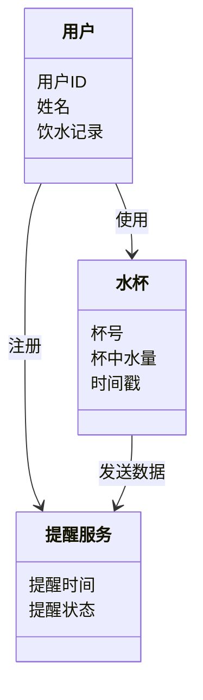
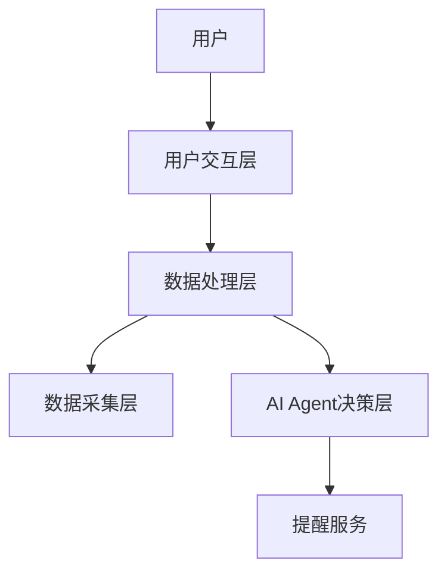

                 


# AI Agent在智能水杯中的饮水提醒

## 关键词：
AI Agent，智能水杯，饮水提醒，传感器数据，机器学习

## 摘要：
本文深入探讨了AI Agent在智能水杯中的应用，重点分析了基于传感器数据的饮水提醒系统。通过详细的技术分析和实际案例，揭示了AI Agent的核心原理、系统架构及算法实现，展示了如何通过技术创新提升用户体验。

---

## 第1章：AI Agent与智能水杯的背景介绍

### 1.1 AI Agent的基本概念

#### 1.1.1 AI Agent的定义与特点
AI Agent（人工智能代理）是指能够感知环境并采取行动以实现目标的智能实体。其特点包括：
- **自主性**：无需外部干预，自主决策。
- **反应性**：实时感知环境变化并作出反应。
- **社交能力**：能与其他系统或用户进行交互。
- **学习能力**：通过数据不断优化行为。

#### 1.1.2 AI Agent的核心要素与功能
AI Agent的核心要素包括：
- **感知模块**：通过传感器或其他输入方式获取环境信息。
- **决策模块**：基于感知信息做出决策。
- **执行模块**：通过执行机构将决策转化为行动。
- **学习模块**：通过机器学习算法优化决策模型。

AI Agent的功能主要体现在数据处理、智能决策和人机交互三个方面。

#### 1.1.3 AI Agent在智能设备中的应用前景
AI Agent在智能设备中的应用前景广阔，尤其是在智能家居、医疗设备和工业自动化等领域。通过AI Agent，设备能够实现更智能化的功能，提升用户体验和设备效率。

### 1.2 智能水杯的基本概念

#### 1.2.1 智能水杯的定义与分类
智能水杯是一种结合了物联网技术和人工智能的智能设备，能够监测和管理用户的饮水习惯。根据功能的不同，智能水杯可以分为普通智能水杯和医疗智能水杯。

- **普通智能水杯**：主要用于记录用户的饮水量和时间，提醒用户定时饮水。
- **医疗智能水杯**：针对特定健康问题（如尿毒症、高血压）设计，能够监测水质、温度等参数，并与医疗系统连接。

#### 1.2.2 智能水杯的功能与应用场景
智能水杯的主要功能包括：
- **监测饮水量**：通过内置传感器记录用户的饮水量。
- **提醒饮水**：根据用户的饮水习惯，智能提醒用户饮水。
- **监测水质**：通过传感器检测水质，确保饮水安全。
- **数据同步**：将饮水数据同步到手机APP或其他设备。

智能水杯的应用场景广泛，包括家庭、办公室、学校和医院等。

#### 1.2.3 智能水杯与传统水杯的主要区别
智能水杯与传统水杯的主要区别在于智能化功能的集成：
- **传统水杯**：仅用于盛装和饮用液体，不具备智能功能。
- **智能水杯**：集成传感器、处理器和通信模块，能够实现智能化管理。

### 1.3 饮水提醒系统的需求背景

#### 1.3.1 饮水提醒的必要性与重要性
人体每天需要摄入足够的水分，但很多人由于工作或生活节奏快，容易忘记饮水。智能水杯通过AI Agent实现自动提醒，帮助用户养成良好的饮水习惯，预防因缺水引起的各种健康问题。

#### 1.3.2 目标用户与使用场景
智能水杯的主要目标用户包括：
- **普通用户**：希望改善饮水习惯的个人。
- **特殊需求用户**：如高血压、尿毒症患者等需要严格控制饮水量的群体。

使用场景主要包括家庭、办公室、学校等场所。

#### 1.3.3 系统设计的目标与边界
系统设计的目标是实现智能、高效的饮水提醒功能，提升用户体验。设计边界包括：
- **功能范围**：仅限于饮水提醒和基本监测功能。
- **用户群体**：面向普通用户和特定医疗用户。
- **技术限制**：基于现有的传感器和AI技术。

---

## 第2章：AI Agent的核心原理与技术

### 2.1 AI Agent的工作原理

#### 2.1.1 AI Agent的基本工作流程
AI Agent的工作流程可以分为以下几个步骤：
1. **感知环境**：通过传感器或其他输入方式获取环境信息。
2. **数据处理**：对获取的数据进行预处理和特征提取。
3. **决策制定**：基于处理后的数据，通过机器学习模型做出决策。
4. **执行行动**：根据决策结果，通过执行机构完成任务。
5. **学习优化**：通过反馈机制优化决策模型。

#### 2.1.2 AI Agent的核心算法与技术
AI Agent的核心算法主要包括：
- **基于规则的算法**：通过预定义的规则进行决策。
- **机器学习算法**：如支持向量机（SVM）和随机森林（Random Forest）。
- **深度学习算法**：如卷积神经网络（CNN）和循环神经网络（RNN）。

#### 2.1.3 AI Agent与传统算法的主要区别
AI Agent的核心优势在于其智能化和自适应能力：
- **传统算法**：基于固定的规则和数据进行处理，不具备学习和优化能力。
- **AI Agent**：能够通过数据学习，不断优化决策模型，适应不同的环境和用户需求。

### 2.2 AI Agent的关键技术

#### 2.2.1 传感器数据采集与处理
AI Agent需要通过传感器获取环境数据，主要包括：
- **温度传感器**：监测水温。
- **压力传感器**：监测水杯的使用状态。
- **加速度传感器**：监测水杯的运动状态。

数据处理主要包括数据清洗、特征提取和数据转换。

#### 2.2.2 数据分析与特征提取
数据分析是AI Agent的核心环节，主要包括：
- **数据清洗**：去除噪声数据，确保数据的准确性。
- **特征提取**：从原始数据中提取有用的特征，如饮水量、饮水时间间隔等。
- **数据转换**：将数据转换为适合机器学习模型的格式。

#### 2.2.3 机器学习与深度学习模型
机器学习模型在AI Agent中的应用主要体现在分类、回归和聚类等方面。深度学习模型则适用于复杂的数据模式识别。

---

## 第3章：智能水杯系统设计

### 3.1 系统功能设计

#### 3.1.1 系统功能概述
智能水杯系统的主要功能包括：
- **饮水监测**：监测用户的饮水量和饮水时间。
- **饮水提醒**：根据用户的饮水习惯，智能提醒用户饮水。
- **数据同步**：将饮水数据同步到手机APP或其他设备。
- **异常检测**：检测异常饮水行为，如过量饮水或不足。

#### 3.1.2 系统功能模块设计
系统功能模块包括：
- **数据采集模块**：负责采集传感器数据。
- **数据处理模块**：对数据进行清洗和特征提取。
- **AI Agent决策模块**：基于特征数据做出决策。
- **用户交互模块**：与用户进行交互，显示提醒信息。

#### 3.1.3 系统功能设计的实体关系图


### 3.2 系统架构设计

#### 3.2.1 系统架构概述
智能水杯系统的架构主要包括：
- **数据采集层**：负责采集传感器数据。
- **数据处理层**：对数据进行处理和分析。
- **AI Agent决策层**：基于数据做出决策。
- **用户交互层**：与用户进行交互。

#### 3.2.2 系统架构设计的分层架构图


---

## 第4章：AI Agent算法实现

### 4.1 数据采集与特征提取

#### 4.1.1 数据采集流程
数据采集流程包括：
1. **传感器数据采集**：通过传感器获取饮水相关的数据。
2. **数据预处理**：对数据进行清洗和归一化处理。
3. **特征提取**：从数据中提取有用的特征，如饮水量、饮水时间间隔等。

#### 4.1.2 数据特征提取的示例代码
```python
import pandas as pd
from sklearn.preprocessing import StandardScaler

# 数据预处理
data = pd.read_csv('drinking_data.csv')
data.dropna(inplace=True)
data = data.drop_duplicates()

# 特征提取
features = data[['temperature', 'pressure', 'acceleration']]
scaler = StandardScaler()
features_scaled = scaler.fit_transform(features)
```

### 4.2 模型训练与优化

#### 4.2.1 模型训练流程
模型训练流程包括：
1. **数据分割**：将数据分为训练集和测试集。
2. **特征选择**：选择对模型性能影响较大的特征。
3. **模型训练**：使用训练数据训练模型。
4. **模型评估**：通过测试数据评估模型性能。
5. **模型优化**：通过调整模型参数优化模型性能。

#### 4.2.2 线性回归模型的实现
```python
from sklearn.linear_model import LinearRegression
from sklearn.metrics import mean_squared_error

# 模型训练
model = LinearRegression()
model.fit(features_scaled, labels)

# 模型预测
predictions = model.predict(features_scaled)

# 模型评估
 mse = mean_squared_error(labels, predictions)
 print(f"均方误差：{mse}")
```

### 4.3 算法实现与优化

#### 4.3.1 算法实现的优化策略
算法实现的优化策略包括：
- **特征选择**：选择对模型性能影响较大的特征。
- **模型选择**：选择适合数据的模型。
- **参数优化**：通过网格搜索等方法优化模型参数。
- **数据增强**：通过数据增强技术增加数据量。

#### 4.3.2 算法实现的代码示例
```python
from sklearn.model_selection import GridSearchCV
from sklearn.ensemble import RandomForestClassifier

# 参数设置
param_grid = {
    'n_estimators': [100, 200],
    'max_depth': [None, 10, 20],
    'min_samples_split': [2, 5, 10]
}

# 模型优化
grid_search = GridSearchCV(RandomForestClassifier(), param_grid, cv=5)
grid_search.fit(features_scaled, labels)

# 最佳参数
best_params = grid_search.best_params_
print(f"最佳参数：{best_params}")
```

---

## 第5章：系统实现与集成

### 5.1 硬件选型与传感器实现

#### 5.1.1 硬件选型
硬件选型需要考虑传感器的类型、精度和成本。常用的传感器包括：
- **温度传感器**：如DS18B20。
- **压力传感器**：如MPX5050。
- **加速度传感器**：如ADXL345。

#### 5.1.2 传感器实现的电路设计
传感器实现的电路设计需要考虑传感器的连接方式、电源供应和信号处理。例如，DS18B20温度传感器可以通过Dallas 1-Wire协议连接到微控制器。

### 5.2 软件开发与系统集成

#### 5.2.1 系统集成的实现
系统集成需要将硬件、软件和AI算法整合到一个统一的系统中。例如，使用MQTT协议实现传感器数据的实时传输和处理。

#### 5.2.2 系统集成的代码示例
```python
import paho.mqtt.client as mqtt

# 连接 MQTT 代理
client = mqtt.Client()
client.connect("localhost", 1883)

# 发布消息
client.publish("water杯/温度", str(25))
client.publish("water杯/压力", str(100))
client.publish("water杯/加速度", str(5))
```

### 5.3 测试优化与性能提升

#### 5.3.1 测试用例设计
测试用例设计需要考虑不同场景下的测试，例如：
- **正常饮水场景**：用户正常饮水时，系统能够正确记录和提醒。
- **异常饮水场景**：用户长时间未饮水，系统能够发出提醒。

#### 5.3.2 系统性能优化
系统性能优化可以通过以下措施实现：
- **优化传感器采样频率**：减少数据采集的频率，降低系统负载。
- **优化数据处理算法**：使用更高效的算法处理数据。
- **优化模型预测速度**：通过模型剪枝等技术优化模型预测速度。

---

## 第6章：案例分析与实际应用

### 6.1 实际应用案例

#### 6.1.1 案例背景
本案例以办公室环境下的饮水提醒系统为例，展示了AI Agent在智能水杯中的实际应用。

#### 6.1.2 系统设计与实现
系统设计包括：
- **需求分析**：了解用户需求，设计系统功能。
- **系统设计**：基于需求设计系统架构和功能模块。
- **系统实现**：根据设计实现系统功能。

#### 6.1.3 系统实现的详细步骤
1. **需求分析**：与用户沟通，明确需求。
2. **系统设计**：设计系统架构和功能模块。
3. **系统实现**：根据设计实现系统功能。
4. **系统测试**：测试系统功能和性能。
5. **系统优化**：根据测试结果优化系统。

### 6.2 实用经验与教训总结

#### 6.2.1 实用经验总结
在实际应用中，需要注意以下几点：
- **传感器选择**：选择适合应用场景的传感器。
- **模型优化**：通过数据清洗和特征选择优化模型性能。
- **系统维护**：定期维护系统，确保其正常运行。

#### 6.2.2 项目实施中的经验与教训
在项目实施过程中，可能会遇到以下问题：
- **数据干扰**：传感器数据受到干扰，影响模型性能。
- **模型泛化能力**：模型在不同场景下的泛化能力不足。
- **用户接受度**：用户对AI Agent的接受度可能较低。

---

## 第7章：总结与展望

### 7.1 全文总结
本文详细探讨了AI Agent在智能水杯中的应用，重点分析了基于传感器数据的饮水提醒系统。通过详细的技术分析和实际案例，揭示了AI Agent的核心原理、系统架构及算法实现，展示了如何通过技术创新提升用户体验。

### 7.2 未来发展方向
未来，AI Agent在智能水杯中的应用将朝着以下几个方向发展：
- **智能化**：通过深度学习和强化学习，进一步提升系统的智能化水平。
- **个性化**：根据用户的个性化需求，提供定制化的饮水提醒服务。
- **集成化**：将智能水杯与其他智能设备集成，形成智能化的生态系统。

### 7.3 最佳实践与注意事项
在实际应用中，需要注意以下几点：
- **数据隐私**：保护用户的隐私数据，防止数据泄露。
- **系统维护**：定期维护系统，确保其正常运行。
- **用户教育**：加强对用户的教育，提升其对AI Agent的认知和接受度。

---

通过本文的分析，我们可以看到AI Agent在智能水杯中的应用前景广阔，随着技术的不断进步，AI Agent将为智能水杯带来更多的创新和可能性。

