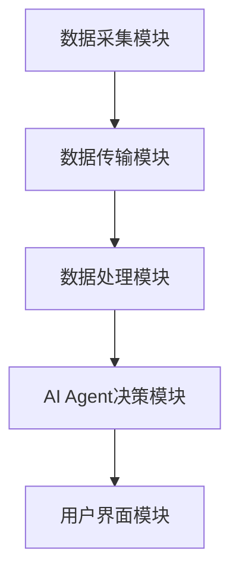
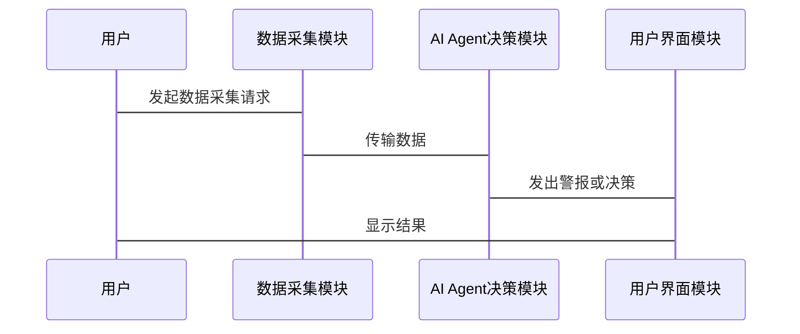

                 


# AI Agent在智能水质实时监测中的实践

## 关键词：AI Agent, 智能水质监测, 机器学习, 强化学习, 智慧水务, 数据分析

## 摘要：  
随着人工智能技术的快速发展，AI Agent在智能水质实时监测中的应用日益广泛。本文从AI Agent的基本概念出发，结合水质监测的实际需求，详细探讨了AI Agent在水质实时监测中的算法原理、系统设计与实现。通过实际案例分析，展示了AI Agent如何提升水质监测的智能化水平，为智慧水务的发展提供了新的思路和解决方案。

---

# 第一部分: AI Agent与智能水质实时监测的背景与基础

## 第1章: AI Agent与水质监测概述

### 1.1 智慧水务与水质监测的重要性
#### 1.1.1 水质监测的背景与意义  
水质是关系到人类健康和生态环境的重要指标。随着工业化和城市化进程的加快，水污染问题日益严重，对水质监测的需求也不断增加。传统的水质监测方式依赖人工采样和实验室分析，效率低下且成本高昂。AI Agent的引入，能够实现水质监测的实时化、智能化，大大提高了监测效率和准确性。

#### 1.1.2 智慧水务的概念与发展趋势  
智慧水务是通过物联网、大数据、人工智能等技术，实现水务管理的智能化和高效化。AI Agent作为智慧水务的重要组成部分，能够对水质数据进行实时分析和决策，为水务管理部门提供科学依据。

#### 1.1.3 AI Agent在水质监测中的作用  
AI Agent可以通过对实时水质数据的分析，快速识别异常情况，预测水质变化趋势，并提出相应的应对措施。此外，AI Agent还能够优化监测系统的运行效率，降低运维成本。

### 1.2 AI Agent的基本概念与特点
#### 1.2.1 AI Agent的定义与核心功能  
AI Agent是一种具有智能的计算机程序，能够感知环境、自主决策并执行任务。在水质监测中，AI Agent的核心功能包括数据采集、分析、预测和决策。

#### 1.2.2 AI Agent与传统自动化的区别  
传统自动化依赖预设的规则和程序，而AI Agent具有学习和适应能力，能够根据环境变化调整自己的行为。此外，AI Agent还能够通过数据驱动的方式优化决策过程。

#### 1.2.3 AI Agent在水质监测中的应用场景  
在水质监测中，AI Agent可以应用于实时数据处理、异常检测、预测预警、优化控制等多个场景。

### 1.3 智能水质实时监测系统的基本架构
#### 1.3.1 系统组成与功能模块  
智能水质实时监测系统通常由数据采集模块、数据传输模块、数据处理模块、AI Agent决策模块和用户界面模块组成。

#### 1.3.2 数据采集与处理流程  
数据采集模块负责采集水质参数（如温度、pH值、溶解氧等）；数据处理模块对采集的数据进行预处理、特征提取和存储；AI Agent决策模块对数据进行分析和决策，并通过用户界面模块向用户展示结果。

#### 1.3.3 AI Agent的决策机制  
AI Agent通过机器学习模型对水质数据进行分析，识别异常情况，预测水质变化趋势，并根据预设的规则或优化目标提出相应的控制策略。

### 1.4 本章小结  
本章介绍了AI Agent的基本概念、水质监测的重要性以及智能水质实时监测系统的架构。AI Agent在水质监测中的应用，不仅提高了监测效率，还为智慧水务的发展提供了新的可能性。

---

## 第2章: AI Agent的核心算法原理

### 2.1 机器学习算法在水质监测中的应用
#### 2.1.1 支持向量机（SVM）原理  
支持向量机是一种监督学习算法，适用于分类和回归任务。在水质监测中，SVM可以用于水质类别划分或预测。

#### 2.1.2 随机森林（Random Forest）原理  
随机森林是一种基于决策树的集成学习算法，具有较高的鲁棒性和泛化能力。在水质监测中，随机森林可以用于水质参数的预测和异常检测。

#### 2.1.3 神经网络（ANN）原理  
人工神经网络是一种模拟人脑结构和功能的算法，适用于处理非线性关系。在水质监测中，ANN可以用于复杂水质模型的建立和预测。

### 2.2 强化学习在AI Agent中的应用
#### 2.2.1 强化学习的基本概念  
强化学习是一种通过试错机制优化决策的算法，适用于动态环境下的决策问题。在水质监测中，强化学习可以用于优化监测系统的控制策略。

#### 2.2.2 Q-Learning算法在水质监测中的应用  
Q-Learning是一种经典的强化学习算法，适用于离散动作空间的问题。在水质监测中，Q-Learning可以用于优化监测设备的部署和采样频率。

#### 2.2.3 策略梯度（Policy Gradient）方法  
策略梯度是一种基于概率的强化学习方法，适用于连续动作空间的问题。在水质监测中，策略梯度可以用于优化监测系统的参数设置。

### 2.3 聚类分析与异常检测算法
#### 2.3.1 K-Means聚类算法  
K-Means是一种经典的无监督聚类算法，适用于将水质数据分成不同的类别。在水质监测中，K-Means可以用于识别水质异常区域。

#### 2.3.2 DBSCAN算法  
DBSCAN是一种基于密度的聚类算法，适用于处理噪声数据。在水质监测中，DBSCAN可以用于识别水质异常事件。

#### 2.3.3 One-Class SVM算法  
One-Class SVM是一种用于异常检测的算法，适用于单类数据的情况。在水质监测中，One-Class SVM可以用于识别水质异常事件。

### 2.4 算法选择与优化策略
#### 2.4.1 算法性能评估指标  
常用的算法性能评估指标包括准确率、召回率、F1分数、均方误差（MSE）等。

#### 2.4.2 超参数优化方法  
超参数优化可以通过网格搜索、随机搜索或贝叶斯优化等方法实现。

#### 2.4.3 模型鲁棒性与泛化能力提升策略  
通过数据增强、交叉验证、集成学习等方法可以提升模型的鲁棒性和泛化能力。

### 2.5 本章小结  
本章详细介绍了机器学习和强化学习算法在水质监测中的应用，分析了不同算法的优缺点，并提出了算法选择和优化的策略。

---

## 第3章: 智能水质监测的数学模型与公式

### 3.1 数据预处理与特征提取
#### 3.1.1 数据标准化与归一化公式  
数据标准化公式：$$ x_{\text{norm}} = \frac{x - \mu}{\sigma} $$  
数据归一化公式：$$ x_{\text{norm}} = \frac{x - \min(x)}{\max(x) - \min(x)} $$  

#### 3.1.2 特征选择的数学方法  
特征选择可以通过相关性分析、LASSO回归等方法实现。

### 3.2 机器学习模型的数学表达
#### 3.2.1 线性回归模型  
线性回归模型：$$ y = \beta_0 + \beta_1x + \epsilon $$  

#### 3.2.2 支持向量机的优化目标  
支持向量机的优化目标：$$ \min_{\theta} \frac{1}{2}\|\theta\|^2 + C \sum_{i=1}^n \xi_i $$  

#### 3.2.3 神经网络的前向传播公式  
神经网络的前向传播公式：$$ a^{(l+1)} = \sigma(w^{(l)}a^{(l)} + b^{(l)}) $$  

### 3.3 强化学习中的数学模型
#### 3.3.1 Q-Learning的更新公式  
Q-Learning的更新公式：$$ Q(s,a) = Q(s,a) + \alpha [r + \gamma \max Q(s',a') - Q(s,a)] $$  

#### 3.3.2 策略梯度的损失函数  
策略梯度的损失函数：$$ \mathcal{L} = -\mathbb{E}[\log \pi(a|s)Q(s,a)] $$  

### 3.4 本章小结  
本章通过数学公式详细阐述了机器学习和强化学习算法的原理，为后续的系统设计和实现奠定了理论基础。

---

## 第4章: 智能水质监测系统

### 4.1 系统组成与功能模块
智能水质监测系统通常包括数据采集模块、数据传输模块、数据处理模块、AI Agent决策模块和用户界面模块。

### 4.2 系统设计与实现
#### 4.2.1 数据采集模块  
数据采集模块负责采集水质参数（如温度、pH值、溶解氧等）。

#### 4.2.2 数据处理模块  
数据处理模块对采集的数据进行预处理、特征提取和存储。

#### 4.2.3 AI Agent决策模块  
AI Agent决策模块对数据进行分析和决策，并通过用户界面模块向用户展示结果。

### 4.3 系统架构设计
#### 4.3.1 系统架构图  


#### 4.3.2 系统交互图  


### 4.4 本章小结  
本章详细介绍了智能水质监测系统的组成、功能模块和系统架构设计，为后续的项目实现提供了清晰的指导。

---

## 第5章: 项目实战

### 5.1 环境配置
#### 5.1.1 安装必要的库  
安装Python、TensorFlow、Scikit-learn、Keras等库。

### 5.2 系统核心实现源代码
#### 5.2.1 数据预处理代码  
```python
import pandas as pd
import numpy as np

# 数据加载
data = pd.read_csv('water_quality.csv')

# 数据标准化
from sklearn.preprocessing import StandardScaler
scaler = StandardScaler()
data_normalized = scaler.fit_transform(data)
```

#### 5.2.2 模型训练代码  
```python
from sklearn.model_selection import train_test_split
from sklearn.ensemble import RandomForestClassifier

# 数据分割
X_train, X_test, y_train, y_test = train_test_split(data_normalized, data['label'], test_size=0.2)

# 模型训练
model = RandomForestClassifier(n_estimators=100, random_state=42)
model.fit(X_train, y_train)
```

#### 5.2.3 强化学习代码  
```python
from keras.models import Sequential
from keras.layers import Dense

# 神经网络模型定义
model = Sequential()
model.add(Dense(64, activation='relu', input_dim=X_train.shape[1]))
model.add(Dense(1, activation='sigmoid'))

# 模型编译
model.compile(loss='binary_crossentropy', optimizer='adam', metrics=['accuracy'])
model.fit(X_train, y_train, epochs=10, batch_size=32)
```

### 5.3 实际案例分析
#### 5.3.1 数据分析与可视化  
使用Matplotlib对水质数据进行可视化分析，识别异常情况。

#### 5.3.2 模型预测与评估  
对模型进行预测，并评估其准确率、召回率等性能指标。

### 5.4 本章小结  
本章通过实际案例分析，详细展示了AI Agent在水质监测中的具体应用，验证了系统的可行性和有效性。

---

## 第6章: 总结与展望

### 6.1 总结  
本文详细介绍了AI Agent在智能水质实时监测中的应用，从算法原理到系统设计，再到项目实现，全面探讨了AI Agent在水质监测中的潜力和价值。

### 6.2 展望  
未来，随着人工智能技术的不断发展，AI Agent在水质监测中的应用将更加广泛和深入。可以通过引入更复杂的模型（如深度学习、强化学习）进一步提升监测系统的智能化水平。

---

## 附录: 注意事项与最佳实践

### 6.3 注意事项  
1. 数据采集时要注意数据的完整性和准确性。  
2. 模型训练时要进行充分的交叉验证，避免过拟合。  
3. 系统运行时要定期维护和更新模型。

### 6.4 最佳实践  
1. 在实际应用中，建议结合多种算法进行模型融合，提升系统的鲁棒性。  
2. 定期对系统进行性能评估，并根据实际需求优化模型参数。

---

以上是《AI Agent在智能水质实时监测中的实践》的技术博客文章的完整目录大纲和内容。

