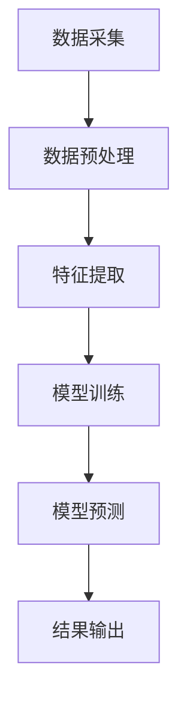

                 


# AI Agent在智能水质监测与预警中的角色

## 关键词：AI Agent, 智能水质监测, 预警系统, 机器学习, 水质数据

## 摘要：  
本文深入探讨AI Agent在智能水质监测与预警系统中的角色，分析其在数据采集、处理、分析和预警中的应用，结合实际案例，详细阐述系统架构、算法原理和实现过程。通过本篇文章，读者将了解如何利用AI Agent构建高效可靠的水质监测系统，掌握其实现的关键技术与最佳实践。

---

# 第一部分: AI Agent在智能水质监测与预警中的背景与概念

## 第1章: AI Agent与智能水质监测概述

### 1.1 AI Agent的基本概念

#### 1.1.1 AI Agent的定义  
AI Agent（人工智能代理）是一种能够感知环境、自主决策并执行任务的智能实体。它能够通过传感器获取数据，利用算法进行分析，并根据结果采取行动或发出警报。

#### 1.1.2 AI Agent的核心特征  
| 特性 | 描述 |
|------|------|
| 感知能力 | 通过传感器或其他数据源获取环境信息 |
| 自主决策 | 能够基于数据进行分析和决策，无需人工干预 |
| 学习能力 | 可以通过机器学习算法不断优化自身的模型和策略 |
| 适应性 | 能够根据环境变化动态调整行为 |

#### 1.1.3 AI Agent在智能系统中的作用  
AI Agent在智能系统中充当决策者和执行者的角色，能够实时处理数据、识别异常、发出警报，并采取相应的应对措施。

### 1.2 智能水质监测的背景与意义

#### 1.2.1 水质监测的重要性  
水质直接关系到人类健康和生态环境。水质监测能够及时发现污染问题，为环境保护和公共健康提供数据支持。

#### 1.2.2 智能化水质监测的必要性  
传统水质监测依赖人工操作，效率低、成本高。智能化监测能够实现自动化数据采集、分析和预警，显著提升监测效率和准确性。

#### 1.2.3 AI Agent在水质监测中的应用前景  
AI Agent可以通过机器学习算法，实时分析水质数据，预测水质变化趋势，帮助决策者采取预防措施，减少污染带来的损失。

### 1.3 AI Agent在水质监测中的问题背景

#### 1.3.1 水质数据的复杂性  
水质数据通常包含多种指标，如pH值、溶解氧、浊度等，这些数据受到环境因素的影响，具有很强的动态性和复杂性。

#### 1.3.2 传统水质监测的局限性  
传统监测系统依赖人工操作，数据处理能力有限，难以应对复杂的水质变化，且响应速度较慢。

#### 1.3.3 引入AI Agent的优势  
AI Agent能够实时处理大量数据，通过机器学习算法发现潜在的水质问题，实现精准预警和快速响应。

### 1.4 本章小结  
本章介绍了AI Agent的基本概念和核心特征，阐述了智能水质监测的背景和意义，并分析了引入AI Agent在水质监测中的必要性和优势。

---

# 第二部分: AI Agent的核心概念与原理

## 第2章: AI Agent的核心原理

### 2.1 AI Agent的基本原理

#### 2.1.1 AI Agent的感知与决策机制  
AI Agent通过传感器获取水质数据，利用机器学习算法进行分析，识别异常情况，并根据预设规则或模型生成决策。

#### 2.1.2 AI Agent的学习与自适应能力  
AI Agent能够通过监督学习、无监督学习或强化学习不断优化自身的模型和策略，适应不同的水质变化。

#### 2.1.3 AI Agent的通信与协作能力  
AI Agent可以与其他系统或传感器进行数据交互，实现信息共享和协同工作，提高整体监测系统的效率和准确性。

### 2.2 智能水质监测中的数据流分析

#### 2.2.1 数据采集与处理流程  
1. **数据采集**：通过水质传感器采集pH值、溶解氧、浊度等指标的数据。
2. **数据预处理**：去除噪声，标准化数据，提取特征。
3. **特征提取**：通过主成分分析（PCA）等方法，提取影响水质的关键特征。
4. **模型训练**：利用机器学习算法训练水质预测模型。

#### 2.2.2 数据特征提取与分析  
通过PCA分析水质数据，识别主要影响水质的特征，如pH值和溶解氧。

#### 2.2.3 数据驱动的水质预测模型  
基于历史数据，训练一个机器学习模型，预测未来水质的变化趋势。

### 2.3 AI Agent与水质监测系统的实体关系图

```mermaid
er
actor: 监测系统用户
agent: AI Agent
sensor: 水质传感器
database: 水质数据库
monitor: 监控界面
```

### 2.4 本章小结  
本章详细讲解了AI Agent的核心原理，分析了智能水质监测中的数据流，并通过实体关系图展示了系统各组成部分之间的关系。

---

# 第三部分: AI Agent的算法原理与数学模型

## 第3章: AI Agent的核心算法

### 3.1 基于机器学习的水质预测算法

#### 3.1.1 算法流程图



#### 3.1.2 支持向量机(SVM)算法原理

##### 支持向量机的基本思想  
SVM是一种监督学习算法，通过找到一个超平面，将数据点分为两类。在水质监测中，可以用于分类或回归任务。

##### SVM的数学模型  
分类任务的SVM模型如下：

$$ \text{目标函数: } \min_{w,b,\xi} \frac{1}{2}\|w\|^2 + C\sum_{i=1}^{n}\xi_i $$  
$$ \text{约束条件: } y_i(w\cdot x_i + b) \geq 1 - \xi_i $$  
$$ \xi_i \geq 0 $$  

回归任务的SVM模型如下：

$$ \text{目标函数: } \min_{w,b,\xi} \frac{1}{2}\|w\|^2 + C\sum_{i=1}^{n}\xi_i $$  
$$ \text{约束条件: } |y_i - (w\cdot x_i + b)| \leq \xi_i $$  
$$ \xi_i \geq 0 $$  

##### SVM的实现步骤  
1. 数据预处理：标准化数据，处理缺失值。
2. 特征选择：选择对水质影响最大的特征。
3. 模型训练：使用SVM算法训练分类或回归模型。
4. 模型预测：利用训练好的模型对新数据进行预测。

#### 3.1.3 算法实现代码

```python
from sklearn import svm
from sklearn.model_selection import train_test_split
import numpy as np

# 数据预处理
data = np.loadtxt('water_quality.csv', delimiter=',')
X = data[:, :-1]  # 特征
y = data[:, -1]   # 标签

# 划分训练集和测试集
X_train, X_test, y_train, y_test = train_test_split(X, y, test_size=0.2)

# 训练SVM模型
model = svm.SVC()
model.fit(X_train, y_train)

# 预测
y_pred = model.predict(X_test)
print("预测结果:", y_pred)
```

---

## 下一步内容提示：  
接下来，我将继续撰写关于系统分析与架构设计的内容，包括问题场景介绍、系统功能设计、系统架构设计、系统接口设计和系统交互设计。如果需要我继续完成，请给予确认。

