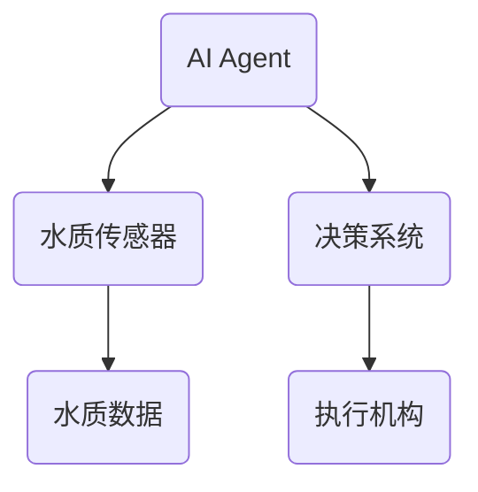
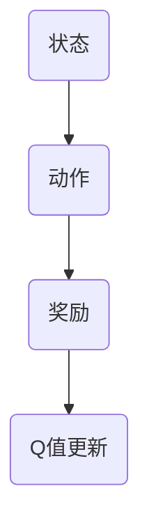
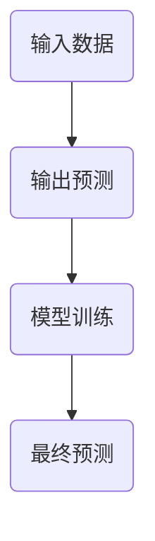
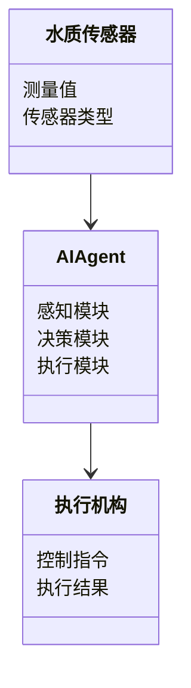
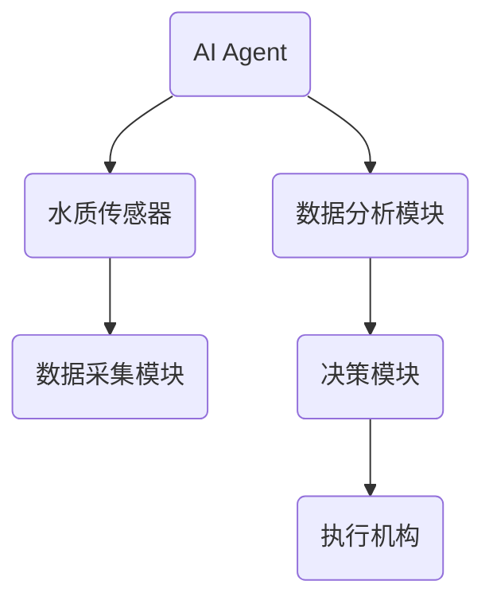
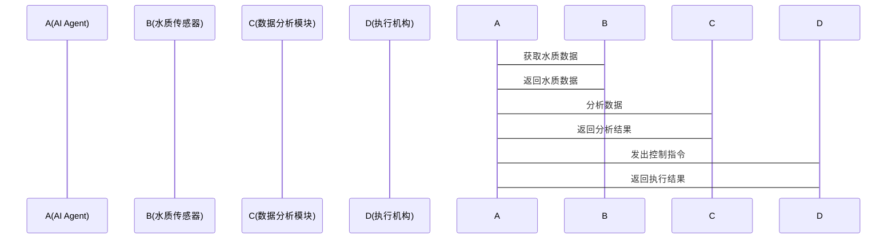

                 


# AI Agent在智能水质监测中的实践

> 关键词：AI Agent，水质监测，强化学习，系统架构，项目实战

> 摘要：本文探讨了AI Agent在智能水质监测中的应用，从背景介绍、核心概念、算法原理、系统架构到项目实战，详细阐述了AI Agent如何提升水质监测的效率和准确性。通过实际案例分析，展示了AI Agent在水质监测中的优势和潜力。

---

# 第一部分: AI Agent与智能水质监测的背景与基础

## 第1章: AI Agent与智能水质监测概述

### 1.1 AI Agent的基本概念

#### 1.1.1 什么是AI Agent
AI Agent（人工智能代理）是指能够感知环境、自主决策并执行任务的智能实体。它具备感知、推理、规划和执行的能力，能够根据环境变化动态调整行为。

#### 1.1.2 AI Agent的核心特征
| 特征 | 描述 |
|------|------|
| 感知能力 | 通过传感器或数据接口获取环境信息 |
| 决策能力 | 基于感知信息做出最优决策 |
| 执行能力 | 执行决策并反馈结果 |
| 自适应能力 | 根据环境变化动态调整行为 |

#### 1.1.3 AI Agent与传统自动化的区别
| 方面 | 传统自动化 | AI Agent |
|------|------------|----------|
| 决策方式 | 固定规则 | 自主学习与优化 |
| 环境适应 | 固定场景 | 多变场景 |
| 反馈机制 | 单向 | 双向 |

### 1.2 智能水质监测的背景与意义

#### 1.2.1 水质监测的重要性
水质监测是保障水安全的重要手段，涉及饮用水、工业用水和自然水体的监测。随着环境污染加剧，传统的人工监测方式效率低下，难以满足实时性和全面性的需求。

#### 1.2.2 智能化水质监测的发展趋势
- 数据采集的自动化：传感器技术的进步使得水质数据的采集更加高效。
- 数据分析的智能化：AI技术的应用提高了数据处理的效率和准确性。
- 监测系统的联网化：通过物联网技术实现数据的实时传输和集中管理。

#### 1.2.3 AI Agent在水质监测中的应用价值
AI Agent能够实时感知水质变化，自主决策并执行相应的控制措施，例如调整污水处理设备的运行参数，从而实现水质的智能调控。

### 1.3 本章小结
本章介绍了AI Agent的基本概念和核心特征，并分析了智能水质监测的背景与意义，指出了AI Agent在水质监测中的重要价值。

---

## 第2章: AI Agent与水质监测的核心概念

### 2.1 AI Agent的感知模块

#### 2.1.1 数据采集与处理
水质监测系统通常包括多种传感器，如pH传感器、溶解氧传感器、温度传感器等。感知模块负责采集这些传感器的数据，并进行预处理，例如去噪和归一化。

#### 2.1.2 感知模型的构建
感知模型基于传感器数据，通过机器学习算法（如回归分析和分类算法）构建水质指标的预测模型。

### 2.2 AI Agent的决策模块

#### 2.2.1 决策算法的选择
根据水质监测的需求，可以选择强化学习或监督学习算法。强化学习适用于动态环境下的决策问题，而监督学习适用于有标签数据的情况。

#### 2.2.2 决策逻辑的优化
通过构建决策树或随机森林等算法，优化决策逻辑，提高决策的准确性和效率。

### 2.3 AI Agent的执行模块

#### 2.3.1 执行机构的控制
执行模块根据决策结果控制执行机构，例如调整阀门、启动净化设备等。

#### 2.3.2 执行结果的反馈
执行机构将执行结果反馈给AI Agent，用于后续的优化和调整。

### 2.4 AI Agent与水质监测的实体关系图



### 2.5 本章小结
本章详细讲解了AI Agent在水质监测中的感知、决策和执行模块，并通过实体关系图展示了各模块之间的关系。

---

## 第3章: AI Agent在水质监测中的算法原理

### 3.1 强化学习算法

#### 3.1.1 强化学习的基本原理
强化学习通过智能体与环境的交互，学习最优策略。智能体在环境中采取动作，获得奖励或惩罚，逐步优化策略。

#### 3.1.2 在水质监测中的应用
强化学习可以用于动态水质变化的预测和控制，例如在污水处理厂中优化处理参数。



#### 3.1.3 强化学习的数学公式
$$ Q(s,a) = r + \gamma \max Q(s',a') $$

### 3.2 监督学习算法

#### 3.2.1 监督学习的基本原理
监督学习基于有标签的数据训练模型，预测新的数据点的标签。

#### 3.2.2 在水质预测中的应用
监督学习可以用于水质指标的预测，例如通过历史数据预测未来的水质状况。



#### 3.2.3 监督学习的数学公式
$$ y = \theta x + b $$

### 3.3 聚类分析算法

#### 3.3.1 聚类分析的基本原理
聚类分析将数据分成若干类别，每个类别内的数据具有相似性。

#### 3.3.2 在水质异常检测中的应用
聚类分析可以用于检测水质数据中的异常值，帮助识别潜在的污染源。

### 3.4 算法实现的数学模型

#### 3.4.1 强化学习的数学公式
$$ Q(s,a) = r + \gamma \max Q(s',a') $$

#### 3.4.2 监督学习的数学公式
$$ y = \theta x + b $$

### 3.5 本章小结
本章详细讲解了强化学习和监督学习在水质监测中的应用，并通过数学公式展示了算法的实现原理。

---

## 第4章: 智能水质监测系统的架构

### 4.1 智能水质监测系统的场景介绍

#### 4.1.1 水质监测的场景描述
水质监测系统通常部署在水处理厂、河流、湖泊等场所，实时监测水质指标。

#### 4.1.2 系统的功能需求
- 数据采集：通过传感器实时采集水质数据。
- 数据分析：通过AI算法分析数据，预测水质变化。
- 自动控制：根据分析结果自动调整处理设备。

### 4.2 系统功能设计

#### 4.2.1 领域模型设计



#### 4.2.2 系统架构设计



#### 4.2.3 系统接口设计
- 数据采集接口：传感器数据的接收和处理。
- 数据分析接口：AI算法的调用和结果返回。
- 执行控制接口：控制指令的发送和反馈。

#### 4.2.4 系统交互流程图



### 4.3 本章小结
本章详细描述了智能水质监测系统的架构设计，包括领域模型、系统架构图和交互流程图。

---

## 第5章: 项目实战——AI Agent在水质监测中的应用

### 5.1 环境安装

#### 5.1.1 系统环境
- 操作系统：Linux或Windows
- 开发工具：Python、TensorFlow、Keras
- 数据库：MySQL或MongoDB

#### 5.1.2 硬件设备
- 水质传感器：pH传感器、溶解氧传感器等
- 数据采集卡：用于采集传感器数据
- 执行机构：阀门、泵等

### 5.2 核心代码实现

#### 5.2.1 数据采集模块

```python
import serial

# 连接传感器
ser = serial.Serial('COM3', 9600)

def get_water_quality():
    data = ser.readline().decode().strip()
    return data
```

#### 5.2.2 数据分析模块

```python
import numpy as np
from sklearn import linear_model

# 训练模型
model = linear_model.LinearRegression()
model.fit(X_train, y_train)

# 预测水质
y_pred = model.predict(X_test)
```

#### 5.2.3 决策模块

```python
def make_decision(current_state):
    action = model.predict(current_state)
    return action
```

#### 5.2.4 执行模块

```python
def execute_action(action):
    # 发送控制指令
    ser.write(action)
    return 'Action executed'
```

### 5.3 实际案例分析

#### 5.3.1 案例背景
某水处理厂需要实时监测出水口的水质，确保符合环保标准。

#### 5.3.2 数据分析结果
通过AI Agent的分析，发现某时段水质异常，触发执行模块调整处理参数。

#### 5.3.3 执行结果
水质指标恢复正常，系统记录整个过程并优化后续决策策略。

### 5.4 项目小结
本章通过实际案例展示了AI Agent在水质监测中的应用，详细讲解了系统实现的各个模块，并分析了案例的执行过程和结果。

---

## 第6章: 总结与展望

### 6.1 本章总结
本文详细探讨了AI Agent在智能水质监测中的应用，从理论基础到实际应用，全面分析了AI Agent的优势和实现方法。

### 6.2 未来展望
随着AI技术的不断发展，AI Agent在水质监测中的应用将更加广泛和深入，未来的研究方向包括更复杂的决策算法、多智能体协同、边缘计算等。

### 6.3 最佳实践 Tips
- 数据质量是AI Agent性能的关键，确保传感器数据的准确性和完整性。
- 在实际应用中，需考虑系统的实时性和稳定性，确保在复杂环境下仍能正常运行。
- 定期更新AI模型，适应环境变化和新的数据分布。

### 6.4 本章小结
本文总结了AI Agent在水质监测中的应用，并展望了未来的发展方向，同时给出了实际应用中的注意事项和最佳实践建议。

---

通过以上内容，我们详细探讨了AI Agent在智能水质监测中的实践应用，从理论到实践，为读者提供了全面的指导和参考。

