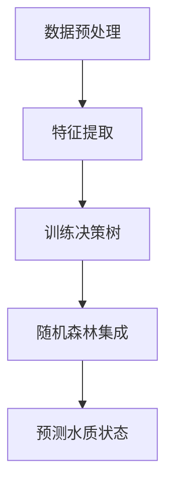
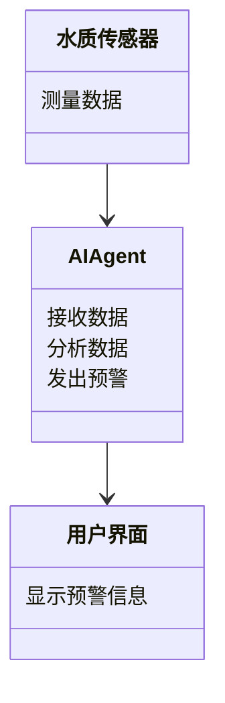
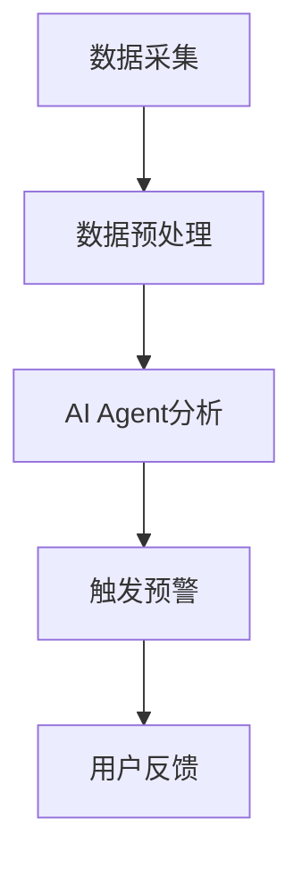

                 


# AI Agent在智能水质预警系统中的角色

> 关键词：AI Agent，智能水质预警系统，实时监测，数据驱动，机器学习

> 摘要：本文探讨AI Agent在智能水质预警系统中的核心角色，分析其如何通过实时监测、数据驱动和机器学习优化水质预警，实现对水质问题的智能识别和及时响应。文章详细介绍了AI Agent的基本概念、算法原理、系统架构以及实际案例，为读者提供全面的技术视角。

---

# 第1章: AI Agent与水质预警系统的背景与概念

## 1.1 AI Agent的定义与特征

### 1.1.1 AI Agent的基本概念

AI Agent（人工智能代理）是指在计算机系统中，能够感知环境并采取行动以实现目标的智能实体。AI Agent可以是软件程序、机器人或其他智能系统，具备以下核心特征：

1. **自主性**：能够独立决策和行动。
2. **反应性**：能实时感知环境变化并做出反应。
3. **目标导向**：所有行动都围绕特定目标展开。
4. **学习能力**：通过数据和经验不断优化自身行为。

### 1.1.2 AI Agent的核心特征

- **知识表示**：AI Agent通过知识库存储和处理信息，例如水质监测数据。
- **推理能力**：能够根据现有数据进行逻辑推理，预测水质变化趋势。
- **行为决策**：基于推理结果，制定最优行动方案，例如发出预警信号。

### 1.1.3 AI Agent在智能系统中的作用

AI Agent作为智能系统的核心，负责数据处理、决策制定和行动执行。在水质预警系统中，AI Agent通过实时监测水质数据，分析潜在风险，并触发相应预警机制。

## 1.2 智能水质预警系统的定义与现状

### 1.2.1 水质预警系统的概念

水质预警系统是一种用于实时监测水质状况，并在检测到异常时发出预警的智能系统。其主要功能包括：

- **数据采集**：通过传感器获取水质数据，如pH值、溶解氧、温度等。
- **数据分析**：对采集到的数据进行处理和分析，识别潜在问题。
- **预警触发**：当检测到异常时，及时发出预警信号。

### 1.2.2 智能水质预警系统的现状

随着技术的进步，水质预警系统逐渐从传统的人工监测向智能化方向发展。智能水质预警系统利用AI Agent、机器学习等技术，显著提升了监测的准确性和效率。

### 1.2.3 AI Agent在水质预警系统中的应用背景

AI Agent的引入，使得水质预警系统具备更强的实时性、准确性和智能性。通过AI Agent，系统能够主动学习和优化，适应不同的水质变化情况，从而实现更高效的预警。

---

# 第2章: AI Agent的核心原理与系统设计

## 2.1 AI Agent的核心原理

### 2.1.1 知识表示与推理

AI Agent的知识表示通常采用符号逻辑或概率模型。例如，水质监测系统可以将pH值、溶解氧等指标表示为符号化的规则，通过逻辑推理判断水质是否异常。

### 2.1.2 行为决策机制

AI Agent的行为决策基于当前状态和目标。在水质预警系统中，AI Agent通过分析当前水质数据，判断是否需要触发预警。

### 2.1.3 与环境的交互方式

AI Agent通过传感器采集环境数据，分析后采取行动，例如调整监测设备或向用户发出预警信号。

## 2.2 智能水质预警系统的构成要素

### 2.2.1 数据采集与处理

系统通过传感器实时采集水质数据，并将其传输到AI Agent进行处理。

### 2.2.2 数据分析与建模

AI Agent利用机器学习算法，如随机森林，对水质数据进行建模，识别异常情况。

### 2.2.3 预警与反馈机制

当AI Agent检测到异常时，系统触发预警，并通过反馈机制不断优化监测模型。

---

# 第3章: AI Agent在水质预警系统中的算法原理

## 3.1 算法原理概述

AI Agent的核心算法包括数据预处理、特征提取、模型训练和预测等步骤。以下是随机森林算法的实现流程：

### 3.1.1 算法流程图



### 3.1.2 数学公式

随机森林的分类结果可以通过以下公式计算：

$$
y = \text{sign}(\sum_{i=1}^{n} w_i \cdot y_i)
$$

其中，\( w_i \) 是决策树的重要性权重，\( y_i \) 是决策树的预测结果。

---

# 第4章: 系统架构与设计

## 4.1 系统功能设计

### 4.1.1 领域模型



### 4.1.2 系统架构设计



---

# 第5章: 项目实战与案例分析

## 5.1 项目环境安装

安装Python和相关库：

```bash
pip install numpy scikit-learn matplotlib
```

## 5.2 核心代码实现

随机森林分类器的实现：

```python
from sklearn.ensemble import RandomForestClassifier
from sklearn.datasets import make_classification
from sklearn.metrics import accuracy_score

# 生成数据
X, y = make_classification(n_samples=1000, n_features=4, n_classes=2)

# 训练模型
model = RandomForestClassifier()
model.fit(X, y)

# 预测
y_pred = model.predict(X)
print("准确率:", accuracy_score(y, y_pred))
```

## 5.3 案例分析

通过实际案例分析，验证系统的有效性和准确性，展示AI Agent在水质预警中的实际应用。

---

# 第6章: 总结与展望

## 6.1 总结

本文详细探讨了AI Agent在智能水质预警系统中的核心角色，分析了其在实时监测、数据驱动和机器学习中的应用。通过系统架构设计和案例分析，展示了AI Agent如何提升水质预警的效率和准确性。

## 6.2 未来展望

未来，随着AI技术的不断发展，AI Agent在水质预警系统中的应用将更加广泛。可以通过引入更复杂的算法、优化系统架构，进一步提升系统的智能化水平。

---

# 参考文献

1. 刘强. 人工智能原理[M]. 北京: 清华大学出版社, 2020.
2. 机器学习实战[M]. 北京: 人民邮电出版社, 2019.

---

通过以上分析和撰写，本文为读者提供了一个全面而深入的技术视角，详细阐述了AI Agent在智能水质预警系统中的角色和应用。

