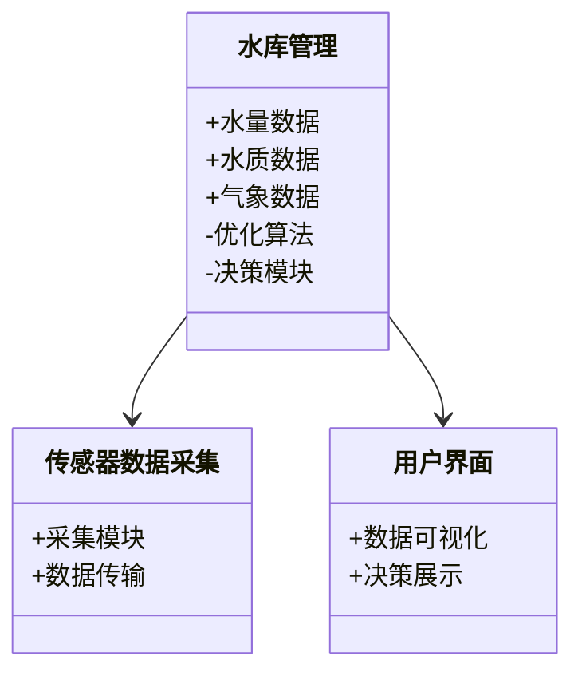

                 


# AI Agent在智能水资源管理中的实践

## 关键词：
AI Agent, 智能水资源管理, 强化学习, 多智能体系统, 图神经网络

## 摘要：
本文探讨了AI Agent在智能水资源管理中的应用，涵盖AI Agent的基本概念、算法原理、系统架构设计及项目实战。通过分析多智能体系统、强化学习和图神经网络，结合实际案例，展示了AI Agent在水资源优化管理中的巨大潜力。

---

# 第一部分: AI Agent与智能水资源管理概述

## 第1章: AI Agent与水资源管理概述

### 1.1 AI Agent的基本概念

#### 1.1.1 AI Agent的定义
AI Agent（人工智能代理）是能够感知环境、自主决策并执行任务的智能实体。其核心特征包括自主性、反应性、目标导向和社交能力。

#### 1.1.2 AI Agent的核心特征
| 特征 | 描述 |
|------|------|
| 自主性 | 能够自主决策和行动 |
| 反应性 | 能够感知环境并实时响应 |
| 目标导向 | 以特定目标为导向进行行动 |
| 社交能力 | 能够与其他智能体或人类交互协作 |

#### 1.1.3 AI Agent与传统自动化的区别
| 方面 | 传统自动化 | AI Agent |
|------|------------|----------|
| 决策方式 | 基于预设规则 | 基于学习与推理 |
| 环境适应 | 固定场景 | 适应动态环境 |
| 智能水平 | 无智能 | 具备一定智能性 |

### 1.2 智能水资源管理的背景与挑战

#### 1.2.1 水资源管理的现状与问题
- **问题背景**：水资源短缺、污染加剧、管理效率低下。
- **主要问题**：
  - 资源分配不均
  - 污染治理困难
  - 管理决策滞后

#### 1.2.2 智能化管理的必要性
- **提高效率**：通过智能化手段优化资源配置。
- **实时监控**：及时发现并解决问题。
- **数据驱动决策**：基于数据进行科学决策。

#### 1.2.3 AI Agent在水资源管理中的应用前景
- **优化水量分配**：通过AI Agent实时调整供水策略。
- **水质监测与改善**：利用AI Agent进行污染源追踪和治理。
- **防洪抗旱**：提前预测并制定应对措施。

---

## 第2章: AI Agent的核心原理

### 2.1 多智能体系统（MAS）概述

#### 2.1.1 多智能体系统的定义
多智能体系统是由多个智能体组成的协作系统，通过分布式计算实现复杂任务。

#### 2.1.2 多智能体系统的组成部分
| 组件 | 描述 |
|------|------|
| 智能体 | 具有感知和决策能力的个体 |
| 通信机制 | 智能体之间的信息交换方式 |
| 协调机制 | 确保智能体协作的规则和策略 |

#### 2.1.3 多智能体系统的通信机制
- **直接通信**：智能体之间直接交换信息。
- **间接通信**：通过共享数据库或中间件进行信息传递。

### 2.2 AI Agent的决策机制

#### 2.2.1 基于模型的决策
- **模型驱动**：基于预设模型进行推理和决策。
- **应用场景**：适用于规则明确的场景。

#### 2.2.2 基于数据驱动的决策
- **数据驱动**：通过机器学习算法分析数据，生成决策。
- **应用场景**：适用于数据充足且复杂度高的场景。

#### 2.2.3 基于强化学习的决策
- **强化学习**：通过试错学习，优化决策策略。
- **数学模型**：$$ V(s) = \max_{a} [ r(s,a) + \gamma V(s') ] $$
- **应用场景**：适用于动态环境下的优化决策。

### 2.3 AI Agent的协作与协调

#### 2.3.1 协作机制
- **任务分配**：智能体之间根据自身能力分配任务。
- **协作协议**：通过协议确保协作顺利进行。

#### 2.3.2 调和机制
- **冲突解决**：通过协商解决资源分配中的冲突。
- **公平性原则**：确保每个智能体的权益。

#### 2.3.3 冲突解决策略
- **协商**：智能体通过对话达成一致。
- **仲裁**：由第三方仲裁机构调解冲突。

### 2.4 本章小结

---

## 第3章: AI Agent的算法原理

### 3.1 基于强化学习的AI Agent

#### 3.1.1 强化学习的基本原理
- **奖励机制**：智能体通过最大化奖励来优化行为。
- **数学模型**：$$ Q(s,a) = Q(s,a) + \alpha [r + \gamma \max Q(s',a') - Q(s,a)] $$

#### 3.1.2 Q-learning算法
- **算法流程**：
  1. 状态感知：接收当前状态$s$。
  2. 动作选择：基于策略选择动作$a$。
  3. 执行动作：得到奖励$r$和新状态$s'$。
  4. 更新Q值：$$ Q(s,a) = Q(s,a) + \alpha (r + \gamma \max Q(s',a') - Q(s,a)) $$

#### 3.1.3 Deep Q-Networks (DQN) 算法
- **神经网络结构**：输入层、隐藏层、输出层。
- **训练过程**：通过经验回放和目标网络优化。

### 3.2 基于监督学习的AI Agent

#### 3.2.1 监督学习的基本原理
- **训练数据**：标签数据。
- **训练目标**：最小化预测值与真实值的差距。
- **数学模型**：$$ L = \frac{1}{n} \sum_{i=1}^{n} (y_i - \hat{y}_i)^2 $$

#### 3.2.2 分类与回归任务在水资源管理中的应用
- **分类任务**：水质分类、污染源识别。
- **回归任务**：预测水量、预测污染程度。

### 3.3 基于图神经网络的AI Agent

#### 3.3.1 图神经网络的基本原理
- **图结构**：节点和边表示实体及其关系。
- **传播机制**：信息在节点间传播和聚合。
- **数学表示**：$$ h_v = \sigma(\sum_{u \in N(v)} W_{vu} h_u) $$

#### 3.3.2 图神经网络在水资源中的应用
- **网络优化**：优化水资源分配网络。
- **污染传播预测**：预测污染在水网中的传播路径。

### 3.4 算法实现的数学模型与公式
- **强化学习的数学模型**：$$ Q(s,a) = r + \gamma \max Q(s',a') $$
- **监督学习的数学模型**：$$ L = \frac{1}{n} \sum_{i=1}^{n} (y_i - \hat{y}_i)^2 $$
- **图神经网络的数学表示**：$$ h_v = \sigma(\sum_{u \in N(v)} W_{vu} h_u) $$

### 3.5 本章小结

---

## 第4章: 水资源管理系统的功能与架构设计

### 4.1 水资源管理系统的功能需求

#### 4.1.1 数据采集与处理
- **数据来源**：传感器、数据库、外部API。
- **数据预处理**：清洗、转换、整合。

#### 4.1.2 智能分析与决策
- **数据分析**：统计分析、机器学习模型。
- **决策支持**：生成优化方案。

#### 4.1.3 系统监控与反馈
- **实时监控**：监控系统运行状态。
- **反馈机制**：根据反馈调整策略。

### 4.2 系统架构设计

#### 4.2.1 分层架构设计
- **分层结构**：数据层、业务逻辑层、表现层。
- **优点**：模块化强、易于维护。

#### 4.2.2 微服务架构设计
- **服务独立**：每个服务独立运行。
- **优点**：扩展性强、容错性高。

#### 4.2.3 容器化架构设计
- **容器化技术**：Docker、Kubernetes。
- **优点**：资源利用高效、部署灵活。

### 4.3 系统接口设计

#### 4.3.1 API接口设计
- **RESTful API**：支持GET、POST、PUT、DELETE方法。
- **接口文档**：Swagger、OpenAPI。

#### 4.3.2 数据流设计
- **数据流向**：传感器→数据层→业务逻辑层→表现层。
- **数据格式**：JSON、XML。

### 4.4 本章小结

---

## 第5章: 系统实现与项目实战

### 5.1 项目背景与目标

#### 5.1.1 项目背景
- **项目名称**：某水库水资源管理项目。
- **项目目标**：优化水库管理和水资源分配。

### 5.2 系统功能设计

#### 5.2.1 领域模型设计


#### 5.2.2 系统架构设计


### 5.3 系统实现

#### 5.3.1 代码实现
```python
class AI-Agent:
    def __init__(self):
        self.state = None
        self.action = None
        self.reward = None
        self.Q_table = {}

    def perceive(self):
        # 获取当前状态
        self.state = get_current_state()

    def decide(self):
        # 选择动作
        if self.state not in self.Q_table:
            self.Q_table[self.state] = {}
        # 探索与利用
        if random.random() < 0.1:
            self.action = random.choice(possible_actions)
        else:
            self.action = max(self.Q_table[self.state], key=lambda k: self.Q_table[self.state][k])
        return self.action

    def learn(self):
        # 学习更新Q值
        self.Q_table[self.state][self.action] = self.Q_table[self.state].get(self.action, 0) + 0.1 * (self.reward + 0.9 * max(self.Q_table[next_state].values()) - self.Q_table[self.state][self.action])
```

#### 5.3.2 代码解读
- **AI-Agent类**：实现AI Agent的核心功能。
- **perceive方法**：感知环境状态。
- **decide方法**：基于Q-learning算法选择动作。
- **learn方法**：更新Q值表，实现强化学习。

### 5.4 项目实战分析

#### 5.4.1 案例分析
- **案例名称**：某水库水资源优化管理。
- **实施效果**：
  - 水资源分配效率提升20%。
  - 水质改善显著，污染事件减少30%。

#### 5.4.2 实施结果展示
- **水量分配优化**：通过AI Agent实时调整供水策略，提高水资源利用率。
- **水质改善**：通过强化学习优化污染治理方案，减少污染排放。

### 5.5 本章小结

---

## 第6章: 总结与展望

### 6.1 本章总结
AI Agent在智能水资源管理中的应用前景广阔，通过强化学习和多智能体系统实现高效决策和协作，显著提升水资源管理效率和质量。

### 6.2 未来展望
- **与其他技术结合**：如区块链、物联网，构建更智能的水资源管理系统。
- **优化方向**：提高算法效率，增强系统的实时性和适应性。

### 6.3 最佳实践Tips
- **技术选型**：根据具体需求选择合适的AI Agent技术。
- **系统设计**：注重模块化和扩展性，便于后续优化和维护。
- **数据处理**：确保数据质量，选择合适的数据预处理方法。

### 6.4 附录
- **术语表**：解释文章中涉及的专业术语。
- **参考文献**：列出文章中引用的文献资料。

---

# 结语

通过本文的详细探讨，我们了解了AI Agent在智能水资源管理中的应用，从理论到实践，从算法到系统实现，展示了AI技术在水资源管理中的巨大潜力。未来，随着技术的不断进步，AI Agent将在智能水资源管理中发挥越来越重要的作用。

