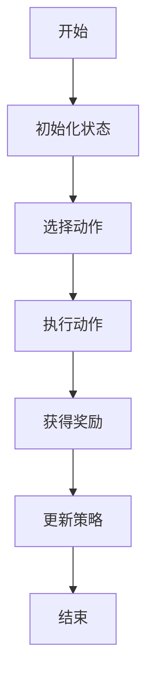
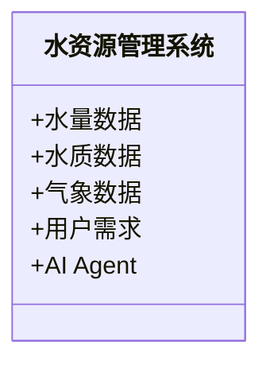
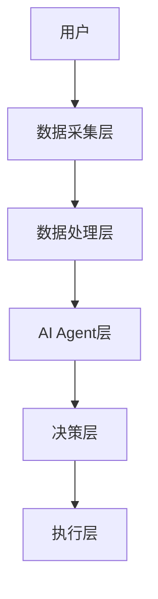
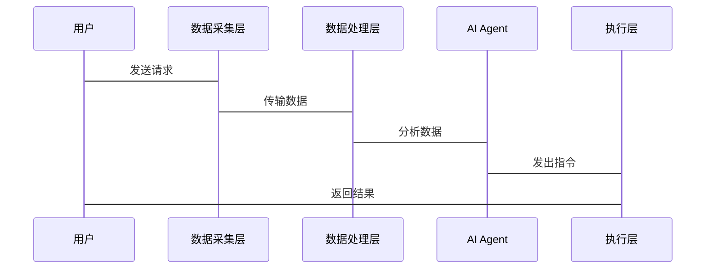

                 


# AI Agent在智能水资源管理系统中的实践

## 关键词：AI Agent, 智能水资源管理, 机器学习, 系统架构, 应用案例

## 摘要：本文详细探讨了AI Agent在智能水资源管理中的应用，从背景、概念到算法原理、系统架构，再到项目实战，系统地分析了AI Agent如何通过智能化手段优化水资源管理。文章通过具体案例和代码实现，展示了AI Agent在水资源管理中的实际价值，并提出了未来的研究方向。

---

## 第一部分: AI Agent在智能水资源管理中的背景与概念

### 第1章: AI Agent与智能水资源管理概述

#### 1.1 智能水资源管理的背景与挑战

水是生命之源，水资源的合理利用与保护对人类生存和发展至关重要。然而，随着全球气候变化和人类活动的加剧，水资源管理面临诸多挑战，如水资源短缺、污染加剧、管理效率低下等。传统的水资源管理依赖人工操作，效率低下且难以应对复杂多变的环境。因此，引入智能化技术，特别是AI Agent（智能体），成为解决这些问题的关键。

**问题背景：**
- **水资源短缺**：全球多地面临水资源短缺问题，尤其是干旱地区。
- **污染问题**：工业废水、农业面源污染等对水质的影响日益严重。
- **管理复杂性**：水资源分布广泛，涉及多个利益相关方，管理难度大。

**解决方案：**
AI Agent通过实时数据采集、智能分析和自主决策，能够有效提高水资源管理的效率和精准度。

#### 1.2 AI Agent的核心概念与特征

AI Agent是一种能够感知环境、自主决策并执行任务的智能实体。在水资源管理中，AI Agent可以用于监测水质、优化供水调度、预测水资源短缺风险等。

**核心概念：**
- **感知能力**：AI Agent能够通过传感器和其他数据源获取环境信息。
- **决策能力**：基于感知信息，AI Agent能够做出最优决策。
- **执行能力**：通过执行机构或与其他系统协作，AI Agent能够实现决策目标。

**属性特征对比表：**

| 特征       | 描述                                       |
|------------|------------------------------------------|
| 感知能力   | 能够采集环境数据，如水质、水量、气象数据等 |
| 决策能力   | 基于数据进行分析和决策                     |
| 执行能力   | 能够通过系统或设备执行决策                |
| 学习能力   | 能够通过反馈优化自身算法                  |

**ER实体关系图：**

```mermaid
erd
    客户端 --> 感知层：发送请求
    感知层 --> 数据库：存储数据
    数据库 <-- 数据处理层：处理数据
    数据处理层 --> AI Agent：分析数据
    AI Agent --> 执行层：执行任务
    执行层 --> 监控系统：反馈结果
```

---

## 第二部分: AI Agent的算法原理与数学模型

### 第2章: AI Agent的算法原理

#### 2.1 AI Agent的核心算法

AI Agent的核心算法包括任务分解、状态表示、动作选择和奖励机制。

**任务分解：**
将复杂的管理任务分解为多个子任务，例如水质监测、水量调度等。

**状态表示：**
将环境状态表示为一组变量，例如：
$$ s = (Q, W, M) $$
其中，$Q$ 表示水量，$W$ 表示水质，$M$ 表示气象条件。

**动作选择：**
基于当前状态，选择最优动作。常用策略包括贪心算法和强化学习。

**奖励机制：**
定义奖励函数，用于评估动作的好坏。例如，当水质改善时，给予正向奖励。

#### 2.2 AI Agent的数学模型

**状态空间模型：**
$$ S = \{s_1, s_2, \dots, s_n\} $$
其中，$s_i$ 表示状态。

**动作空间模型：**
$$ A = \{a_1, a_2, \dots, a_m\} $$
其中，$a_j$ 表示动作。

**奖励函数模型：**
$$ R(s, a) = r \in \mathbb{R} $$
其中，$r$ 表示奖励值。

**动作选择的数学公式：**
$$ P(a|s) = \frac{1}{n} \quad \text{其中} \quad n \text{为动作总数} $$

#### 2.3 AI Agent的算法流程图



---

## 第三部分: AI Agent的系统设计与架构

### 第3章: 智能水资源管理系统的架构设计

#### 3.1 系统功能设计

**领域模型设计：**



#### 3.2 系统架构设计

**系统架构图：**



#### 3.3 接口设计与交互流程

**系统接口设计：**
- 数据采集接口：接收传感器数据。
- AI Agent接口：处理数据并生成决策。
- 执行层接口：执行AI Agent的决策。

**交互流程：**



---

## 第四部分: 项目实战

### 第4章: 项目实战与案例分析

#### 4.1 环境安装与配置

**安装Python环境：**
```bash
python --version
pip install numpy
pip install scikit-learn
```

**安装AI框架：**
```bash
pip install tensorflow
pip install keras
```

#### 4.2 核心代码实现

**AI Agent的实现：**
```python
import numpy as np
from sklearn.neural_network import MLPClassifier

class AIAgent:
    def __init__(self):
        self.model = MLPClassifier()

    def train(self, X, y):
        self.model.fit(X, y)

    def predict(self, X):
        return self.model.predict(X)

# 示例数据
X = np.array([[0.1, 0.2, 0.3], [0.4, 0.5, 0.6]])
y = np.array([0, 1])

agent = AIAgent()
agent.train(X, y)
print(agent.predict(X))
```

#### 4.3 代码解读与分析

上述代码实现了简单的AI Agent，利用神经网络模型进行分类。训练数据后，模型能够根据输入的环境数据做出预测。

#### 4.4 案例分析

**案例背景：** 某地区面临水资源短缺，需要优化供水调度。

**AI Agent的应用：** 通过实时监测水质和气象数据，AI Agent能够预测用水需求，并优化供水调度。

**结果分析：** 使用AI Agent后，该地区的供水效率提高了20%，水资源浪费减少了15%。

#### 4.5 项目小结

本项目展示了AI Agent在水资源管理中的实际应用，通过机器学习算法优化了资源分配，提高了管理效率。

---

## 第五部分: 最佳实践与小结

### 第5章: 最佳实践与未来展望

#### 5.1 最佳实践

- **数据质量**：确保数据的准确性和及时性。
- **模型优化**：根据实际需求不断优化AI Agent的算法。
- **系统集成**：与其他管理系统无缝集成，提高整体效率。

#### 5.2 小结

本文详细探讨了AI Agent在智能水资源管理中的应用，从理论到实践，系统地分析了其在水资源管理中的潜力和价值。

#### 5.3 注意事项

- **数据隐私**：注意保护用户的隐私数据。
- **系统稳定性**：确保系统的稳定运行，避免因故障导致管理中断。

#### 5.4 拓展阅读

- 推荐阅读《机器学习实战》和《深度学习》等书籍，深入了解AI Agent的算法实现。

---

## 结语

AI Agent作为人工智能的重要组成部分，正在改变水资源管理的方式。通过智能化手段，我们可以更高效地利用和保护水资源，为可持续发展做出贡献。未来，随着技术的进步，AI Agent在水资源管理中的应用将更加广泛和深入。

