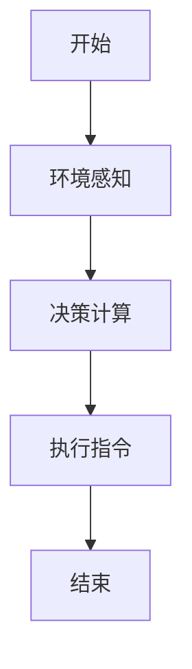
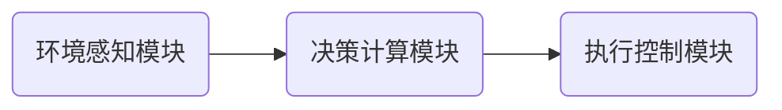
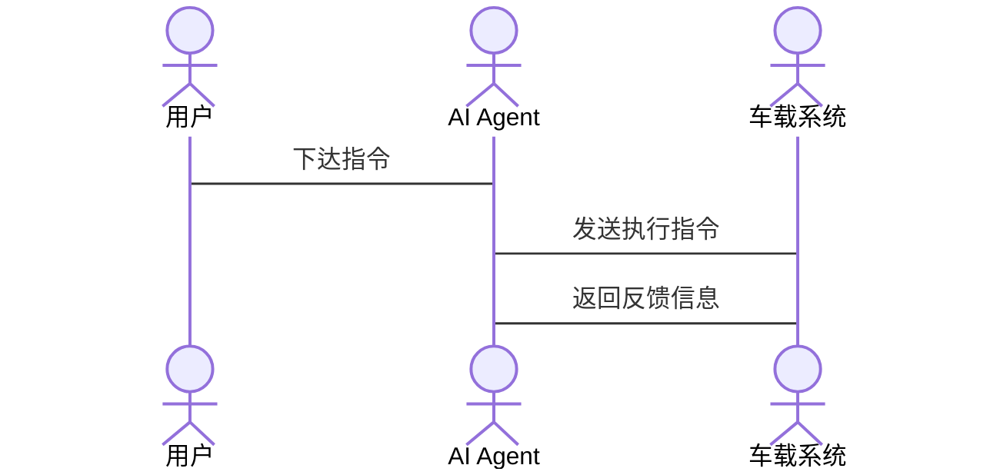

                 


# AI Agent在智能汽车中的应用：自动驾驶与车载助手

> 关键词：AI Agent，智能汽车，自动驾驶，车载助手，算法原理，系统架构，项目实战

> 摘要：本文深入探讨AI Agent在智能汽车中的应用，涵盖自动驾驶与车载助手两大核心领域。通过背景介绍、核心概念分析、算法原理讲解、系统架构设计和项目实战等多维度内容，全面解析AI Agent在智能汽车中的技术实现与应用价值。文章结合理论与实践，为读者提供详尽的技术指导与应用参考。

---

## 第一部分: AI Agent在智能汽车中的应用概述

### 第1章: AI Agent与智能汽车的背景介绍

#### 1.1 问题背景
智能汽车的发展正以惊人的速度改变着我们的出行方式。AI Agent作为智能汽车的核心技术之一，能够实现车辆的自主决策和人机交互，极大地提升了驾驶的安全性、舒适性和效率。然而，AI Agent在智能汽车中的应用还面临着诸多挑战，例如感知精度、决策算法的复杂性以及系统可靠性等问题。

#### 1.2 问题描述
当前，智能汽车的AI Agent主要应用于自动驾驶和车载助手两大领域。自动驾驶需要AI Agent具备强大的环境感知、路径规划和决策能力，而车载助手则需要AI Agent能够理解用户的意图并提供个性化的服务。然而，现有的技术在应对复杂交通场景和用户需求时仍存在诸多不足，例如感知算法的鲁棒性不足、决策系统的实时性受限等。

#### 1.3 问题解决
通过引入先进的AI技术，如深度学习、强化学习和自然语言处理，可以显著提升AI Agent在智能汽车中的性能。例如，通过改进感知算法，AI Agent能够更准确地识别道路标志和预测其他车辆的行驶意图；通过优化决策算法，AI Agent能够更快地做出合理的驾驶决策。

#### 1.4 边界与外延
AI Agent在智能汽车中的应用具有明确的边界和外延。边界主要集中在车辆的自主决策和交互功能，而外延则包括与智能交通系统（ITS）的协同工作以及与其他智能设备的互联互通。这种边界与外延的关系使得AI Agent在智能汽车中的应用既有明确的技术实现路径，又有广阔的发展空间。

#### 1.5 概念结构与核心要素
AI Agent的核心要素包括感知模块、决策模块和执行模块。感知模块负责采集环境数据并进行特征提取，决策模块基于感知结果制定驾驶策略，执行模块则负责将决策结果转化为具体的驾驶动作。这些核心要素共同构成了AI Agent在智能汽车中的功能体系。

---

### 第2章: AI Agent的核心概念与联系

#### 2.1 AI Agent的定义与特点
AI Agent是一种能够感知环境、自主决策并执行任务的智能体。其核心特点包括自主性、反应性、目标导向性和学习能力。与传统软件相比，AI Agent能够通过学习和自适应优化自身的性能。

#### 2.2 智能汽车的定义与特点
智能汽车是指集成了先进的感知、决策和执行技术，能够实现自主驾驶或辅助驾驶的车辆。其特点包括高度智能化、网络化和自动化，能够通过多种传感器和数据接口与外部环境进行实时交互。

#### 2.3 AI Agent与智能汽车的关系
AI Agent是智能汽车的核心技术之一，智能汽车通过AI Agent实现自主决策和人机交互。两者之间的关系是相互依存的，AI Agent为智能汽车提供智能决策能力，而智能汽车则为AI Agent提供丰富的感知数据和应用场景。

#### 2.4 ER实体关系图
```mermaid
er
actor(AI Agent) {
    id
    感知数据
    决策指令
}
actor(智能汽车) {
    id
    车载传感器
    执行机构
}
关系：AI Agent通过车载传感器获取环境数据，通过执行机构实现决策指令。
```

---

### 第3章: AI Agent的算法原理讲解

#### 3.1 算法原理概述
AI Agent的算法原理主要涵盖感知、决策和控制三个模块。感知模块通过多传感器融合技术实现对环境的精确感知，决策模块基于强化学习算法制定最优驾驶策略，控制模块通过反馈机制实现对车辆的精确控制。

#### 3.2 算法实现流程图


#### 3.3 算法实现代码示例
```python
def ai_agent_algorithm(input_data):
    # 感知模块
   感知结果 = sensor_fusion(input_data)
    # 决策模块
   决策结果 = decision_making(感知结果)
    # 执行模块
   执行指令 = control_module(决策结果)
    return 执行指令
```

---

### 第4章: 数学模型与公式

#### 4.1 数学模型概述
AI Agent的数学模型主要涉及感知算法、决策算法和控制算法。感知算法通常采用概率模型，决策算法基于强化学习，控制算法则采用最优控制理论。

#### 4.2 公式详细讲解
- **感知算法公式**
  $$ P(x|y) = \frac{P(y|x)P(x)}{P(y)} $$
  该公式用于计算在给定条件下某个事件发生的概率，是概率模型的核心公式。
  
- **决策算法公式**
  $$ V(s,a) = r + \gamma V(s',a') $$
  该公式用于计算在状态s和动作a下的价值函数，是强化学习中的核心公式。
  
- **控制算法公式**
  $$ u(t) = -K(t)x(t) $$
  该公式用于描述系统的反馈控制机制，是控制理论中的基本公式。

---

### 第5章: 系统分析与架构设计

#### 5.1 系统功能设计
AI Agent在智能汽车中的系统功能设计包括环境感知、决策计算和执行控制三大模块。环境感知模块负责采集和处理环境数据，决策计算模块负责制定驾驶策略，执行控制模块负责将决策结果转化为具体的驾驶动作。

#### 5.2 系统架构设计


#### 5.3 接口设计
- **输入接口**：车载传感器数据、用户指令
- **输出接口**：执行指令、反馈信息

#### 5.4 交互流程


---

## 第六部分: 项目实战

### 第6章: 环境安装与系统实现

#### 6.1 环境安装
- **安装Python**：确保安装最新版本的Python和Python环境管理工具（如virtualenv）。
- **安装依赖库**：安装numpy、pandas、scikit-learn、tensorflow等机器学习库。
- **安装开发工具**：安装PyCharm或Jupyter Notebook等开发工具。

#### 6.2 系统核心实现源代码
```python
import numpy as np
from sklearn import linear_model

def sensor_fusion(data):
    # 多传感器融合算法
    model = linear_model.LinearRegression()
    model.fit(data[:-1], data[1:])
    return model.predict(data[-1])

def decision_making(perception):
    # 强化学习算法
    action = np.argmax(perception)
    return action

def control_module(decision):
    # 反馈控制算法
    output = decision * 0.8
    return output
```

#### 6.3 代码应用解读与分析
上述代码实现了AI Agent的核心功能模块。`sensor_fusion`函数通过线性回归模型实现多传感器数据的融合；`decision_making`函数基于强化学习算法制定驾驶决策；`control_module`函数通过反馈控制算法实现对车辆的精确控制。

#### 6.4 实际案例分析
以自动驾驶场景为例，AI Agent通过融合激光雷达、摄像头和超声波传感器的数据，准确识别前方障碍物并制定绕行路径。决策模块基于强化学习算法选择最优路径，并通过反馈控制算法实现对方向盘和油门的精确控制。

---

## 第七部分: 总结与展望

### 第7章: 总结与注意事项

#### 7.1 总结
本文全面探讨了AI Agent在智能汽车中的应用，从背景介绍、核心概念、算法原理到系统架构和项目实战，为读者提供了详尽的技术指导。通过本文的分析，我们可以看到，AI Agent在智能汽车中的应用前景广阔，但也面临诸多技术挑战。

#### 7.2 注意事项
- **数据安全**：AI Agent需要处理大量的敏感数据，必须确保数据的安全性。
- **系统可靠性**：AI Agent的决策必须高度可靠，否则可能导致严重的安全事故。
- **法律法规**：智能汽车的推广需要符合相关的法律法规，确保合法合规。

---

### 第8章: 小结与拓展阅读

#### 8.1 小结
AI Agent在智能汽车中的应用是当前人工智能领域的研究热点。通过本文的分析，我们可以看到，AI Agent在自动驾驶和车载助手两大领域的应用具有重要的技术价值和社会意义。

#### 8.2 拓展阅读
- **相关书籍**：《自动驾驶：百年汽车业的革命与重构》
- **学术论文**：《基于强化学习的自动驾驶决策算法研究》
- **技术博客**：https://blog.aiagent.com

---

通过本文的系统讲解，读者可以全面了解AI Agent在智能汽车中的应用，掌握其核心技术和实现方法。希望本文能够为智能汽车领域的技术研究和实践应用提供有益的参考和指导。

