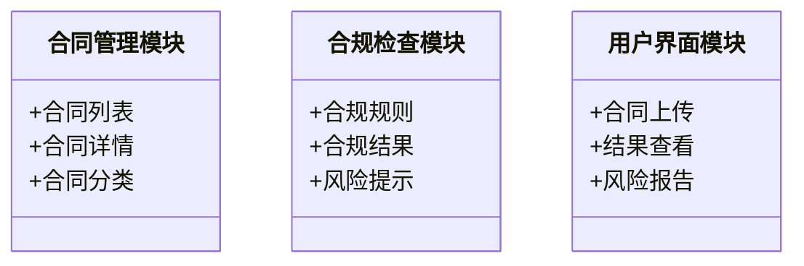
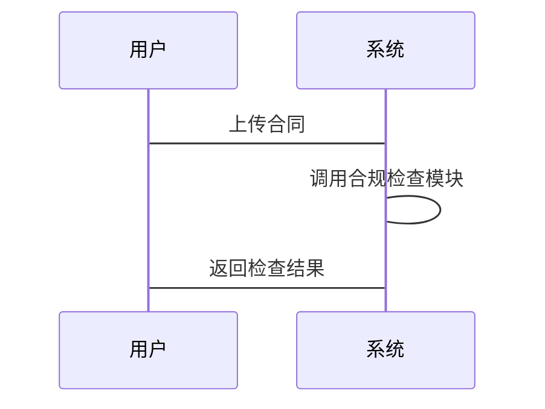

                 


# AI Agent在智能法律合规检查中的角色

---

## 关键词

AI Agent, 智能法律合规检查, 人工智能, 法律合规, 智能系统

---

## 摘要

AI Agent在智能法律合规检查中的角色越来越重要。随着法律事务的复杂化和数据量的激增，传统的法律合规检查方式已经难以满足现代企业的需求。AI Agent作为一种智能化的解决方案，能够通过自主学习、实时分析和自动化执行，显著提升法律合规检查的效率和准确性。本文将详细探讨AI Agent在智能法律合规检查中的核心原理、系统架构、实际应用案例以及未来的发展趋势，为读者提供全面的了解。

---

# 第1章：AI Agent的基本概念与法律合规检查的背景

## 1.1 AI Agent的定义与核心特征

AI Agent（人工智能代理）是指能够感知环境、自主决策并执行任务的智能实体。它具备以下几个核心特征：

1. **自主性**：AI Agent能够在没有外部干预的情况下独立执行任务。
2. **反应性**：能够实时感知环境变化并做出相应的反应。
3. **目标导向性**：具备明确的目标，能够优化行为以实现目标。
4. **学习能力**：通过数据和经验不断优化自身的决策能力。

AI Agent的应用领域非常广泛，包括智能助手、自动驾驶、智能客服等。

## 1.2 法律合规检查的现状与挑战

### 1.2.1 法律合规检查的基本概念

法律合规检查是指对企业的经营行为、合同文本、法律文件等进行审查，确保其符合相关法律法规和行业规范。传统的法律合规检查主要依赖人工审查，效率低、成本高且容易出错。

### 1.2.2 传统法律合规检查的痛点与局限性

1. **效率低下**：人工审查需要大量时间，特别是在处理大量法律文件时。
2. **成本高昂**：需要大量专业律师和法律人员参与。
3. **主观性**：不同律师可能对同一份合同的理解存在差异。
4. **及时性不足**：无法实时监控和更新法律法规的变化。

### 1.2.3 数字化与智能化对法律合规检查的推动作用

随着AI技术的发展，法律合规检查逐步从人工化向智能化转变。智能化法律合规检查能够快速处理大量数据，实时更新法律法规，并提供准确的合规建议。

## 1.3 AI Agent在法律合规检查中的结合与意义

### 1.3.1 AI Agent与法律合规检查的结合方式

AI Agent可以通过以下方式与法律合规检查结合：

1. **自动化审查**：AI Agent能够自动解析合同文本，识别潜在的法律风险。
2. **实时监控**：AI Agent可以实时跟踪法律法规的变化，并自动更新合规建议。
3. **智能决策支持**：AI Agent能够提供基于数据分析的决策支持，帮助法律人员快速做出合规判断。

### 1.3.2 AI Agent在法律合规检查中的价值与意义

1. **提高效率**：AI Agent能够快速处理大量法律文件，显著减少人工审查的时间。
2. **降低成本**：通过自动化审查，减少了对大量律师的依赖，降低了合规检查的成本。
3. **提高准确性**：AI Agent能够基于大数据和机器学习算法，提供更精准的合规判断。
4. **实时性**：AI Agent能够实时更新法律法规，确保合规检查的及时性。

---

# 第2章：AI Agent与法律合规检查的核心概念

## 2.1 AI Agent在法律合规检查中的核心原理

### 2.1.1 基于规则的AI Agent推理机制

基于规则的AI Agent通过预设的法律规则和逻辑推理来判断合同的合规性。例如，AI Agent可以基于合同中的关键词和条款，自动识别潜在的法律风险。

### 2.1.2 基于机器学习的AI Agent训练与优化

基于机器学习的AI Agent通过训练大量的法律文本数据，学习合同的合规性特征，并生成相应的合规判断。例如，AI Agent可以通过训练合同分类模型，自动将合同分为合规和不合规两类。

### 2.1.3 多模态AI Agent在法律文本分析中的应用

多模态AI Agent能够同时处理文本、语音、图像等多种数据形式。在法律合规检查中，多模态AI Agent可以用于分析合同文本、识别合同中的图像标志等。

---

## 2.2 法律合规检查的核心要素与AI Agent的结合

### 2.2.1 法律合规检查的核心要素

1. **法律法规**：AI Agent需要实时更新法律法规数据库，确保合规检查的准确性。
2. **合同文本**：AI Agent能够自动解析合同条款，识别潜在的法律风险。
3. **合规建议**：AI Agent可以提供基于分析结果的合规建议，帮助用户快速做出决策。

### 2.2.2 AI Agent与法律合规检查的属性对比

| 属性 | AI Agent | 法律合规检查 |
|------|-----------|--------------|
| 自主性 | 高         | 低           |
| 反应性 | 高         | 低           |
| 目标导向性 | 高         | 中           |
| 学习能力 | 高         | 低           |

### 2.2.3 法律合规检查的ER实体关系图

```mermaid
er
actor: 用户
role: 法律顾问
contract: 合同
rule: 法律法规
risk: 风险点
```

---

## 2.3 AI Agent在法律合规检查中的关键流程

### 2.3.1 数据采集与预处理

1. **数据采集**：从企业系统中获取合同文本、法律法规文件等数据。
2. **数据清洗**：去除冗余数据，确保数据的完整性和一致性。

### 2.3.2 数据分析与合规判断

1. **关键词提取**：通过自然语言处理技术提取合同中的关键词和关键条款。
2. **合规判断**：基于预设的法律规则和机器学习模型，判断合同的合规性。

### 2.3.3 结果展示与反馈

1. **结果展示**：将合规判断结果展示给用户，并标注潜在的风险点。
2. **反馈优化**：根据用户的反馈，优化AI Agent的判断模型。

---

# 第3章：AI Agent在法律合规检查中的算法原理

## 3.1 基于规则的AI Agent算法

### 3.1.1 算法流程

1. **规则定义**：定义法律合规的规则，例如“合同中必须包含保密条款”。
2. **规则匹配**：将合同文本与规则进行匹配，识别潜在的法律风险。

### 3.1.2 代码实现

```python
def rule_based_check(contract_text):
    risks = []
    if "confidentiality" not in contract_text.lower():
        risks.append("Missing confidentiality clause")
    # 更多规则的检查
    return risks
```

## 3.2 基于机器学习的AI Agent算法

### 3.2.1 算法流程

1. **数据标注**：将合同文本标注为合规或不合规。
2. **模型训练**：使用机器学习算法（如逻辑回归、支持向量机）训练分类模型。
3. **模型预测**：使用训练好的模型对新合同进行合规性预测。

### 3.2.2 代码实现

```python
from sklearn.linear_model import LogisticRegression

# 假设X为训练数据，y为标签（0为合规，1为不合规）
model = LogisticRegression()
model.fit(X, y)

# 预测新合同的合规性
new_contract = ...  # 新合同的特征向量
prediction = model.predict(new_contract)
print("预测结果：", prediction)
```

### 3.2.3 数学模型

逻辑回归模型的数学公式如下：

$$ P(y=1|x) = \frac{1}{1 + e^{- (w^T x + b)}} $$

其中，$w$ 是权重向量，$b$ 是偏置项，$x$ 是输入特征向量。

---

## 3.3 基于深度学习的AI Agent算法

### 3.3.1 算法流程

1. **数据预处理**：将合同文本转换为数值表示（如词嵌入）。
2. **模型训练**：使用深度学习模型（如LSTM、BERT）训练文本分类模型。
3. **模型预测**：使用训练好的模型对新合同进行合规性预测。

### 3.3.2 代码实现

```python
import tensorflow as tf
from tensorflow.keras import layers

# 定义模型
model = tf.keras.Sequential([
    layers.Embedding(input_dim= vocabulary_size, output_dim= embedding_dim),
    layers.LSTM(units=64),
    layers.Dense(1, activation='sigmoid')
])

# 编译模型
model.compile(optimizer='adam', loss='binary_crossentropy', metrics=['accuracy'])

# 训练模型
model.fit(X_train, y_train, epochs=10, batch_size=32)
```

### 3.3.3 模型评估

评估模型的性能，如准确率、召回率、F1值等。

---

# 第4章：AI Agent在法律合规检查中的系统架构设计

## 4.1 系统功能设计

### 4.1.1 领域模型设计



### 4.1.2 系统架构设计


### 4.1.3 系统接口设计

1. **合同上传接口**：用户上传合同文本。
2. **合规检查接口**：AI Agent对合同进行合规性检查。
3. **结果展示接口**：将检查结果展示给用户。

### 4.1.4 系统交互流程



---

## 4.2 系统实现细节

### 4.2.1 数据库设计

数据库用于存储合同文本、合规规则、检查结果等数据。

```mermaid
erd
    合同表: id, 合同内容, 上传时间
    规则表: id, 规则名称, 规则内容
    结果表: id, 合同id, 检查结果
```

### 4.2.2 系统功能实现

1. **合同上传**：用户可以通过网页或API上传合同文本。
2. **合规检查**：系统自动调用AI Agent进行合规性检查。
3. **结果展示**：用户可以通过网页查看检查结果，并下载风险报告。

---

## 4.3 系统优化与扩展

### 4.3.1 系统优化

1. **性能优化**：通过并行计算、缓存技术等优化系统的运行效率。
2. **模型优化**：通过模型调参、数据增强等方法提高AI Agent的准确率。

### 4.3.2 系统扩展

1. **多语言支持**：支持多种语言的合同审查。
2. **多领域支持**：扩展到更多法律领域，如知识产权、劳动法等。

---

# 第5章：AI Agent在法律合规检查中的项目实战

## 5.1 项目环境安装

### 5.1.1 安装Python

```bash
# 安装Python
https://www.python.org/downloads/
```

### 5.1.2 安装必要的库

```bash
pip install numpy pandas scikit-learn tensorflow
```

## 5.2 项目核心代码实现

### 5.2.1 合同上传模块

```python
import os
from flask import Flask, request, redirect, url_for

app = Flask(__name__)

@app.route('/upload', methods=['GET', 'POST'])
def upload_file():
    if request.method == 'POST':
        if 'file' not in request.files:
            return redirect(request.url)
        file = request.files['file']
        if file.filename == '':
            return redirect(request.url)
        if file:
            filename = file.filename
            content = file.read().decode('utf-8')
            # 调用合规检查模块
            result = check_compliance(content)
            return f"检查结果：{result}"
    return '''
        <form method=post enctype=multipart/form-data>
            <input type=file name=file>
            <input type=submit value=Upload>
        </form>
    '''

if __name__ == '__main__':
    app.run(debug=True)
```

### 5.2.2 合规检查模块

```python
def check_compliance(contract_content):
    # 这里可以调用之前训练好的模型进行检查
    # 示例：基于规则的检查
    risks = []
    if "confidentiality" not in contract_content.lower():
        risks.append("Missing confidentiality clause")
    if "governing_law" not in contract_content.lower():
        risks.append("Missing governing law clause")
    return ", ".join(risks)
```

## 5.3 项目小结

通过以上代码实现，我们完成了一个简单的AI Agent在法律合规检查中的应用。实际项目中需要考虑更多的细节，如数据安全、模型优化、用户界面设计等。

---

# 第6章：AI Agent在法律合规检查中的最佳实践

## 6.1 总结

AI Agent在智能法律合规检查中的应用前景广阔。通过自动化审查、实时监控和智能决策支持，AI Agent能够显著提高法律合规检查的效率和准确性。然而，AI Agent的应用也面临一些挑战，如数据隐私、模型解释性等。

## 6.2 小结

本文详细探讨了AI Agent在智能法律合规检查中的核心原理、系统架构和实际应用案例。通过本文的学习，读者可以深入了解AI Agent在法律合规检查中的重要作用，并掌握相关技术的实现方法。

## 6.3 注意事项

1. **数据隐私**：在处理法律数据时，必须遵守相关法律法规，确保数据的安全性。
2. **模型解释性**：AI Agent的决策需要具有可解释性，以便用户理解和信任。
3. **持续优化**：定期更新法律法规数据库和优化AI Agent的模型，以确保系统的准确性。

## 6.4 拓展阅读

1. **《机器学习实战》**：学习机器学习的基本概念和算法实现。
2. **《法律人工智能》**：深入了解人工智能在法律领域的应用。
3. **《深度学习》**：学习深度学习的基本原理和应用。

---

通过以上内容，您可以深入了解AI Agent在智能法律合规检查中的角色和应用。希望本文对您有所帮助！

