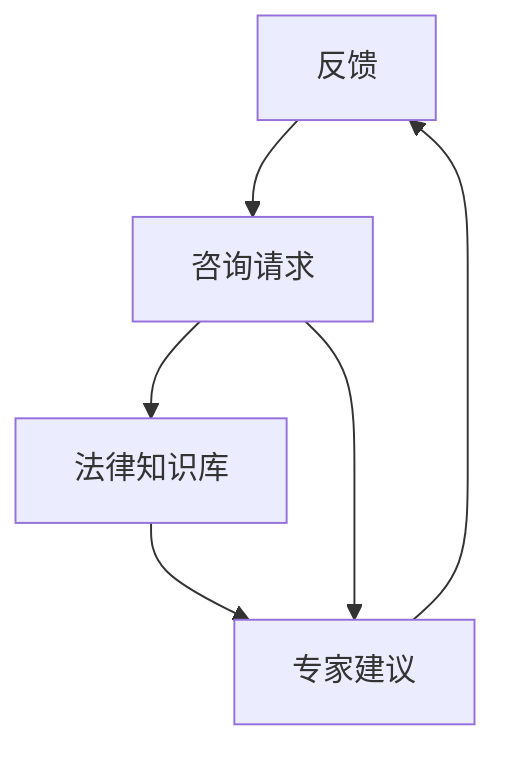

                 


# AI Agent在智能法律咨询系统中的角色

> 关键词：AI Agent，智能法律咨询系统，自然语言处理，机器学习，法律知识图谱

> 摘要：AI Agent在智能法律咨询系统中扮演着越来越重要的角色。本文系统地探讨了AI Agent在法律咨询中的核心概念、算法原理、系统架构设计以及实际应用。通过详细分析AI Agent的功能和优势，结合具体的案例和代码实现，展示了如何利用AI技术提升法律咨询的效率和准确性。同时，本文也探讨了系统设计中的关键问题，包括知识表示、人机交互和法律推理等，并提出了最佳实践和未来的研究方向。

---

## 第一部分: AI Agent在智能法律咨询系统中的背景与概念

### 第1章: AI Agent的基本概念与法律咨询系统的结合

#### 1.1 AI Agent的定义与核心特征
- **1.1.1 AI Agent的定义**
  - AI Agent是一种能够感知环境、自主决策并执行任务的智能实体。
  - 在法律咨询系统中，AI Agent能够理解和处理法律文本，提供个性化的法律建议。

- **1.1.2 AI Agent的核心特征**
  - **智能性**：能够理解和处理复杂的法律信息。
  - **交互性**：支持自然语言对话，与用户进行实时互动。
  - **自主性**：能够在没有人工干预的情况下执行任务。

- **1.1.3 AI Agent与传统法律咨询系统的区别**
  - **效率**：AI Agent能够快速处理大量信息，提高咨询效率。
  - **可扩展性**：AI Agent可以同时服务于大量用户，而传统系统则受到人力资源的限制。
  - **准确性**：AI Agent基于最新的法律知识库提供咨询，减少了人为错误。

#### 1.2 智能法律咨询系统的背景
- **1.2.1 现代法律咨询的需求变化**
  - 用户需求日益多样化，对法律咨询的时效性和准确性要求越来越高。
  - 传统法律咨询系统难以满足大规模、个性化的需求。

- **1.2.2 传统法律咨询的局限性**
  - 人力资源有限，难以覆盖所有用户。
  - 法律知识更新速度快，人工更新效率低。
  - 咨询过程缺乏智能化，用户体验不佳。

- **1.2.3 AI技术在法律咨询中的应用潜力**
  - AI Agent能够实时更新法律知识库，确保咨询的准确性。
  - 通过自然语言处理技术，实现与用户的自然对话。
  - 提供个性化的法律建议，满足用户的多样化需求。

#### 1.3 AI Agent在法律咨询中的角色定位
- **1.3.1 AI Agent作为法律咨询辅助工具的角色**
  - 协助用户快速获取法律信息，提供初步咨询建议。
  - 在复杂问题上，引导用户联系专业律师。

- **1.3.2 AI Agent在法律咨询系统中的功能定位**
  - 作为前端交互界面，接收用户咨询请求。
  - 分析用户需求，匹配合适的法律知识和解决方案。
  - 提供实时反馈，确保咨询过程流畅。

- **1.3.3 AI Agent与法律专家的协同工作模式**
  - AI Agent处理简单、常见问题，减轻法律专家的工作负担。
  - 在复杂问题上，AI Agent辅助法律专家进行分析和推理。
  - 结合AI Agent的自动化能力与法律专家的专业知识，实现高效的协同工作。

---

## 第2章: AI Agent在智能法律咨询系统中的问题背景

### 2.1 法律咨询系统中的常见问题
- **2.1.1 用户需求的多样性和复杂性**
  - 不同用户可能面临不同的法律问题，例如合同纠纷、家庭法律问题等。
  - 每个问题可能涉及复杂的法律条款和相关规定。

- **2.1.2 法律知识的更新速度**
  - 法律法规不断更新，传统法律咨询系统难以及时更新知识库。
  - AI Agent能够实时更新法律知识，确保咨询的准确性。

- **2.1.3 传统咨询的效率问题**
  - 传统法律咨询需要预约律师，耗时较长。
  - AI Agent能够提供即时咨询，提高效率。

### 2.2 AI Agent解决这些问题的潜力
- **2.2.1 提高咨询效率**
  - AI Agent能够快速处理用户请求，提供即时反馈。
  - 通过自然语言处理技术，实现高效的用户交互。

- **2.2.2 实现实时法律信息更新**
  - AI Agent能够实时获取最新的法律法规，确保咨询的准确性。
  - 通过机器学习算法，自动更新法律知识库。

- **2.2.3 提供个性化法律建议**
  - AI Agent能够根据用户的具体情况，提供个性化的法律建议。
  - 通过数据分析，预测法律风险，帮助用户做出决策。

### 2.3 问题解决的边界与外延
- **2.3.1 AI Agent的能力边界**
  - AI Agent能够处理常见、简单的法律问题，但对于复杂的法律案件，仍需要专业律师的介入。
  - AI Agent无法处理涉及主观判断的法律问题，如道德和伦理问题。

- **2.3.2 系统的适用范围与限制**
  - 适用于个人用户和中小企业，提供基础法律咨询。
  - 对于复杂的法律案件，AI Agent可以作为辅助工具，帮助法律专家进行分析和推理。

- **2.3.3 与法律专家协同工作的必要性**
  - AI Agent无法完全替代专业律师，特别是在复杂的法律案件中。
  - 法律专家需要对AI Agent的建议进行审核和补充，确保咨询的准确性和全面性。

---

## 第3章: AI Agent的核心概念与联系

### 3.1 核心概念原理
- **3.1.1 知识表示与推理**
  - 将法律知识表示为结构化的数据，如法律条文、案例等。
  - 通过逻辑推理，分析用户的问题，匹配最合适的法律建议。

- **3.1.2 自然语言处理技术**
  - 使用NLP技术，理解用户的咨询请求。
  - 生成自然流畅的回复，提升用户体验。

- **3.1.3 机器学习算法**
  - 通过机器学习算法，训练AI Agent的学习能力。
  - 不断优化AI Agent的性能，提高咨询的准确性。

### 3.2 核心概念属性特征对比表
| 特性       | 描述                       |
|------------|--------------------------|
| 智能性     | 能够理解和处理法律文本     |
| 交互性     | 支持自然语言对话           |
| 自适应性   | 根据反馈调整响应策略       |

### 3.3 ER实体关系图


---

## 第4章: AI Agent在智能法律咨询系统中的算法原理

### 4.1 算法原理概述
- AI Agent的核心算法包括自然语言处理、机器学习和知识推理。
- 使用这些算法，AI Agent能够理解和处理法律文本，提供个性化的法律建议。

### 4.2 自然语言处理技术
- **4.2.1 分词与词性标注**
  - 将用户的问题分解成词语，并标注词性。
  - 例如，将“合同纠纷”分解成“合同”和“纠纷”，并标注为名词。

- **4.2.2 句法分析与语义理解**
  - 分析句子的语法结构，理解句子的含义。
  - 例如，理解“我需要起草一份合同”中的意图是起草合同。

- **4.2.3 基于深度学习的NLP模型**
  - 使用预训练的NLP模型，如BERT，进行文本表示和语义理解。
  - 代码示例：
    ```python
    import transformers
    model = transformers.BertModel.from_pretrained('bert-base-uncased')
    tokenizer = transformers.BertTokenizer.from_pretrained('bert-base-uncased')
    inputs = tokenizer("我需要起草一份合同", return_tensors='np')
    outputs = model(inputs.input_ids, inputs.attention_mask)
    ```

### 4.3 机器学习算法
- **4.3.1 分类算法**
  - 使用分类算法，将用户的问题分类到不同的法律领域。
  - 例如，使用SVM或随机森林进行分类。

- **4.3.2 回归算法**
  - 预测法律风险，如违约概率。
  - 使用逻辑回归或神经网络进行预测。

- **4.3.3 聚类算法**
  - 将相似的法律问题分组，便于快速检索和处理。
  - 使用K-means或DBSCAN进行聚类。

### 4.4 知识推理与法律条文匹配
- **4.4.1 知识图谱构建**
  - 构建法律知识图谱，表示法律条文、案例之间的关系。
  - 使用图嵌入技术，如TransE，进行知识推理。

- **4.4.2 基于规则的推理**
  - 定义法律推理规则，如“如果合同中没有明确条款，则适用相关法律”，进行推理。

- **4.4.3 基于符号逻辑的推理**
  - 使用逻辑推理引擎，如Prolog，进行法律条文的逻辑推理。

---

## 第5章: AI Agent在智能法律咨询系统中的系统分析与架构设计

### 5.1 问题场景介绍
- **用户场景**：用户通过AI Agent进行法律咨询，系统需要快速响应并提供准确的建议。
- **系统目标**：构建一个高效、准确、易于使用的智能法律咨询系统。

### 5.2 系统功能设计
- **领域模型设计**
  ```mermaid
  classDiagram
      class 用户 {
          id
          咨询历史
      }
      class 法律知识库 {
          法律条文
          法律案例
      }
      class AI Agent {
          自然语言处理模块
          知识推理模块
      }
      用户 --> AI Agent: 提交咨询请求
      AI Agent --> 法律知识库: 查询法律信息
  ```

- **系统架构设计**
  ```mermaid
  architecture
      客户端 --> AI Agent: 用户咨询请求
      AI Agent --> 法律知识库: 查询法律信息
      AI Agent --> 专家系统: 获取专家建议
      AI Agent --> 用户: 返回咨询结果
  ```

- **系统接口设计**
  - 用户通过API提交咨询请求。
  - 系统返回JSON格式的咨询结果。

- **系统交互设计**
  ```mermaid
  sequenceDiagram
      用户 -> AI Agent: 提交咨询请求
      AI Agent -> 法律知识库: 查询相关法律信息
      法律知识库 -> AI Agent: 返回法律信息
      AI Agent -> 用户: 返回咨询结果
  ```

---

## 第6章: AI Agent在智能法律咨询系统中的项目实战

### 6.1 环境安装与配置
- **安装Python和相关库**
  ```bash
  pip install transformers pandas numpy
  ```

### 6.2 系统核心实现源代码
- **自然语言处理模块**
  ```python
  import transformers
  model = transformers.BertModel.from_pretrained('bert-base-uncased')
  tokenizer = transformers.BertTokenizer.from_pretrained('bert-base-uncased')
  ```

- **知识推理模块**
  ```python
  import networkx as nx
  G = nx.DiGraph()
  G.add_edge('合同', '合同条款')
  G.add_edge('合同条款', '违约责任')
  ```

### 6.3 代码应用解读与分析
- **NLP模块的应用**
  - 使用BERT模型进行文本表示和语义理解。
  - 对用户的咨询请求进行分词和词性标注。

- **知识推理模块的应用**
  - 基于知识图谱进行法律条文的匹配和推理。
  - 使用逻辑推理引擎进行法律规则的推理。

### 6.4 实际案例分析
- **案例1：合同纠纷咨询**
  - 用户咨询：“我需要起草一份合同。”
  - AI Agent分析：用户需要起草合同，可能涉及合同条款、违约责任等内容。
  - 系统建议：提供合同模板，并提醒用户注意关键条款。

### 6.5 项目小结
- AI Agent在法律咨询系统中的应用前景广阔。
- 通过不断优化算法和知识库，AI Agent能够更好地服务于用户。

---

## 第7章: AI Agent在智能法律咨询系统中的最佳实践

### 7.1 小结
- AI Agent在法律咨询系统中的应用提升了咨询的效率和准确性。
- 通过与法律专家的协同工作，确保咨询的准确性和全面性。

### 7.2 注意事项
- **数据隐私**：确保用户数据的安全和隐私。
- **法律准确性**：AI Agent的建议仅供参考，用户需要结合实际情况进行判断。
- **系统维护**：定期更新法律知识库，确保系统正常运行。

### 7.3 拓展阅读
- 推荐阅读相关领域的书籍和论文，深入了解AI在法律咨询中的应用。
- 关注最新的技术动态，了解AI Agent在法律咨询中的最新进展。

---

## 第八章: 结语

AI Agent在智能法律咨询系统中的应用是人工智能技术的重要发展方向。通过不断优化算法和系统设计，AI Agent能够更好地服务于用户，提升法律咨询的效率和准确性。未来，随着技术的进步，AI Agent将在法律咨询领域发挥更大的作用，为用户提供更加智能化、个性化的服务。

