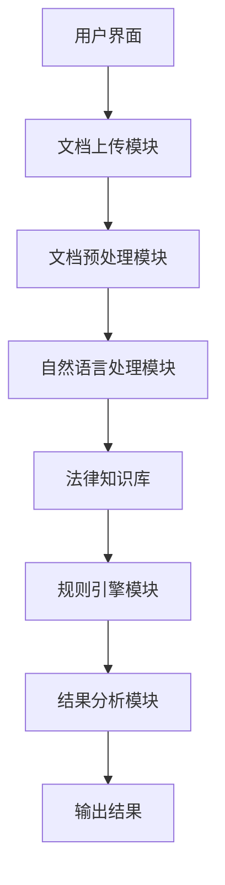
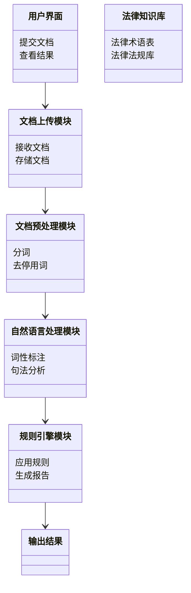
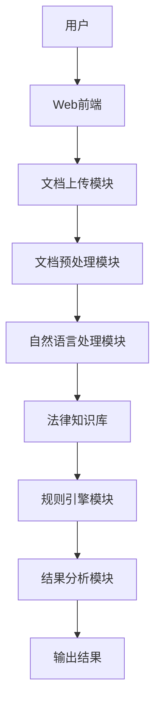
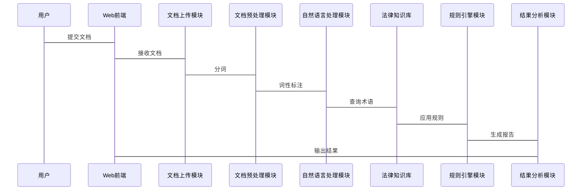

                 


# AI Agent在智能法律文档分析中的角色

> **关键词**: AI Agent, 智能法律文档分析, 自然语言处理, 机器学习, 知识图谱, 法律问答系统

> **摘要**: 本文探讨AI Agent在智能法律文档分析中的角色，从AI Agent的基本概念、法律文档分析的核心任务到具体的应用案例，系统地分析其在合同审查、法律案例分析和法律问答系统中的作用。通过详细的技术分析、系统架构设计和项目实战，展示AI Agent如何提升法律文档分析的效率和准确性。

---

## 第二部分: 系统架构与实现

### 第5章: 系统架构与实现

#### 5.1 系统架构设计

##### 5.1.1 系统模块划分

图5-1展示了AI Agent在智能法律文档分析系统中的模块划分：



##### 5.1.2 系统功能设计

图5-2展示了系统的功能模块类图：



##### 5.1.3 系统架构设计

图5-3展示了系统的整体架构：



##### 5.1.4 系统接口设计

法律文档分析系统的接口设计包括：

1. 文档上传接口：接收法律文档并存储。
2. 文档预处理接口：对文档进行分词和去停用词处理。
3. 自然语言处理接口：进行词性标注和句法分析。
4. 规则引擎接口：应用法律规则生成报告。
5. 结果分析接口：对处理结果进行验证和优化。

##### 5.1.5 系统交互流程

图5-4展示了系统的交互流程：



---

### 第6章: 项目实战

#### 6.1 项目介绍

以智能合同审查系统为例，展示AI Agent在法律文档分析中的实际应用。

#### 6.2 环境配置

```bash
# 安装Python依赖
pip install -r requirements.txt
```

#### 6.3 核心实现代码

##### 6.3.1 文档预处理模块

```python
def preprocess(document):
    # 分词
    tokens = tokenizer(document)
    # 去停用词
    filtered_tokens = [token for token in tokens if token not in stop_words]
    return filtered_tokens
```

##### 6.3.2 自然语言处理模块

```python
def nlp_process(tokens):
    # 词性标注
    pos_tags = pos_tagger(tokens)
    # 句法分析
    parse_tree = syntax_analyzer(pos_tags)
    return parse_tree
```

##### 6.3.3 规则引擎模块

```python
def rule_engine(parse_tree, knowledge_base):
    # 应用规则
    results = rule_applier(parse_tree, knowledge_base)
    return results
```

##### 6.3.4 结果分析模块

```python
def result_analysis(results):
    # 优化结果
    optimized_results = result_optimizer(results)
    return optimized_results
```

#### 6.4 实际案例分析

以一份合同为例，展示AI Agent如何识别关键条款：

1. **文档预处理**: 对合同进行分词和去停用词处理。
2. **自然语言处理**: 进行词性标注和句法分析。
3. **规则引擎**: 应用法律规则识别关键条款。
4. **结果分析**: 对识别结果进行优化和输出。

#### 6.5 项目小结

通过实际案例分析，展示了AI Agent在智能合同审查系统中的应用，验证了其在法律文档分析中的高效性和准确性。

---

### 第7章: 最佳实践与小结

#### 7.1 最佳实践

1. **数据质量**: 确保训练数据的质量和多样性。
2. **模型优化**: 定期更新模型以提高准确率。
3. **用户反馈**: 通过用户反馈不断优化系统。

#### 7.2 小结

本文详细探讨了AI Agent在智能法律文档分析中的角色，从系统架构到项目实战，展示了其在合同审查、法律案例分析和法律问答系统中的应用。通过实际案例分析，验证了AI Agent在法律文档分析中的高效性和准确性。

#### 7.3 注意事项

- 数据隐私与安全问题需高度重视。
- 系统需定期更新以适应法律法规的变化。
- 保持与用户的良好互动，及时处理反馈。

#### 7.4 拓展阅读

建议读者深入研究以下领域：

1. **复杂法律文档的分析**: 如涉及多法律领域的综合性文档。
2. **实时法律咨询系统**: 基于AI Agent的实时法律问答系统。
3. **法律推理与论证**: 探讨AI Agent在法律推理中的应用。

---

通过以上分析和实践，AI Agent在智能法律文档分析中的角色得到了全面的展示和验证，为未来的法律技术发展提供了有力的支持。

