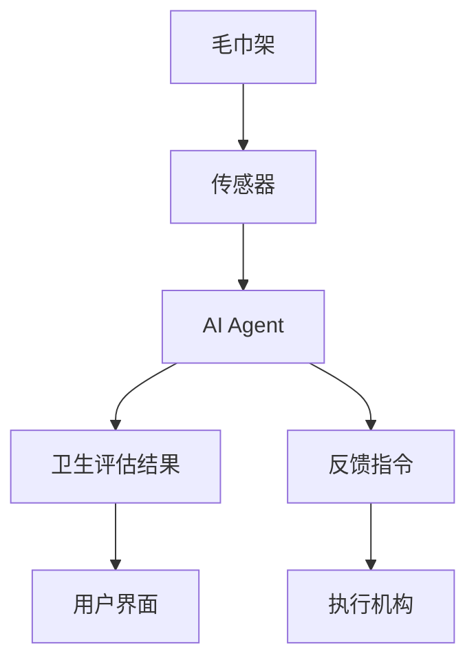
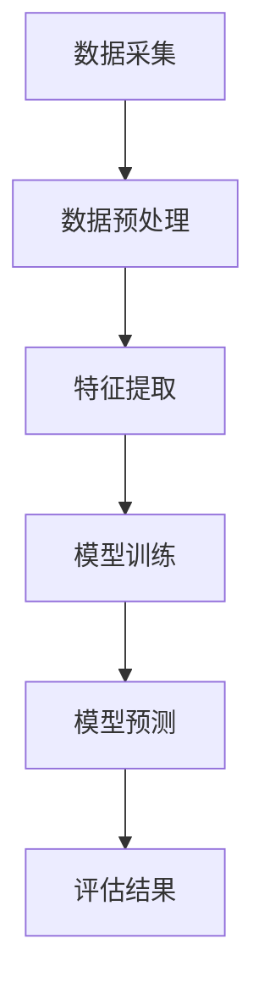
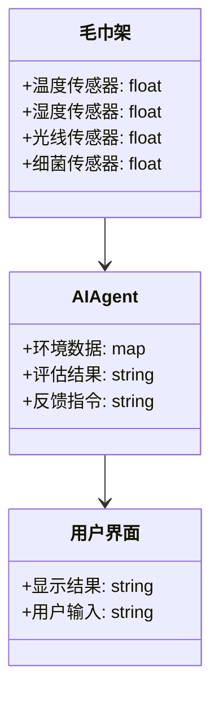
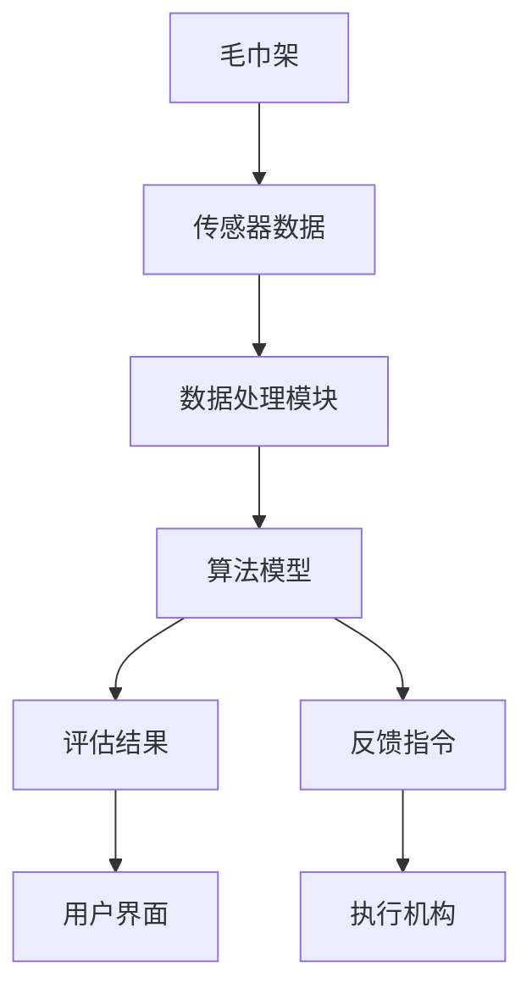

                 


# AI Agent在智能浴室毛巾架中的卫生状况评估

> 关键词：AI Agent, 卫生评估, 多传感器融合, 智能家居, 智能浴室

> 摘要：本文探讨了AI Agent在智能浴室毛巾架中的卫生状况评估应用，从背景介绍、核心概念、算法原理、系统架构设计到项目实战，详细分析了如何利用AI技术实现毛巾架卫生状况的智能化评估。

---

# 第一部分: AI Agent在智能浴室毛巾架中的背景与核心概念

# 第1章: 背景介绍

## 1.1 问题背景

### 1.1.1 智能浴室环境的卫生挑战

现代家庭浴室环境潮湿，毛巾作为日常使用频率最高的物品之一，容易滋生细菌和霉菌。如何实时监测和评估毛巾架的卫生状况，确保用户健康，成为一个亟待解决的问题。

### 1.1.2 毛巾架卫生状况的重要性

毛巾架的卫生状况直接影响到家庭成员的健康。潮湿的环境容易导致细菌和霉菌的滋生，而及时发现和改善卫生状况，可以有效预防健康问题。

### 1.1.3 AI Agent在卫生评估中的作用

AI Agent（人工智能代理）可以通过多传感器融合技术，实时监测毛巾架的环境数据，并结合历史数据和用户行为，提供智能化的卫生评估和改善建议。

## 1.2 问题描述

### 1.2.1 毛巾架卫生状况的多维度评估

毛巾架的卫生状况需要从多个维度进行评估，包括湿度、细菌含量、空气质量等。传统的评估方法依赖人工检查，效率低且不准确。

### 1.2.2 用户对卫生状况的需求

用户希望毛巾架能够提供实时的卫生评估信息，并根据评估结果自动调整环境参数，以保持毛巾架的清洁和干燥。

### 1.2.3 当前解决方案的局限性

当前解决方案主要依赖人工检查，缺乏智能化和实时性。同时，单一传感器的使用无法全面评估卫生状况，导致评估结果不够准确。

## 1.3 问题解决

### 1.3.1 AI Agent的核心解决方案

通过AI Agent结合多传感器技术，实时监测毛巾架的环境数据，利用机器学习算法进行卫生评估，并提供改善建议。

### 1.3.2 多传感器融合技术的应用

多传感器融合技术可以同时采集毛巾架的温度、湿度、光照、细菌含量等多种数据，通过数据融合算法提高评估的准确性。

### 1.3.3 实时监测与智能反馈机制

AI Agent通过实时监测环境数据，结合用户行为和历史数据，提供智能反馈，帮助用户优化毛巾架的使用环境。

## 1.4 边界与外延

### 1.4.1 系统的边界条件

毛巾架卫生评估系统仅关注毛巾架及其周边环境的卫生状况，不涉及其他智能家居设备的功能。

### 1.4.2 功能的外延与扩展

系统功能可以扩展到其他智能家居设备，例如智能灯、智能马桶等，形成一个完整的智能家居生态系统。

### 1.4.3 与其他智能家居设备的协同

通过与智能家居中枢的连接，毛巾架卫生评估系统可以与其他设备协同工作，例如联动空调调节湿度，联动紫外线灯消毒等。

## 1.5 核心要素与概念结构

### 1.5.1 AI Agent的基本组成

AI Agent由传感器模块、数据处理模块、算法模型模块和反馈执行模块组成。

### 1.5.2 多传感器数据的整合

系统整合了温度、湿度、光照、细菌含量等多种传感器数据，通过数据融合算法进行综合评估。

### 1.5.3 卫生评估的指标体系

卫生评估指标包括细菌含量、湿度水平、空气质量等，评估结果分为优秀、良好、一般、较差和差五个等级。

---

# 第2章: 核心概念与联系

## 2.1 核心概念原理

### 2.1.1 AI Agent的基本原理

AI Agent通过多传感器数据融合，利用机器学习算法对环境数据进行分析和预测，生成卫生评估结果，并根据结果执行相应的反馈操作。

### 2.1.2 多传感器数据融合的原理

多传感器数据融合通过加权融合、决策融合等方法，将多种传感器的数据进行综合处理，提高评估的准确性和鲁棒性。

### 2.1.3 卫生评估的数学模型

卫生评估模型基于机器学习算法，例如支持向量机（SVM）或随机森林（Random Forest），通过训练数据生成评估结果。

## 2.2 概念属性特征对比

以下表格对比了不同传感器在毛巾架卫生评估中的性能和特点：

| 传感器类型   | 温度传感器 | 湿度传感器 | 光线传感器 | 细菌传感器 |
|--------------|-----------|-----------|-----------|-----------|
| 主要功能     | 测量温度   | 测量湿度   | 测量光线   | 测量细菌   |
| 数据输出     | 摄氏度     | 百分比     | �照度       | 细菌数量   |
| 应用场景     | 环境监测   | 环境监测   | 环境监测   | 卫生评估   |

## 2.3 ER实体关系图



---

# 第3章: 算法原理讲解

## 3.1 算法原理

### 3.1.1 多传感器数据融合算法

多传感器数据融合算法通过加权平均、加权和等方法，将多种传感器的数据进行综合处理，生成更准确的环境数据。

### 3.1.2 机器学习算法

机器学习算法（如支持向量机、随机森林）用于对环境数据进行分类和回归分析，生成卫生评估结果。

### 3.1.3 数据预处理

数据预处理包括数据清洗、归一化和特征提取等步骤，确保输入数据的准确性和一致性。

## 3.2 算法流程图



## 3.3 算法数学模型

### 3.3.1 数据预处理

假设传感器采集到的原始数据为$X$，经过归一化处理后得到：

$$
X_{\text{normalized}} = \frac{X - \mu}{\sigma}
$$

其中，$\mu$是均值，$\sigma$是标准差。

### 3.3.2 模型训练

随机森林模型的训练过程如下：

$$
\text{输入：} X_{\text{train}}, y_{\text{train}} \\
\text{输出：} \text{随机森林模型}
$$

### 3.3.3 模型预测

随机森林模型对测试数据进行预测：

$$
\text{输入：} X_{\text{test}} \\
\text{输出：} y_{\text{pred}} = \text{模型预测结果}
$$`

---

# 第4章: 系统分析与架构设计

## 4.1 问题场景介绍

毛巾架卫生评估系统需要在潮湿的浴室环境中运行，实时监测环境数据，评估卫生状况，并提供改善建议。

## 4.2 系统功能设计

### 4.2.1 领域模型



### 4.2.2 系统架构设计



## 4.3 系统接口设计

### 4.3.1 传感器接口

传感器通过I2C或UART接口与AI Agent连接，传输环境数据。

### 4.3.2 用户界面接口

用户界面通过蓝牙或Wi-Fi与AI Agent连接，显示评估结果和接收用户输入。

---

# 第5章: 项目实战

## 5.1 环境安装

```bash
pip install numpy scikit-learn matplotlib
```

## 5.2 核心代码实现

### 5.2.1 数据预处理

```python
import numpy as np
from sklearn.preprocessing import StandardScaler

# 示例数据
X = np.array([[25, 60, 500, 100],
              [26, 65, 450, 150],
              [24, 55, 480, 80]])

# 数据预处理
scaler = StandardScaler()
X_normalized = scaler.fit_transform(X)
print(X_normalized)
```

### 5.2.2 模型训练

```python
from sklearn.ensemble import RandomForestClassifier
from sklearn.metrics import accuracy_score

# 示例数据
X_train = np.array([[25, 60, 500, 100],
                    [26, 65, 450, 150],
                    [24, 55, 480, 80],
                    [25, 60, 500, 100],
                    [26, 65, 450, 150],
                    [24, 55, 480, 80]])

y_train = np.array([0, 1, 2, 0, 1, 2])

# 模型训练
model = RandomForestClassifier(n_estimators=100)
model.fit(X_train, y_train)
```

### 5.2.3 模型预测

```python
# 预测测试数据
X_test = np.array([[25, 60, 500, 100]])
y_pred = model.predict(X_test)
print("预测结果:", y_pred)
```

## 5.3 实际案例分析

假设毛巾架的环境数据为温度25°C，湿度60%，光线强度500 lux，细菌数量100个。模型预测结果为优秀（0）。

## 5.4 项目小结

通过AI Agent和多传感器融合技术，实现了毛巾架卫生状况的智能化评估，提高了评估的准确性和实时性。

---

# 第6章: 最佳实践与小结

## 6.1 最佳实践

### 6.1.1 传感器校准

定期校准传感器，确保数据的准确性。

### 6.1.2 数据隐私保护

确保用户数据的安全，避免隐私泄露。

### 6.1.3 模型更新

定期更新机器学习模型，提高评估的准确性。

## 6.2 小结

本文详细介绍了AI Agent在智能浴室毛巾架中的卫生状况评估应用，从背景介绍、核心概念、算法原理到系统架构设计和项目实战，全面分析了实现方法和实际应用效果。

## 6.3 注意事项

### 6.3.1 硬件选型

选择合适的传感器和硬件设备，确保系统的稳定性和可靠性。

### 6.3.2 软件优化

优化算法模型，提高系统的运行效率和评估精度。

## 6.4 拓展阅读

### 6.4.1 智能家居相关技术

推荐阅读《智能家居系统设计与实现》。

### 6.4.2 机器学习在卫生评估中的应用

推荐阅读《机器学习在环境监测中的应用》。

---

# 结语

通过AI Agent和多传感器融合技术，智能浴室毛巾架的卫生状况评估系统能够实现智能化、实时化和精准化，为用户提供了更加健康和舒适的使用体验。

