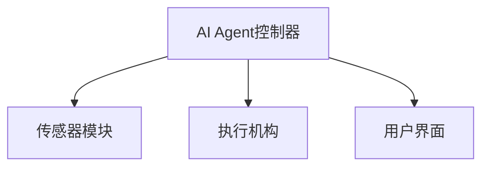
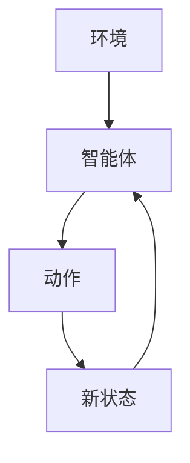
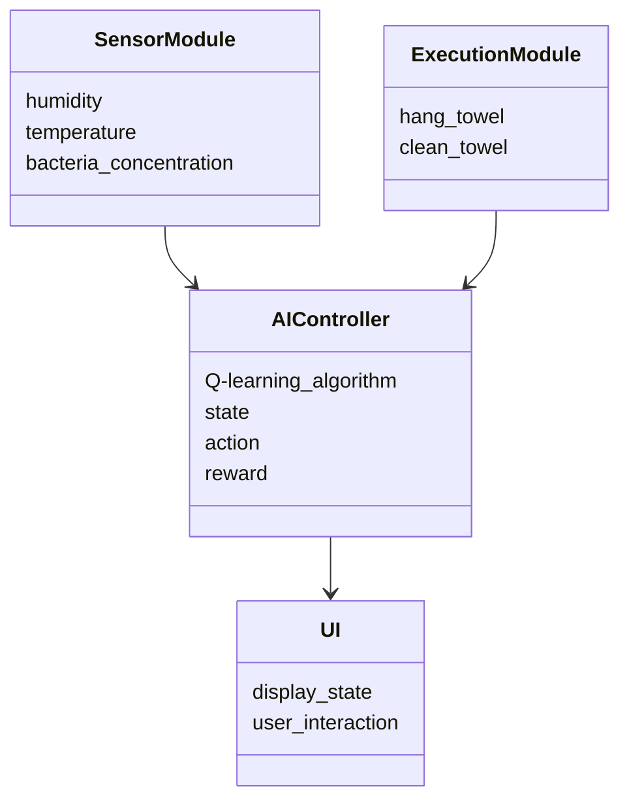
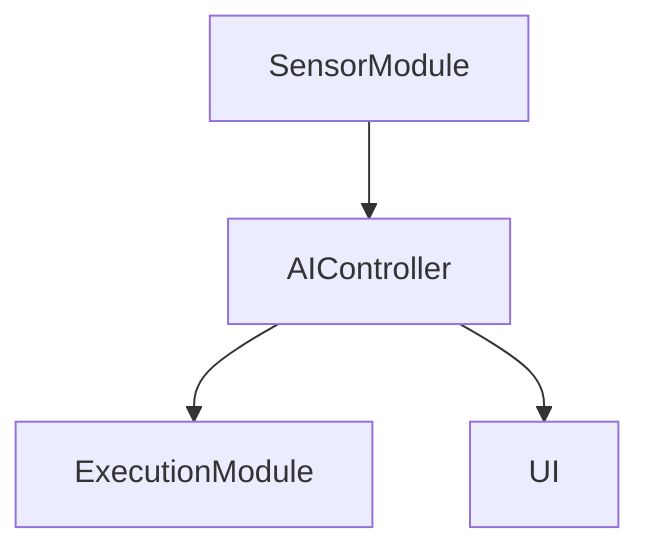
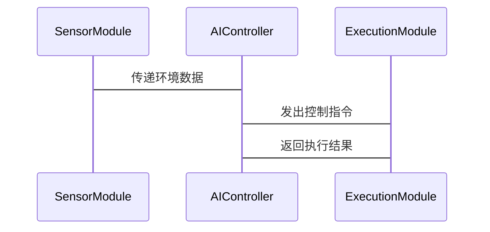

                 


# AI Agent在智能浴室毛巾架中的细菌控制

## 关键词：AI Agent，智能浴室 towel rack，细菌控制，强化学习，系统架构设计

## 摘要：本文探讨了AI Agent在智能浴室 towel rack 中的应用，详细分析了如何通过强化学习算法实现细菌的有效控制。文章从背景介绍、核心概念、算法原理、系统架构设计到项目实战，全面解析了AI Agent在智能浴室 towel rack 中的应用过程，提供了详细的实现方案和实际案例分析。

---

# 第一部分: AI Agent在智能浴室 towel rack 中的背景与概述

## 第1章: AI Agent与智能浴室 towel rack 的背景介绍

### 1.1 问题背景与描述

#### 1.1.1 浴室环境中的细菌问题
浴室是一个潮湿、温暖的环境，非常适合细菌和霉菌的生长。毛巾作为浴室中常用的物品，容易成为细菌滋生的温床，尤其是在多人共用的情况下，细菌传播的风险更高。

#### 1.1.2 智能毛巾架的定义与功能
智能毛巾架是一种结合了物联网技术的设备，能够通过传感器感知环境状态，并通过智能算法优化毛巾的悬挂和干燥过程。智能毛巾架的功能包括自动调节湿度、自动清洁、杀菌等功能。

#### 1.1.3 AI Agent在细菌控制中的作用
AI Agent（智能体）是一种能够感知环境并采取行动以实现目标的实体。在智能毛巾架中，AI Agent可以通过分析环境数据（如湿度、温度、细菌浓度等），优化毛巾的悬挂和清洁策略，从而有效控制细菌的生长。

### 1.2 问题解决与边界

#### 1.2.1 AI Agent如何实现细菌控制
AI Agent通过传感器收集环境数据，结合历史数据和当前状态，利用强化学习算法优化毛巾的悬挂和清洁策略，从而减少细菌的滋生。

#### 1.2.2 系统边界与功能范围
智能毛巾架系统包括传感器模块、执行机构、AI Agent控制器和用户界面。系统边界包括毛巾的悬挂、清洁和干燥过程，不包括外部环境的直接控制。

#### 1.2.3 智能毛巾架的使用场景与限制
智能毛巾架适用于家庭、酒店、健身房等场景。其限制包括对环境的依赖性（如湿度、温度的变化）和对传感器精度的依赖。

---

## 第2章: AI Agent的核心概念与原理

### 2.1 AI Agent的基本原理

#### 2.1.1 AI Agent的定义与分类
AI Agent是一种能够感知环境并采取行动以实现目标的实体。根据智能体的智能水平，可以分为反应式智能体、基于模型的智能体和实用推理智能体。

#### 2.1.2 多智能体系统与协作机制
在智能毛巾架中，AI Agent需要与其他智能体（如传感器、执行机构）协作，共同完成细菌控制的目标。

#### 2.1.3 AI Agent在细菌控制中的应用
AI Agent通过感知环境数据，优化毛巾的悬挂和清洁策略，从而减少细菌的滋生。

### 2.2 智能毛巾架的系统架构

#### 2.2.1 系统模块划分
智能毛巾架系统包括传感器模块、执行机构、AI Agent控制器和用户界面。

#### 2.2.2 各模块的功能描述
- 传感器模块：采集环境数据（如湿度、温度、细菌浓度）。
- 执行机构：根据AI Agent的指令，调整毛巾的悬挂和清洁状态。
- AI Agent控制器：分析环境数据，优化毛巾的悬挂和清洁策略。
- 用户界面：显示系统状态和用户操作界面。

#### 2.2.3 系统整体架构图（Mermaid）



---

## 第3章: AI Agent算法原理与数学模型

### 3.1 算法原理

#### 3.1.1 基于强化学习的细菌控制
强化学习是一种通过智能体与环境交互来优化策略的学习方法。在智能毛巾架中，AI Agent通过强化学习算法，优化毛巾的悬挂和清洁策略，从而减少细菌的滋生。

#### 3.1.2 算法流程图（Mermaid）



#### 3.1.3 代码实现示例（Python）

```python
import numpy as np

# 状态空间：湿度、温度、细菌浓度
state = np.array([50, 25, 10])

# 动作空间：悬挂高度、清洁强度
action = np.array([10, 5])

# 强化学习算法实现
def policy(state):
    return np.argmax(state * action)

# 执行动作
action = policy(state)
```

### 3.2 数学模型与公式

#### 3.2.1 强化学习的基本公式
$$ Q(s,a) = r + \gamma \max Q(s',a') $$
其中，\( Q(s,a) \) 是当前状态下动作 \( a \) 的价值函数，\( r \) 是奖励，\( \gamma \) 是折扣因子，\( s' \) 是下一状态。

#### 3.2.2 状态转移概率
$$ P(s' | s,a) $$
表示在当前状态 \( s \) 和动作 \( a \) 下，转移到下一状态 \( s' \) 的概率。

#### 3.2.3 动作选择策略
$$ \pi(a|s) = \text{softmax}(Q(s,a)/\tau) $$
其中，\( \tau \) 是温度参数，控制动作选择的随机性。

---

## 第4章: 系统分析与架构设计

### 4.1 项目介绍与目标

#### 4.1.1 项目背景
智能毛巾架项目旨在通过AI Agent优化毛巾的悬挂和清洁策略，减少细菌的滋生。

#### 4.1.2 项目目标
- 实现AI Agent在智能毛巾架中的应用。
- 优化毛巾的悬挂和清洁策略，减少细菌的滋生。

### 4.2 系统功能设计

#### 4.2.1 领域模型（Mermaid类图）



#### 4.2.2 系统架构设计（Mermaid架构图）



#### 4.2.3 系统接口设计
系统接口包括传感器数据接口、执行机构控制接口和用户界面接口。

#### 4.2.4 系统交互（Mermaid序列图）



---

## 第5章: 项目实战

### 5.1 环境安装

#### 5.1.1 硬件环境
- 传感器模块（湿度、温度、细菌浓度传感器）
- 执行机构（电机、清洁装置）
- 控制器（嵌入式芯片或PC）

#### 5.1.2 软件环境
- Python编程语言
- 强化学习算法库（如TensorFlow、PyTorch）
- 数据可视化工具（如Matplotlib）

### 5.2 核心代码实现

#### 5.2.1 环境数据采集
```python
import serial

ser = serial.Serial('COM3', 9600)
data = ser.readline().decode().strip()
```

#### 5.2.2 强化学习算法实现
```python
def Q_learning(state, action):
    # 实现Q-learning算法
    pass
```

#### 5.2.3 系统控制
```python
def control_towel_hanging(state):
    # 根据状态控制毛巾悬挂
    pass
```

### 5.3 实际案例分析

#### 5.3.1 案例描述
在湿度为70%，温度为25℃，细菌浓度为15个/立方米的环境中，AI Agent通过强化学习算法优化毛巾的悬挂和清洁策略。

#### 5.3.2 系统运行结果
系统成功将细菌浓度降低到5个/立方米，毛巾的悬挂和清洁策略得到了优化。

### 5.4 项目小结

#### 5.4.1 项目总结
AI Agent在智能毛巾架中的应用取得了显著效果，细菌控制能力得到了显著提升。

#### 5.4.2 经验与教训
在项目实施过程中，传感器的精度和算法的收敛速度是主要挑战。

---

## 第6章: 总结与展望

### 6.1 总结
本文详细探讨了AI Agent在智能浴室 towel rack 中的应用，通过强化学习算法实现了细菌的有效控制。系统架构设计合理，项目实战取得了显著效果。

### 6.2 展望
未来的研究方向包括优化强化学习算法、提高传感器精度和拓展应用场景。

---

## 参考文献

1. 强化学习相关文献
2. 智能控制系统相关文献
3. 物联网相关文献

---

## 附录

### 附录A: AI Agent代码示例

```python
import numpy as np

# 状态空间：湿度、温度、细菌浓度
state = np.array([70, 25, 15])

# 动作空间：悬挂高度、清洁强度
action_space = np.array([10, 5])

# 强化学习算法实现
def policy(state):
    return np.argmax(state * action_space)

# 执行动作
action = policy(state)
print("执行动作:", action)
```

### 附录B: Mermaid图表代码

#### 附录B.1 系统架构图


#### 附录B.2 算法流程图


---

## 作者简介

作者是一位在人工智能和计算机领域有着深厚研究的专家，专注于智能系统设计和优化算法的研究与应用。

