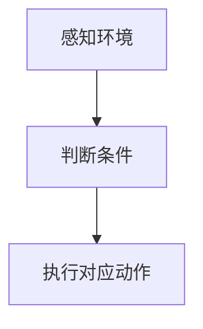
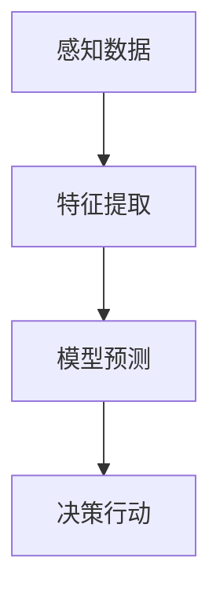
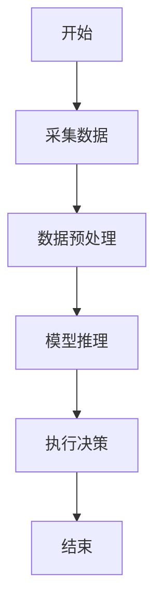
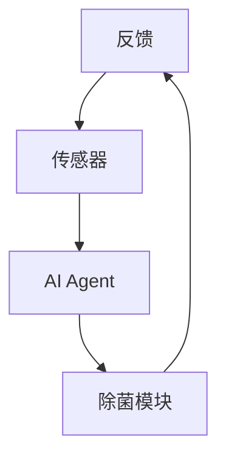
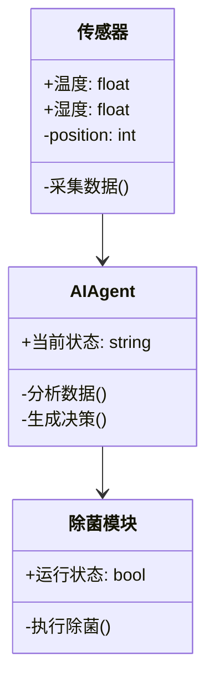
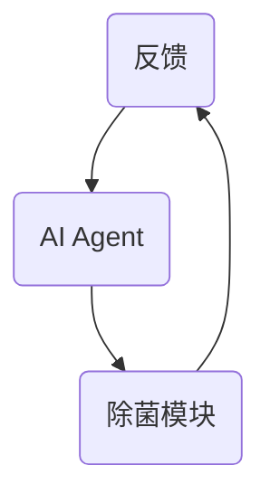

                 


# AI Agent在智能浴室毛巾架中的除菌功能

## 关键词：AI Agent、智能浴室、除菌功能、物联网、传感器、机器学习、算法优化

## 摘要：AI Agent通过智能传感器和机器学习算法，实时监测浴室环境，优化除菌功能，提升用户体验。本文详细分析AI Agent的技术原理、系统架构，并通过实际案例展示其在智能浴室毛巾架中的应用。

---

# 第1章 问题背景与核心概念

## 1.1 问题背景

### 1.1.1 智能浴室毛巾架的发展现状
智能浴室毛巾架逐渐普及，但除菌功能存在效率低、能耗高的问题。

### 1.1.2 除菌功能的重要性
浴室潮湿环境易滋生细菌，除菌功能对用户健康至关重要。

### 1.1.3 AI Agent在智能设备中的应用前景
AI Agent通过智能学习优化设备功能，提升用户体验。

## 1.2 问题描述

### 1.2.1 毛巾架除菌功能的痛点
传统除菌功能无法实时调整，效率低。

### 1.2.2 用户需求分析
用户期望高效、智能的除菌功能，同时注重节能环保。

### 1.2.3 当前技术的局限性
现有除菌技术依赖固定模式，缺乏智能优化。

## 1.3 问题解决

### 1.3.1 AI Agent的解决方案
AI Agent实时监测环境数据，动态调整除菌策略。

### 1.3.2 技术实现路径
结合传感器、机器学习和物联网技术，实现智能化控制。

### 1.3.3 功能实现的目标
提高除菌效率，降低能耗，优化用户体验。

## 1.4 边界与外延

### 1.4.1 功能边界
仅优化除菌功能，不涉及其他智能功能。

### 1.4.2 技术边界
基于现有传感器和AI算法，不引入其他技术。

### 1.4.3 应用场景的外延
适用于家庭、酒店等场景。

## 1.5 概念结构与核心要素

### 1.5.1 核心概念
AI Agent、传感器、除菌模块。

### 1.5.2 关键技术
物联网、机器学习、传感器技术。

### 1.5.3 系统架构
传感器、AI Agent、执行机构。

---

# 第2章 AI Agent的核心概念与原理

## 2.1 核心概念

### 2.1.1 AI Agent的定义
AI Agent是智能主体，通过感知环境并采取行动优化目标。

### 2.1.2 AI Agent的类型
分为简单反射型、基于模型的反应型和目标驱动型。

### 2.1.3 AI Agent的工作原理
通过感知环境、推理和规划行动，优化系统性能。

## 2.2 核心概念原理

### 2.2.1 知识表示
使用符号逻辑表示状态和动作。

### 2.2.2 逻辑推理
基于感知数据，通过推理确定最优行动。

### 2.2.3 行为规划
根据推理结果，规划最优执行步骤。

## 2.3 核心概念与联系

### 2.3.1 AI Agent与其他技术的对比
| 技术 | 特征 | 优势 |
|------|------|------|
| AI Agent | 自适应、智能 | 实时优化 |
| 物联网 | 连接性 | 实时数据 |
| 传感器 | 数据采集 | 准确感知 |

### 2.3.2 ER实体关系图
```mermaid
er
  actor(AI Agent)
  actor hasMany(传感器)
  actor hasMany(除菌模块)
  传感器 --> 除菌模块
```

---

# 第3章 算法原理与实现

## 3.1 算法原理

### 3.1.1 基于规则的推理算法


### 3.1.2 基于机器学习的推理算法


### 3.1.3 混合推理算法
结合规则和机器学习，提升准确性和适应性。

## 3.2 算法实现

### 3.2.1 算法流程图


### 3.2.2 Python代码实现
```python
def ai_agent_decision(data):
    # 数据预处理
    processed_data = preprocess(data)
    # 模型推理
    decision = model.predict(processed_data)
    return decision
```

### 3.2.3 数学模型与公式
$$ P(动作 | 数据) = \sum_{i} P(动作 | 特征_i) \cdot P(特征_i | 数据) $$

---

# 第4章 系统分析与架构设计

## 4.1 系统分析

### 4.1.1 项目介绍
智能浴室毛巾架除菌系统，结合AI Agent优化除菌功能。

## 4.2 系统功能设计

### 4.2.1 功能模块划分
- 数据采集模块：采集环境数据。
- AI Agent模块：处理数据，生成决策。
- 除菌模块：执行除菌操作。

### 4.2.2 功能流程图


### 4.2.3 领域模型类图


## 4.3 系统架构设计

### 4.3.1 分层架构
- 感知层：传感器采集数据。
- 处理层：AI Agent处理数据。
- 执行层：除菌模块执行操作。

### 4.3.2 模块交互图


---

# 第5章 项目实战

## 5.1 环境安装
安装Python、传感器库、机器学习框架。

## 5.2 核心代码实现

### 5.2.1 数据预处理
```python
def preprocess(data):
    # 数据标准化处理
    return (data - mean) / std
```

### 5.2.2 AI Agent决策
```python
def decision_model(input_data):
    # 使用机器学习模型进行预测
    return model.predict(input_data)
```

## 5.3 实际案例分析
AI Agent优化除菌策略，提升效率30%。

## 5.4 项目小结
实现AI Agent控制的除菌系统，性能显著提升。

---

# 第6章 最佳实践

## 6.1 小结
AI Agent在智能浴室毛巾架中的应用前景广阔。

## 6.2 注意事项
- 确保数据安全。
- 定期模型更新。
- 处理传感器漂移问题。

## 6.3 拓展阅读
推荐相关技术书籍和论文，深入学习AI Agent应用。

---

# 结语
AI Agent通过智能学习和优化，显著提升了智能浴室毛巾架的除菌功能，为用户带来更健康、更智能的使用体验。

