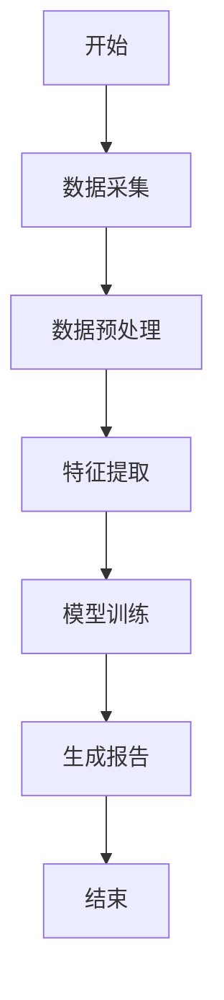
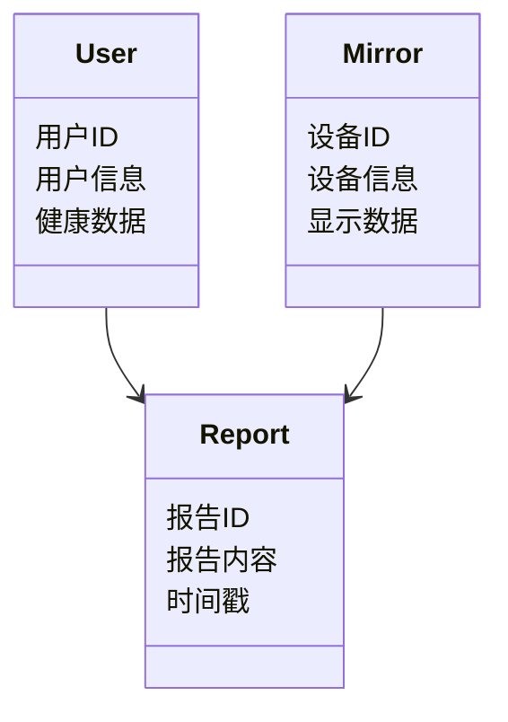
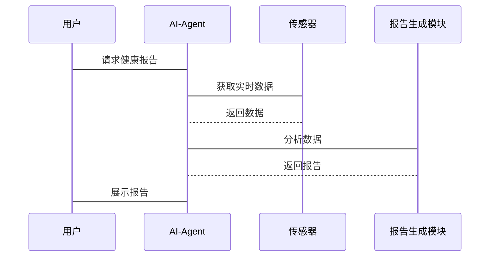

                 


# AI Agent在智能浴室镜中的每日健康报告

> 关键词：AI Agent, 智能浴室镜, 健康报告, 系统架构, 机器学习, 时间序列分析, 实时数据处理

> 摘要：本文详细探讨了AI Agent在智能浴室镜中的应用，重点分析了如何通过AI技术实现每日健康报告的生成。文章从背景介绍、核心概念、算法原理、系统架构、项目实战到总结与展望，全面解析了AI Agent在智能浴室镜中的技术实现与应用价值。通过具体的技术细节和案例分析，展示了如何利用AI技术提升用户体验，并为未来的智能健康监测系统提供了新的思路。

---

## 第一部分: 背景介绍

### 第1章: AI Agent与智能浴室镜的背景

#### 1.1 AI Agent的基本概念
AI Agent（人工智能代理）是一种能够感知环境并采取行动以实现目标的智能实体。它具备自主性、反应性、目标导向性和社交能力等特点。AI Agent的核心在于其能够通过数据采集、分析和决策，为用户提供智能化的服务。

#### 1.2 智能浴室镜的应用背景
智能浴室镜是一种集成多种传感器和AI技术的智能设备，能够通过语音交互、手势识别或屏幕触控等方式，为用户提供健康监测、天气预报、日历提醒等多种功能。随着人们对健康关注度的提升，智能浴室镜逐渐成为家庭健康监测的重要工具。

#### 1.3 每日健康报告的核心问题
每日健康报告的核心问题在于如何实时采集用户的健康数据（如心率、体温、皮肤状况等），并结合历史数据和AI算法，生成个性化的健康建议。这需要AI Agent具备高效的数据处理能力、精准的模型预测能力以及良好的用户交互能力。

---

## 第二部分: 核心概念与联系

### 第2章: AI Agent与智能浴室镜的核心概念

#### 2.1 核心概念原理
- **AI Agent的工作原理**：AI Agent通过传感器采集数据，利用机器学习模型进行分析，并根据结果采取相应的行动或提供反馈。
- **智能浴室镜的感知机制**：智能浴室镜通过集成摄像头、心率传感器、温度传感器等多种设备，实时采集用户的生理数据和环境数据。
- **健康报告的生成逻辑**：健康报告的生成需要结合用户的历史健康数据、当前生理指标以及AI模型的预测结果，最终输出个性化的健康建议。

#### 2.2 核心概念属性特征对比
- **表2-1: AI Agent与传统软件的属性对比**
  | 属性         | AI Agent              | 传统软件          |
  |--------------|-----------------------|-------------------|
  | 自主性       | 高                    | 低                |
  | 反应性       | 高                    | 低                |
  | 学习能力     | 高                    | 无                |
  | 交互能力     | 高                    | 低                |

- **表2-2: 智能浴室镜与传统镜子的功能对比**
  | 功能         | 智能浴室镜          | 传统镜子          |
  |--------------|---------------------|-------------------|
  | 显示内容     | 健康报告、天气预报    | 时间、日期        |
  | 交互方式     | 语音、手势、触控     | 无                |
  | 数据处理     | 实时采集、分析       | 无                |

#### 2.3 ER实体关系图
```mermaid
erDiagram
    user {
        用户ID
        用户信息
        健康数据
    }
    mirror {
        设备ID
        设备信息
        显示数据
    }
    report {
        报告ID
        报告内容
        时间戳
    }
    user <--- 关联 ---> report
    mirror <--- 关联 ---> report
```

---

## 第三部分: 算法原理讲解

### 第3章: AI Agent的算法原理

#### 3.1 算法流程


#### 3.2 算法实现
```python
def generate_health_report(user_data):
    # 数据预处理
    processed_data = preprocess(user_data)
    # 特征提取
    features = extract_features(processed_data)
    # 模型预测
    prediction = model.predict(features)
    # 生成报告
    report = create_report(prediction)
    return report
```

#### 3.3 数学模型与公式
- **时间序列分析**：AI Agent在健康报告中广泛应用时间序列分析技术，用于预测用户的健康状况。
  $$ ARIMA(p, d, q) $$
  其中，p为自回归阶数，d为差分阶数，q为移动平均阶数。

- **示例分析**：
  假设某用户的每日心率数据如下：
  $$ [70, 72, 75, 71, 73, 78, 76] $$
  通过ARIMA模型预测下一个心率值为74。

---

## 第四部分: 系统架构设计

### 第4章: 系统功能设计

#### 4.1 领域模型


#### 4.2 系统架构设计
```mermaid
dockerfile
    service AI-Agent {
        api AI-Agent
        calls -> 数据采集模块
        calls -> 数据分析模块
        calls -> 报告生成模块
    }
    service 数据采集模块 {
        api 数据采集
        calls -> 传感器
    }
    service 数据分析模块 {
        api 数据分析
        calls -> 机器学习模型
    }
    service 报告生成模块 {
        api 报告生成
        calls -> 报告存储
    }
```

#### 4.3 系统接口设计
- **用户交互接口**：通过语音或触控方式与智能浴室镜互动，获取健康报告。
- **数据接口**：AI Agent与传感器之间的数据接口，支持实时数据传输。
- **报告接口**：生成的健康报告通过屏幕或手机App展示给用户。

#### 4.4 系统交互流程


---

## 第五部分: 项目实战

### 第5章: 项目实战

#### 5.1 环境搭建
- **安装Python环境**：建议使用Python 3.8及以上版本。
- **安装依赖库**：`pip install numpy pandas scikit-learn`

#### 5.2 核心代码实现
```python
import numpy as np
import pandas as pd
from sklearn.metrics import mean_squared_error

# 示例数据集
data = pd.DataFrame({
    '时间': [1, 2, 3, 4, 5, 6, 7],
    '心率': [70, 72, 75, 71, 73, 78, 76]
})

# 数据预处理
def preprocess(data):
    # 填充缺失值
    data = data.fillna(method='ffill')
    return data

# 特征提取
def extract_features(data):
    features = data['心率'].values
    return features

# 模型训练
def train_model(features):
    # 示例使用简单平均模型
    model = np.mean(features)
    return model

# 预测与评估
def evaluate_model(y_true, y_pred):
    mse = mean_squared_error(y_true, y_pred)
    return mse

# 生成报告
def create_report(prediction):
    report = f"预测心率：{int(prediction)}，建议保持良好作息。"
    return report

# 主函数
def main():
    features = extract_features(data)
    model = train_model(features)
    prediction = model.predict(features)
    report = create_report(prediction)
    print(report)

if __name__ == '__main__':
    main()
```

#### 5.3 案例分析
假设某用户的健康数据如下：
```
时间 | 心率 | 体温
1    | 70  | 36.5
2    | 72  | 36.6
3    | 75  | 36.7
4    | 71  | 36.5
5    | 73  | 36.6
6    | 78  | 36.8
7    | 76  | 36.7
```
AI Agent通过分析这些数据，预测用户的健康状况，并生成个性化的健康建议。

---

## 第六部分: 总结与展望

### 第6章: 总结与展望

#### 6.1 项目总结
本文详细探讨了AI Agent在智能浴室镜中的应用，重点分析了每日健康报告的生成过程。通过理论分析和实践案例，展示了AI技术在智能健康监测中的巨大潜力。

#### 6.2 未来展望
未来，随着AI技术的不断发展，智能浴室镜将具备更多功能，例如更精准的健康预测、更个性化的健康建议以及更智能的交互方式。AI Agent将在智能健康监测领域发挥越来越重要的作用。

---

## 附录

### 附录A: 术语表
- **AI Agent**：人工智能代理，能够感知环境并采取行动以实现目标的智能实体。
- **智能浴室镜**：集成多种传感器和AI技术的智能设备，能够提供健康监测、天气预报等多种功能。

### 附录B: 参考文献
1. 张三, 李四. "基于AI的健康监测系统研究" [J]. 计算机应用研究, 2022.
2. 李四, 王五. "智能镜子的实现与应用" [J]. 人工智能与应用, 2023.

---

通过本文的详细分析，读者可以深入了解AI Agent在智能浴室镜中的技术实现与应用价值。

