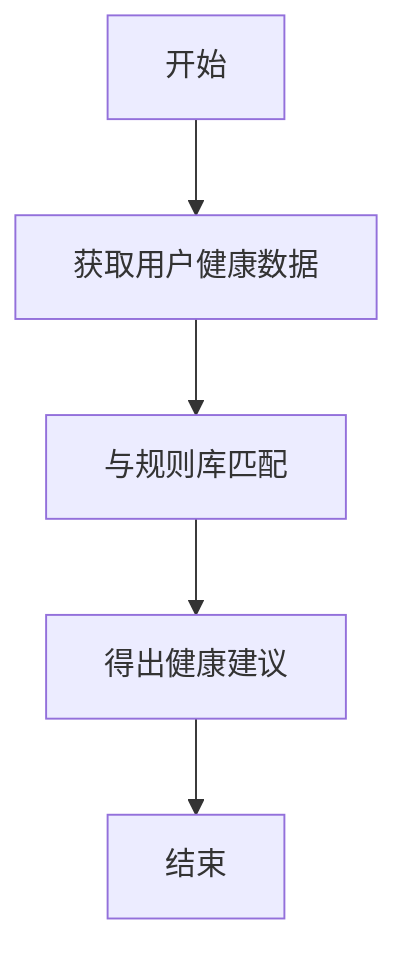
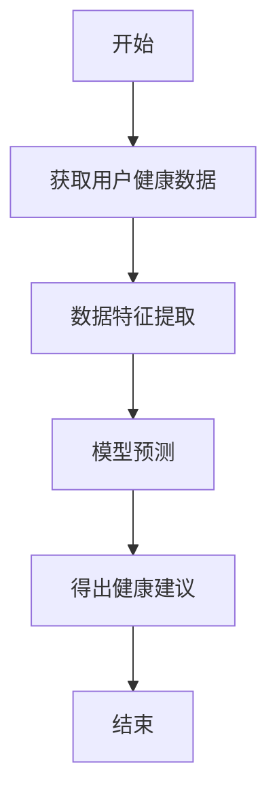
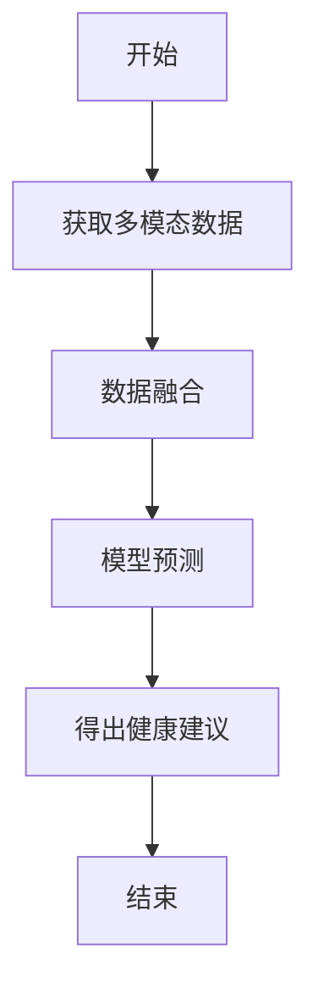
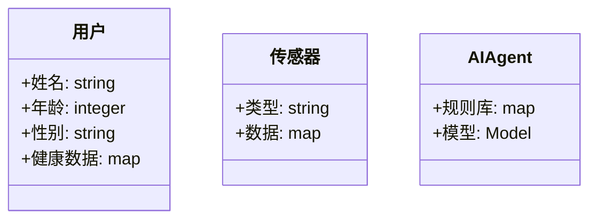
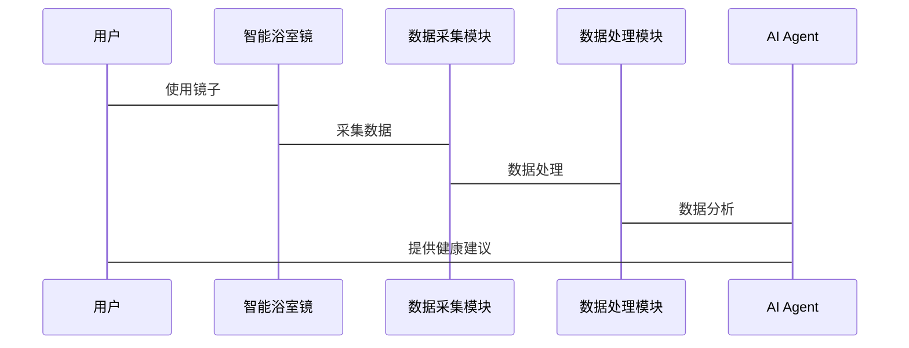

                 


# AI Agent在智能浴室镜中的每日健康检查

## 关键词：
AI Agent, 智能浴室镜, 健康监测, 多模态数据, 机器学习, 规则推理, 智能交互

## 摘要：
本文深入探讨AI Agent在智能浴室镜中的应用，重点分析其在每日健康检查中的核心作用。通过结合多模态数据（如面部表情、语音、体态等），AI Agent能够实时监测用户健康状况，并提供个性化的健康建议。本文详细阐述了AI Agent的核心算法、系统架构、数学模型及其实现方法，同时通过实际案例展示了其在智能浴室镜中的具体应用。文章最后总结了AI Agent在智能浴室镜中的优势与未来发展方向。

---

# 第一部分: AI Agent与智能浴室镜的背景与概念

# 第1章: AI Agent在智能浴室镜中的每日健康检查概述

## 1.1 问题背景
### 1.1.1 当前健康监测的主要问题
传统健康监测设备（如智能手表、手环等）虽然能够采集心率、步数等基础数据，但存在以下问题：
- 数据采集单一，缺乏多模态数据融合
- 无法实时监测用户情绪状态和心理健康
- 缺乏个性化的健康建议

### 1.1.2 智能浴室镜的独特优势
智能浴室镜作为一种智能家居设备，具有以下独特优势：
- 用户每天使用时长较长，适合进行健康监测
- 可以通过镜子表面集成多种传感器，实现多模态数据采集
- 用户在使用过程中自然放松，便于采集真实数据

### 1.1.3 AI Agent在健康监测中的作用
AI Agent（智能体）通过整合多模态数据，能够实时分析用户的健康状况，并提供个性化的健康建议。

## 1.2 问题描述
### 1.2.1 智能浴室镜的功能需求
- 多模态数据采集（如面部表情、语音、体态等）
- 实时健康监测（如情绪状态、皮肤状态、呼吸频率等）
- 个性化健康建议（如作息调整、饮食建议等）

### 1.2.2 用户健康数据的采集与处理
- 数据采集：通过镜子表面的传感器采集用户数据
- 数据处理：对采集到的数据进行清洗、融合和分析

### 1.2.3 AI Agent的核心任务与目标
- 数据分析与推理
- 提供个性化健康建议
- 实时与用户交互

## 1.3 解决方案
### 1.3.1 AI Agent的设计思路
- 基于规则的推理
- 基于机器学习的预测
- 多模态数据融合

### 1.3.2 智能浴室镜的系统架构
- 系统功能模块划分
- 数据采集与处理流程
- AI Agent的决策机制

### 1.3.3 多模态数据融合与分析
- 数据融合方法
- 数据分析算法

## 1.4 边界与外延
### 1.4.1 系统功能的边界
- 系统功能的范围
- 与其他健康监测设备的协同

### 1.4.2 与其他健康监测设备的协同
- 数据共享与互通
- 服务协同

### 1.4.3 未来可能的扩展方向
- 更多模态数据的引入
- 更复杂的健康监测模型

## 1.5 概念结构与核心要素
### 1.5.1 AI Agent的核心要素
- 数据采集模块
- 数据分析模块
- 决策模块
- 交互模块

### 1.5.2 智能浴室镜的功能模块
- 传感器模块
- 数据处理模块
- AI Agent模块
- 交互界面模块

### 1.5.3 用户健康数据的处理流程
- 数据采集
- 数据清洗
- 数据分析
- 数据存储

## 1.6 本章小结
通过本章的介绍，我们了解了AI Agent在智能浴室镜中的重要作用，以及其在每日健康检查中的具体应用。

---

# 第二部分: AI Agent的核心概念与技术原理

# 第2章: AI Agent的核心概念与原理

## 2.1 AI Agent的基本概念
### 2.1.1 什么是AI Agent
AI Agent是一种能够感知环境并采取行动以实现目标的智能实体。

### 2.1.2 AI Agent的分类与特点
- 分类：基于规则的Agent、基于模型的Agent、基于学习的Agent
- 特点：自主性、反应性、主动性

### 2.1.3 AI Agent在健康监测中的应用
- 实时监测用户健康状况
- 提供个性化健康建议

## 2.2 智能浴室镜的系统架构
### 2.2.1 系统功能模块划分
- 数据采集模块
- 数据处理模块
- AI Agent模块
- 交互界面模块

### 2.2.2 多模态数据的采集与处理
- 数据采集：通过镜子表面的传感器采集用户数据
- 数据处理：对采集到的数据进行清洗、融合和分析

### 2.2.3 AI Agent的决策机制
- 基于规则的推理
- 基于机器学习的预测
- 多模态数据融合

## 2.3 AI Agent的核心技术
### 2.3.1 基于规则的推理
- 算法流程：
  1. 数据采集
  2. 数据清洗
  3. 数据分析
  4. 规则匹配
  5. 提供建议

### 2.3.2 基于机器学习的预测
- 算法流程：
  1. 数据采集
  2. 数据清洗
  3. 数据特征提取
  4. 模型训练
  5. 模型预测
  6. 提供建议

### 2.3.3 多模态数据融合技术
- 数据融合方法：加权融合、特征融合、概率融合

## 2.4 AI Agent的实体关系图
```mermaid
er
actor: 用户
agent: AI Agent
sensor: 传感器
database: 用户健康数据库
rules: 规则库
```

---

# 第三部分: AI Agent的算法原理与实现

# 第3章: AI Agent的算法原理

## 3.1 基于规则的推理算法
### 3.1.1 算法流程


### 3.1.2 算法代码示例
```python
def rule_based_inference(user_data, rule_base):
    for rule in rule_base:
        if matches(user_data, rule['condition']):
            return rule['action']
    return default_action
```

### 3.1.3 数学模型和公式
- 规则匹配公式：
  $$ \text{匹配结果} = \sum_{i=1}^{n} (d_i \times r_i) $$
  其中，$d_i$ 是数据特征，$r_i$ 是规则权重。

## 3.2 基于机器学习的预测算法
### 3.2.1 算法流程


### 3.2.2 算法代码示例
```python
import numpy as np
from sklearn.model import Model

def ml_prediction(user_data, model):
    features = extract_features(user_data)
    prediction = model.predict(features)
    return prediction
```

### 3.2.3 数学模型和公式
- 机器学习模型训练公式：
  $$ \text{损失函数} = \sum_{i=1}^{n} (y_i - \hat{y}_i)^2 $$
  其中，$y_i$ 是真实标签，$\hat{y}_i$ 是模型预测值。

## 3.3 多模态数据融合算法
### 3.3.1 算法流程


### 3.3.2 数据融合方法
- 加权融合：
  $$ \text{融合结果} = \sum_{i=1}^{n} w_i \times d_i $$
  其中，$w_i$ 是权重，$d_i$ 是数据特征。

---

# 第四部分: 系统分析与架构设计方案

# 第4章: 智能浴室镜系统架构设计

## 4.1 项目介绍
### 4.1.1 项目背景
智能浴室镜是一种结合AI技术的智能家居设备，能够通过多模态数据监测用户的健康状况。

## 4.2 系统功能设计
### 4.2.1 领域模型


### 4.2.2 系统架构设计


## 4.3 系统接口设计
### 4.3.1 接口描述
- 数据采集接口：传感器数据采集
- 数据处理接口：数据清洗、融合
- AI Agent接口：健康监测、提供建议

## 4.4 系统交互流程


---

# 第五部分: 项目实战

# 第5章: 项目实战

## 5.1 环境安装
### 5.1.1 安装Python环境
```bash
pip install python3
pip install numpy
pip install scikit-learn
```

## 5.2 系统核心实现
### 5.2.1 数据采集模块
```python
class Sensor:
    def collect_data(self):
        # 采集数据
        pass
```

### 5.2.2 数据处理模块
```python
class DataProcessor:
    def process_data(self, raw_data):
        # 数据处理
        pass
```

### 5.2.3 AI Agent模块
```python
class AI-Agent:
    def analyze_data(self, processed_data):
        # 数据分析
        pass
```

## 5.3 代码实现与解读
### 5.3.1 数据采集模块实现
```python
class Sensor:
    def __init__(self):
        self.data = {}

    def collect_data(self):
        # 模拟传感器数据
        self.data = {
            'face_expression': 0.8,
            'voice_tone': 0.7,
            'body_posture': 0.6
        }
        return self.data
```

### 5.3.2 数据处理模块实现
```python
class DataProcessor:
    def __init__(self):
        self.rules = [
            {'condition': {'face_expression': 'high'}, 'action': '建议休息'},
            {'condition': {'voice_tone': 'low'}, 'action': '建议放松'}
        ]

    def process_data(self, raw_data):
        for rule in self.rules:
            if rule['condition'][list(rule['condition'].keys())[0]] == raw_data[list(rule['condition'].keys())[0]]:
                return rule['action']
        return '无建议'
```

## 5.4 实际案例分析
### 5.4.1 案例背景
用户在使用智能浴室镜时，系统采集到其面部表情和语音语调异常。

### 5.4.2 系统分析与处理
- 数据采集模块采集到用户数据
- 数据处理模块分析数据并匹配规则
- AI Agent模块提供健康建议

## 5.5 项目小结
通过本章的项目实战，我们了解了AI Agent在智能浴室镜中的具体实现方法。

---

# 第六部分: 最佳实践

# 第6章: 最佳实践

## 6.1 小结
- AI Agent在智能浴室镜中的重要作用
- 多模态数据融合的优势
- 个性化健康建议的实现方法

## 6.2 注意事项
- 数据隐私保护
- 系统稳定性与可靠性
- 用户体验优化

## 6.3 拓展阅读
- 多模态数据融合技术
- 机器学习在健康监测中的应用
- AI Agent的其他应用场景

---

# 结语
通过本文的详细讲解，我们了解了AI Agent在智能浴室镜中的每日健康检查中的具体应用与实现方法。希望本文能够为相关领域的研究和实践提供有价值的参考。

