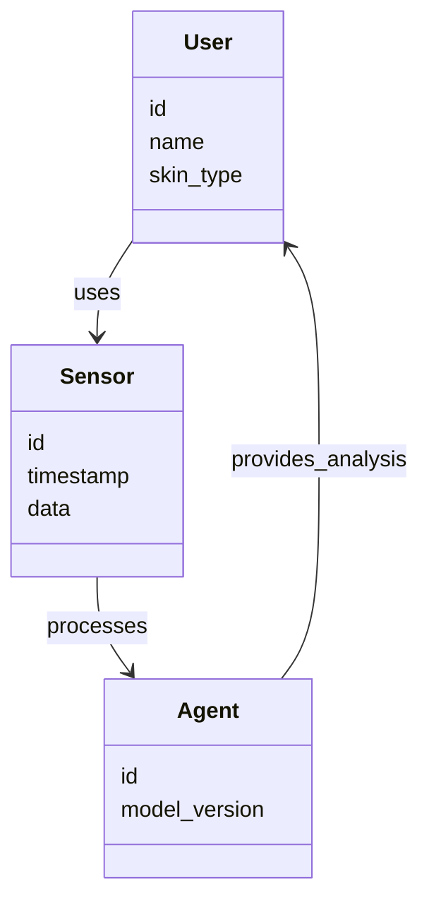
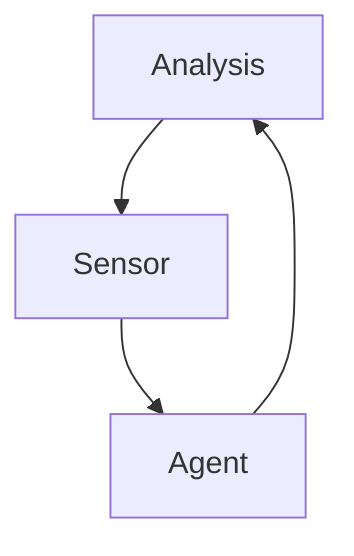
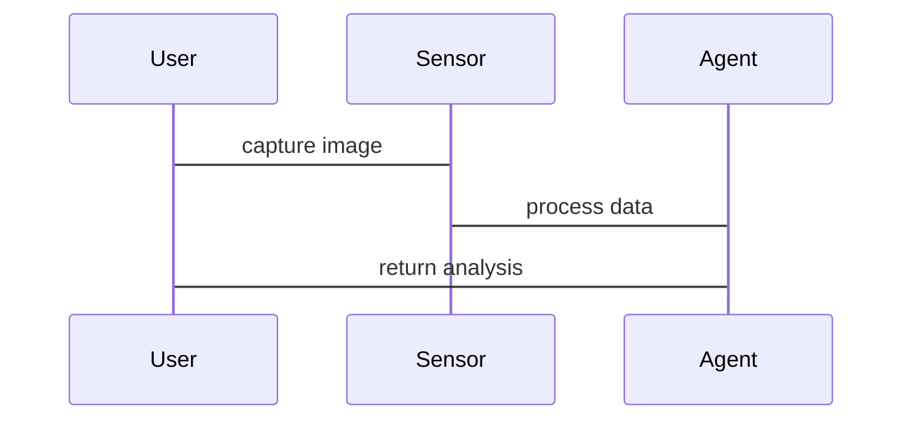

                 


# AI Agent在智能浴室镜中的皮肤状态分析

> 关键词：AI Agent, 智能浴室镜, 皮肤状态分析, 图像处理, 机器学习, 健康监测

> 摘要：本文探讨AI Agent在智能浴室镜中的应用，重点分析其在皮肤状态监测中的作用。通过背景介绍、核心概念、算法原理、系统架构和项目实战等部分，全面解析AI Agent如何助力智能浴室镜实现高效、精准的皮肤健康监测。

---

# 第1章: 问题背景与需求分析

## 1.1 问题背景

### 1.1.1 智能浴室镜的发展现状
智能浴室镜已从传统的装饰品发展为集成多种功能的智能设备。当前市场上的智能浴室镜不仅具备基础的照明和镜子功能，还支持天气预报、日历查看、音乐播放等功能。然而，大多数产品仍局限于简单的信息展示，缺乏深度的健康监测功能。

### 1.1.2 皮肤健康监测的重要性
皮肤是人体最大的器官，其健康状况直接反映一个人的身体健康。皮肤问题如痘痘、过敏、色素沉着等不仅影响外观，还可能预示潜在的健康问题。通过智能镜子实时监测皮肤状态，用户可以及时调整生活习惯和健康方案。

### 1.1.3 AI技术在健康监测中的应用趋势
AI技术在医疗健康领域的应用日益广泛。通过AI算法，智能设备能够实时分析用户的身体数据，提供个性化的健康建议。皮肤健康监测作为AI技术的重要应用场景，正在推动智能镜子向更智能化、个性化的方向发展。

## 1.2 问题描述

### 1.2.1 智能浴室镜的皮肤分析功能需求
用户对智能浴室镜的期望已从简单的信息展示转向健康监测。皮肤分析功能的需求主要集中在实时监测、数据记录和健康建议生成等方面。

### 1.2.2 用户对皮肤健康监测的实际需求
用户希望智能镜子能够提供个性化的皮肤健康建议，如防晒提醒、护肤推荐等。此外，用户还期待设备能够长期记录皮肤数据，帮助他们追踪皮肤健康的变化趋势。

### 1.2.3 当前技术的局限性与改进空间
目前的智能镜子大多依赖简单的图像识别技术，缺乏深度的分析能力。AI技术的应用尚不成熟，算法精度和数据处理能力有待提升。此外，设备的交互体验也需要进一步优化。

## 1.3 问题解决思路

### 1.3.1 引入AI Agent的核心原因
AI Agent（人工智能代理）具备自主决策和学习能力，能够实时分析用户数据并提供个性化建议。引入AI Agent可以显著提升智能镜子的皮肤分析能力，满足用户的深度需求。

### 1.3.2 AI Agent在皮肤状态分析中的作用
AI Agent通过整合用户数据，利用机器学习模型分析皮肤健康状况，提供实时反馈和个性化建议。同时，AI Agent还能根据用户的行为和环境因素，动态调整分析策略，提升监测精度。

### 1.3.3 解决方案的技术路线
解决方案的技术路线包括：数据采集、特征提取、模型训练、系统集成和用户界面设计。AI Agent负责数据处理和决策，用户通过镜子界面与系统交互。

---

# 第2章: 核心概念与系统架构

## 2.1 核心概念原理

### 2.1.1 AI Agent的基本原理
AI Agent通过感知环境、处理数据和执行任务实现智能化。在智能镜子中，AI Agent负责接收用户的皮肤图像，分析健康状况，并提供反馈。

### 2.1.2 皮肤状态分析的数学模型
皮肤状态分析涉及多种特征，如颜色、纹理、形状等。通过机器学习模型，AI Agent可以识别皮肤问题并分类。

### 2.1.3 智能浴室镜的交互机制
智能镜子通过摄像头和显示屏与用户交互。AI Agent负责处理图像数据，生成分析结果，并通过镜子显示反馈信息。

## 2.2 核心概念对比分析

### 2.2.1 AI Agent与传统算法的对比
AI Agent具备自主学习和适应能力，能够处理复杂的数据。传统算法依赖预设规则，难以应对多样化的输入。

### 2.2.2 不同皮肤分析方法的优缺点对比
| 方法 | 优点 | 缺点 |
|------|------|------|
| 基于颜色的空间分析 | 简单易实现 | 易受光照影响 |
| 基于纹理的分析 | 细腻特征提取 | 算法复杂度高 |
| 机器学习分类 | 高精度 | 数据需求量大 |

### 2.2.3 系统架构的可扩展性分析
模块化设计使系统具备良好的扩展性。AI Agent可以根据需求升级模型，新增功能模块不影响现有系统。

## 2.3 ER实体关系图

```mermaid
erDiagram
    user {
        id
        name
        skin_type
        health_status
    }
    sensor {
        id
        timestamp
        data
    }
    agent {
        id
        model_version
        status
    }
    user --> sensor : uses
    sensor --> agent : processes
    agent --> user : provides_analysis
```

---

# 第3章: 算法原理与数学模型

## 3.1 图像处理流程

### 3.1.1 图像采集与预处理
使用摄像头采集皮肤图像，预处理包括去噪、增强对比度等。

### 3.1.2 皮肤区域的定位与分割
通过阈值分割或边缘检测，从图像中提取皮肤区域。

### 3.1.3 图像增强技术
应用直方图均衡化和对比度拉伸等技术，提升图像质量。

## 3.2 特征提取方法

### 3.2.1 基于颜色空间的
颜色空间转换公式：
$$I = R, Q = G, U = B$$

### 3.2.2 基于纹理的
纹理分析使用Gabor滤波器，提取皮肤的纹理特征。

### 3.2.3 基于形状的
通过形态学操作，识别皮肤区域的形状特征。

---

# 第4章: 系统分析与架构设计

## 4.1 问题场景介绍

### 4.1.1 系统目标
实现AI Agent驱动的皮肤状态监测，提供实时反馈和个性化建议。

### 4.1.2 问题场景描述
用户在镜子前站立，系统通过摄像头采集图像，分析皮肤健康状况，显示结果并提供建议。

## 4.2 系统功能设计

### 4.2.1 领域模型类图


### 4.2.2 系统架构图


### 4.2.3 接口设计
系统提供API接口，支持数据获取、分析请求和结果反馈。

### 4.2.4 交互序列图


---

# 第5章: 项目实战

## 5.1 环境安装

### 5.1.1 开发工具安装
安装Python、TensorFlow、OpenCV等工具。

### 5.1.2 项目依赖
安装Pillow、numpy、scikit-learn等库。

## 5.2 核心实现

### 5.2.1 图像处理代码
```python
import cv2
from PIL import Image

def preprocess_image(image_path):
    img = cv2.imread(image_path)
    gray = cv2.cvtColor(img, cv2.COLOR_BGR2GRAY)
    return gray
```

### 5.2.2 特征提取与分类
```python
from sklearn.svm import SVC
import numpy as np

def extract_features(image):
    # 提取颜色特征
    features = []
    for pixel in image.flatten():
        features.append(pixel)
    return np.array(features)

model = SVC()
model.fit(X_train, y_train)
```

## 5.3 实际案例分析

### 5.3.1 数据分析
分析用户的皮肤数据，识别潜在问题。

### 5.3.2 结果解读
根据模型输出，提供个性化的护肤建议。

## 5.4 项目小结
项目实现了AI Agent驱动的皮肤分析功能，验证了技术可行性。

---

# 第6章: 最佳实践

## 6.1 小结
AI Agent在智能镜子中的应用前景广阔，能够显著提升用户体验。

## 6.2 注意事项
确保数据隐私，优化算法性能。

## 6.3 拓展阅读
推荐阅读相关领域的技术文献，深入了解AI在健康监测中的应用。

---

# 结语
通过本文的详细讲解，读者可以全面了解AI Agent在智能浴室镜中的应用。从背景分析到系统设计，再到项目实战，每一步都进行了深入探讨。希望本文能够为相关领域的研究和实践提供有价值的参考。

