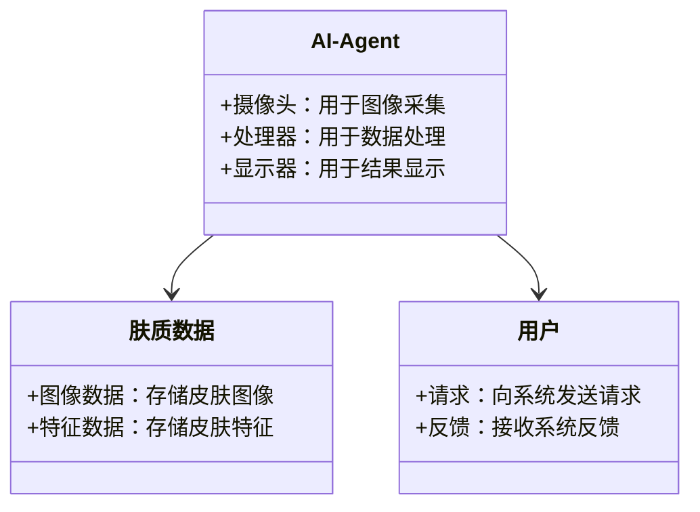
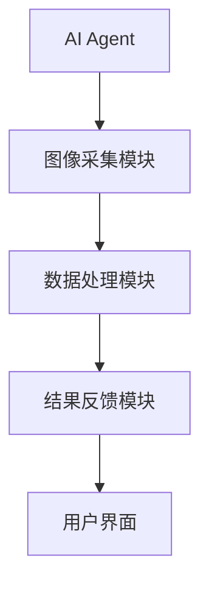

                 


# AI Agent在智能浴室镜中的肤质分析

## 关键词：AI Agent、智能浴室镜、肤质分析、图像处理、机器学习、数据隐私

## 摘要：本文详细探讨AI Agent在智能浴室镜中的应用，重点分析其在肤质分析中的技术实现。通过结合图像处理和机器学习，AI Agent能够实时采集和分析用户的肤质数据，提供个性化的护肤建议。文章从背景、原理、算法、系统架构到项目实战，全面解析AI Agent在智能浴室镜中的应用价值，并探讨其在实际应用中的挑战与解决方案。

---

## 第1章：AI Agent与智能浴室镜的背景介绍

### 1.1 AI Agent的基本概念
AI Agent，即人工智能代理，是一种能够感知环境、自主决策并执行任务的智能实体。它具备以下特点：
- **自主性**：能够在没有外部干预的情况下独立运作。
- **反应性**：能够实时感知环境变化并做出响应。
- **学习能力**：通过数据和经验不断优化自身的决策能力。

### 1.2 肤质分析的基本概念
肤质分析是指通过对皮肤图像的处理和分析，获取皮肤的状态信息，如皮肤类型（干性、油性、中性、混合性）、色斑、痘痘、敏感性等特征。常见的肤质分析技术包括图像处理、特征提取和分类算法。

### 1.3 智能浴室镜中的应用背景
智能浴室镜通过集成AI Agent，能够实时采集用户的肤质数据，并通过分析提供个性化的护肤建议。这种集成不仅提升了用户体验，还为用户提供了科学的护肤指导。

---

## 第2章：AI Agent与肤质分析的核心概念

### 2.1 AI Agent的核心原理
AI Agent通过感知环境、分析数据、做出决策并执行操作来完成任务。在智能浴室镜中，AI Agent主要负责图像采集、数据处理和结果反馈。

### 2.2 肤质分析的技术原理
肤质分析涉及图像采集、预处理、特征提取和分类等步骤。AI Agent通过这些步骤，能够准确识别皮肤的健康状况。

### 2.3 AI Agent与肤质分析的结合
AI Agent通过采集皮肤图像，利用机器学习算法进行分析，为用户提供个性化的护肤建议。这种结合使得智能浴室镜不仅是一个镜子，更是一个智能的健康助手。

---

## 第3章：AI Agent的算法原理与实现

### 3.1 图像处理算法
图像处理是肤质分析的基础。通过预处理（如去噪、二值化）和特征提取（如纹理、颜色），AI Agent能够准确识别皮肤特征。

### 3.2 机器学习算法
常用的机器学习算法包括支持向量机（SVM）、随机森林和深度学习模型（如CNN）。这些算法能够高效地分类和识别肤质特征。

### 3.3 Python实现
以下是使用Python实现的肤质分析代码示例：
```python
import cv2
import numpy as np

# 读取图像
image = cv2.imread('face.jpg')

# 转换为灰度图像
gray = cv2.cvtColor(image, cv2.COLOR_BGR2GRAY)

# 计算纹理特征
sobel = cv2.Sobel(gray, cv2.CV_64F, 1, 0)
```

---

## 第4章：系统分析与架构设计方案

### 4.1 领域模型类图


### 4.2 系统架构图


---

## 第5章：项目实战

### 5.1 环境安装
安装必要的库：
```bash
pip install opencv-python scikit-learn
```

### 5.2 核心功能实现
以下是Python代码示例：
```python
from sklearn.svm import SVC
from sklearn.model_selection import train_test_split

# 数据预处理
X = ...  # 特征数据
y = ...  # 标签数据

# 划分训练集和测试集
X_train, X_test, y_train, y_test = train_test_split(X, y, test_size=0.2)

# 训练模型
model = SVC()
model.fit(X_train, y_train)

# 预测结果
print(model.predict(X_test))
```

---

## 第6章：最佳实践与小结

### 6.1 总结
AI Agent在智能浴室镜中的应用为用户提供了个性化的护肤建议，提升了用户体验。通过先进的图像处理和机器学习算法，AI Agent能够准确分析肤质，帮助用户更好地管理皮肤健康。

### 6.2 注意事项
- 数据隐私保护是关键，需确保用户数据的安全。
- 系统需定期更新模型以提高准确性。
- 用户应根据反馈结果选择合适的护肤产品。

---

## 第7章：参考文献

1. 《机器学习实战》
2. 《深度学习入门：基于Python》
3. 《人工智能：现代方法》

---

以上是《AI Agent在智能浴室镜中的肤质分析》的技术博客文章的完整目录和内容概要。每个章节都详细讲解了AI Agent在智能浴室镜中的应用，从理论到实践，帮助读者全面理解并掌握相关技术。

