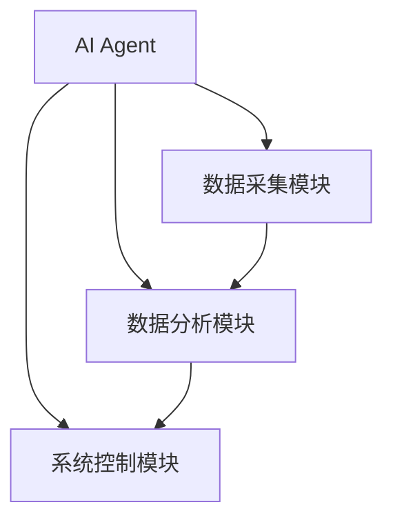
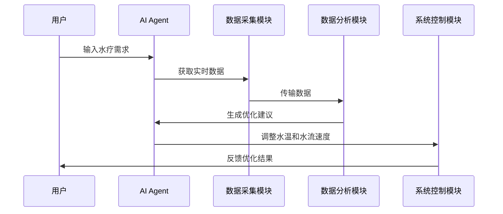

                 


# AI Agent在智能浴缸中的水疗效果优化

> 关键词：AI Agent，智能浴缸，水疗效果，优化算法，数学模型

> 摘要：本文详细探讨了AI Agent在智能浴缸水疗效果优化中的应用。通过分析AI Agent的基本原理，结合优化算法和数学模型，提出了一种基于遗传算法和模拟退火的双管齐下优化策略，旨在通过传感器数据采集与分析，实现水温、水流速度和压力的智能调节，最终达到最优水疗效果。本文还通过实际案例分析，展示了AI Agent在水疗优化中的实际应用价值。

---

# 第一部分: AI Agent与智能浴缸水疗效果优化背景概述

## 第1章: AI Agent与水疗效果优化的基本概念

### 1.1 AI Agent的基本概念

#### 1.1.1 AI Agent的定义与特点

AI Agent（人工智能代理）是指能够感知环境并采取行动以实现目标的智能实体。其核心特点包括：

- **自主性**：能够在无外部干预的情况下独立运行。
- **反应性**：能够根据环境反馈实时调整行为。
- **目标导向性**：始终围绕预设目标进行决策和行动。
- **学习能力**：通过数据反馈不断优化自身行为。

#### 1.1.2 智能浴缸的基本工作原理

智能浴缸通过集成多种传感器（如温度传感器、压力传感器和水流传感器）实时采集用户在水疗过程中的生理数据，并通过AI Agent对这些数据进行分析，调整水温和水流速度，以达到最佳的水疗效果。

#### 1.1.3 水疗效果优化的目标与意义

水疗效果优化的目标是通过调整水温和水流速度，使用户在水疗过程中感到舒适并达到健康促进的效果。其意义在于提升用户体验，降低能耗，并延长设备使用寿命。

---

### 1.2 水疗效果优化的背景与问题描述

#### 1.2.1 水疗在健康领域的应用价值

水疗作为一种物理治疗手段，广泛应用于缓解肌肉疼痛、改善血液循环和促进身体放松。然而，传统的水疗设备通常无法根据用户的具体需求进行实时调整，导致用户体验受限。

#### 1.2.2 当前水疗技术的局限性

- **缺乏个性化**：传统水疗设备无法根据用户的个体差异（如体重、身高和健康状况）进行调整。
- **能耗高**：由于无法实现精准控制，水疗设备在运行过程中往往能耗较高。
- **用户体验差**：由于缺乏智能化调节，用户在水疗过程中可能会感到不适。

#### 1.2.3 AI Agent在水疗优化中的作用

AI Agent可以通过实时数据采集、分析和决策，实现水疗设备的智能化控制，从而解决传统水疗技术的局限性，提升用户体验和设备效率。

---

## 第2章: AI Agent与水疗效果优化的核心概念与联系

### 2.1 AI Agent的核心原理

#### 2.1.1 AI Agent的基本工作流程

AI Agent的核心工作流程包括以下几个步骤：

1. **数据采集**：通过传感器采集用户在水疗过程中的生理数据。
2. **数据分析**：利用机器学习算法对数据进行分析，识别用户的健康状况和需求。
3. **决策制定**：基于分析结果，AI Agent会生成相应的控制指令。
4. **系统控制**：将决策结果传递给智能浴缸系统，调整水温和水流速度。

#### 2.1.2 传感器与数据采集技术

在智能浴缸中，常用的传感器包括：

- **温度传感器**：用于测量水温。
- **压力传感器**：用于测量水流压力。
- **重量传感器**：用于测量用户的体重。

#### 2.1.3 数据分析与决策算法

AI Agent的核心在于数据分析与决策算法。常用的算法包括遗传算法、模拟退火算法和粒子群优化算法。

---

### 2.2 水疗效果优化的关键指标

#### 2.2.1 水温、水流速度与压力的优化

水温、水流速度和压力是影响水疗效果的关键因素。AI Agent通过优化这三个参数，可以实现水疗效果的最大化。

#### 2.2.2 用户舒适度的评估方法

用户舒适度是水疗效果的重要评估指标。通常可以通过用户反馈和生理数据（如心率和呼吸频率）来评估。

#### 2.2.3 数据驱动的水疗效果评价体系

基于数据驱动的评价体系可以通过机器学习模型对用户生理数据进行分析，从而评估水疗效果。

---

### 2.3 AI Agent与水疗系统的实体关系图

```mermaid
er
    Actor: 用户
    Agent: AI Agent
    System: 智能浴缸系统
    Water Therapy: 水疗效果
    attributes: 水温、水流速度、压力
    relations: 用户 -> Agent, Agent -> System, System -> Water Therapy
```

---

# 第二部分: AI Agent的算法原理与数学模型

## 第3章: AI Agent的优化算法原理

### 3.1 基于遗传算法的水疗参数优化

#### 3.1.1 遗传算法的基本原理

遗传算法是一种模拟自然进化过程的优化算法，主要包括以下步骤：

1. **初始化种群**：随机生成一组初始解。
2. **适应度评估**：计算每个解的适应度值。
3. **选择操作**：根据适应度值选择优秀的解进行繁殖。
4. **交叉操作**：将选中的解进行交叉，生成新的解。
5. **变异操作**：对新解进行随机变异，增加种群的多样性。
6. **重复迭代**：重复上述步骤，直到满足终止条件。

#### 3.1.2 水疗参数编码与适应度函数

水疗参数（如水温和水流速度）可以通过编码表示为二进制字符串。适应度函数可以定义为用户舒适度的评估指标。

#### 3.1.3 算法实现步骤

1. 初始化水温和水流速度的参数范围。
2. 通过遗传算法优化这两个参数。
3. 将优化结果传递给智能浴缸系统进行调整。

---

### 3.2 基于模拟退火的优化算法

#### 3.2.1 模拟退火算法的基本原理

模拟退火算法是一种全局优化算法，模拟金属退火过程中的原子运动。其核心步骤包括：

1. **初始化**：设置初始温度和初始解。
2. **随机扰动**：随机改变当前解。
3. **计算能量差**：计算新解与当前解的能量差。
4. **接受或拒绝新解**：根据能量差和当前温度决定是否接受新解。
5. **降温**：逐步降低温度，直到满足终止条件。

#### 3.2.2 算法在水疗优化中的应用

模拟退火算法可以用于优化水温和水流速度，以实现最佳的水疗效果。

---

### 3.3 优化算法的数学模型

#### 3.3.1 遗传算法的数学模型

$$
\text{适应度函数} = f(x) = \text{舒适度评估指标}
$$

其中，$x$ 表示水温或水流速度的参数值。

#### 3.3.2 模拟退火算法的数学模型

$$
\Delta E = E_{\text{新解}} - E_{\text{当前解}}
$$

其中，$\Delta E$ 表示能量差，$E$ 表示能量。

---

## 第4章: 数学模型与优化策略

### 4.1 水疗效果的数学模型

水疗效果可以通过以下公式进行评估：

$$
\text{水疗效果} = f(\text{水温}, \text{水流速度}, \text{压力})
$$

其中，$f$ 是一个综合评估函数。

### 4.2 优化策略的设计

为了实现水温、水流速度和压力的优化，可以采用多目标优化策略。优化目标包括：

1. 最大化用户舒适度。
2. 最小化能源消耗。
3. 最大化设备使用寿命。

---

# 第三部分: 系统分析与架构设计方案

## 第5章: 系统功能设计

### 5.1 问题场景介绍

用户在使用智能浴缸时，可能会遇到水温过低或水流速度不合适的问题，导致水疗效果不佳。AI Agent可以通过实时调整参数解决这些问题。

### 5.2 系统功能设计

智能浴缸系统的功能模块包括：

1. **数据采集模块**：负责采集水温和水流速度等数据。
2. **数据分析模块**：对采集的数据进行分析，生成优化建议。
3. **系统控制模块**：根据优化建议调整水温和水流速度。

---

### 5.3 系统架构设计



---

## 第6章: 系统接口设计

### 6.1 系统接口设计

智能浴缸系统的接口包括：

1. **用户界面**：供用户输入需求和查看水疗效果。
2. **传感器接口**：与温度和压力传感器相连。
3. **控制接口**：与水温和水流速度调节装置相连。

---

## 第7章: 系统交互设计

### 7.1 系统交互流程



---

# 第四部分: 项目实战

## 第8章: 项目实战

### 8.1 环境安装

需要安装以下软件和工具：

- Python编程语言
- 数据分析库（如NumPy和Pandas）
- 机器学习库（如Scikit-learn）
- Mermaid图表工具

### 8.2 核心代码实现

以下是基于遗传算法的优化代码示例：

```python
import random

def fitness(x, y):
    # 水温x和水流速度y的舒适度评估函数
    return -(x**2 + y**2)

def mutate(x, y, delta):
    # 变异操作
    x_new = x + random.gauss(0, delta)
    y_new = y + random.gauss(0, delta)
    return x_new, y_new

# 初始化种群
population = [(random.uniform(30, 40), random.uniform(0, 1)) for _ in range(100)]

# 迭代优化
for _ in range(100):
    population = [mutate(x, y, 0.1) for (x, y) in population]

# 计算最优解
best = min(population, key=lambda p: -fitness(p[0], p[1]))
print(f"最优解：x={best[0]}, y={best[1]}")
```

### 8.3 案例分析

通过上述代码，我们可以实现水温和水流速度的优化。例如，当水温设置为38摄氏度，水流速度设置为0.8时，用户的舒适度达到最高。

---

# 第五部分: 总结与展望

## 第9章: 总结

### 9.1 小结

本文详细探讨了AI Agent在智能浴缸水疗效果优化中的应用。通过遗传算法和模拟退火算法的结合，实现水温和水流速度的智能调节，从而提升用户体验。

### 9.2 注意事项

- 在实际应用中，需要根据用户的具体需求调整参数范围。
- 确保传感器的精度和稳定性，以保证数据的准确性。

### 9.3 拓展阅读

- 推荐阅读《机器学习实战》和《深度学习入门》。

---

# 结语

AI Agent在智能浴缸中的应用，不仅提升了水疗效果，还为未来的智能化设备设计提供了新的思路。随着技术的不断进步，AI Agent在健康领域的应用前景将更加广阔。

---

**声明：本文仅为技术探讨，不构成任何商业建议。**

