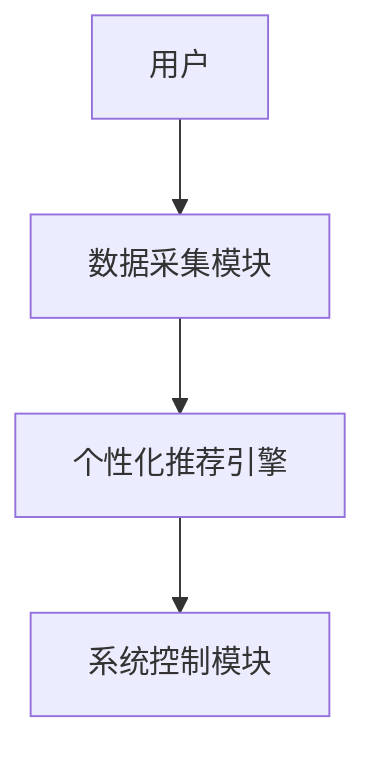

                 


# AI Agent在智能浴缸中的水疗模式个性化

## 关键词：AI Agent, 智能浴缸, 水疗模式, 个性化推荐, 算法原理, 系统架构

## 摘要：  
本文探讨AI Agent在智能浴缸中的应用，重点分析其如何实现水疗模式的个性化推荐。通过背景介绍、核心概念、算法原理、系统架构及项目实战，详细阐述AI Agent在健康数据分析、个性化体验提升中的作用，为智能设备的设计提供理论和实践参考。

---

## 第一部分：背景介绍

### 第1章：AI Agent与智能浴缸的背景

#### 1.1 问题背景与描述  
传统浴缸提供固定的水温、水流强度和按摩模式，无法满足用户的个性化需求。现代智能浴缸通过AI Agent技术，能够根据用户的健康数据、使用习惯和偏好，动态调整水疗模式，提升用户体验。  

#### 1.2 个性化水疗模式的必要性  
- **用户需求多样性**：不同用户对水温、水流强度、按摩力度的需求差异显著。  
- **健康数据分析的重要性**：通过AI算法分析用户的健康数据，如心率、血压等，提供针对性的水疗方案。  
- **个性化体验的提升价值**：通过个性化推荐，用户能获得更舒适、更健康的水疗体验。  

#### 1.3 问题解决与边界  
- **AI Agent的作用**：通过学习用户的使用习惯和健康数据，动态优化水疗模式。  
- **水疗模式的边界**：个性化推荐基于用户数据，但需考虑隐私保护和数据安全。  
- **核心要素**：包括用户数据采集、AI算法分析、个性化推荐引擎。  

---

## 第二部分：核心概念与联系

### 第2章：AI Agent的核心概念

#### 2.1 AI Agent的基本原理  
- **定义与分类**：AI Agent是一种能够感知环境、自主决策的智能实体，分为简单反射型、基于模型的反应型、目标驱动型和效用驱动型。  
- **核心特征**：智能代理具备主动性、响应性、适应性和社会性。  
- **与传统算法的区别**：AI Agent能够主动感知环境并动态调整行为，而传统算法依赖固定规则。  

#### 2.2 水疗模式的个性化推荐  
- **推荐算法的基本原理**：基于用户历史行为、偏好和数据特征，生成推荐结果。  
- **个性化推荐的实现方式**：包括协同过滤、基于内容的推荐和混合推荐模型。  
- **动态调整机制**：根据用户的实时反馈，动态优化推荐结果。  

#### 2.3 核心概念对比表  
| 概念         | 属性特征               | 示例                       |
|--------------|------------------------|-----------------------------|
| AI Agent     | 主动性、适应性         | 根据用户反馈调整推荐模式   |
| 个性化推荐   | 基于用户数据           | 根据用户健康数据推荐模式    |
| 水疗模式     | 结合物理参数           | 不同模式对应不同水流强度   |

#### 2.4 ER实体关系图  
```mermaid
er
actor: 用户
agent: AI代理
mode: 水疗模式
parameter: 水疗参数
```

---

## 第三部分：算法原理讲解

### 第3章：个性化推荐算法

#### 3.1 协同过滤算法  
协同过滤基于用户相似性推荐相似用户的偏好。  
- **实现步骤**：  
  1. 计算用户相似度（如余弦相似度）。  
  2. 根据相似用户的偏好生成推荐。  
- **数学模型**：  
  $$ 相似度 = \frac{\sum u_i r_i}{\sqrt{\sum u_i^2} \sqrt{\sum r_i^2}} $$  

#### 3.2 基于内容的推荐  
基于水疗模式的特征进行推荐。  
- **实现步骤**：  
  1. 提取模式特征（如水温、水流强度）。  
  2. 计算模式间的相似度。  
- **数学模型**：  
  $$ 相似度 = \frac{\sum f_i w_i}{\sqrt{\sum f_i^2} \sqrt{\sum w_i^2}} $$  

#### 3.3 混合推荐模型  
结合协同过滤和内容推荐的优点。  
- **实现步骤**：  
  1. 计算用户相似度和模式相似度。  
  2. 综合两种推荐结果。  

#### 3.4 Python代码实现  
```python
import numpy as np

def cosine_similarity(a, b):
    return np.dot(a, b) / (np.linalg.norm(a) * np.linalg.norm(b))

# 示例数据
user_vector = np.array([4, 3, 2])
item_vector = np.array([2, 3, 4])

similarity = cosine_similarity(user_vector, item_vector)
print(similarity)
```

---

## 第四部分：系统分析与架构设计

### 第4章：系统架构设计

#### 4.1 问题场景介绍  
智能浴缸系统需要实时采集用户数据（如心率、血压），通过AI Agent分析生成个性化推荐。

#### 4.2 系统功能设计  
- **用户数据采集模块**：采集用户健康数据和使用偏好。  
- **个性化推荐引擎**：基于算法生成推荐模式。  
- **系统控制模块**：根据推荐结果调整水疗参数。  

#### 4.3 系统架构图  


---

## 第五部分：项目实战

### 第5章：环境安装与代码实现

#### 5.1 环境安装  
- **安装Python**：`python --version`  
- **安装依赖库**：`pip install numpy scikit-learn`  

#### 5.2 核心代码实现  
```python
from sklearn.metrics.pairwise import cosine_similarity

# 示例数据
users = {
    'user1': [4, 3, 2],
    'user2': [2, 3, 4]
}

# 计算相似度
similarity_matrix = cosine_similarity(users.values())

print(similarity_matrix)
```

#### 5.3 代码解读与分析  
- **数据采集**：从用户输入或传感器获取数据。  
- **算法实现**：使用协同过滤或内容推荐生成推荐列表。  
- **系统控制**：根据推荐结果调整水疗参数。  

---

## 第六部分：总结与拓展

### 第6章：最佳实践与注意事项

#### 6.1 最佳实践  
- 定期更新用户数据，保持推荐的准确性。  
- 提供用户反馈机制，优化推荐算法。  

#### 6.2 小结  
AI Agent在智能浴缸中的应用，通过个性化推荐提升了用户体验，展现了人工智能在健康领域的巨大潜力。

#### 6.3 注意事项  
- 数据隐私保护是关键。  
- 系统稳定性需确保用户安全。  

#### 6.4 拓展阅读  
- 探索更复杂的推荐算法（如深度学习模型）。  
- 研究多模态数据融合技术。  

---

## 结语  
通过本文的详细分析，AI Agent在智能浴缸中的应用不仅提升了用户体验，也为智能健康设备的设计提供了新的思路。未来，随着技术的进步，个性化水疗模式将更加智能化和精准化。

