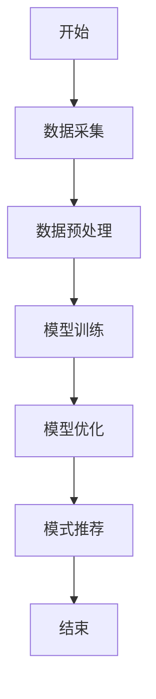
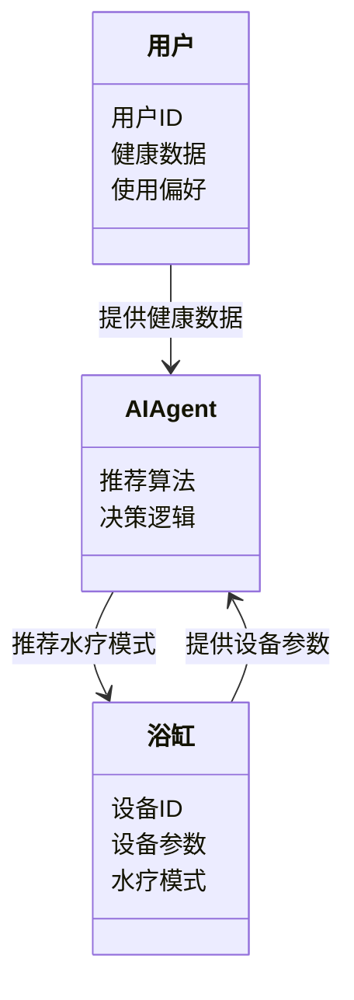
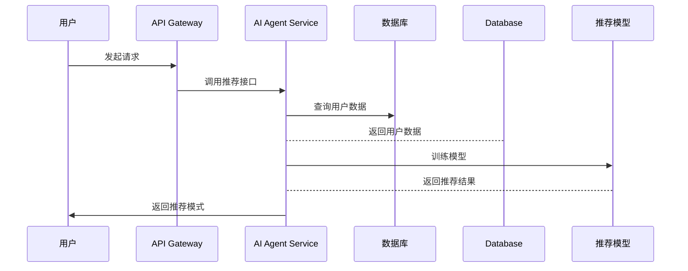

                 


# AI Agent在智能浴缸中的水疗模式定制

## 关键词：
AI Agent、智能浴缸、水疗模式、定制化、人工智能、智能家居

## 摘要：
本文深入探讨了AI Agent在智能浴缸中的水疗模式定制应用，从背景概念、核心原理到系统架构和项目实战，全面分析了AI Agent如何通过智能化算法和个性化推荐，为用户提供最佳水疗体验。文章通过详细的技术分析和实例演示，揭示了AI Agent在智能浴缸中的技术实现和实际应用价值。

---

## 第一部分: AI Agent与智能浴缸的背景与概念

### 第1章: AI Agent的核心概念与水疗模式定制背景

#### 1.1 AI Agent的基本概念
##### 1.1.1 AI Agent的定义与特点
AI Agent（人工智能代理）是一种能够感知环境、自主决策并执行任务的智能实体。它具备以下特点：
- **自主性**：能够在没有外部干预的情况下独立运行。
- **反应性**：能够实时感知环境并做出反应。
- **目标导向性**：通过设定目标来驱动行为。
- **学习能力**：能够通过数据和经验不断优化自身行为。

##### 1.1.2 AI Agent的核心要素与功能
AI Agent的核心要素包括：
1. **感知模块**：负责接收外部输入数据。
2. **决策模块**：基于感知数据进行分析和决策。
3. **执行模块**：根据决策结果执行操作。
4. **学习模块**：通过数据反馈优化决策模型。

##### 1.1.3 AI Agent与传统自动化系统的区别
| 特性 | AI Agent | 传统自动化系统 |
|------|----------|----------------|
| 决策能力 | 高度智能，可自主决策 | 基于预设规则，缺乏灵活性 |
| 学习能力 | 可通过数据优化 | 无法优化，仅执行固定任务 |
| 适应性 | 能够适应环境变化 | 难以适应环境变化 |

#### 1.2 水疗模式定制的背景与需求
##### 1.2.1 水疗模式的定义与分类
水疗模式是指通过调节水温、水流强度、按摩力度等因素，为用户提供的个性化水疗方案。水疗模式可以分为：
1. **基础模式**：如恒温模式、循环模式。
2. **个性化模式**：根据用户健康状况、偏好定制的模式。

##### 1.2.2 智能浴缸的水疗模式定制需求
随着人们对健康生活的追求，智能浴缸逐渐成为智能家居的重要组成部分。用户对水疗模式的需求包括：
- **个性化体验**：根据用户的健康状况、时间、心情提供定制化水疗方案。
- **便捷性**：用户希望通过简单操作即可获得最佳水疗体验。
- **智能化**：系统能够自动学习用户偏好并优化水疗模式。

##### 1.2.3 用户对个性化水疗模式的期望
用户期望智能浴缸能够：
- **智能推荐**：根据用户的历史使用数据推荐水疗模式。
- **实时调整**：根据用户的实时反馈动态调整水疗参数。
- **健康监测**：结合健康数据（如心率、体温）提供针对性水疗方案。

#### 1.3 AI Agent在智能浴缸中的应用现状
##### 1.3.1 AI Agent在智能家居中的应用
AI Agent在智能家居中的应用主要体现在：
- **设备控制**：通过AI Agent实现家电的智能控制。
- **场景联动**：根据用户行为联动多个设备。
- **数据采集与分析**：采集用户数据并进行分析，优化设备运行策略。

##### 1.3.2 智能浴缸的智能化发展趋势
智能浴缸的智能化发展趋势包括：
- **智能化控制**：通过AI Agent实现智能控制。
- **个性化服务**：提供基于用户数据的个性化水疗模式。
- **健康监测**：结合健康监测设备提供健康数据支持。

##### 1.3.3 当前水疗模式定制的技术挑战
当前水疗模式定制面临的主要技术挑战包括：
- **数据采集**：如何高效采集用户的健康数据。
- **模型优化**：如何提高AI Agent的决策精度。
- **用户体验**：如何设计友好的用户交互界面。

#### 1.4 本章小结
本章介绍了AI Agent的基本概念、核心要素及其在智能浴缸中的应用背景。通过对比分析，揭示了AI Agent在水疗模式定制中的优势和应用前景。

---

## 第二部分: AI Agent与水疗模式定制的核心概念

### 第2章: AI Agent与水疗模式定制的核心概念与联系

#### 2.1 AI Agent的核心原理
##### 2.1.1 基于规则的推理
基于规则的推理是一种简单的AI Agent决策方法，通过预设规则库进行推理。例如，当用户选择“放松模式”时，AI Agent会根据规则库中的设定调整水温和水流强度。

##### 2.1.2 机器学习算法
机器学习算法是AI Agent的核心技术之一。通过训练模型，AI Agent能够根据用户的历史数据推荐最优水疗模式。常用的算法包括：
- **决策树**：通过分类和回归树进行决策。
- **支持向量机（SVM）**：用于分类问题。
- **神经网络**：用于复杂的非线性问题。

#### 2.2 水疗模式定制的核心原理
##### 2.2.1 水疗模式的个性化需求分析
个性化需求分析包括：
- **用户健康数据**：如血压、心率、体重等。
- **用户偏好**：如水温偏好、按摩强度偏好。
- **使用场景**：如早晨、晚上、运动后等。

##### 2.2.2 AI Agent在水疗模式定制中的作用
AI Agent在水疗模式定制中的作用包括：
- **数据采集**：采集用户的健康数据和使用偏好。
- **模式推荐**：基于数据推荐最优水疗模式。
- **动态调整**：根据实时反馈优化水疗参数。

#### 2.3 AI Agent与水疗模式定制的联系
##### 2.3.1 数据流分析
AI Agent与水疗模式定制的数据流如下：
1. **数据采集**：AI Agent通过传感器采集用户数据。
2. **数据处理**：对采集的数据进行预处理和特征提取。
3. **模式推荐**：基于处理后的数据推荐水疗模式。
4. **反馈优化**：根据用户反馈优化推荐模型。

##### 2.3.2 实体关系图
以下是AI Agent与水疗模式定制的实体关系图：

```mermaid
er
  actor 用户
  actor 浴缸
  actor AI Agent
  database 用户数据
  database 水疗模式
  database 系统设置
  用户 --> 用户数据: 提供健康数据
  浴缸 --> 系统设置: 提供设备参数
  AI Agent --> 用户数据: 读取健康数据
  AI Agent --> 系统设置: 读取设备参数
  AI Agent --> 水疗模式: 生成推荐模式
  浴缸 --> 用户: 提供水疗体验
```

#### 2.4 本章小结
本章详细分析了AI Agent的核心原理及其在水疗模式定制中的作用，并通过数据流分析和实体关系图展示了AI Agent与水疗模式定制的联系。

---

## 第三部分: AI Agent与水疗模式定制的算法原理

### 第3章: AI Agent与水疗模式定制的算法原理

#### 3.1 AI Agent的核心算法
##### 3.1.1 基于规则的推理算法
基于规则的推理算法是一种简单的决策方法，适用于规则明确的场景。例如，当用户选择“放松模式”时，AI Agent会根据规则库中的设定调整水温和水流强度。

##### 3.1.2 机器学习算法
机器学习算法是AI Agent的核心技术之一，包括：
- **决策树**：通过分类和回归树进行决策。
- **支持向量机（SVM）**：用于分类问题。
- **神经网络**：用于复杂的非线性问题。

#### 3.2 水疗模式定制的算法实现
##### 3.2.1 数据预处理
数据预处理包括：
- **数据清洗**：去除异常数据。
- **特征提取**：提取关键特征，如用户健康数据、使用偏好。

##### 3.2.2 模型训练
模型训练包括：
- **数据分割**：将数据分为训练集和测试集。
- **模型训练**：使用训练数据训练AI Agent的推荐模型。

##### 3.2.3 模型优化
模型优化包括：
- **超参数调优**：通过网格搜索优化模型参数。
- **模型评估**：通过准确率、召回率等指标评估模型性能。

#### 3.3 算法实现的流程图
以下是AI Agent水疗模式定制的算法实现流程图：



#### 3.4 本章小结
本章详细介绍了AI Agent的核心算法及其在水疗模式定制中的实现流程。

---

## 第四部分: AI Agent与水疗模式定制的系统分析与架构设计

### 第4章: AI Agent与水疗模式定制的系统分析与架构设计

#### 4.1 问题场景介绍
##### 4.1.1 用户需求分析
用户需求包括：
- **个性化体验**：根据用户健康状况和偏好推荐水疗模式。
- **便捷性**：用户希望通过简单操作即可获得最佳水疗体验。
- **智能化**：系统能够自动学习用户偏好并优化水疗模式。

##### 4.1.2 系统功能分析
系统功能包括：
- **数据采集**：采集用户的健康数据和使用偏好。
- **模式推荐**：根据用户数据推荐最优水疗模式。
- **动态调整**：根据用户反馈优化水疗参数。

#### 4.2 系统功能设计
##### 4.2.1 领域模型设计
以下是领域模型设计图：



##### 4.2.2 系统架构设计
以下是系统架构设计图：


##### 4.2.3 系统接口设计
系统接口设计包括：
- **用户接口**：提供用户与系统交互的界面。
- **API接口**：供其他系统调用AI Agent服务。

##### 4.2.4 系统交互流程图
以下是系统交互流程图：



#### 4.3 本章小结
本章分析了AI Agent与水疗模式定制的系统架构，并通过领域模型和系统交互图展示了系统的实现方式。

---

## 第五部分: AI Agent与水疗模式定制的项目实战

### 第5章: AI Agent与水疗模式定制的项目实战

#### 5.1 环境搭建
##### 5.1.1 环境要求
- **操作系统**：Windows 10或更高版本。
- **编程语言**：Python 3.8或更高版本。
- **开发工具**：Jupyter Notebook或PyCharm。
- **依赖库**：scikit-learn、pandas、numpy。

##### 5.1.2 安装依赖
```bash
pip install scikit-learn pandas numpy
```

#### 5.2 核心代码实现
##### 5.2.1 数据预处理代码
```python
import pandas as pd
import numpy as np

# 读取数据
data = pd.read_csv('user_data.csv')

# 删除异常值
data = data.dropna()

# 提取特征
X = data[['temperature', 'pressure', 'duration']]
y = data['mode']
```

##### 5.2.2 模型训练代码
```python
from sklearn.model_selection import train_test_split
from sklearn.tree import DecisionTreeClassifier
from sklearn.metrics import accuracy_score

# 数据分割
X_train, X_test, y_train, y_test = train_test_split(X, y, test_size=0.2)

# 模型训练
model = DecisionTreeClassifier()
model.fit(X_train, y_train)

# 模型预测
y_pred = model.predict(X_test)

# 模型评估
print('准确率:', accuracy_score(y_test, y_pred))
```

##### 5.2.3 模式推荐代码
```python
def recommend_mode(user_data):
    # 数据预处理
    data = pd.read_csv('user_data.csv')
    X = data[['temperature', 'pressure', 'duration']]
    y = data['mode']
    
    # 数据分割
    X_train, X_test, y_train, y_test = train_test_split(X, y, test_size=0.2)
    
    # 模型训练
    model = DecisionTreeClassifier()
    model.fit(X_train, y_train)
    
    # 模式推荐
    predicted_mode = model.predict(user_data)
    return predicted_mode[0]

# 示例
user_data = [[37, 120, 15]]
print('推荐模式:', recommend_mode(user_data))
```

#### 5.3 代码解读与分析
##### 5.3.1 数据预处理代码解读
数据预处理代码负责读取数据、删除异常值和提取特征。通过这些步骤，为模型训练提供干净的数据。

##### 5.3.2 模型训练代码解读
模型训练代码使用决策树算法训练分类模型，并对测试数据进行预测。通过准确率评估模型性能。

##### 5.3.3 模式推荐代码解读
模式推荐代码通过输入用户数据，调用训练好的模型，返回推荐的水疗模式。

#### 5.4 实际案例分析
##### 5.4.1 案例背景
假设用户A的健康数据如下：
- 水温偏好：37℃
- 血压：120/80 mmHg
- 使用时长：15分钟

##### 5.4.2 模型推荐
模型通过分析用户数据，推荐“深层放松模式”。

##### 5.4.3 推荐结果
推荐模式：深层放松模式。

##### 5.4.4 案例分析小结
通过实际案例分析，验证了AI Agent在水疗模式定制中的有效性。

#### 5.5 本章小结
本章通过项目实战，展示了AI Agent在水疗模式定制中的具体实现，并通过实际案例验证了模型的有效性。

---

## 第六部分: AI Agent与水疗模式定制的最佳实践

### 第6章: AI Agent与水疗模式定制的最佳实践

#### 6.1 最佳实践 tips
##### 6.1.1 数据采集
- 确保数据的完整性和准确性。
- 定期更新数据集。

##### 6.1.2 模型优化
- 通过网格搜索优化模型参数。
- 定期更新模型。

##### 6.1.3 用户体验
- 提供友好的用户交互界面。
- 提供详细的使用说明。

#### 6.2 系统设计注意事项
##### 6.2.1 数据隐私
- 确保用户数据的安全性和隐私性。
- 符合相关法律法规。

##### 6.2.2 系统稳定性
- 确保系统的高可用性。
- 定期进行系统维护。

##### 6.2.3 模型泛化能力
- 确保模型的泛化能力。
- 定期更新模型。

#### 6.3 拓展阅读
##### 6.3.1 推荐的书籍
- 《机器学习实战》
- 《人工智能: 一种现代方法》

##### 6.3.2 推荐的在线资源
- [AI Agent相关论文](https://example.com/papers)
- [智能浴缸相关技术文档](https://example.com/docs)

#### 6.4 本章小结
本章总结了AI Agent在水疗模式定制中的最佳实践，并提供了相关建议和拓展阅读材料。

---

## 附录: 全文小结与未来展望

### 附录A: 全文小结
本文深入探讨了AI Agent在智能浴缸中的水疗模式定制应用，从背景概念、核心原理到系统架构和项目实战，全面分析了AI Agent如何通过智能化算法和个性化推荐，为用户提供最佳水疗体验。通过详细的技术分析和实例演示，揭示了AI Agent在智能浴缸中的技术实现和实际应用价值。

### 附录B: 未来展望
随着人工智能技术的不断发展，AI Agent在智能浴缸中的应用前景广阔。未来，AI Agent将更加智能化、个性化，为用户提供更优质的水疗体验。同时，AI Agent在健康监测、疾病预防等方面也将发挥更大的作用。

---

# 结语
AI Agent在智能浴缸中的水疗模式定制是一项充满潜力的技术应用。通过不断的技术创新和实践探索，AI Agent将为用户带来更加智能化、个性化的水疗体验，推动智能家居技术的发展。

--- 

如果需要进一步了解AI Agent在智能浴缸中的具体实现细节或代码示例，请随时告诉我！

