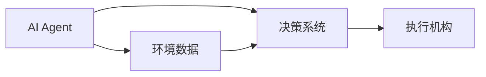
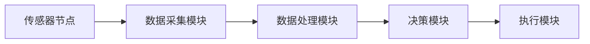
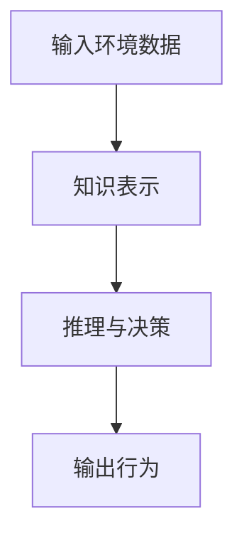
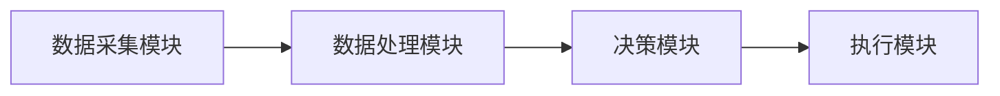
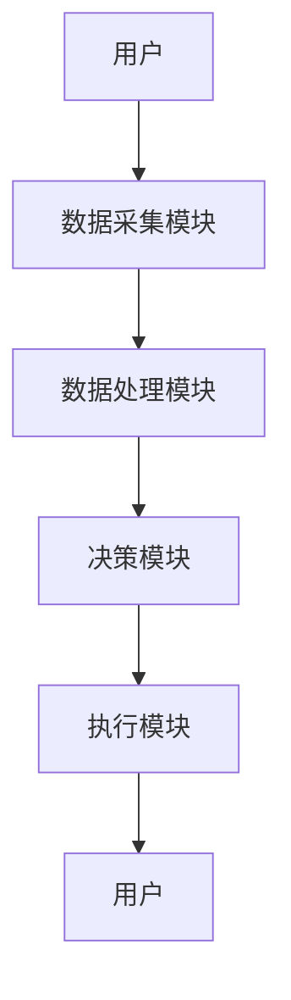

                 


# AI Agent在智能海洋环境监测中的实践

> 关键词：AI Agent, 智能海洋环境监测, 算法原理, 系统架构, 项目实战

> 摘要：本文深入探讨了AI Agent在智能海洋环境监测中的应用实践，从背景、核心概念、算法原理、系统架构到项目实战，全面解析了AI Agent如何助力海洋环境监测智能化。

---

## 第一部分：AI Agent在智能海洋环境监测中的背景与基础

### 第1章：AI Agent与智能海洋环境监测概述

#### 1.1 AI Agent的基本概念

AI Agent（人工智能代理）是一种能够感知环境、自主决策并执行任务的智能实体。它具备以下特点：
- **自主性**：无需外部干预，自主完成任务。
- **反应性**：能够实时感知环境并做出反应。
- **社会性**：能够与其他智能体或人类进行交互与协作。

#### 1.2 智能海洋环境监测的背景与意义

海洋环境监测是保护海洋生态系统、预防污染和自然灾害的重要手段。传统的海洋监测依赖人工操作，效率低下且成本高昂。AI Agent的引入，为海洋环境监测带来了智能化和自动化的解决方案。

#### 1.3 AI Agent在海洋监测中的应用前景

AI Agent能够实时处理海量数据，识别异常情况，优化监测策略，为海洋环境保护和资源管理提供科学依据。

---

## 第二部分：AI Agent的核心概念与原理

### 第2章：AI Agent的核心概念与属性

#### 2.1 AI Agent的核心概念

- **知识表示**：AI Agent需要通过某种形式的知识表示来理解环境。常见的知识表示方法包括逻辑推理和概率推理。
- **推理与决策**：AI Agent通过推理引擎对环境信息进行分析，并基于预设的目标制定决策。
- **多智能体协同**：在复杂的海洋环境中，多个AI Agent需要协同工作，共同完成监测任务。

#### 2.2 AI Agent的属性对比

| 属性       | 描述                                       |
|------------|--------------------------------------------|
| 智能性     | 能够理解和处理复杂信息                     |
| 反应性     | 实时感知环境并做出反应                   |
| 学习能力   | 能够通过经验改进性能                     |

#### 2.3 实体关系图（ER图）



### 第3章：海洋环境监测系统的原理与架构

#### 3.1 海洋环境监测的核心原理

- **数据采集**：通过传感器获取海洋环境数据，如温度、盐度、溶解氧等。
- **数据处理**：对采集的数据进行清洗、融合和特征提取。
- **数据分析与建模**：利用机器学习算法对数据进行分析，并建立数学模型预测环境变化。

#### 3.2 海洋环境监测系统的架构



---

## 第三部分：AI Agent算法原理与数学模型

### 第4章：AI Agent的核心算法原理

#### 4.1 知识表示与推理算法

- **逻辑推理算法**：基于命题逻辑的推理方法，适用于确定性问题。
- **概率推理算法**：基于贝叶斯网络的推理方法，适用于不确定性问题。
- **群智算法**：通过多智能体协同完成复杂任务。

#### 4.2 行为决策算法

- **Q-Learning算法**：一种基于强化学习的决策算法。
- **DQN算法**：深度强化学习算法，适用于高维状态空间。
- **贝叶斯网络算法**：基于概率的决策方法。

#### 4.3 算法流程图



#### 4.4 算法实现代码

```python
import numpy as np

class AI_Agent:
    def __init__(self):
        self.Q_table = np.zeros((state_space, action_space))
    
    def感知环境(self, 环境数据):
        # 处理环境数据，返回状态
        return 状态
    
    def采取行动(self, 状态):
        # 基于Q-learning算法选择动作
        return 动作
    
    def更新Q表(self, 状态, 动作, 奖励):
        # 更新Q表
        self.Q_table[状态, 动作] = self.Q_table[状态, 动作] + 学习率 * (奖励 + γ * np.max(self.Q_table[状态, :]) - self.Q_table[状态, 动作])
```

---

## 第四部分：系统分析与架构设计方案

### 第5章：系统分析与架构设计

#### 5.1 项目介绍

本项目旨在开发一个基于AI Agent的智能海洋环境监测系统，实现对海洋环境的实时监测和智能预警。

#### 5.2 系统功能设计

- **数据采集模块**：负责采集海洋环境数据。
- **数据处理模块**：对数据进行清洗和融合。
- **决策模块**：基于AI Agent算法做出决策。
- **执行模块**：根据决策执行相应操作。

#### 5.3 系统架构图



#### 5.4 系统接口设计

- **传感器接口**：与海洋传感器连接，获取实时数据。
- **决策接口**：与其他智能体或系统交互。
- **用户接口**：供用户查看监测结果。

#### 5.5 系统交互流程图



---

## 第五部分：项目实战

### 第6章：项目实战

#### 6.1 环境安装

```bash
pip install numpy matplotlib scikit-learn
```

#### 6.2 系统核心实现源代码

```python
import numpy as np
import matplotlib.pyplot as plt
from sklearn import linear_model

class OceanMonitoringSystem:
    def __init__(self):
        self.sensors = ['温度', '盐度', '溶解氧']
        self.models = {}
    
    def train_model(self, 数据):
        # 训练模型
        pass
    
    def predict(self, 输入):
        # 预测结果
        return 结果
    
    def plot_data(self, 数据):
        plt.plot(数据)
        plt.show()
```

#### 6.3 代码应用解读与分析

- **数据采集**：通过传感器获取海洋环境数据。
- **数据预处理**：清洗和融合数据。
- **模型训练**：利用机器学习算法训练模型。
- **预测与决策**：基于模型预测结果做出决策。

#### 6.4 案例分析

假设我们有一个海洋监测站，需要监测海水温度和盐度。通过AI Agent，我们可以实时预测温度变化，并提前采取措施防止潜在的环境问题。

#### 6.5 项目小结

本项目展示了AI Agent在智能海洋环境监测中的实际应用，通过系统设计和代码实现，验证了AI Agent的有效性和可行性。

---

## 第六部分：总结与展望

### 第7章：总结与展望

#### 7.1 总结

本文详细探讨了AI Agent在智能海洋环境监测中的应用，从理论到实践，全面解析了AI Agent的优势和实现方法。

#### 7.2 展望

未来，随着AI技术的不断发展，AI Agent在海洋环境监测中的应用将更加广泛和深入，为海洋环境保护和资源管理提供更强大的技术支持。

---

### 最佳实践 Tips

- 在实际应用中，需结合具体场景选择合适的AI Agent算法。
- 数据质量是AI Agent性能的关键，需确保数据采集和处理的准确性。
- 系统设计时，需考虑多智能体协同和分布式计算。

---

### 小结

通过本文的分析，我们可以看到AI Agent在智能海洋环境监测中的巨大潜力。希望本文能为相关领域的研究和实践提供有价值的参考。

---

### 注意事项

- 确保系统安全性和可靠性，防止数据泄露和系统崩溃。
- 定期更新模型和算法，适应环境变化和新需求。

---

### 拓展阅读

- 《强化学习导论》
- 《分布式系统：概念与设计》
- 《机器学习在环境监测中的应用》

---

通过以上内容，我们全面解析了AI Agent在智能海洋环境监测中的实践应用，从理论到实践，为读者提供了详尽的指导和参考。

