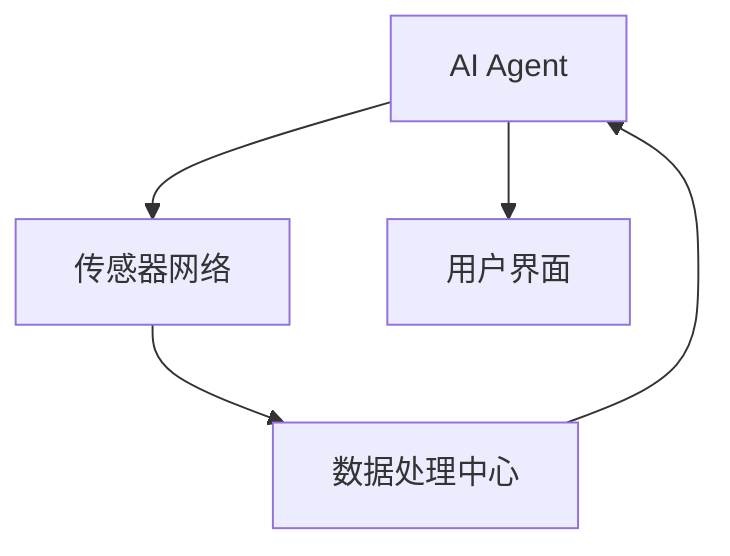
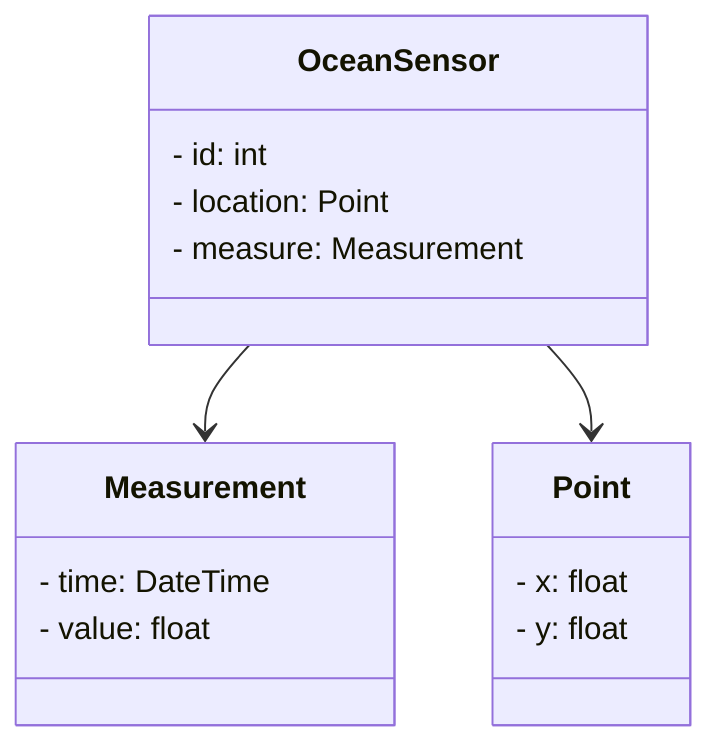
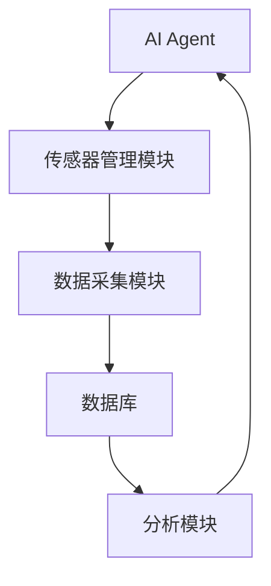
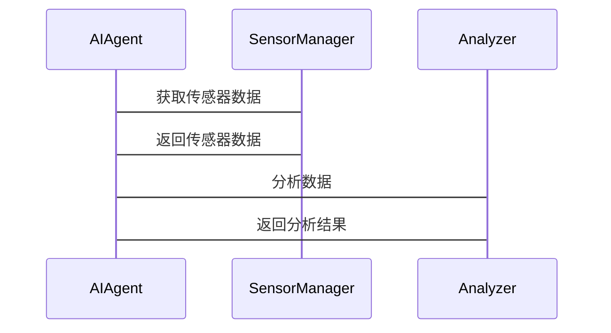

                 


# AI Agent在智能海洋生态监测中的实践

> 关键词：AI Agent，智能海洋生态监测，算法原理，系统架构，项目实战

> 摘要：本文系统地探讨了AI Agent在智能海洋生态监测中的应用与实践。从背景介绍到核心算法，从系统设计到项目实战，详细阐述了AI Agent如何助力海洋生态监测的智能化发展。文章内容涵盖AI Agent的核心概念、算法原理、系统架构设计以及实际案例分析，旨在为相关领域的研究人员和工程师提供理论支持和实践指导。

---

# 第1章: AI Agent与智能海洋生态监测的背景介绍

## 1.1 问题背景

### 1.1.1 海洋生态监测的重要性
海洋生态系统是地球上最重要的生态系统之一，涵盖鱼类、珊瑚礁、海草床等多种生物群落。海洋生态监测是保护海洋环境、评估海洋资源可持续利用的重要手段。然而，传统的海洋生态监测方法存在效率低、成本高、覆盖范围有限等问题。

### 1.1.2 传统海洋生态监测的局限性
传统海洋生态监测主要依赖人工采样和实验室分析，这种方式不仅耗时耗力，还难以实现大范围、实时化的监测。此外，海洋环境复杂多变，传统方法难以应对突发性事件（如赤潮、石油泄漏等）的监测需求。

### 1.1.3 AI Agent在海洋生态监测中的优势
AI Agent（人工智能代理）是一种能够感知环境、自主决策并执行任务的智能体。将AI Agent应用于海洋生态监测，可以实现实时数据采集、智能分析和自主决策，显著提升监测效率和准确性。

---

## 1.2 问题描述

### 1.2.1 海洋生态监测的主要挑战
1. **数据多样性**：海洋环境中存在多种类型的数据，包括水质参数（如温度、盐度、溶解氧）、生物数据（如鱼类分布、浮游生物密度）等，如何高效处理这些数据是关键。
2. **动态性**：海洋环境具有高度动态性，生态事件（如赤潮）的发生具有突发性和不确定性，需要实时响应。
3. **覆盖范围**：海洋面积广阔，传统的监测手段难以实现大范围覆盖。

### 1.2.2 AI Agent在监测中的应用场景
1. **实时数据处理**：AI Agent可以实时分析海洋传感器传来的数据，快速识别异常情况。
2. **自主决策**：AI Agent可以根据环境变化自主调整监测策略，例如在发现异常时触发警报或启动应急措施。
3. **智能预测**：基于历史数据和环境模型，AI Agent可以预测未来海洋生态的变化趋势。

### 1.2.3 问题解决的必要性
通过引入AI Agent技术，可以显著提升海洋生态监测的效率和精度，同时降低监测成本。AI Agent的自主决策能力使其能够适应复杂的海洋环境，为海洋生态保护和资源管理提供有力支持。

---

## 1.3 问题解决

### 1.3.1 AI Agent的核心功能
1. **感知环境**：通过传感器获取海洋环境数据。
2. **数据处理**：对获取的数据进行清洗、分析和建模。
3. **决策制定**：基于分析结果做出监测策略调整或触发警报。

### 1.3.2 AI Agent在海洋生态监测中的具体应用
1. **水质监测**：实时监测海洋水质参数，预警水质异常。
2. **生物监测**：通过图像识别技术监测海洋生物分布和数量变化。
3. **生态事件预警**：快速识别并预警赤潮、石油泄漏等生态事件。

### 1.3.3 技术实现的可行性分析
AI Agent的核心技术包括机器学习、自然语言处理和计算机视觉等。这些技术在海洋生态监测中的应用已经取得了显著成果，证明了AI Agent在该领域的可行性。

---

## 1.4 边界与外延

### 1.4.1 AI Agent的边界条件
1. **数据输入**：AI Agent需要海洋传感器提供的实时数据。
2. **决策范围**：AI Agent的决策局限于海洋生态监测领域，不涉及其他海洋活动（如渔业管理）。
3. **环境限制**：AI Agent的设计需要考虑海洋环境的特殊性，例如水下通信的延迟问题。

### 1.4.2 海洋生态监测的范围界定
海洋生态监测的范围包括海洋水质、海洋生物、海底地形等方面。本文主要关注AI Agent在水质监测和生物监测中的应用。

### 1.4.3 相关领域的外延分析
AI Agent在海洋生态监测中的应用可以扩展到其他领域，例如海洋资源开发、海洋灾害预警等。这些扩展应用将推动AI技术在海洋领域的广泛应用。

---

## 1.5 概念结构与核心要素

### 1.5.1 AI Agent的组成要素
1. **感知模块**：负责采集环境数据。
2. **推理模块**：对数据进行分析和建模。
3. **决策模块**：根据分析结果做出决策。
4. **执行模块**：执行决策指令。

### 1.5.2 海洋生态监测系统的构成
1. **传感器网络**：负责采集海洋环境数据。
2. **数据处理中心**：对数据进行清洗和分析。
3. **AI Agent系统**：负责数据的智能分析和决策。
4. **用户界面**：供用户查看监测结果和控制系统。

### 1.5.3 核心概念之间的关系
通过Mermaid图可以清晰展示AI Agent与海洋生态监测系统的交互关系：



---

# 第2章: AI Agent的核心概念与原理

## 2.1 AI Agent的基本原理

### 2.1.1 AI Agent的定义与分类
AI Agent是一种能够感知环境、自主决策并执行任务的智能体。根据应用场景的不同，AI Agent可以分为强化学习型AI Agent、监督学习型AI Agent和无监督学习型AI Agent。

### 2.1.2 AI Agent的核心算法
AI Agent的核心算法包括强化学习（Reinforcement Learning）、监督学习（Supervised Learning）和无监督学习（Unsupervised Learning）。

### 2.1.3 AI Agent的决策机制
AI Agent的决策机制基于环境感知、目标建模和策略优化。通过不断与环境交互，AI Agent可以优化自身的决策策略。

---

## 2.2 海洋生态监测系统的原理

### 2.2.1 数据采集与处理
海洋生态监测系统通过传感器采集海洋环境数据，包括温度、盐度、溶解氧等参数。

### 2.2.2 数据分析与建模
通过机器学习算法对数据进行建模，识别海洋生态系统的潜在问题。

### 2.2.3 监测结果的反馈与优化
AI Agent根据分析结果优化监测策略，例如调整传感器布放密度或启动应急措施。

---

## 2.3 AI Agent与海洋生态监测的结合

### 2.3.1 AI Agent在数据处理中的作用
AI Agent可以通过强化学习优化数据处理流程，提高数据处理效率。

### 2.3.2 AI Agent在生态模型构建中的应用
AI Agent可以基于历史数据构建海洋生态模型，预测未来生态变化趋势。

### 2.3.3 AI Agent在监测结果优化中的价值
AI Agent可以通过无监督学习发现数据中的异常模式，优化监测结果的准确性。

---

# 第3章: AI Agent的核心算法与数学模型

## 3.1 AI Agent的核心算法

### 3.1.1 强化学习算法
强化学习是一种通过试错学习来优化决策策略的算法。其核心公式为：

$$ Q(s,a) = Q(s,a) + \alpha [r + \gamma \max Q(s',a') - Q(s,a)] $$

其中：
- \( Q(s,a) \)：状态-动作值函数。
- \( \alpha \)：学习率。
- \( r \)：奖励。
- \( \gamma \)：折扣因子。
- \( Q(s',a') \)：下一个状态的最大动作值函数。

### 3.1.2 监督学习算法
监督学习是一种基于标注数据进行模型训练的算法。其核心公式为：

$$ y = \theta x + b $$

其中：
- \( y \)：输出。
- \( \theta \)：权重参数。
- \( x \)：输入。
- \( b \)：偏置项。

### 3.1.3 无监督学习算法
无监督学习是一种基于未标注数据进行模式发现的算法。其核心公式为：

$$ k-means目标函数： \arg \max \sum_{i=1}^k \sum_{j=1}^n I(c_j=i) \sum_{m=1}^n I(c_m=i) (x_j - x_m) $$

---

## 3.2 数学模型与公式

### 3.2.1 强化学习的数学模型
强化学习的数学模型可以用马尔可夫决策过程（MDP）表示：

$$ MDP = (S, A, R, P, \gamma) $$

其中：
- \( S \)：状态空间。
- \( A \)：动作空间。
- \( R \)：奖励函数。
- \( P \)：转移概率矩阵。
- \( \gamma \)：折扣因子。

### 3.2.2 监督学习的数学模型
监督学习的数学模型可以用线性回归表示：

$$ y = \theta x + b $$

### 3.2.3 无监督学习的数学模型
无监督学习的数学模型可以用k均值聚类表示：

$$ \arg \min \sum_{i=1}^k \sum_{j=1}^n I(c_j=i) \|x_j - \mu_i\|^2 $$

其中：
- \( c_j \)：样本 \( j \) 的聚类标签。
- \( \mu_i \)：第 \( i \) 个聚类的中心点。

---

# 第4章: AI Agent与海洋生态监测的系统设计

## 4.1 系统功能设计

### 4.1.1 领域模型
通过Mermaid类图可以清晰展示海洋生态监测系统的领域模型：



### 4.1.2 系统架构
通过Mermaid架构图可以展示AI Agent在海洋生态监测系统中的架构设计：



### 4.1.3 系统接口设计
系统接口设计包括数据采集接口、数据处理接口和用户界面接口。通过RESTful API可以实现各模块之间的通信。

### 4.1.4 系统交互设计
通过Mermaid序列图可以展示AI Agent与海洋生态监测系统的交互流程：



---

## 4.2 系统实现与优化

### 4.2.1 环境配置
海洋生态监测系统的环境配置包括传感器网络部署、数据采集模块安装和数据库搭建。

### 4.2.2 核心代码实现
以下是AI Agent的核心代码实现示例（Python）：

```python
class AI_Agent:
    def __init__(self, sensors):
        self.sensors = sensors
        self.data = []
    
    def perceive(self):
        # 获取传感器数据
        for sensor in self.sensors:
            data = sensor.measure()
            self.data.append(data)
    
    def decide(self):
        # 基于强化学习的决策
        pass
    
    def act(self):
        # 执行决策
        pass
```

### 4.2.3 代码应用解读与分析
AI Agent的核心代码实现包括感知、决策和执行三个模块。感知模块负责采集传感器数据，决策模块基于强化学习算法做出决策，执行模块负责执行决策指令。

---

## 4.3 项目小结

### 4.3.1 项目总结
通过AI Agent技术可以显著提升海洋生态监测的效率和精度，实现智能化的海洋生态监测。

### 4.3.2 经验与教训
在项目实施过程中，需要注意传感器数据的实时性和AI Agent的决策效率，确保系统能够在复杂环境下稳定运行。

### 4.3.3 优化建议
未来可以进一步优化AI Agent的决策算法，引入更先进的强化学习算法（如深度强化学习）提升系统的智能化水平。

---

# 第5章: 总结与展望

## 5.1 总结
本文系统地探讨了AI Agent在智能海洋生态监测中的应用与实践。通过理论分析和实践案例，验证了AI Agent在海洋生态监测中的巨大潜力。

## 5.2 展望
未来，随着AI技术的不断发展，AI Agent在海洋生态监测中的应用将更加广泛和深入。通过引入更先进的算法和更高效的硬件设备，AI Agent将为海洋生态保护和资源管理提供更有力的支持。

---

# 参考文献
[此处列出相关参考文献]

---

# 附录

## 附录A: 数据集
[列出使用的数据集及其描述]

## 附录B: 工具与库
[列出使用的工具和库及其版本信息]

## 附录C: 其他
[其他补充信息]

