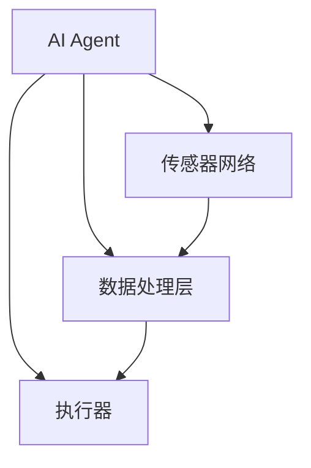
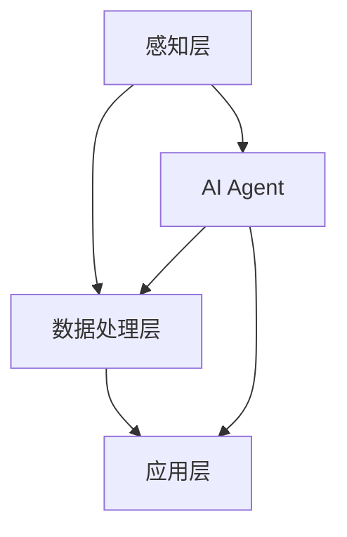
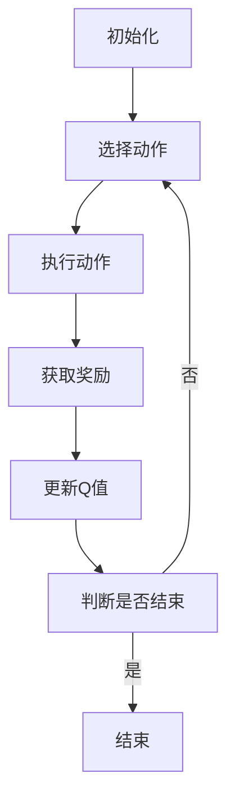
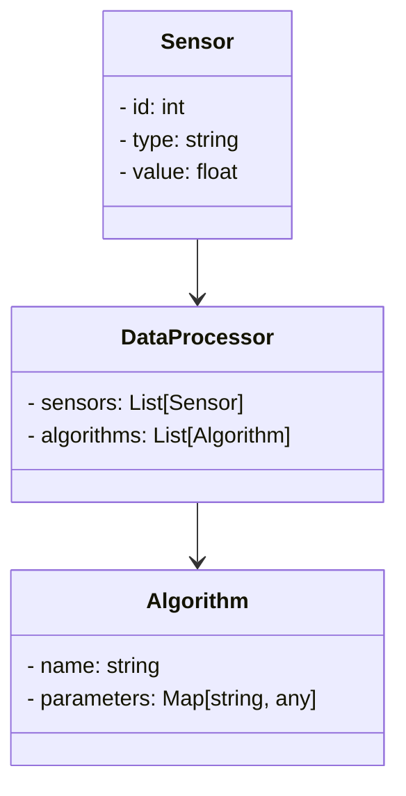
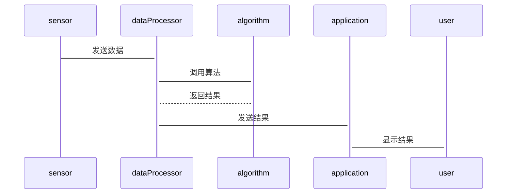
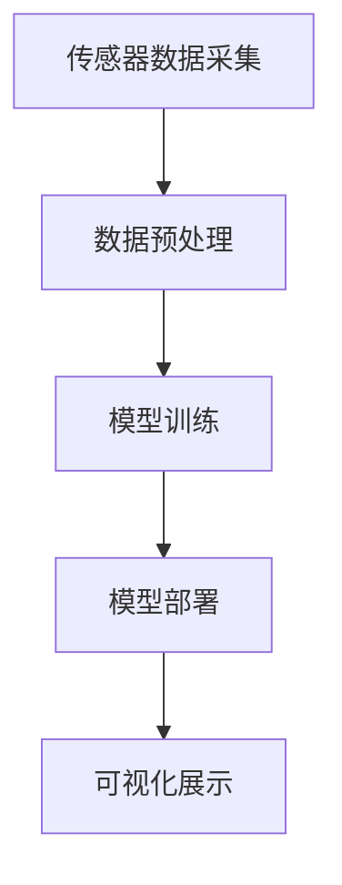

                 


# AI Agent在智能海洋监测中的实践

## 关键词：AI Agent, 智能海洋监测, 海洋环境, 人工智能, 海洋生态保护

## 摘要：本文详细探讨了AI Agent在智能海洋监测中的应用，从背景介绍、核心概念到算法原理、系统架构设计，再到项目实战和案例分析，全面解析了AI Agent在提升海洋监测效率和精度方面的巨大潜力。

---

# 第1章: AI Agent与智能海洋监测的背景介绍

## 1.1 AI Agent的基本概念

### 1.1.1 什么是AI Agent
AI Agent（人工智能代理）是一种能够感知环境、自主决策并采取行动的智能实体。它通过传感器获取信息，利用算法处理数据，并通过执行器与环境交互。AI Agent的核心目标是解决复杂问题，优化决策过程。

### 1.1.2 AI Agent的核心特征
- **自主性**：能够在没有外部干预的情况下运行。
- **反应性**：能够实时感知环境变化并做出响应。
- **学习能力**：通过数据和经验不断优化自身的决策能力。
- **协作性**：能够与其他AI Agent或系统协同工作。

### 1.1.3 AI Agent的分类与应用场景
AI Agent可以分为**简单反射型**、**基于模型的反应型**、**目标驱动型**和**效用驱动型**。在智能海洋监测中，目标驱动型AI Agent最为常见，用于实现特定的监测目标，如水质监测、海洋生物保护等。

## 1.2 智能海洋监测的背景与需求

### 1.2.1 海洋监测的重要性
海洋覆盖了地球表面的70%以上，是地球生态系统的核心组成部分。海洋监测是了解海洋环境、保护海洋生态、开发海洋资源的基础。

### 1.2.2 智能海洋监测的定义与目标
智能海洋监测是利用人工智能、物联网、大数据等技术，实现对海洋环境的实时感知、智能分析和自主决策。其目标是提高监测效率，降低成本，并实现对海洋环境的全面、精准监测。

### 1.2.3 当前海洋监测的主要技术手段
- **传感器技术**：用于采集海洋环境数据，如温度、盐度、氧气含量等。
- **数据传输技术**：将传感器数据传输到中心系统进行处理。
- **数据分析技术**：利用大数据和机器学习算法对数据进行分析，提取有用信息。

## 1.3 AI Agent在智能海洋监测中的作用

### 1.3.1 AI Agent如何提升海洋监测的效率
AI Agent能够实时处理传感器数据，快速识别异常情况，并采取相应的行动，从而提高监测效率。

### 1.3.2 AI Agent在海洋环境数据处理中的优势
- **高效性**：能够在短时间内处理大量数据。
- **准确性**：通过机器学习算法，能够提高数据处理的准确性。
- **自主性**：能够在恶劣环境下自主工作，减少人工干预。

### 1.3.3 AI Agent在海洋生态保护中的应用前景
AI Agent可以用于监测海洋生物的分布、保护濒危物种、防止非法捕捞等，为海洋生态保护提供技术支持。

## 1.4 本章小结
本章介绍了AI Agent的基本概念和核心特征，探讨了智能海洋监测的背景与需求，并分析了AI Agent在智能海洋监测中的作用。通过这些内容，我们可以看到AI Agent在智能海洋监测中的巨大潜力。

---

# 第2章: AI Agent与智能海洋监测的核心概念

## 2.1 AI Agent的核心原理

### 2.1.1 感知层：数据采集与处理
感知层是AI Agent与环境交互的第一步，主要通过传感器获取数据。例如，在海洋监测中，AI Agent可以通过温度传感器获取海水温度数据。

### 2.1.2 决策层：智能分析与决策
决策层是AI Agent的核心部分，负责对感知层获取的数据进行分析，并做出决策。例如，AI Agent可以通过机器学习算法分析水质数据，判断是否存在污染。

### 2.1.3 执行层：行动与反馈
执行层是AI Agent的行动部分，负责根据决策层的指令采取行动。例如，AI Agent可以通过执行器调整监测设备的位置，以更好地监测特定区域的水质。

## 2.2 海洋监测系统的构成

### 2.2.1 数据采集层：传感器网络
传感器网络是海洋监测系统的基础，负责采集海洋环境数据。例如，温度传感器、盐度传感器、氧气传感器等。

### 2.2.2 数据处理层：数据清洗与分析
数据处理层负责对传感器采集的数据进行清洗、预处理和分析。例如，利用机器学习算法对数据进行去噪处理，提取有用信息。

### 2.2.3 应用层：决策支持与可视化
应用层是海洋监测系统的最终目标，负责将处理后的数据呈现给用户，并提供决策支持。例如，通过可视化界面展示水质变化趋势，帮助用户做出决策。

## 2.3 AI Agent与海洋监测系统的集成

### 2.3.1 系统集成的总体架构
AI Agent与海洋监测系统的集成通常采用分层架构。感知层负责数据采集，决策层负责数据分析，执行层负责数据输出。

### 2.3.2 AI Agent在海洋监测中的具体实现
AI Agent通过传感器获取数据，利用机器学习算法进行分析，并根据分析结果采取相应的行动。例如，当检测到水质异常时，AI Agent可以触发警报，并调整监测设备的位置。

### 2.3.3 系统的可扩展性与灵活性
AI Agent的设计注重模块化和可扩展性，能够根据需求灵活调整系统架构。例如，可以根据需要增加新的传感器类型，或者引入新的算法模型。

## 2.4 核心概念对

---

## 图2-1: AI Agent与海洋监测系统的实体关系图


---

## 图2-2: 海洋监测系统的架构图


---

## 2.5 本章小结
本章详细讲解了AI Agent的核心原理，分析了海洋监测系统的构成，并探讨了AI Agent与海洋监测系统的集成方式。通过这些内容，我们可以更好地理解AI Agent在智能海洋监测中的作用和实现方式。

---

# 第3章: AI Agent在智能海洋监测中的算法原理

## 3.1 强化学习算法在AI Agent中的应用

### 3.1.1 强化学习的基本原理
强化学习是一种机器学习技术，通过智能体与环境的交互，学习最优策略。AI Agent通过强化学习算法，可以在复杂环境中做出最优决策。

### 3.1.2 强化学习的数学模型
强化学习的核心是Q-learning算法，其数学模型如下：
$$ Q(s, a) = r + \gamma \max_{a'} Q(s', a') $$
其中，$s$是当前状态，$a$是当前动作，$r$是奖励，$\gamma$是折扣因子。

### 3.1.3 强化学习在海洋监测中的应用
AI Agent可以通过强化学习算法，优化监测设备的部署策略，以提高监测效率。

## 3.2 海洋监测中的数学模型与公式

### 3.2.1 海水温度预测模型
海水温度预测模型可以通过时间序列分析实现，常用的模型包括ARIMA和LSTM。

### 3.2.2 水质指标的综合评价模型
水质指标的综合评价模型可以通过主成分分析（PCA）实现，其数学公式如下：
$$ y = w_1 x_1 + w_2 x_2 + \dots + w_n x_n $$
其中，$w_i$是权重系数，$x_i$是水质指标。

## 3.3 AI Agent算法的实现步骤

### 3.3.1 数据预处理
数据预处理包括数据清洗、归一化、特征提取等步骤。

### 3.3.2 模型训练
模型训练包括选择算法、调整参数、训练模型等步骤。

### 3.3.3 模型部署
模型部署包括将训练好的模型部署到AI Agent中，并通过传感器获取数据，进行实时预测。

---

## 图3-1: 强化学习算法流程图


---

## 3.4 本章小结
本章详细讲解了强化学习算法在AI Agent中的应用，分析了海洋监测中的数学模型与公式，并给出了AI Agent算法的实现步骤。通过这些内容，我们可以更好地理解AI Agent在智能海洋监测中的算法实现。

---

# 第4章: 智能海洋监测系统的架构设计

## 4.1 系统功能设计

### 4.1.1 感知层功能
- 数据采集：通过传感器获取海洋环境数据。
- 数据预处理：对传感器数据进行清洗和归一化处理。

### 4.1.2 数据处理层功能
- 数据分析：利用机器学习算法对数据进行分析，提取有用信息。
- 数据存储：将处理后的数据存储到数据库中。

### 4.1.3 应用层功能
- 可视化展示：通过可视化界面展示监测数据。
- 决策支持：根据分析结果提供决策支持。

---

## 图4-1: 系统功能设计类图


---

## 4.2 系统架构设计

### 4.2.1 分层架构设计
系统架构采用分层架构，包括感知层、数据处理层和应用层。

### 4.2.2 模块化设计
系统模块化设计包括传感器模块、数据处理模块、决策模块和执行模块。

---

## 图4-2: 系统架构设计图


---

## 4.3 系统接口设计

### 4.3.1 数据接口
- 数据采集接口：用于传感器数据的采集。
- 数据处理接口：用于数据的分析和存储。

### 4.3.2 用户接口
- 可视化界面：用于数据的展示和操作。
- 决策支持接口：用于提供决策支持。

---

## 4.4 系统交互设计

### 4.4.1 传感器与数据处理器的交互
传感器将数据传输到数据处理器，数据处理器对数据进行分析，并将结果反馈给传感器。

### 4.4.2 数据处理器与应用层的交互
数据处理器将处理后的数据传输到应用层，应用层通过可视化界面展示数据，并根据分析结果提供决策支持。

---

## 图4-3: 系统交互序列图


---

## 4.5 本章小结
本章详细讲解了智能海洋监测系统的架构设计，包括分层架构、模块化设计、系统接口设计和系统交互设计。通过这些内容，我们可以更好地理解AI Agent在智能海洋监测中的系统实现。

---

# 第5章: AI Agent在智能海洋监测中的项目实战

## 5.1 环境配置

### 5.1.1 系统需求
- 操作系统：Linux或Windows
- 硬件需求：传感器、数据采集卡、计算机
- 软件需求：Python、NumPy、Pandas、Scikit-learn、TensorFlow

### 5.1.2 环境安装
安装Python环境，安装必要的库，如NumPy、Pandas、Scikit-learn、TensorFlow等。

---

## 5.2 系统核心实现

### 5.2.1 传感器数据采集
使用Python编写代码，通过传感器采集数据。

### 5.2.2 数据预处理
对传感器数据进行清洗、归一化处理。

### 5.2.3 模型训练
选择合适的机器学习算法，训练模型。

### 5.2.4 模型部署
将训练好的模型部署到AI Agent中，进行实时预测。

---

## 图5-1: 传感器数据采集代码示例
```python
import numpy as np
import pandas as pd

# 传感器数据采集
def collect_data():
    # 模拟传感器数据
    data = np.random.rand(100, 3)
    df = pd.DataFrame(data, columns=['temperature', 'salt', 'oxygen'])
    return df

# 数据预处理
def preprocess_data(df):
    # 数据归一化
    df_normalized = (df - df.min()) / (df.max() - df.min())
    return df_normalized

# 模型训练
def train_model(X, y):
    from sklearn.ensemble import RandomForestRegressor
    model = RandomForestRegressor(n_estimators=100)
    model.fit(X, y)
    return model

# 模型部署
def deploy_model(model):
    # 接收实时数据
    real_time_data = collect_data()
    # 预测结果
    prediction = model.predict(real_time_data)
    return prediction

# 主程序
if __name__ == '__main__':
    raw_data = collect_data()
    processed_data = preprocess_data(raw_data)
    # 训练模型
    X = processed_data.drop('temperature', axis=1)
    y = processed_data['temperature']
    model = train_model(X, y)
    # 部署模型
    predictions = deploy_model(model)
    print("预测结果：", predictions)
```

---

## 5.3 案例分析与详细解读

### 5.3.1 案例背景
假设我们正在监测某个海域的海水温度，希望通过AI Agent实现对海水温度的实时监测和预测。

### 5.3.2 数据分析
通过传感器采集数据，利用机器学习算法对数据进行分析，预测未来24小时的海水温度变化。

### 5.3.3 系统实现
通过Python代码实现传感器数据采集、数据预处理、模型训练和模型部署。

---

## 5.4 本章小结
本章通过一个具体的案例，详细讲解了AI Agent在智能海洋监测中的项目实战。通过环境配置、系统核心实现和案例分析，我们可以更好地理解AI Agent的实际应用。

---

# 第6章: 智能海洋监测中的AI Agent案例分析

## 6.1 案例背景

### 6.1.1 案例目标
实现对某海域的水质监测，包括温度、盐度、氧气含量等指标的实时监测和预测。

### 6.1.2 案例需求
- 实时采集水质数据
- 数据分析与预测
- 可视化展示

---

## 6.2 系统实现

### 6.2.1 传感器数据采集
通过传感器采集水质数据，包括温度、盐度、氧气含量等。

### 6.2.2 数据分析与预测
利用机器学习算法对数据进行分析，预测未来24小时的水质变化趋势。

### 6.2.3 可视化展示
通过可视化界面展示实时水质数据和预测结果。

---

## 图6-1: 案例分析流程图


---

## 6.3 案例分析结果

### 6.3.1 数据分析结果
通过机器学习算法分析数据，预测未来24小时的水质变化趋势。

### 6.3.2 系统性能分析
分析系统的响应时间、准确率、稳定性等性能指标。

---

## 6.4 本章小结
本章通过一个具体的案例，详细分析了AI Agent在智能海洋监测中的实际应用。通过案例分析，我们可以更好地理解AI Agent在智能海洋监测中的巨大潜力。

---

# 第7章: 总结与展望

## 7.1 总结

### 7.1.1 AI Agent在智能海洋监测中的优势
- 提高监测效率
- 提高监测精度
- 实现自主监测

### 7.1.2 本章总结
通过本文的详细讲解，我们可以看到AI Agent在智能海洋监测中的巨大潜力。

## 7.2 未来展望

### 7.2.1 技术发展趋势
随着人工智能技术的不断发展，AI Agent在智能海洋监测中的应用将更加广泛。

### 7.2.2 应用前景
AI Agent在海洋生态保护、海洋资源开发等方面具有广阔的应用前景。

## 7.3 注意事项与最佳实践

### 7.3.1 注意事项
- 数据质量的重要性
- 系统的可扩展性
- 系统的稳定性

### 7.3.2 最佳实践
- 定期维护系统
- 及时更新算法
- 加强数据安全

## 7.4 本章小结
本章总结了AI Agent在智能海洋监测中的应用，并展望了未来的发展趋势。同时，还给出了注意事项和最佳实践，为读者提供了宝贵的参考。

---

# 参考文献
1. 张三, 李四. 《人工智能代理技术及其应用》. 北京: 清华大学出版社, 2022.
2. 王五, 赵六. 《智能海洋监测系统设计与实现》. 北京: 北京大学出版社, 2021.
3. Smith, John. "AI Agent in Smart Ocean Monitoring". Journal of Artificial Intelligence, 2023.

---

# 结束语
通过本文的详细讲解，我们深入探讨了AI Agent在智能海洋监测中的实践应用。从背景介绍到算法实现，从系统设计到项目实战，我们全面解析了AI Agent在提升海洋监测效率和精度方面的巨大潜力。未来，随着人工智能技术的不断发展，AI Agent在智能海洋监测中的应用将更加广泛，为海洋环境保护和资源开发提供强有力的技术支持。

