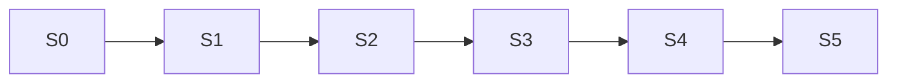

                 


# AI Agent在智能海洋资源勘探中的实践

---

## 关键词：
AI Agent, 海洋资源勘探, 强化学习, 多模态数据, 自然语言处理, 图像识别

---

## 摘要：
本文探讨了AI Agent在智能海洋资源勘探中的应用，详细介绍了AI Agent的核心概念、算法原理、系统架构设计以及实际项目中的实现。通过分析海洋资源勘探的传统方法与挑战，本文提出了基于AI Agent的解决方案，并通过具体案例展示了其在路径规划、数据处理和人机交互中的应用。文章最后总结了AI Agent在海洋资源勘探中的优势，并展望了未来的发展方向。

---

# 第1章: AI Agent与海洋资源勘探概述

## 1.1 AI Agent的基本概念
### 1.1.1 AI Agent的定义与特点
AI Agent（人工智能代理）是一种能够感知环境、自主决策并执行任务的智能实体。其特点包括：
- **自主性**：能够在没有外部干预的情况下完成任务。
- **反应性**：能够实时感知环境并做出反应。
- **学习能力**：通过数据和经验不断优化自身的决策能力。

### 1.1.2 AI Agent的核心技术与能力
AI Agent的核心技术包括：
- **强化学习**：用于决策和路径规划。
- **自然语言处理**：用于人机交互和信息提取。
- **图像识别**：用于数据分析和目标检测。

### 1.1.3 AI Agent在不同领域的应用现状
AI Agent已在多个领域得到广泛应用，包括：
- **金融领域**：用于股票交易和风险管理。
- **医疗领域**：用于疾病诊断和治疗方案优化。
- **交通领域**：用于自动驾驶和路径规划。

## 1.2 海洋资源勘探的基本概念
### 1.2.1 海洋资源的种类与分布
海洋资源主要包括：
- **矿产资源**：如海底矿床。
- **能源资源**：如石油和天然气。
- **生物资源**：如海洋生物和渔场。

海洋资源的分布受到地质构造、水文条件和生态环境的影响。

### 1.2.2 海洋资源勘探的传统方法与挑战
传统海洋资源勘探方法包括：
- **地球物理勘探**：通过地震勘探和磁测法探测海底结构。
- **海洋地质调查**：通过钻探和取样分析海底沉积物。

传统方法的挑战包括：
- **数据获取成本高**：需要大量的设备和人力资源。
- **数据处理复杂**：海洋数据具有多维性和不确定性。

### 1.2.3 智能化海洋资源勘探的必要性
智能化海洋资源勘探的必要性体现在：
- **提高效率**：通过AI技术快速处理和分析海量数据。
- **降低成本**：减少对传统设备的依赖，降低勘探成本。
- **提高准确性**：通过智能算法优化勘探目标的定位。

## 1.3 AI Agent在海洋资源勘探中的应用前景
### 1.3.1 AI Agent在海洋勘探中的优势
AI Agent在海洋资源勘探中的优势包括：
- **自主决策能力**：能够在复杂环境中自主完成任务。
- **多模态数据处理能力**：能够整合和分析多种类型的数据。
- **实时反馈能力**：能够根据环境变化实时调整决策。

### 1.3.2 当前技术瓶颈与未来发展方向
当前技术瓶颈包括：
- **数据不足**：海洋数据的获取和处理需要大量资源。
- **算法复杂性**：复杂的环境需要更高效的算法。

未来发展方向包括：
- **多智能体协作**：通过多个AI Agent协同工作提高勘探效率。
- **边缘计算**：在边缘设备上进行实时数据处理和决策。

### 1.3.3 本章小结
本章介绍了AI Agent的基本概念和海洋资源勘探的传统方法与挑战，分析了智能化海洋资源勘探的必要性和AI Agent的应用前景，指出了当前技术瓶颈和未来发展方向。

---

# 第2章: AI Agent的核心原理与技术

## 2.1 AI Agent的决策机制
### 2.1.1 强化学习在决策中的应用
强化学习是一种通过试错和奖励机制优化决策的技术。其核心在于定义状态、动作和奖励函数。

- **状态空间**：表示环境的状态，例如海洋中的温度、深度等。
- **动作空间**：表示AI Agent可以执行的动作，例如移动、钻探等。
- **奖励函数**：定义AI Agent执行动作后的奖励，例如发现资源给予奖励。

### 2.1.2 状态空间与动作空间的建模
状态空间和动作空间的建模需要考虑海洋环境的复杂性。例如，状态可以包括地理位置、水深、地质构造等，动作可以包括移动、钻探、采集样本等。

### 2.1.3 奖励函数的设计与优化
奖励函数的设计需要根据勘探目标进行调整。例如，发现资源时给予正向奖励，偏离目标时给予负向奖励。

## 2.2 AI Agent的感知与交互能力
### 2.2.1 多模态数据的融合与处理
AI Agent需要处理多种类型的数据，例如图像、文本、数值等。通过多模态数据的融合，可以提高决策的准确性和鲁棒性。

### 2.2.2 自然语言处理在人机交互中的应用
自然语言处理技术可以用于人机交互，例如通过语音指令控制AI Agent执行任务。

### 2.2.3 图像识别技术在海洋勘探中的应用
图像识别技术可以用于分析卫星图像、海底地形图等，帮助定位资源分布。

## 2.3 AI Agent的自主学习与进化
### 2.3.1 迁移学习在海洋勘探中的应用
迁移学习可以将其他领域的知识迁移到海洋勘探中，例如将地质勘探的知识迁移到海洋矿产勘探。

### 2.3.2 知识图谱的构建与应用
知识图谱可以用于存储和管理海洋资源勘探的相关知识，帮助AI Agent进行推理和决策。

### 2.3.3 自监督学习在数据处理中的应用
自监督学习可以通过无标签数据进行学习，例如通过预测缺失数据来提高数据处理能力。

## 2.4 本章小结
本章详细介绍了AI Agent的核心原理，包括强化学习、多模态数据处理、自然语言处理和图像识别等技术，分析了自主学习与进化在AI Agent中的应用。

---

# 第3章: 海洋资源勘探系统的需求分析与架构设计

## 3.1 海洋资源勘探系统的需求分析
### 3.1.1 数据采集与处理模块
数据采集与处理模块负责采集和预处理海洋数据，例如温度、深度、地质构造等。

### 3.1.2 系统分析与决策模块
系统分析与决策模块负责基于AI Agent的决策机制进行路径规划和资源定位。

### 3.1.3 人机交互与反馈模块
人机交互与反馈模块负责与人类用户进行交互，接收指令并反馈结果。

## 3.2 系统架构设计
### 3.2.1 分层架构设计
分层架构包括数据采集层、数据处理层和应用层，每层负责不同的功能模块。

### 3.2.2 微服务架构设计
微服务架构将系统划分为多个独立的服务模块，例如数据采集服务、决策服务等。

### 3.2.3 数据流与交互流程设计
数据流与交互流程设计需要考虑数据的流动方向和交互的顺序，确保系统的高效运行。

## 3.3 系统实现的技术选型
### 3.3.1 AI框架的选择与优化
选择合适的AI框架，例如TensorFlow或PyTorch，进行模型训练和优化。

### 3.3.2 数据存储与处理方案
选择合适的数据存储方案，例如数据库或分布式存储系统，确保数据的安全性和高效性。

### 3.3.3 系统接口设计与实现
设计系统接口，例如API接口，确保不同模块之间的通信和协作。

## 3.4 本章小结
本章分析了海洋资源勘探系统的需求，并提出了分层架构和微服务架构的设计方案，讨论了数据流与交互流程以及技术选型。

---

# 第4章: AI Agent在海洋资源勘探中的算法实现与优化

## 4.1 基于强化学习的路径规划算法
### 4.1.1 强化学习在路径规划中的应用
路径规划是海洋资源勘探中的重要任务，强化学习可以用于优化路径。

### 4.1.2 算法流程图
以下是一个基于强化学习的路径规划算法的流程图：



### 4.1.3 算法实现与优化
通过策略梯度方法优化奖励函数，提高路径规划的效率和准确性。

## 4.2 多模态数据融合算法
### 4.2.1 多模态数据的融合方法
多模态数据融合可以通过加权平均、主成分分析等方法实现。

### 4.2.2 算法实现与优化
通过实验验证不同融合方法的效果，选择最优的融合策略。

## 4.3 实验结果与分析
### 4.3.1 实验设计与数据采集
设计实验方案，采集海洋数据并进行预处理。

### 4.3.2 实验结果与可视化
展示实验结果，例如路径规划的优化效果和资源定位的准确性。

### 4.3.3 算法性能对比与优化
对比不同算法的性能，分析优化的方向。

## 4.4 本章小结
本章详细介绍了AI Agent在海洋资源勘探中的算法实现与优化，包括路径规划和多模态数据融合算法。

---

# 第5章: 项目实战——基于AI Agent的海洋资源勘探系统

## 5.1 项目背景与目标
本项目旨在开发一个基于AI Agent的海洋资源勘探系统，实现高效的资源定位和路径规划。

## 5.2 系统实现
### 5.2.1 环境配置
安装必要的软件和库，例如Python、TensorFlow等。

### 5.2.2 核心代码实现
以下是路径规划算法的核心代码：

```python
import numpy as np
import tensorflow as tf

def reward_function(state, action):
    # 定义奖励函数
    return tf.reduce_sum(state * action)

def policy_network(input_dim, output_dim):
    # 定义策略网络
    model = tf.keras.Sequential([
        tf.keras.layers.Dense(64, activation='relu', input_shape=(input_dim,)),
        tf.keras.layers.Dense(output_dim, activation='softmax')
    ])
    return model

def train_agent(env, policy_network, reward_function, num_episodes=1000):
    # 训练AI Agent
    optimizer = tf.keras.optimizers.Adam(learning_rate=0.001)
    for episode in range(num_episodes):
        state = env.reset()
        total_reward = 0
        while not done:
            action = policy_network(state)
            reward = reward_function(state, action)
            # 更新策略网络
            optimizer.minimize(-reward, policy_network.trainable_weights)
            state, reward, done = env.step(action)
            total_reward += reward
    return policy_network

# 使用AI Agent进行海洋资源勘探
env = OceanEnvironment()
policy = policy_network(input_dim=state_dim, output_dim=action_dim)
trained_policy = train_agent(env, policy, reward_function)
```

### 5.2.3 实际案例分析
通过实际案例分析AI Agent在海洋资源勘探中的应用效果，例如在某个海域进行资源定位和路径规划。

## 5.3 本章小结
本章通过项目实战展示了基于AI Agent的海洋资源勘探系统的实现，包括环境配置、核心代码实现和实际案例分析。

---

# 第6章: 总结与展望

## 6.1 本章总结
本文详细介绍了AI Agent在智能海洋资源勘探中的应用，包括核心概念、算法实现和系统设计。通过实际案例展示了AI Agent在海洋资源勘探中的优势和应用前景。

## 6.2 未来展望
未来的研究方向包括：
- **多智能体协作**：通过多个AI Agent协同工作，提高勘探效率。
- **边缘计算**：在边缘设备上进行实时数据处理和决策。
- **深度学习优化**：通过更高效的深度学习算法提高资源定位的准确性。

---

## 附录
- 附录A: 项目代码
- 附录B: 算法详细说明
- 附录C: 参考文献

---

以上是《AI Agent在智能海洋资源勘探中的实践》的完整目录和内容概要。如果需要进一步的扩展或详细内容，请随时告知！

