                 


# AI Agent在智能海洋资源勘探中的实践

## 关键词：AI Agent，智能海洋资源勘探，多智能体系统，机器学习，资源探测

## 摘要：  
本文深入探讨了AI Agent在智能海洋资源勘探中的实践应用。通过分析AI Agent的核心技术、海洋资源勘探的关键技术以及系统架构设计，结合实际项目案例，详细讲解了AI Agent在海底地形分析、矿产资源探测和海洋环境监测中的具体应用场景。文章从理论到实践，系统性地展示了如何利用AI Agent技术提升海洋资源勘探的效率和精度，为相关领域的研究和应用提供了宝贵的参考。

---

# 第一部分: AI Agent与智能海洋资源勘探概述

## 第1章: AI Agent与智能海洋资源勘探概述

### 1.1 AI Agent的基本概念与特点
#### 1.1.1 AI Agent的定义与核心要素  
AI Agent（人工智能代理）是一种能够感知环境、自主决策并执行任务的智能实体。其核心要素包括感知能力、决策能力、执行能力和交互能力。  

#### 1.1.2 AI Agent与传统自动化的区别  
AI Agent不仅能够执行预设任务，还能通过学习和适应不断优化自身的行为，具备更强的自主性和灵活性。  

#### 1.1.3 智能海洋资源勘探的定义与特点  
智能海洋资源勘探是指利用AI技术对海洋资源进行智能化探测和分析的过程。其特点包括高效性、精确性和实时性。  

### 1.2 AI Agent在海洋资源勘探中的应用背景  
#### 1.2.1 海洋资源勘探的挑战与痛点  
海洋环境复杂多变，资源分布不均，传统勘探方法效率低、成本高且精度有限。  

#### 1.2.2 AI Agent在其中的核心作用  
AI Agent能够通过实时数据处理、智能决策和自主导航，显著提高资源勘探的效率和准确性。  

#### 1.2.3 当前技术发展现状与趋势  
随着AI技术的快速发展，AI Agent在海洋资源勘探中的应用正在从理论研究向实际应用迈进，未来将更加智能化和协同化。  

### 1.3 本书的核心目标与结构安排  
#### 1.3.1 本书的核心目标  
通过理论与实践结合，系统性地讲解AI Agent在智能海洋资源勘探中的应用。  

#### 1.3.2 目录结构与内容概览  
文章分为七章，涵盖AI Agent的基本概念、核心技术、海洋资源勘探的关键技术、系统架构设计、项目实战等内容。  

#### 1.3.3 学习本书的建议与方法  
建议读者结合实际项目，逐步学习AI Agent的核心算法和系统架构设计。  

---

# 第二部分: AI Agent的核心技术与原理

## 第2章: AI Agent的核心技术与原理

### 2.1 AI Agent的核心技术  
#### 2.1.1 感知技术：数据采集与处理  
AI Agent通过传感器采集海洋环境数据，如水温、盐度、海底地形等，并进行预处理和特征提取。  

#### 2.1.2 决策技术：智能推理与优化  
基于强化学习和图神经网络，AI Agent能够进行复杂决策和路径规划。  

#### 2.1.3 执行技术：动作规划与控制  
AI Agent通过动作规划算法（如RRT*）实现自主导航和任务执行。  

#### 2.1.4 通信技术：信息交互与协作  
通过多智能体通信协议，AI Agent能够实现信息共享和协同决策。  

### 2.2 AI Agent的算法原理  
#### 2.2.1 基于强化学习的决策算法  
强化学习通过 reward 函数优化 Agent 的行为策略，实现复杂环境下的最优决策。  

**算法流程图（Mermaid）：**  
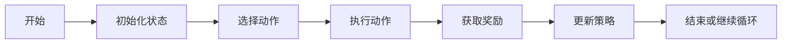

**Python代码示例：**  
```python
import numpy as np
class Agent:
    def __init__(self, state_space, action_space):
        self.state_space = state_space
        self.action_space = action_space
        # 初始化策略网络
        self.policy = np.random.rand(state_space, action_space)
    
    def get_action(self, state):
        # 选择动作
        action_probs = np.exp(self.policy[state]) / np.sum(np.exp(self.policy[state]))
        action = np.random.choice(self.action_space, p=action_probs)
        return action
    
    def update_policy(self, reward):
        # 更新策略网络
        self.policy += reward
```

#### 2.2.2 基于图神经网络的知识表示  
图神经网络通过构建海洋环境的知识图谱，实现复杂关系的表示与推理。  

**知识图谱示例（Mermaid）：**  
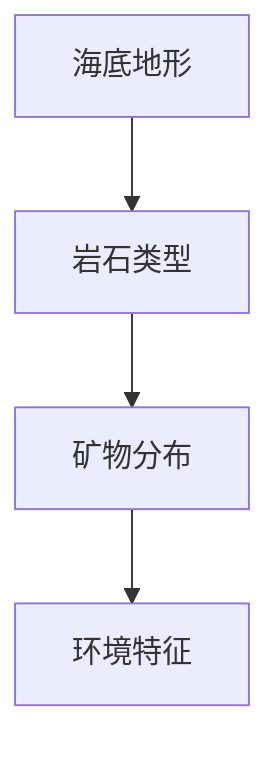

#### 2.2.3 基于概率论的不确定性处理  
通过贝叶斯网络，AI Agent能够处理环境中的不确定性，提高决策的鲁棒性。  

**贝叶斯网络示例（Mermaid）：**  
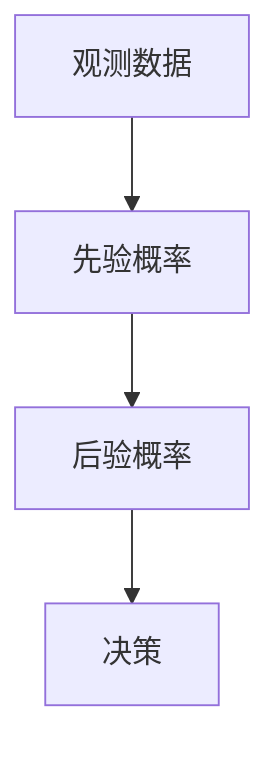

### 2.3 AI Agent的系统架构设计  
#### 2.3.1 分层架构：感知层、决策层与执行层  
分层架构将AI Agent的功能划分为感知、决策和执行三个层次，实现模块化设计。  

**分层架构类图（Mermaid）：**  
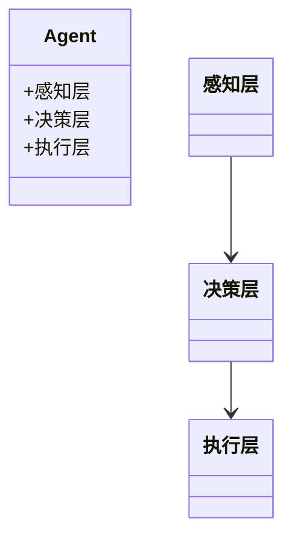

#### 2.3.2 分布式架构：多 Agent 协作与通信  
分布式架构通过多 Agent 协作，实现任务分工和信息共享，提高整体效率。  

**分布式架构示意图（Mermaid）：**  
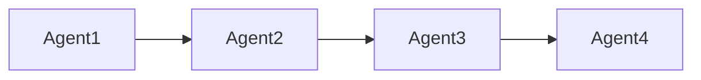

#### 2.3.3 高可用性设计：容错与自适应机制  
通过冗余设计和自适应算法，AI Agent能够应对环境中的突发情况，保证任务的连续性。  

---

# 第三部分: 智能海洋资源勘探的关键技术

## 第3章: 海洋资源勘探的关键技术

### 3.1 多源数据融合技术  
#### 3.1.1 海洋环境数据的采集与处理  
AI Agent通过多种传感器（如声呐、摄像头）采集海洋环境数据，并进行融合处理。  

#### 3.1.2 数据融合方法：基于特征与基于模型  
基于特征的融合方法通过提取特征向量进行数据融合，基于模型的方法则通过深度学习模型实现端到端融合。  

**数据融合方法对比表格：**

| 方法类型 | 特点 | 优缺点 |
|----------|------|--------|
| 基于特征 | 简单高效 | 易受噪声影响 |
| 基于模型 | 高精度 | 计算复杂度高 |

#### 3.1.3 数据质量评估与优化  
通过数据清洗和特征选择，提高数据质量和可用性。  

### 3.2 海洋环境建模技术  
#### 3.2.1 海底地形建模：点云数据处理与网格化  
通过点云数据处理技术，AI Agent能够生成高精度的海底地形网格。  

**海底地形建模流程图（Mermaid）：**  
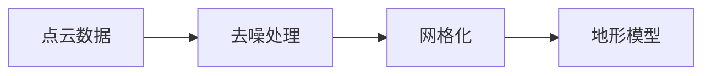

#### 3.2.2 海洋地质结构分析：基于深度学习的特征提取  
深度学习模型（如CNN）用于提取海底地质结构的特征，实现地质分析。  

**深度学习模型结构（Mermaid）：**  
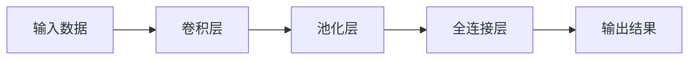

#### 3.2.3 海洋环境动态预测：时间序列建模  
通过LSTM等时间序列模型，AI Agent能够预测海洋环境的动态变化。  

**LSTM模型结构（Mermaid）：**  
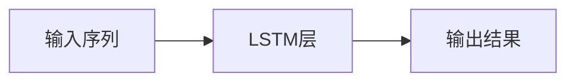

### 3.3 资源探测路径规划技术  
#### 3.3.1 基于栅格地图的路径规划  
栅格地图通过将环境离散化为网格，实现路径规划。  

**栅格地图路径规划示意图（Mermaid）：**  
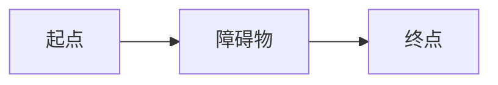

#### 3.3.2 基于改进A*算法的路径优化  
通过改进A*算法，AI Agent能够快速找到最优路径。  

**改进A*算法流程图（Mermaid）：**  
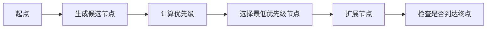

#### 3.3.3 多目标优化路径规划  
通过多目标优化算法（如NSGA-II），AI Agent能够在复杂环境中实现多目标平衡。  

---

# 第四部分: 系统分析与架构设计方案

## 第4章: 系统分析与架构设计方案

### 4.1 项目介绍与系统功能设计  
#### 4.1.1 项目介绍  
本项目旨在开发一个基于AI Agent的海洋资源勘探系统，实现海底地形分析、矿产探测和环境监测。  

#### 4.1.2 系统功能设计  
系统功能包括数据采集、环境建模、资源探测和任务管理。  

**系统功能模块类图（Mermaid）：**  
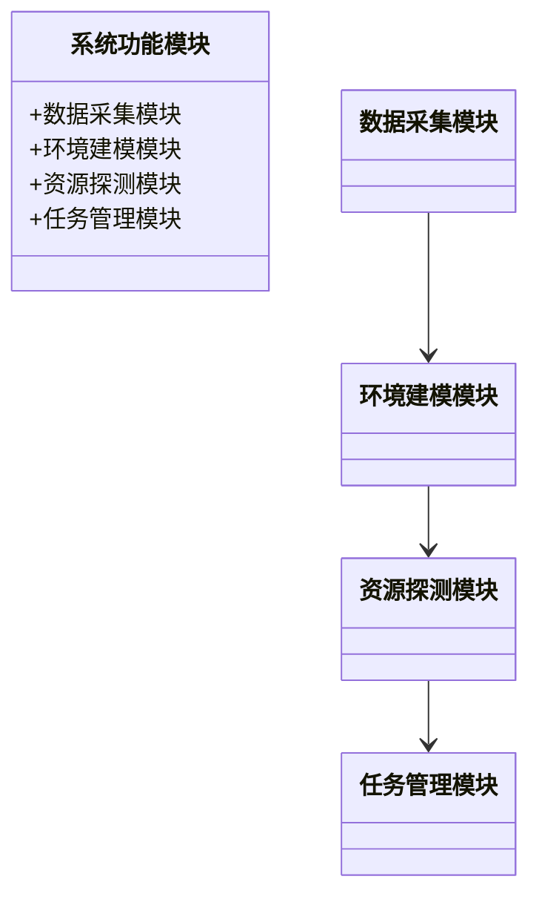

### 4.2 系统架构设计  
#### 4.2.1 系统架构图  
系统架构采用分层设计，包括数据采集层、数据处理层和应用层。  

**系统架构图（Mermaid）：**  
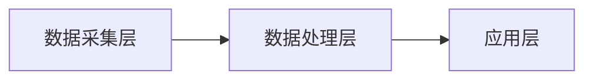

#### 4.2.2 系统接口设计  
系统接口包括数据接口、任务接口和结果接口，实现模块间的通信与协作。  

#### 4.2.3 系统交互流程图  
系统交互流程包括任务启动、数据采集、数据处理和结果输出。  

**系统交互流程图（Mermaid）：**  
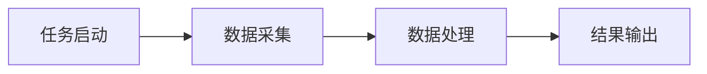

### 4.3 项目实战  
#### 4.3.1 环境安装  
需要安装Python、深度学习框架（如TensorFlow或PyTorch）和相关库。  

#### 4.3.2 核心代码实现  
以下是资源探测模块的核心代码示例：  

```python
import numpy as np
from sklearn.cluster import KMeans

# 数据预处理
data = np.load('ocean_data.npy')
data_normalized = (data - data.min()) / (data.max() - data.min())

# 聚类分析
model = KMeans(n_clusters=3)
model.fit(data_normalized)
labels = model.labels_

# 可视化结果
print(labels)
```

#### 4.3.3 实际案例分析  
以某海域的海底地形探测为例，详细分析AI Agent的探测过程和结果。  

#### 4.3.4 项目总结  
总结项目的实现过程、成果和经验教训。  

---

# 第五部分: 总结与展望

## 第5章: 总结与展望

### 5.1 总结  
本文系统性地介绍了AI Agent在智能海洋资源勘探中的应用，涵盖了核心技术、系统设计和项目实战。  

### 5.2 未来展望  
未来，随着AI技术的进一步发展，AI Agent在海洋资源勘探中的应用将更加广泛和深入，包括多智能体协作、实时动态优化等领域。  

---

# 附录

## 附录A: 工具安装与配置指南  
详细说明AI Agent开发所需的工具安装和配置步骤。  

## 附录B: 数据集与代码资源  
列出常用的海洋资源勘探数据集和开源代码库。  

## 附录C: 参考文献与进一步阅读  
提供相关领域的参考文献和推荐阅读资料。  

---

通过以上内容，您可以系统性地撰写一篇关于AI Agent在智能海洋资源勘探中的实践的深度技术博客文章。

