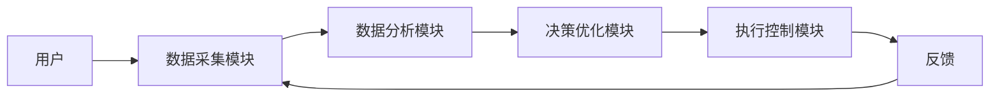
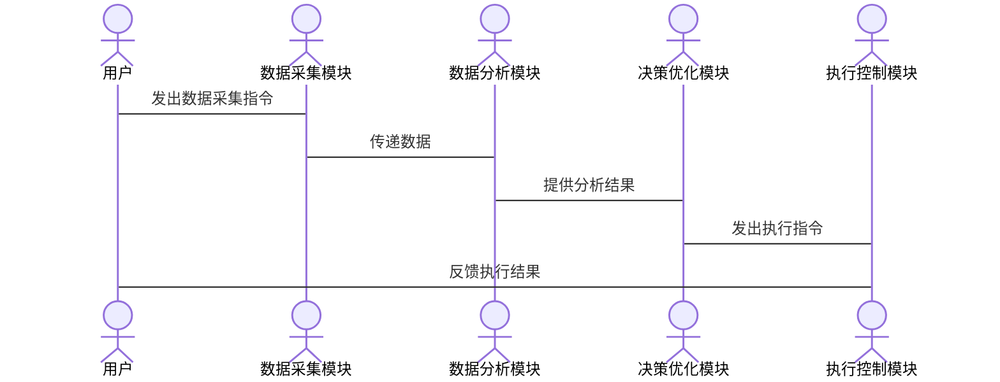

                 


```markdown
# AI Agent在智能海洋资源管理中的实践

> 关键词：AI Agent、智能海洋资源管理、算法原理、系统架构、项目实战

> 摘要：AI Agent作为人工智能领域的核心技术，正在逐步应用于智能海洋资源管理中。本文将从AI Agent的基本概念和原理出发，详细探讨其在海洋资源管理中的应用场景，结合实际案例，分析其算法原理和系统架构，最后总结其在智能海洋资源管理中的实践经验和未来发展方向。

---

# 第一部分: AI Agent与智能海洋资源管理概述

## 第1章: AI Agent与智能海洋资源管理的背景介绍

### 1.1 AI Agent的基本概念
#### 1.1.1 什么是AI Agent
AI Agent（人工智能代理）是指能够感知环境、自主决策并执行任务的智能实体。它能够通过传感器获取信息，利用算法进行分析，并通过执行器完成特定任务。

#### 1.1.2 AI Agent的核心特点
- **自主性**：能够自主决策和行动。
- **反应性**：能够实时感知环境并做出反应。
- **目标导向性**：以特定目标为导向，优化决策和行动。
- **学习能力**：能够通过经验不断优化自身性能。

#### 1.1.3 AI Agent与传统算法的区别
传统算法通常需要明确的规则和输入条件，而AI Agent具有自主性和学习能力，能够适应复杂和动态的环境。

### 1.2 智能海洋资源管理的定义与特点
#### 1.2.1 海洋资源管理的定义
海洋资源管理是指对海洋中的资源（如渔业资源、矿产资源、能源资源等）进行合理开发、利用和保护的过程。

#### 1.2.2 智能化海洋资源管理的核心要素
- **数据采集**：通过传感器、卫星等手段获取海洋环境数据。
- **数据分析**：利用大数据和AI技术对数据进行处理和分析。
- **决策优化**：基于分析结果，优化资源管理和利用策略。
- **实时监控**：对海洋资源的动态变化进行实时监控和预警。

#### 1.2.3 海洋资源管理的挑战与机遇
- **挑战**：海洋环境复杂多变，资源分布不均匀，管理难度大。
- **机遇**：AI技术的进步为海洋资源管理提供了新的工具和方法。

### 1.3 AI Agent在智能海洋资源管理中的应用前景
#### 1.3.1 AI Agent在海洋资源管理中的潜在应用领域
- **渔业资源管理**：优化捕捞策略，保护濒危物种。
- **海洋环境保护**：监测污染源，制定环境保护方案。
- **海洋能源开发**：优化能源采集和分配。

#### 1.3.2 企业采用AI Agent的优势
- **提高效率**：通过智能化管理，降低人工成本，提高资源利用效率。
- **增强决策能力**：基于数据和模型，提供科学的决策支持。
- **提升竞争力**：通过技术创新，增强企业的市场竞争力。

#### 1.3.3 AI Agent应用的挑战与机遇
- **挑战**：技术复杂性高，数据获取难度大，隐私和安全问题。
- **机遇**：技术进步带来的效率提升和成本降低。

## 第2章: AI Agent的核心概念与联系

### 2.1 AI Agent的核心原理
#### 2.1.1 AI Agent的感知与决策机制
AI Agent通过传感器和数据源获取环境信息，利用算法进行分析和推理，制定决策策略。

#### 2.1.2 AI Agent的行动与反馈循环
AI Agent根据决策结果执行行动，并通过反馈机制不断优化自身行为。

#### 2.1.3 AI Agent的自适应能力
AI Agent能够根据环境变化和新的数据，动态调整自身的行为策略。

### 2.2 AI Agent的属性特征对比
#### 表格对比AI Agent与其他AI技术的特征

| 特性                | AI Agent                          | 传统AI算法                        |
|---------------------|-----------------------------------|------------------------------------|
| 自主性              | 高                                 | 低                                 |
| 反应性              | 高                                 | 中                                 |
| 目标导向性          | 高                                 | 低                                 |
| 学习能力            | 高                                 | 中                                 |

### 2.3 AI Agent与海洋资源管理的ER实体关系图
```mermaid
erDiagram
    actor 海洋资源管理系统的用户 {
        <属性> 身份标识
        <属性> 用户权限
        <属性> 操作记录
    }
    actor AI Agent {
        <属性> 状态
        <属性> 行为历史
        <属性> 知识库
    }
    actor 海洋资源 {
        <属性> 资源类型
        <属性> 数量
        <属性> 分布区域
    }
    海洋资源管理系统的用户 --> AI Agent : 发出指令
    AI Agent --> 海洋资源 : 执行操作
    海洋资源 --> 海洋资源管理系统的用户 : 反馈状态
```

## 第3章: AI Agent的算法原理讲解

### 3.1 AI Agent的核心算法
#### 3.1.1 强化学习算法
强化学习是一种通过试错机制来优化决策的算法。AI Agent通过与环境的交互，不断优化自身的策略，以获得最大的累积奖励。

#### 3.1.2 决策树算法
决策树是一种基于树状结构的分类和回归方法。AI Agent通过构建决策树，能够快速进行分类和预测。

### 3.2 算法原理的数学模型
#### 3.2.1 强化学习的数学模型
$$ V(s) = \max_{a} [ r(s,a) + \gamma V(s') ] $$
其中：
- \( V(s) \) 表示状态 \( s \) 的价值函数。
- \( r(s,a) \) 表示在状态 \( s \) 下执行动作 \( a \) 的奖励。
- \( \gamma \) 表示折扣因子。
- \( s' \) 表示执行动作 \( a \) 后的新状态。

#### 3.2.2 决策树的数学模型
决策树的构建过程可以通过信息增益来选择最优的分割特征。信息增益公式为：
$$ \text{信息增益} = \text{熵}(D) - \sum \text{熵}(D_i) $$
其中：
- \( D \) 表示原始数据集。
- \( D_i \) 表示按某个特征分割后的子数据集。

### 3.3 算法实现的代码示例
#### 强化学习算法实现
```python
import numpy as np

class AIAgent:
    def __init__(self, state_space, action_space):
        self.state_space = state_space
        self.action_space = action_space
        self.value_function = np.zeros(state_space)

    def take_action(self, state):
        action = np.argmax(self.value_function[state])
        return action

    def update_value_function(self, state, value):
        self.value_function[state] = value

    def get_value(self, state):
        return self.value_function[state]
```

#### 决策树算法实现
```python
from sklearn.tree import DecisionTreeClassifier

class DecisionTreeAgent:
    def __init__(self, max_depth=5):
        self.tree = DecisionTreeClassifier(max_depth=max_depth)

    def fit(self, X, y):
        self.tree.fit(X, y)

    def predict(self, X):
        return self.tree.predict(X)
```

## 第4章: AI Agent在智能海洋资源管理中的应用

### 4.1 海洋资源管理的场景分析
海洋资源管理需要应对复杂的环境变化和资源分布的动态性，AI Agent能够通过实时数据监测和智能决策，优化资源管理和利用。

### 4.2 AI Agent在海洋环境保护中的应用
AI Agent可以通过监测海洋污染、预测环境变化，制定环境保护策略。

### 4.3 AI Agent在海洋能源开发中的应用
AI Agent可以优化海洋能源的采集和分配，提高能源利用效率。

## 第5章: AI Agent在智能海洋资源管理中的系统架构设计

### 5.1 系统功能设计
- **数据采集模块**：通过传感器和卫星获取海洋环境数据。
- **数据分析模块**：利用AI算法对数据进行处理和分析。
- **决策优化模块**：基于分析结果，优化资源管理策略。
- **执行控制模块**：根据决策结果，执行具体的管理操作。

### 5.2 系统架构设计


### 5.3 系统接口设计
- **数据接口**：与传感器和数据库的接口。
- **用户接口**：与用户的交互界面。
- **决策接口**：与决策系统的接口。

### 5.4 系统交互流程


## 第6章: AI Agent在智能海洋资源管理中的项目实战

### 6.1 环境安装
- **Python**：安装Python 3.8及以上版本。
- **依赖库**：安装numpy、pandas、scikit-learn、mermaid等。

### 6.2 核心代码实现
#### 数据采集模块
```python
import pandas as pd
import requests

def fetch_data(api_url):
    response = requests.get(api_url)
    data = response.json()
    return pd.DataFrame(data)
```

#### 数据分析模块
```python
from sklearn.tree import DecisionTreeClassifier

def analyze_data(data):
    X = data.drop('target', axis=1)
    y = data['target']
    model = DecisionTreeClassifier().fit(X, y)
    return model
```

### 6.3 案例分析
以海洋污染监测为例，通过AI Agent实现污染源的定位和污染程度的预测。

### 6.4 项目总结
通过实际案例分析，验证AI Agent在智能海洋资源管理中的有效性和实用性。

## 第7章: 最佳实践与未来展望

### 7.1 最佳实践
- **数据质量**：确保数据的准确性和完整性。
- **算法选择**：根据具体场景选择合适的AI算法。
- **系统维护**：定期更新模型和优化系统。

### 7.2 小结
本文详细介绍了AI Agent在智能海洋资源管理中的应用，从理论到实践，全面探讨了其技术实现和实际应用。

### 7.3 注意事项
- **隐私保护**：注意保护用户的隐私数据。
- **系统安全**：确保系统的安全性和稳定性。
- **数据存储**：合理存储和管理数据。

### 7.4 拓展阅读
- **推荐书籍**：《人工智能：一种现代方法》
- **推荐论文**：《AI Agent在智能资源管理中的应用研究》
- **在线课程**：AI Agent与智能系统课程

---

# 结语
通过本文的详细讲解，读者可以全面了解AI Agent在智能海洋资源管理中的实践应用。未来，随着AI技术的不断发展，AI Agent将在更多领域发挥重要作用。
```

