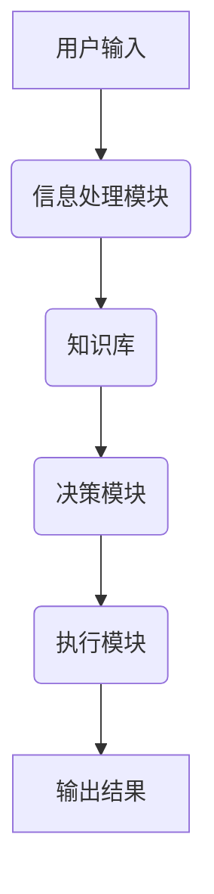

                 


好的，我们一步一步来构建这篇文章的目录大纲和内容结构。首先，我会先列出文章的主要章节，然后逐步细化每一章的内容。为了更好地展示文章的结构和内容，我会使用清晰的标题和子标题来组织内容。

---

# 《AI Agent在智能海洋资源管理中的应用》

**关键词**：AI Agent, 智能海洋资源管理, 人工智能, 海洋环境监测, 自然语言处理, 机器学习

**摘要**：  
随着人工智能技术的快速发展，AI Agent（智能体）在海洋资源管理中的应用逐渐成为研究热点。本文将从AI Agent的核心原理出发，结合海洋资源管理的实际需求，详细探讨AI Agent在资源监测、环境评估和应急决策等方面的应用场景，并分析其技术优势和挑战。通过实际案例和系统架构设计，本文为AI Agent在智能海洋资源管理中的应用提供了理论基础和实践指导。

---

## 目录大纲

### 第一部分：AI Agent与智能海洋资源管理的背景与基础

1. **AI Agent的基本概念与核心原理**  
   - 1.1 AI Agent的定义与特征  
   - 1.2 AI Agent的工作流程与应用场景  
   - 1.3 AI Agent在海洋资源管理中的潜力

2. **海洋资源管理的需求与挑战**  
   - 2.1 海洋资源管理的核心问题  
   - 2.2 传统海洋资源管理的局限性  
   - 2.3 AI Agent在海洋资源管理中的优势

### 第二部分：AI Agent在海洋资源管理中的技术实现

3. **AI Agent的核心技术与算法原理**  
   - 3.1 自然语言处理技术在海洋资源管理中的应用  
   - 3.2 计算机视觉技术在海洋环境监测中的应用  
   - 3.3 机器学习与深度学习算法在资源优化中的应用  
   - 3.4 知识图谱在海洋资源管理中的构建与应用

4. **AI Agent在海洋资源管理中的系统架构设计**  
   - 4.1 系统功能模块划分  
   - 4.2 系统架构设计（使用Mermaid图展示）  
   - 4.3 系统接口设计与交互流程  

5. **AI Agent在海洋资源管理中的算法实现与代码示例**  
   - 5.1 算法原理与数学模型（使用LaTeX公式展示）  
   - 5.2 算法实现的代码示例（Python实现）  
   - 5.3 算法优化与性能分析  

### 第三部分：AI Agent在海洋资源管理中的实际应用

6. **AI Agent在海洋资源监测中的应用案例**  
   - 6.1 海洋生物监测（如鱼类、珊瑚礁等）  
   - 6.2 海洋环境监测（如水质、温度、盐度等）  
   - 6.3 资源保护策略的制定与优化  

7. **AI Agent在海洋资源管理中的应急决策应用**  
   - 7.1 应急决策的流程与算法设计  
   - 7.2 紧急情况下的资源分配与优化  
   - 7.3 应急决策的案例分析与总结  

8. **AI Agent在海洋资源管理中的未来发展趋势**  
   - 8.1 多智能体协作在海洋资源管理中的应用前景  
   - 8.2 边缘计算在海洋资源管理中的潜力  
   - 8.3 AI Agent与其他新兴技术的结合与创新  

### 第四部分：总结与展望

9. **总结与展望**  
   - 9.1 本文的核心内容总结  
   - 9.2 AI Agent在海洋资源管理中的未来发展方向  
   - 9.3 对相关研究者和从业者的建议  

---

### 详细内容示例

#### 第2章：海洋资源管理的需求与挑战

##### 2.2 传统海洋资源管理的局限性

- **2.2.1 数据获取的困难性**  
  - 海洋环境复杂，数据采集成本高且难度大。  
  - 传统方法依赖人工采集，效率低下且覆盖面有限。

- **2.2.2 决策的滞后性**  
  - 传统决策依赖人工分析，存在时间滞后问题。  
  - 面对突发环境变化，传统方法难以快速响应。

- **2.2.3 跨学科协同的不足**  
  - 海洋资源管理涉及海洋学、环境科学、经济学等多个领域，传统方法难以实现多学科协同。

---

#### 第4章：AI Agent在海洋资源管理中的系统架构设计

##### 4.2 系统架构设计（使用Mermaid图展示）



---

#### 第5章：AI Agent在海洋资源管理中的算法实现与代码示例

##### 5.1 算法原理与数学模型（使用LaTeX公式展示）

- **5.1.1 环境预测模型**  
  使用回归算法预测海洋环境变化：  
  $$ y = \beta_0 + \beta_1x + \epsilon $$  
  其中，$y$ 是预测值，$x$ 是输入特征，$\beta_0$ 和 $\beta_1$ 是回归系数。

- **5.1.2 资源分配优化模型**  
  使用强化学习算法优化资源分配：  
  $$ V(s) = \max_{a} [r(s,a) + V(s') ] $$  
  其中，$s$ 是状态，$a$ 是动作，$s'$ 是下一个状态。

##### 5.2 算法实现的代码示例（Python实现）

```python
import numpy as np
from sklearn.linear_model import LinearRegression

# 示例：环境预测模型的实现
def environment_prediction(data):
    X = data[['temperature', 'salinity']]
    y = data['sea_level']
    model = LinearRegression()
    model.fit(X, y)
    return model

# 示例：资源分配优化模型的实现（简化版）
def resource_allocation(agent, environment):
    state = environment.get_state()
    action = agent.decide_action(state)
    reward = environment.get_reward(action)
    agent.update_policy(state, action, reward)
    return action
```

---

#### 第7章：AI Agent在海洋资源管理中的应急决策应用

##### 7.3 应急决策的案例分析与总结

- **案例分析：海洋溢油事故的应急决策**  
  - AI Agent通过实时监测溢油扩散情况，结合环境数据和历史案例，快速制定资源分配和 cleanup 方案。  
  - 通过强化学习优化 cleanup 路径，减少环境损害。

- **总结**  
  AI Agent在应急决策中的优势在于快速响应和智能优化，能够显著提高决策的准确性和效率。

---

#### 第9章：总结与展望

##### 9.3 对相关研究者和从业者的建议

- **建议1**：加强AI Agent在海洋资源管理中的基础研究，特别是在多智能体协作和边缘计算方面。  
- **建议2**：推动AI Agent技术与海洋观测系统的深度融合，提升数据采集和处理能力。  
- **建议3**：关注AI Agent在海洋资源管理中的伦理和法律问题，确保技术应用的合规性。

---

### 附录

- **附录A**：AI Agent相关术语表  
- **附录B**：常用算法与技术框架  
- **附录C**：代码库与工具推荐  

---

通过以上目录和内容设计，文章将从理论到实践，系统性地展示AI Agent在智能海洋资源管理中的应用，同时结合实际案例和技术实现，为读者提供丰富的知识和实用的指导。

