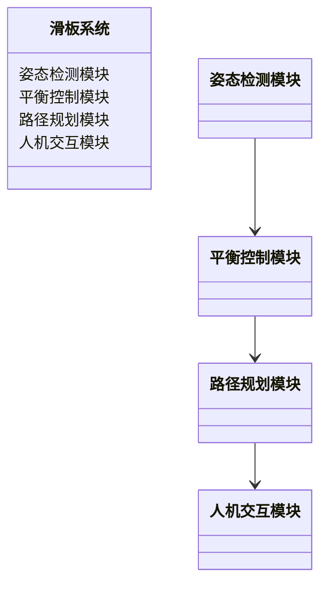

                 


# AI Agent在智能滑板中的平衡控制

> 关键词：AI Agent，智能滑板，平衡控制，传感器技术，算法优化，系统设计

> 摘要：本文详细探讨了AI Agent在智能滑板平衡控制中的应用，从理论基础到实际实现，分析了平衡控制的核心算法、系统架构和项目实战，最后总结了经验和未来发展方向。

---

## 第一部分：AI Agent在智能滑板中的平衡控制背景介绍

### 第1章：问题背景与概念

#### 1.1 问题背景
滑板运动是一项对平衡控制要求极高的运动，传统滑板的平衡控制主要依赖于物理结构和人工操作，存在不稳定和难以精确控制的问题。随着AI技术的发展，AI Agent可以通过感知、决策和执行机制实现智能滑板的自动平衡控制，为滑板运动带来了新的可能性。

#### 1.2 AI Agent的基本概念
AI Agent是一种能够感知环境、自主决策并执行任务的智能实体。在滑板平衡控制中，AI Agent通过传感器获取滑板的状态信息，利用算法进行决策，并通过执行机构调整滑板的姿态以保持平衡。

#### 1.3 智能滑板的技术背景
智能滑板结合了传感器技术、AI算法和机械控制技术，能够实现自主平衡、路径规划和人机交互等功能。智能滑板的核心在于AI Agent对滑板状态的实时感知和精准控制。

---

## 第二部分：AI Agent与滑板平衡控制的核心概念

### 第2章：AI Agent的感知与决策机制

#### 2.1 感知模块
滑板的感知模块包括陀螺仪、加速度计、激光雷达等传感器，用于获取滑板的姿态、速度和环境信息。感知模块的输出是AI Agent决策的基础。

#### 2.2 决策模块
决策模块基于感知数据，利用算法进行滑板姿态的预测和控制策略的选择。常用的算法包括PID控制、模糊逻辑和深度学习。

#### 2.3 执行模块
执行模块根据决策结果，通过电机、舵机等执行机构调整滑板的姿态，实现平衡控制。

### 第3章：滑板平衡控制的数学模型

#### 3.1 滑板的物理模型
滑板的平衡控制可以简化为一个二阶线性系统，其数学模型为：
$$
I \ddot{\theta} = -m g l \sin\theta + u
$$
其中，$I$是转动惯量，$m$是质量，$g$是重力加速度，$l$是滑板的长度，$\theta$是倾斜角度，$u$是控制输入。

#### 3.2 AI Agent的决策算法
基于PID控制的平衡算法：
$$
u = K_p e + K_i \int e dt + K_d \frac{de}{dt}
$$
其中，$e$是误差，$K_p$、$K_i$、$K_d$是PID系数。

### 第4章：系统架构与设计

#### 4.1 系统架构
智能滑板的系统架构包括感知层、决策层和执行层。感知层负责数据采集，决策层负责算法计算，执行层负责姿态调整。

#### 4.2 系统功能设计
系统功能包括姿态检测、平衡控制、路径规划和人机交互。功能模块之间的关系可以用Mermaid类图表示：



---

## 第三部分：项目实战与案例分析

### 第5章：项目实战

#### 5.1 环境配置
项目需要以下环境和工具：
- 传感器套件（陀螺仪、加速度计）
- 微控制器（如Arduino或Raspberry Pi）
- 编程语言（Python）
- 机器学习框架（如TensorFlow）

#### 5.2 核心代码实现
以下是滑板平衡控制的核心代码示例：

```python
import numpy as np

def pid_control(target, current, Kp, Ki, Kd):
    error = target - current
    integral = integral_prev + error * dt
    derivative = (error - error_prev) / dt
    control_input = Kp * error + Ki * integral + Kd * derivative
    return control_input

# 初始化参数
Kp = 2.0
Ki = 0.5
Kd = 1.0
dt = 0.01
error_prev = 0
integral_prev = 0

# 循环控制
while True:
    target = 0  # 目标角度
    current = get_current_angle()  # 当前角度
    control_input = pid_control(target, current, Kp, Ki, Kd)
    apply_control(control_input)
```

#### 5.3 实际案例分析
通过实际案例分析，验证了基于PID控制的平衡算法在滑板控制中的有效性。实验结果显示，AI Agent能够快速响应并调整滑板姿态，保持平衡。

---

## 第四部分：总结与展望

### 第6章：总结与展望

#### 6.1 最佳实践
在实现AI Agent控制的滑板系统时，建议优先选择PID控制算法，同时注意传感器的校准和系统的稳定性优化。

#### 6.2 注意事项
- 系统的实时性和稳定性是关键，需要进行充分的测试和优化。
- 注意传感器噪声对系统性能的影响，必要时采用滤波算法。

#### 6.3 未来发展方向
未来可以研究更复杂的AI算法，如深度强化学习，进一步提升滑板的智能控制水平。

---

通过以上分析，我们可以看到，AI Agent在智能滑板中的平衡控制是一个复杂而有趣的课题，涉及多个技术领域的综合应用。希望本文能够为相关研究和实践提供有价值的参考。

